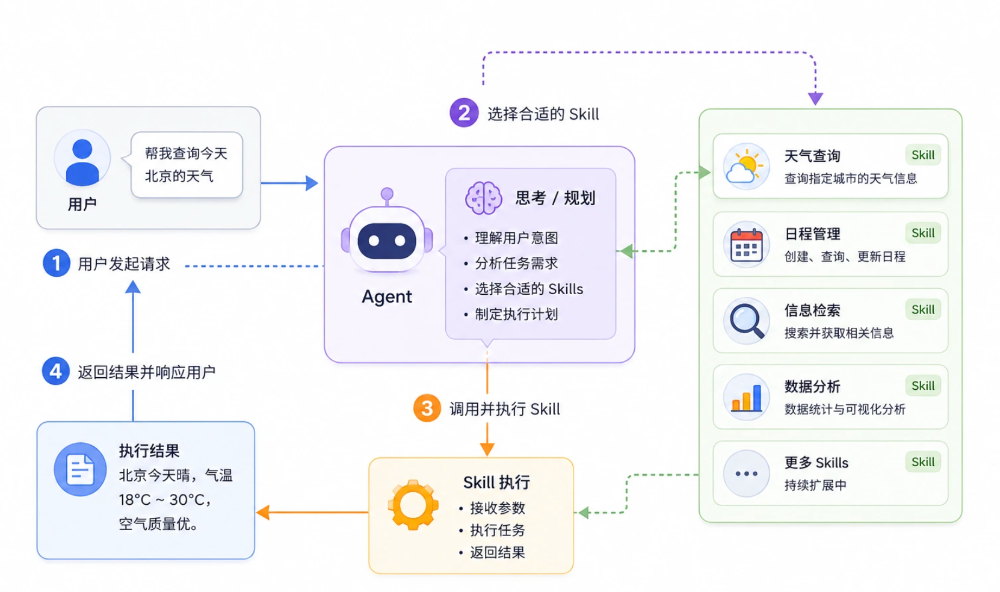

## Skills 工作过程

用户提出需求后，Agent 首先理解任务内容，然后分析应该使用哪些能力（Skills）完成工作。

Skill 可以理解为一个独立能力模块或插件，例如天气查询、搜索、文件处理、数据库访问等。

Agent 负责思考和决策，Skill 负责执行动作，执行完成后结果再返回给 Agent，由 Agent 整理成用户容易理解的结果并输出。

整个流程形成一个完整闭环：理解 → 决策 → 执行 → 返回结果。

## Skills 的工作原理

Skills 使用渐进式披露（Progressive Disclosure）的方式，让代理在不同的阶段加载不同详细程度的信息。这种设计使得代理可以同时管理大量技能，而不会耗尽上下文空间。

代理加载技能分为以下三个阶段：

- 发现阶段（Discovery）：当对话开始时，代理会扫描所有可用的技能文件夹，只读取每个技能的名称（name）和描述（description）。这是最轻量的信息，足以让代理判断某个技能是否可能与当前任务相关。
- 激活阶段（Activation）：当代理判断某个技能的描述与用户请求相匹配时，会将完整的 `SKILL.md` 文件内容加载到上下文中。这时代理会读取完整的指令和说明。
- 执行阶段（Execution）：代理按照 `SKILL.md` 中的指令执行任务。在这个过程中，代理可能会调用技能附带的脚本、读取参考资料或使用其他资源。