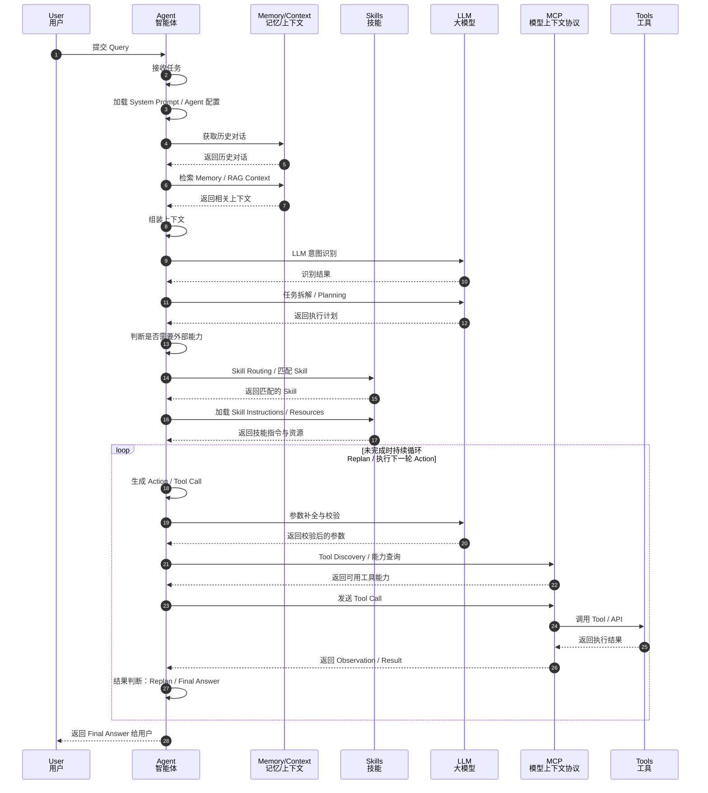

完整流程：用户目标→拆解任务→推理决策→读取记忆→调用工具 / MCP 执行→反思纠错→输出答案 / 文件，循环迭代完成任务。

```mermaid
sequenceDiagram
    autonumber

    participant User as User<br/>用户
    participant Agent as Agent<br/>智能体
    participant Memory as Memory/Context<br/>记忆/上下文
    participant Skills as Skills<br/>技能
    participant LLM as LLM<br/>大模型
    participant MCP as MCP<br/>模型上下文协议
    participant Tools as Tools<br/>工具

    User->>Agent: 提交 Query
    Agent->>Agent: 接收任务
    Agent->>Agent: 加载 System Prompt / Agent 配置
    Agent->>Memory: 获取历史对话
    Memory-->>Agent: 返回历史对话

    Agent->>Memory: 检索 Memory / RAG Context
    Memory-->>Agent: 返回相关上下文
    Agent->>Agent: 组装上下文

    Agent->>LLM: LLM 意图识别
    LLM-->>Agent: 识别结果
    Agent->>LLM: 任务拆解 / Planning
    LLM-->>Agent: 返回执行计划

    Agent->>Agent: 判断是否需要外部能力
    Agent->>Skills: Skill Routing / 匹配 Skill
    Skills-->>Agent: 返回匹配的 Skill
    Agent->>Skills: 加载 Skill Instructions / Resources
    Skills-->>Agent: 返回技能指令与资源

    loop 未完成时持续循环<br/>Replan / 执行下一轮 Action
        Agent->>Agent: 生成 Action / Tool Call
        Agent->>LLM: 参数补全与校验
        LLM-->>Agent: 返回校验后的参数

        Agent->>MCP: Tool Discovery / 能力查询
        MCP-->>Agent: 返回可用工具能力
        Agent->>MCP: 发送 Tool Call
        MCP->>Tools: 调用 Tool / API
        Tools-->>MCP: 返回执行结果
        MCP-->>Agent: 返回 Observation / Result

        Agent->>Agent: 结果判断：Replan / Final Answer
    end

    Agent-->>User: 返回 Final Answer 给用户
```