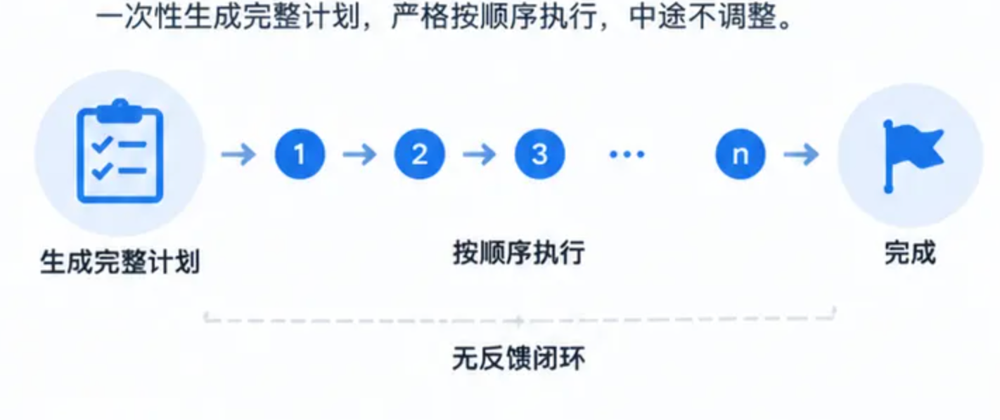
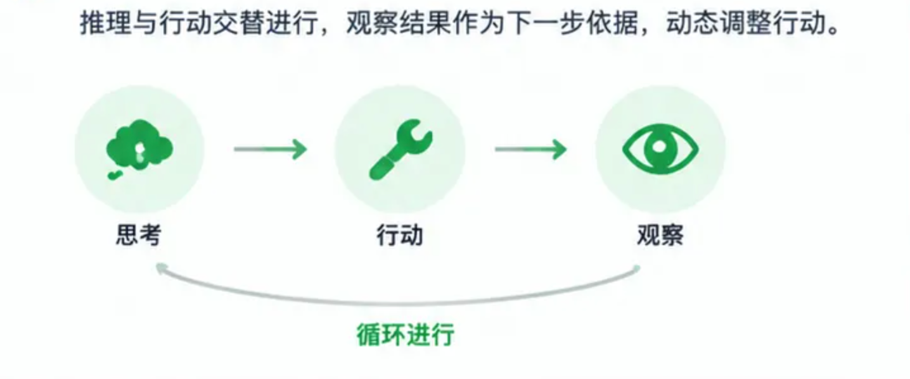
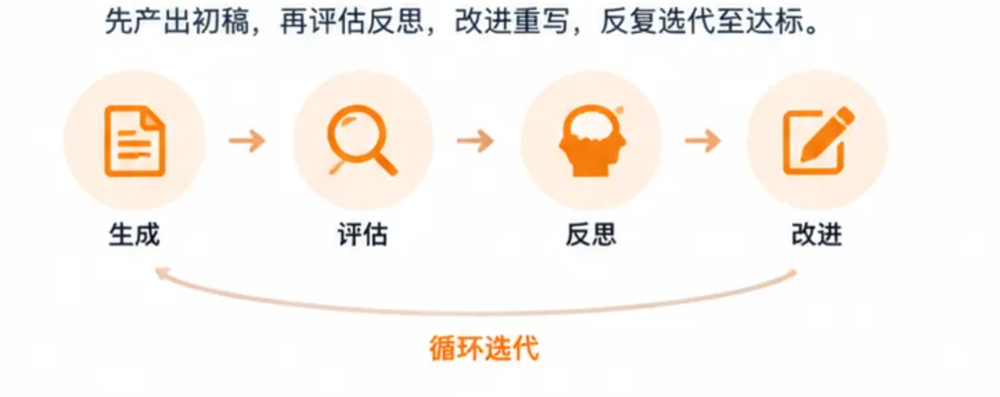

## 任务规划模式

### Plan-and-Execute

先想后做（Plan-and-Execute）

一次性生成完整计划，严格按顺序执行，中途不调整。流程无反馈闭环，稳定可控，适合流程固定的批处理任务。

### ReAct

边想边做（ReAct）

推理与行动交替进行，每步先思考决策，再调用工具获取观察结果，观察作为下一步依据，动态调整后续行动。流程为 “思考→行动→观察” 循环，灵活应变，适合环境动态变化的交互式任务。

### Reflection

先做后想（Reflection）

先产出初稿，再自我评估找出缺陷，反思后改进重写，反复迭代至达标。流程为 “生成→评估→反思→改进” 循环，追求高质量输出，适合写作、代码生成等迭代型任务。

## RAG

RAG：先查资料，再回答

用户提出问题后，系统从文档或知识库中检索相关内容，把取回的资料和问题一起交给模型，再生成回答。图中的向量化嵌入、向量数据库，服务于资料的存储与检索。重点是给模型补充回答所需的外部信息。

AI Agent：由一个智能体处理任务

一个智能体负责理解目标，结合上下文决定下一步。它可以制定计划、使用记忆，并按需调用工具。工具返回结果后，智能体继续处理，最终输出答案。图中的 Memory、Planning 和 Tools，分别对应记忆、计划和工具调用。

Multi-Agent RAG：分头检索，统一汇总

路由智能体根据问题分派任务，让不同的检索智能体查询各自的数据源。检索结果汇入聚合环节，整理后交给模型生成回答。看这部分时，重点留意任务如何分流，以及结果在哪里汇合。