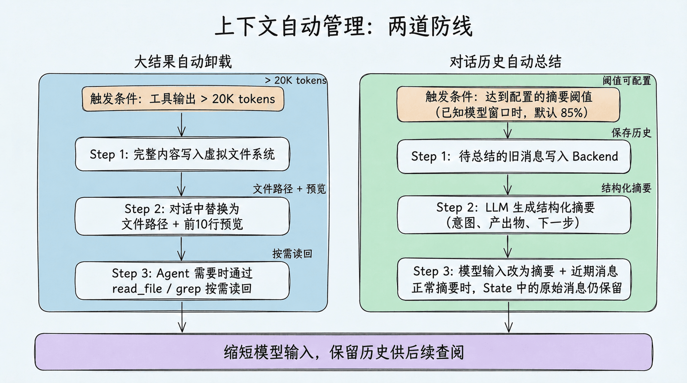

## 用文件系统管理上下文

传统的 Agent 开发有一个致命问题：所有信息都直接塞进 prompt。文件内容、搜索结果、中间计算——全部挤在一个不断膨胀的对话历史里。

Deep Agents 的解决方案是：给 Agent 一个文件系统。

这个思路其实很符合直觉——想想你自己是怎么工作的：

- 你不会把所有资料同时打开铺在桌面上
- 你会把资料分门别类存放，需要时再取出来
- 你会用搜索快速定位需要的内容
- 你会在便签纸上记录中间结果

Deep Agents 让 Agent 也能这样工作。它提供了一整套文件操作工具，Agent 可以像人类一样按需读取、结构化存储、搜索定位。

## 内置文件系统工具

Deep Agents 当前提供 7 个内置文件工具

| 工具         | 用途                                                         | 类比                           |
| ------------ | ------------------------------------------------------------ | ------------------------------ |
| `ls`         | 列出目录中的文件和元信息（大小、修改时间）                   | 打开文件夹看看有什么           |
| `read_file`  | 读取文件内容，支持偏移量和限制条数；原生支持多模态格式（图片、视频、音频、PDF/PPT） | 翻开某份资料阅读               |
| `write_file` | 创建文件，或完整覆盖已有文件                                 | 写一份新的备忘录或重写整份草稿 |
| `edit_file`  | 对已有文件做精确字符串替换                                   | 用红笔修改文档                 |
| `delete`     | 删除文件或目录                                               | 清理不再需要的资料             |
| `glob`       | 按模式匹配查找文件（如 `**/*.py`）                           | 在文件柜中按标签找             |
| `grep`       | 搜索文件内容，按字面量匹配；支持内容输出和计数               | 全文检索                       |

工具定义的是 Agent 能做什么，权限规则决定一次具体操作是否可以做。例如，`write_file` 和 `edit_file` 默认都是普通文件操作，但可以通过 `FilesystemPermission` 对敏感路径直接拒绝，或在执行前暂停等待人工审批。

### `read_file`

对于大文件，`read_file` 支持按偏移量和行数读取，避免一次性把整个文件塞进上下文

```python
# 默认最多读取前 100 行
read_file("/workspace/report.md")

# 从第 100 行开始，读取 50 行
read_file("/workspace/report.md", offset=100, limit=50)
```

`read_file` 不只能读文本——它原生支持多种多媒体格式，直接返回多模态内容块，让 Agent 能 ”看到” 图片、“听到” 音频、“读懂” 文档。这意味着 Agent 可以直接处理截图、录音、演示文稿——不再局限于纯文本工作流。

### `grep`

`grep` 是 Agent 快速定位信息的利器。它支持三种输出模式：

- **`files_with_matches`**：只返回匹配的文件路径（快速定位）
- **`content`**：返回匹配行及上下文（深入查看）
- **`count`**：返回匹配数量（概览统计）

```python
# 找到所有包含 "TODO" 的 Python 文件
grep("TODO", glob="**/*.py", output_mode="files_with_matches")

# 查看匹配内容
grep("def create_agent", output_mode="content")
```

## 上下文自动管理

虚拟文件系统最大的价值不在于 ”存文件” 本身，而在于它与 Deep Agents 的上下文自动管理机制紧密配合。



### 大结果自动卸载

当工具调用的输入或输出超过 20,000 tokens 时（可通过 `tool_token_limit_before_evict` 配置），Deep Agents 会自动：

1. 将完整内容写入虚拟文件系统
2. 在对话历史中替换为文件路径引用 + 前 10 行预览
3. Agent 需要时可以按需读回

比如 Agent 调用搜索工具返回了大量结果：

```bash
原始结果：[50000 tokens 的搜索结果]

自动卸载后：
"结果已保存到 /workspace/search_results_001.md，
 前 10 行预览：
   1  # Search Results for 'LangGraph'
   2
   3  ## Result 1: Official Documentation
   4  ..."
```

这个机制是完全自动的——Agent 不需要手动管理，但可以随时通过 `read_file` 或 `grep` 重新访问完整内容

### 对话历史总结

当上下文达到配置的阈值时，Deep Agents 会启动自动总结。`create_deep_agent()` 在模型 profile 提供窗口大小时，默认使用窗口的 85%；缺少该信息时使用固定 token 阈值，也可以自行配置：

1. 将待总结的旧消息写入 Backend，保存供后续查阅
2. 用 LLM 生成结构化摘要（意图、产出物、下一步），并附上历史保存路径
3. 将本次发给模型的内容换成 “摘要 + 近期消息”；正常摘要时，State 中的原始消息仍然保留

这里要区分 “保存的消息历史” 和 “模型这次看到的内容”。摘要缩短了模型输入，历史文件则用于回查细节；能否读回还取决于 Backend 是否成功保存、文件是否仍然可用。

## 存储后端

 ”虚拟文件系统” 是一个抽象概念，具体的文件存到哪里，由后端（Backend）决定。

Deep Agents 的后端是可插拔的——你可以根据场景选择不同的存储策略。

| 场景           | 推荐后端                         | 理由              |
| -------------- | -------------------------------- | ----------------- |
| 学习和实验     | StateBackend（默认）             | 零配置，自动清理  |
| 本地编程助手   | FilesystemBackend                | 直接操作项目文件  |
| 需要跨会话记忆 | CompositeBackend                 | 混合临时 + 持久化 |
| 需要执行代码   | 沙箱后端                         | 安全隔离          |
| 生产部署       | StoreBackend 或 CompositeBackend | 持久化 + 可伸缩   |

### StateBackend

StateBackend（默认）：临时存储

```python
from deepagents import create_deep_agent

# 默认就是 StateBackend，不需要显式指定
agent = create_deep_agent(model=model)

```

文件存在 LangGraph 的 Agent State 中。特点：

- 同一个对话线程内持久化（多轮对话不丢失）
- 对话结束后丢失（换一个 thread 就没了）
- 主 Agent 和子 Agent 共享文件

适合场景：大多数情况下的默认选择，Agent 的 ”草稿纸”。

### FilesystemBackend

FilesystemBackend：本地磁盘

```python
from deepagents.backends import FilesystemBackend

agent = create_deep_agent(
    model=model,
    backend=FilesystemBackend(root_dir=".", virtual_mode=True)
)
```

文件直接读写本地文件系统。特点：

- `root_dir` 指定 Agent 可访问的根目录；相对路径会被解析为绝对路径（`Path(root_dir).resolve()`），`"."` 即当前工作目录
- `virtual_mode=True` 启用路径沙箱（阻止 `..`、`~` 及越界的绝对路径），强烈建议开启；若为默认的 `virtual_mode=False`，即使设了 `root_dir` 也不提供任何越界保护
- 文件修改是永久的、不可逆的

适合场景：本地开发 CLI（编程助手）、CI/CD 流水线。

### LocalShellBackend

LocalShellBackend：本地 Shell 执行

```python
from deepagents.backends import LocalShellBackend

agent = create_deep_agent(
    model=model,
    backend=LocalShellBackend(root_dir=".", virtual_mode=True, env={"PATH": "/usr/bin:/bin"})
)
```

`LocalShellBackend` 是 `FilesystemBackend` 的扩展，在文件系统工具之外额外提供 `execute` 工具，可直接在宿主机运行 Shell 命令。特点：

- 命令通过 `subprocess.run(shell=True)` 执行，无任何沙箱隔离
- 支持 `timeout`（默认 120 秒）、`max_output_bytes`（默认 100,000）、`env` 等参数
- `root_dir` 作为命令的工作目录，但命令可访问系统上任意路径

适合场景：本地开发环境的编程助手、完全信任 Agent 行为的个人开发机。

如果确实要在个人开发机中临时使用，至少做几层防护：

- 将 `root_dir` 指向一个专门的临时工作区，而不是用户主目录或整个仓库上级目录
- 显式设置 `virtual_mode=True`，并用最小化的 `env` / `PATH` 降低命令可见范围
- 不把 `.env`、私钥、云凭证、生产配置文件放进 Agent 可访问目录
- 对 `rm`、`mv`、安装依赖、修改配置、访问网络等高风险操作增加 Human-in-the-Loop 审批
- 需要运行不可信代码、处理用户上传文件或对外提供服务时，直接换用沙箱后端，不要用 `LocalShellBackend`

### StoreBackend

StoreBackend：跨会话持久化

```python
from langgraph.store.memory import InMemoryStore
from deepagents.backends import StoreBackend

agent = create_deep_agent(
    model=model,
    backend=StoreBackend(
        namespace=("local-user",),
    ),
    store=InMemoryStore()
)
```

文件存在 LangGraph 的 Store 中。特点：

- 跨线程持久化——不同对话都能访问同一份文件
- `namespace` 参数控制数据隔离：`lambda rt: (rt.server_info.user.identity,)` 按用户隔离，防止数据混用
- 开发用 `InMemoryStore`，部署到 LangSmith 时省略 `store` 参数（平台自动配置）

适合场景：长期记忆、跨会话的用户偏好、累积的知识库。

### CompositeBackend

CompositeBackend：混合路由

这是最灵活的方案——不同路径走不同后端：

```python
from deepagents import create_deep_agent
from deepagents.backends import CompositeBackend, StateBackend, StoreBackend
from langgraph.store.memory import InMemoryStore

agent = create_deep_agent(
    model=model,
    backend=CompositeBackend(
        default=StateBackend(),            # 默认：临时存储
        routes={
            "/memories/": StoreBackend(
                namespace=("local-user",),
            ),
        }
    ),
    store=InMemoryStore()
)
```

效果：

- Agent 写入 `/workspace/plan.md` → StateBackend（临时）
- Agent 写入 `/memories/preferences.txt` → StoreBackend（持久化，按用户隔离）
- `ls`、`glob`、`grep` 自动聚合所有后端的结果，路径前缀保留

这种设计让 Agent 既有快速的 ”草稿纸”（State），又有持久的 ”记忆库”（Store），通过路径前缀自然隔离。

### 沙箱后端

沙箱后端：安全代码执行

当使用沙箱后端（Modal、Daytona、Runloop 等）时，除了文件系统工具外，Agent 还会获得一个额外的 `execute` 工具，可以在隔离环境中执行 Shell 命令：

```python
# 沙箱后端自动提供 execute 工具
agent = create_deep_agent(
    model=model,
    backend=sandbox  # 沙箱实例
)
# Agent 现在可以运行: execute("pip install pandas && python analyze.py")
```

## 安全策略

### 声明式权限：FilesystemPermission

最简单的路径访问控制方式是使用 `FilesystemPermission`，无需修改后端代码：

```python
from deepagents import create_deep_agent, FilesystemPermission

agent = create_deep_agent(
    model=model,
    backend=CompositeBackend(
        default=StateBackend(),
        routes={
            "/memories/": StoreBackend(
                namespace=("local-user",),
            ),
        },
    ),
    permissions=[
        FilesystemPermission(
            operations=["write"],
            paths=["/policies/**"],
            mode="deny",           # 禁止写入 /policies/ 下的任何文件
        ),
    ],
)
```

权限规则在工具调用前按声明顺序求值，采用 first-match-wins：第一个同时匹配 `operations` 和 `paths` 的规则决定结果；如果没有规则匹配，则默认允许。因此配置权限时，应将更具体的规则放在更宽泛的规则之前。