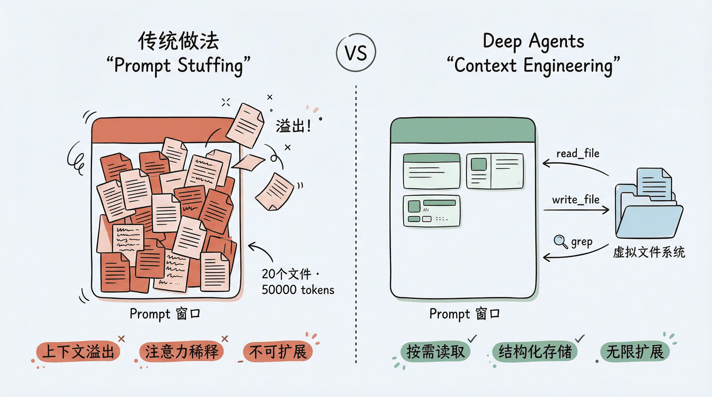
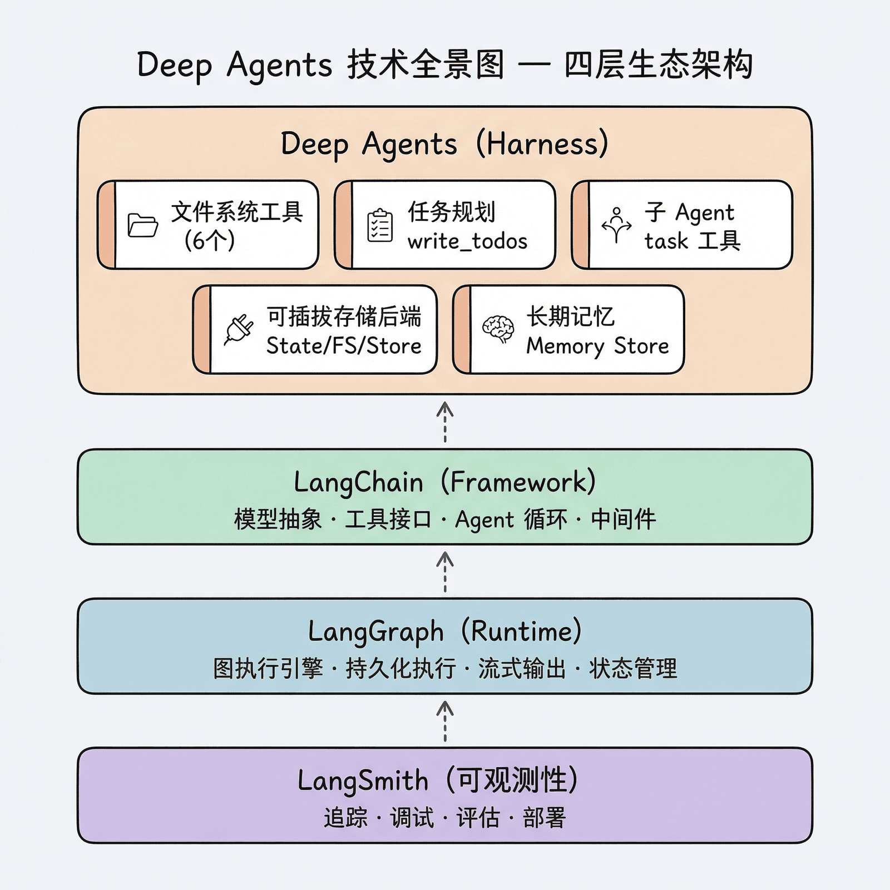

## Deep Agents

### 解决的问题

假设要构建一个 AI 编程助手。它需要：

- 读取项目中的源代码文件
- 理解代码结构，制定修改计划
- 分步骤执行修改，并追踪进度
- 处理过程中发现新问题时，能把子任务 “委派” 给专门的 Agent
- 在多轮对话中记住用户的偏好

如果从零开始用 LangChain 搭建，会发现自己在重复造轮子：手写文件读写工具、手写任务追踪逻辑、手写子 Agent 的调度机制…… 而这些能力，几乎每一个 ”认真” 的 Agent 应用都需要。

这就是 Deep Agents 要解决的问题。

### 为什么需要 Agent Harness？

你可能会问：运行时和框架已经提供了构建 Agent 所需的一切，为什么还需要一个 Harness？

答案来自一个观察：成功的 Agent 产品都长得差不多。

看看市面上那些真正能完成复杂任务的 Agent 产品——Claude Code、Manus、Cursor——它们虽然各有特色，但核心能力惊人地相似：

1. 都有文件系统操作能力：能读写、搜索、编辑文件
2. 都有任务规划能力：能把大任务拆成小步骤
3. 都有子任务委派能力：能把部分工作交给子 Agent
4. 都有上下文管理策略：防止对话过长导致 LLM “失忆”

这些共性不是巧合。当 Agent 面对的任务足够复杂时，这些能力就是必需的。而 Agent Harness 的价值就在于：把这些被验证过的模式固化下来，不需要每次都从头实现。

## Context Engineering

Deep Agents 的技术核心可以用一个概念概括：Context Engineering（上下文工程）。



### 传统做法的问题

传统的 Agent 开发中，所有信息都塞在 prompt 里：

```
System: 你是一个编程助手。
User: 请帮我重构 src/ 下的代码。
[附带: 20 个文件的完整内容，共 50000 tokens]
```

这种做法有几个致命问题：

- 上下文窗口溢出：LLM 有 token 上限，文件一多就装不下
- 注意力稀释：信息越多，LLM 对关键信息的关注度越低
- 不可扩展：无法处理任意规模的项目

### Deep Agents 的做法

Deep Agents 的解决方案是引入一个虚拟文件系统，让 Agent 像人类一样工作：

- 需要读文件时，调用 `read_file` 按需读取
- 需要记录中间结果时，调用 `write_file` 写到文件里
- 需要搜索时，调用 `grep` 或 `glob` 查找
- 大文件只读取需要的部分（`offset` / `limit` 参数）

这样，Agent 的上下文里只保留当前步骤真正需要的信息，其余的都存在文件系统中，需要时再取。

更巧妙的是，这个 ”文件系统” 是虚拟的、可插拔的：

- 可以是内存中的临时存储（开发调试用）
- 可以是本地磁盘（处理真实文件）
- 可以是持久化数据库（跨会话保持记忆）
- 可以是远程沙箱（安全执行代码）
- 甚至可以混合使用（不同路径路由到不同后端）

这就是 Context Engineering——不是把所有信息都喂给 LLM，而是为 LLM 构建一个高效获取和管理信息的基础设施。

## 技术全景



## 参考资料

LangChain Deep Agents 

- <https://mp.weixin.qq.com/s?__biz=MzY4NTQxOTA3MA==&mid=2247483666&idx=1&sn=770fe4ea40b8bb6baf5a78288e99b9cf>
- <https://datawhalechina.github.io/deepagents-in-action/chapters/ch01-agent-harness/>
- <https://datawhalechina.github.io/deepagents-in-action/>