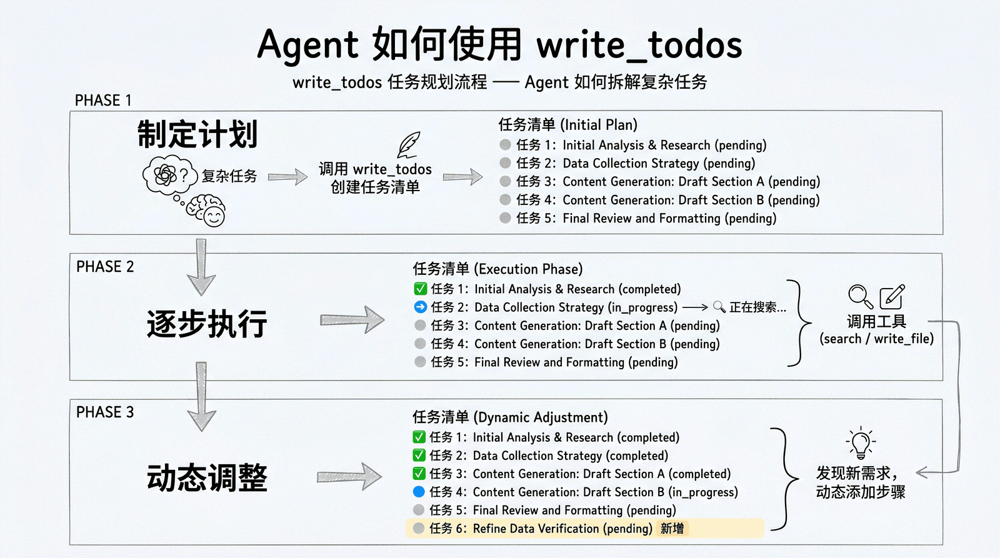

## 启用任务规划

`TodoListMiddleware` 会同时注入 `write_todos` 工具、`todos` 状态和规划提示词。

```python
from deepagents import create_deep_agent
from langchain.agents.middleware import TodoListMiddleware

agent = create_deep_agent(
    model=model,
    middleware=[TodoListMiddleware()],
)
```

| 场景                            | 建议                                   |
| ------------------------------- | -------------------------------------- |
| 单步问答、短工具调用            | 保持关闭，避免计划比任务本身还长       |
| 长程、多阶段、容易漏步骤的任务  | 启用，并用真实任务检查完成率和轨迹长度 |
| 能力较弱、容易失去主线的模型    | 先做 A/B 评测，通常值得尝试            |
| UI 需要展示计划、当前步骤和进度 | 启用；此时 `todos` 也是产品状态协议    |

## `write_todos` 工具

启用后，Deep Agents 会获得 `write_todos` 工具，让 Agent 可以创建和管理任务清单。工具存在不代表每个任务都会调用；具体行为仍由模型、提示词和任务复杂度共同决定。

### 任务的数据结构

每个任务包含以下字段：

```python
{
    "content": "搜索 LangGraph 官方文档，整理核心架构和 API 设计",  # 任务内容
    "status": "pending"  # 状态
}
```

### 三种状态

| 状态          | 含义   | 典型场景                     |
| ------------- | ------ | ---------------------------- |
| `pending`     | 待办   | Agent 刚规划出来，还没开始做 |
| `in_progress` | 进行中 | Agent 正在执行这个步骤       |
| `completed`   | 已完成 | Agent 将任务标记为完成       |

常见状态流转：`pending` → `in_progress` → `completed`。模型也可以根据新信息调整清单，这不是框架强制执行的流程。

`completed` 是 Agent 写入的进度标记。应用仍需检查产物：例如报告是否生成、引用能否核实，或修改后的代码是否通过测试。仅看清单全部完成，不能判断任务质量。

### Agent 怎么用 write_todos？

当 Agent 收到一个复杂任务时，它的典型行为是：



第一步：制定计划

```
Agent 思考：这个任务比较复杂，我先拆解一下。
Agent 调用 write_todos：
  1. [pending] 搜索 LangGraph 官方文档和核心概念
  2. [pending] 搜索三个竞品（Temporal、Inngest、Prefect）
  3. [pending] 对比分析各产品的优劣势
  4. [pending] 撰写报告大纲
  5. [pending] 撰写完整报告
```

第二步：逐步执行

```
Agent 更新任务 1 状态为 in_progress
Agent 调用 internet_search("LangGraph architecture")
Agent 调用 write_file("/workspace/langgraph_notes.md", ...)
Agent 更新任务 1 状态为 completed

Agent 更新任务 2 状态为 in_progress
Agent 调用 internet_search("Temporal vs LangGraph")
...
```

第三步：动态调整

在执行过程中，Agent 可能发现需要额外的步骤：

```
Agent 思考：搜索时发现 Prefect 不太合适，应该换成 Durable Objects。
Agent 调用 write_todos 更新列表：
  1. [completed] 搜索 LangGraph 官方文档和核心概念
  2. [in_progress] 搜索三个竞品
  3. [pending] 对比分析各产品的优劣势
  4. [pending] 撰写报告大纲
  5. [pending] 撰写完整报告
  6. [pending] 补充 Durable Objects 的资料 ← 新增
```

### 任务清单的持久化

任务清单保存在 Agent State 的 `todos` 字段中，和消息历史分开管理：

- 同一次运行中，后续步骤可以继续访问这份清单；默认的对话总结不会删除 `todos` 字段
- 多次 `invoke()` 之间要自动接续清单，需要配置 Checkpointer，并复用同一个 `thread_id`；只添加 `TodoListMiddleware` 不会自动接续上次运行的状态
- `InMemorySaver` 只在当前进程中保存检查点；进程重启后还要恢复，需要使用数据库等持久化 Checkpointer。部署到 Agent Server 时，由平台提供相应的持久化能力
- 默认 `general-purpose` 子 Agent 会继承主 Agent 显式传入的 Todo 配置，但仍在自己的状态中维护清单
- `subagents=[...]` 声明的子 Agent 有独立 Middleware 栈，需要规划能力时必须在自己的 spec 中启用 Todo；它也不会读取主 Agent 的清单