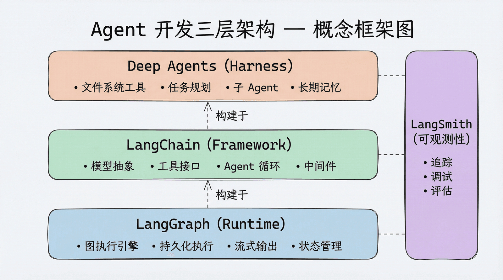

## 概述

LangChain、LangGraph 和 Deep Agents 是 LangChain 生态系统中用于构建 AI 智能体（Agent）的三层递进工具，它们分别充当基础框架、运行时和高阶智能体工具

三者不是互相替代的关系，而是自底向上层层构建。LangGraph 是底层运行时，LangChain 构建在 LangGraph 之上提供更高层抽象，Deep Agents 则在两者之上提供开箱即用的 Agent 能力。你可以根据需求选择在不同层次上工作——需要最大灵活性就直接用 LangGraph，需要快速开发就用 LangChain，需要解决复杂任务就用 Deep Agents。



| 层次                | 代表        | 核心价值                                     | 适用场景                                  |
| ------------------- | ----------- | -------------------------------------------- | ----------------------------------------- |
| Runtime（底层）     | LangGraph   | 持久化执行、流式输出、人机协作、状态管理     | 需要精细控制的长期运行 Agent 和复杂工作流 |
| Framework（中间层） | LangChain   | 模型抽象、工具接口、Agent 循环、中间件       | 快速上手、构建标准化的 Agent 应用         |
| Harness（上层）     | Deep Agents | 预置工具接口、中间件框架、子 Agent、长期记忆 | 复杂多步骤任务、自主性较高的 Agent        |

## 底层

Agent Runtime（运行时层）— LangGraph

Agent Runtime 是整个技术栈的基座，它解决的是 ”Agent 怎么可靠地运行” 的问题：

- 持久化执行（Durable Execution）：Agent 运行到一半崩溃了，能从断点恢复
- 流式输出（Streaming）：让用户实时看到 Agent 的思考和操作过程
- 人机协作（Human-in-the-Loop）：在关键操作前暂停，等待人工审批
- 状态管理（Persistence）：跨对话保存上下文

LangGraph 就是这个底层运行时。它提供了一个基于图（Graph）的执行引擎，支持上面所有这些生产级特性。可以把它理解为 Agent 世界的 ”操作系统”——所有上层应用都运行在它之上。

## 中间层

Agent Framework（框架层）— LangChain

Agent Framework 构建在 Runtime 之上，提供更高层次的开发体验：模型抽象、工具接口、Agent 循环、中间件（Middleware）等。

LangChain 就是这样一个框架。LangChain 1.0 构建在 LangGraph 之上——它利用 LangGraph 的图执行引擎和状态管理能力，但对外提供了更简洁的 API。在使用 LangChain 时，通常不需要直接接触 LangGraph 的底层 API：

```python
from langchain.agents import create_agent

agent = create_agent(
    model="gpt-4.1",
    tools=[web_search, calculator],
    system_prompt="You are a helpful assistant."
)
```

框架层的价值在于标准化和易上手。不需要关心底层的执行引擎、状态持久化逻辑，框架处理好了。

## 上层

Agent Harness（工具层）— Deep Agents

这是最上面的一层，也是本系列课程的主角。

Agent Harness 是一个 ”开箱即用” 的 Agent 套件，它在 Runtime 和 Framework 的基础上，预置了一整套经过验证的工具接口和中间件框架。从 v0.7 开始，Harness 仍提供这些能力，但不再替所有应用默认打开每一种策略。

这个概念怎么理解？打个比方：

- Runtime 提供了工作台、电源、安全护具（底层基础设施）
- Framework 提供了锤子、锯子、钉子（标准化开发工具）
- Harness 直接一个装好了的工具间，常用工具挂在墙上，工作流程贴在白板上（开箱即用）

Deep Agents 就是这样一个 Harness。它利用 LangChain 的核心构建块（模型、工具接口），运行在 LangGraph 的运行时之上，并预置了：

| 能力          | 说明                                                         |
| ------------- | ------------------------------------------------------------ |
| 虚拟文件系统  | `read_file`、`write_file`、`edit_file`、`delete`、`ls`、`glob`、`grep` 七个文件操作工具 |
| 任务规划      | 按需启用 `TodoListMiddleware` 后获得 `write_todos`，把复杂任务拆解为可追踪的步骤 |
| 子 Agent 委派 | `task` 工具，让 Agent 能将子任务派发给专门的 Agent           |
| 长期记忆      | 基于 LangGraph Memory Store，支持跨对话的持久化记忆          |