原文：<https://www.xuanyuancode.com/articles/c0d35f24-5491-4c2a-b56c-77df4506f477>

这是 Claude Code，如果你让它开发一个“美观”的博客网站，它给你的结果可能是这样的：

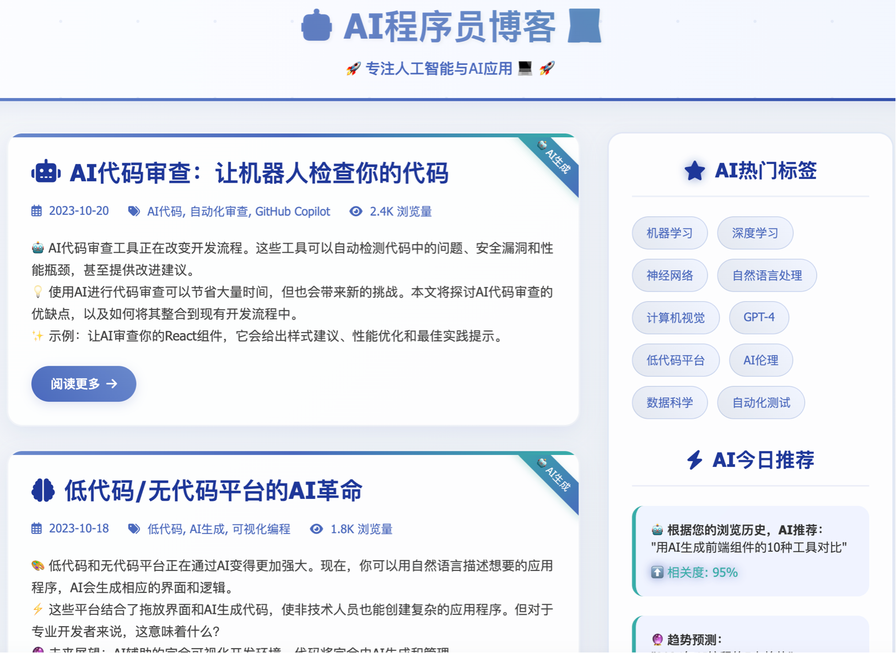

这一点也不美观对吧？

于是你告诉它：

> 1、不要使用蓝紫渐变色
> 2、不要使用 emoji 图标，而要使用 SVG 图标。
> 3、顶部使用导航栏，使用磨玻璃半透明效果
> 4、Hero 区域使用图片作为背景半透明
> 5、一级标题使用 xxx 字体
> 6、按钮使用 xxx 颜色
> 7、文章使用卡片式布局，上半部分是封面图
> ······

把上面这一堆要求告诉 Claude Code，再让他重新给你开发一个“美观”的博客网站，这一次情况就要好很多了。

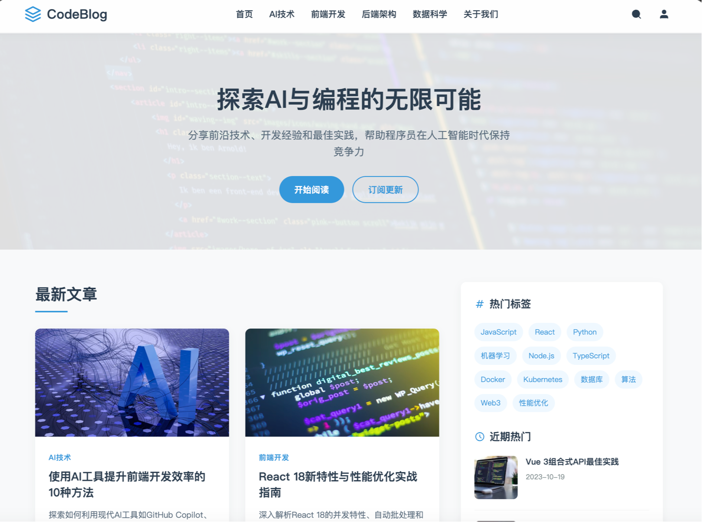

那么问题来了，我不想每次开发项目的时候都啰里啰嗦的写这么一大段，能不能让 Claude Code“记住”我的这些要求，我不用每次都叮嘱呢？

Claude Code 提供了一个方法：我们可以把这一大段要求放到一个单独的文件中，以 markdown 格式书写。

后续我们在让 Claude Code 干活的时候，他就把这个文件一起带上发给 AI 了，这样就不用每次都要写一遍了。

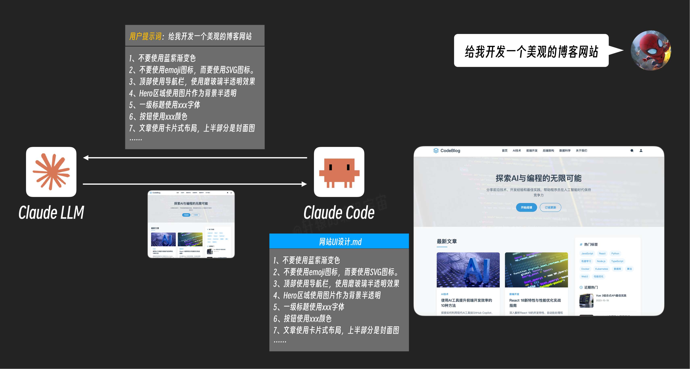

但这样有一个新的问题，如果我只是在 Claude Code 里面聊聊天，提问题，反正不是开发网站，它也要把这一堆内容发给 AI，这不是白白浪费 token 吗？

能不能简化一下这个流程：只有当真正需要用到这个文件的时候，Claude Code 才把它发给 AI 呢？

我们可以这样做：给这个文件取个名字和描述，放在文件最开始的地方，同样还是以 markdown 格式书写。这两个字段简单介绍了这个文件叫啥，是干啥用的。

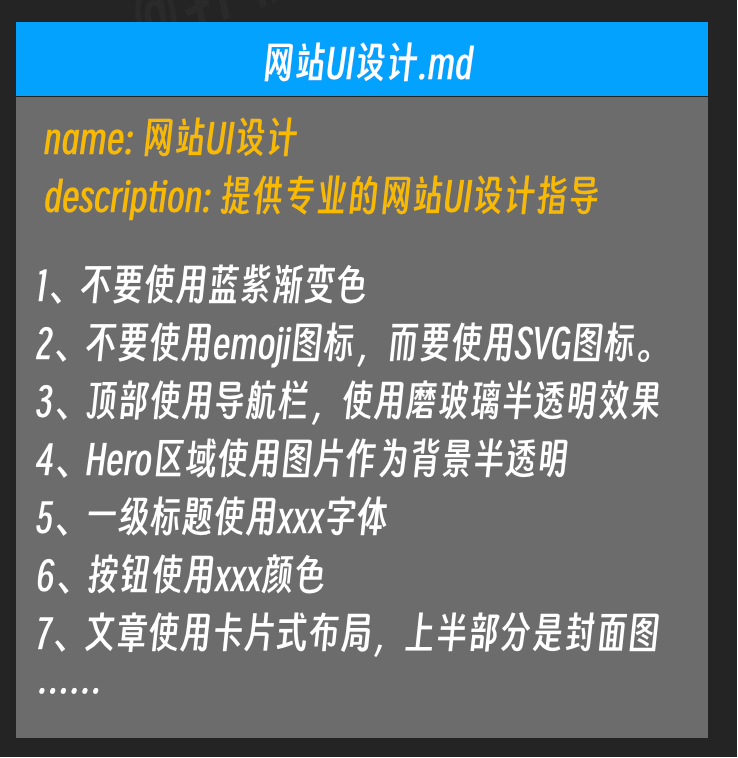

然后 Claude Code 在与 AI 沟通的时候，它告诉 AI，我这里有个文档，它的名字和描述是这样的，如果你有需要可以问我要具体内容。

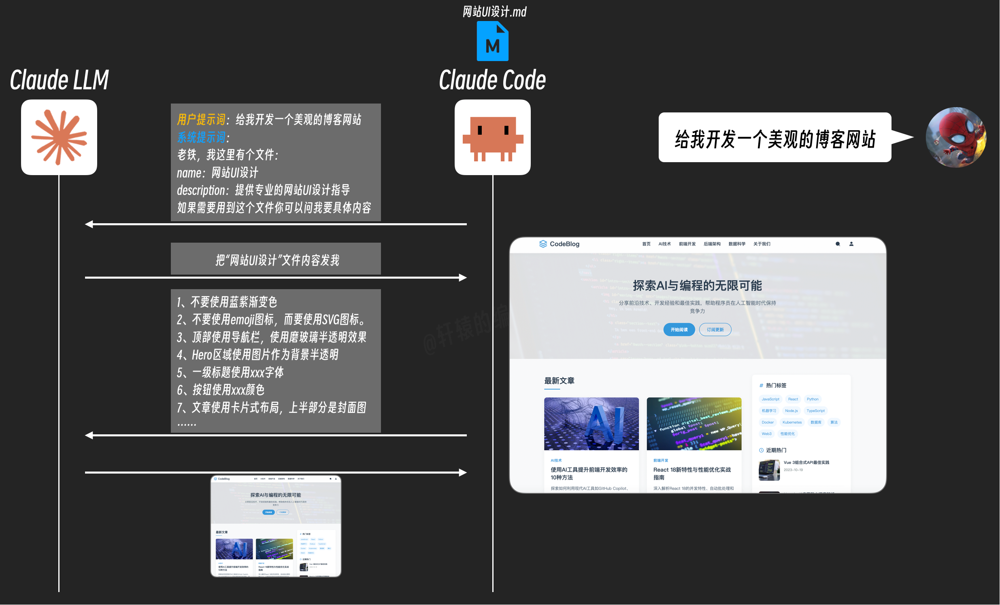

后面 AI 收到用户的指令发现是要开发网站，这时候再告诉 Claude Code 把这个文件给我发来就可以了。

经过这样一通改造，就避免了每次都要把这个文件传给 AI 浪费 token 的问题了。

你发现这一招还挺好使，于是如法炮制，写了一堆不同的文档，比如

- 《SVG 动画制作.md》用来详细指导 AI 如何制作网页 SVG 动画
- 《PPT 制作.md》用来详细指导 AI 如何制作美观的 PPT
- 《日报生成.md》用来详细指导 AI 如何书写符合你们公司风格规范的工作日报。

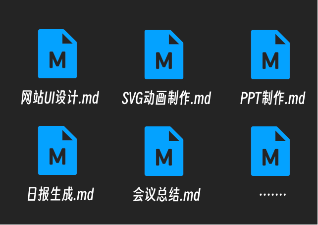

Claude Code 与 AI 交互的时候，只需要把这些文档的名字和描述信息作为一个目录告诉 AI，就像它当初把 MCP 服务清单发给 AI 那样，AI 根据用户的提示词自行决定动态加载哪些文档。

同样的 Claude Code，同样的 AI 大模型，因为有了这一堆文档的加持，你手里的这一套比别人多了很多技能，它更擅长做出好看的网站 UI、更擅长做 SVG 动画、更擅长做 PPT、更擅长写日报，完美！

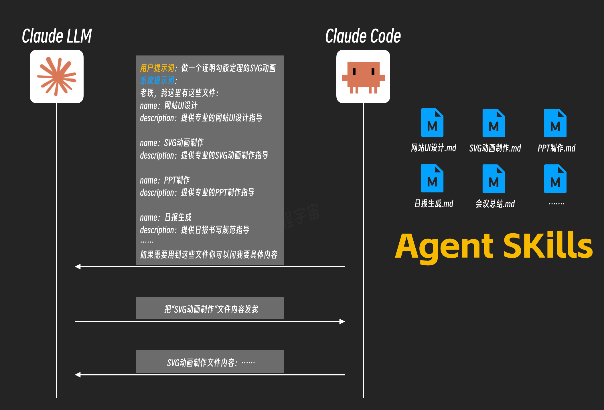

而刚刚这套技术有一个闪亮的名字：Agent Skills！这一个个文档就是一个个的 Skill，也就是一个个的技能。

简单理解的话，这些个 Skill 就是一个个技能手册，Claude Code 和 AI 根据这些手册就能完成特定的工作。

为了规范管理，Claude Code 通过文件夹的形式来管理这些 Skill，并且把每个 Skill 的主文件都统一命名为 Skill.md。

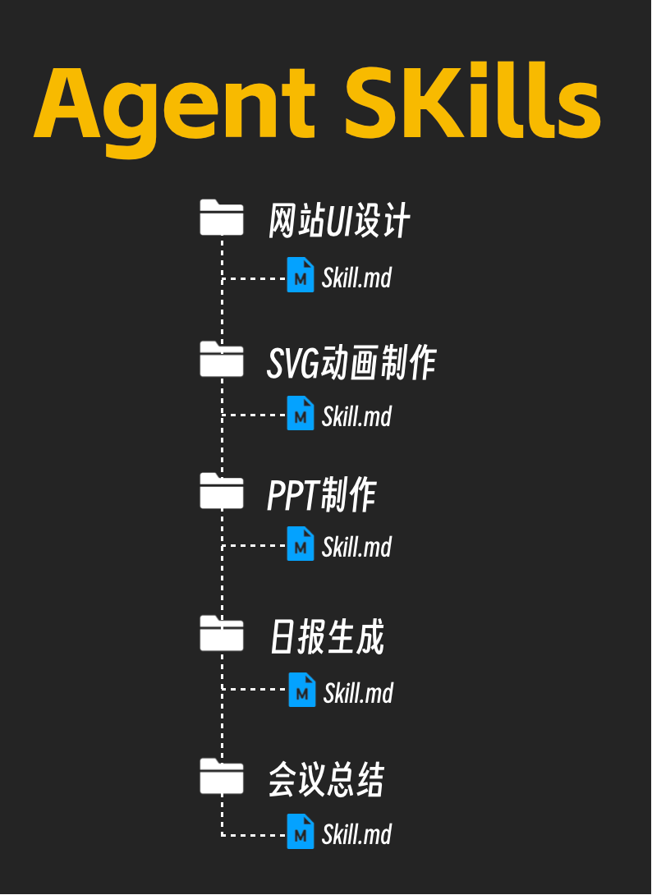

回到我们这个网站 UI 设计的 Skill，随着你不断的迭代，这个 markdown 文件也变得越来越长。

因为好看的 UI 样式实在太多了，各种各样的风格层出不穷，你很难用一个单一的 markdown 文档来全部写完。

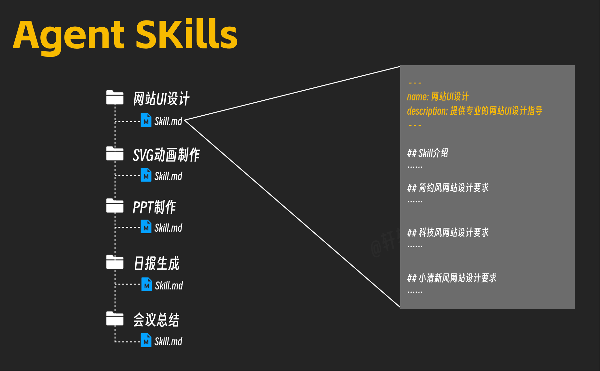

而且就算你能全部写在里面，但实际上 AI 只能用到其中一部分，其他大部分用不上的内容又白白浪费了上下文 token 了。

于是你打算把每一种风格单独拎出来写一个文件，然后在原来这个主文件里面做一个汇总，里面写上：

> - 如果要做简约风网站就读取《简约风.md》
> - 如果要做科技风网站就读取《科技风.md》
> - 如果要做小清新风格网站就读取《小清新.md》

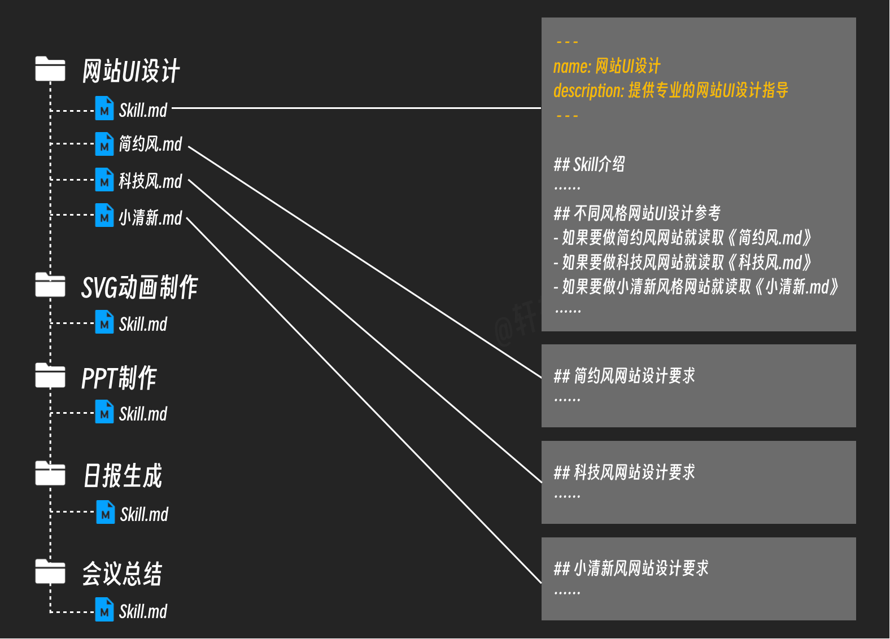

这样一来，当你让 Claude Code 做一个科技风的网站的时候，AI 发现要先读取网站 UI 设计这个 Skill，在读取这个主 markdown 文档之后，再根据需要进一步读取《科技风.md》这个文档。

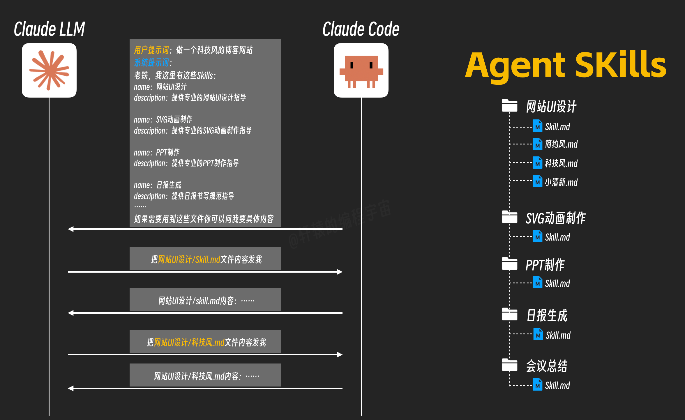

这样按需渐进式加载极大节省了 token，让 AI 只有在必要的时候才读取相应的内容。

再后来，你发现需要对网站 UI 做更精细化的控制，比如按钮、段落、图标、配色、图表等等，用这样的单个文档方式也不太好维护。

你决定技术升级，把这些细粒度的 UI 内容全部用数据表来进行管理，为了简单起见，你选择了用 CSV 表格文件来管理。

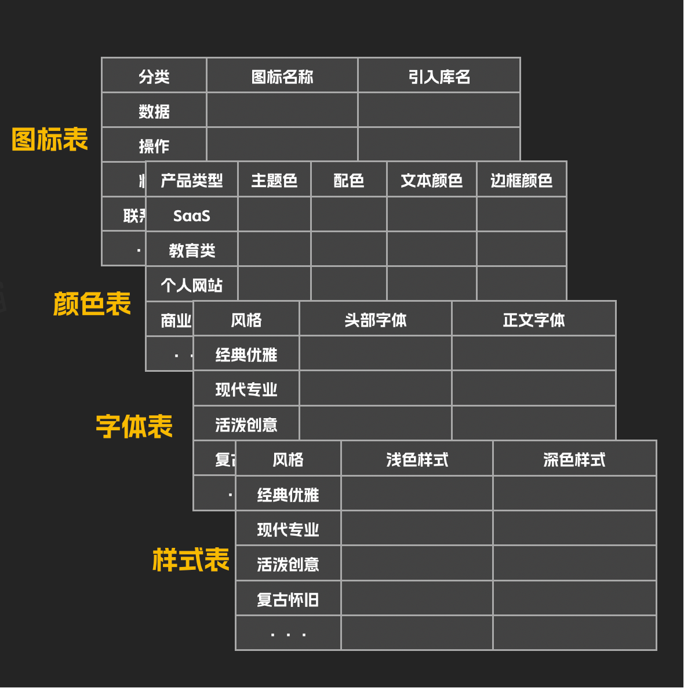

然后你希望 AI 在开发网站的时候，按照下面这一套工作流来确定最终选择的样式：

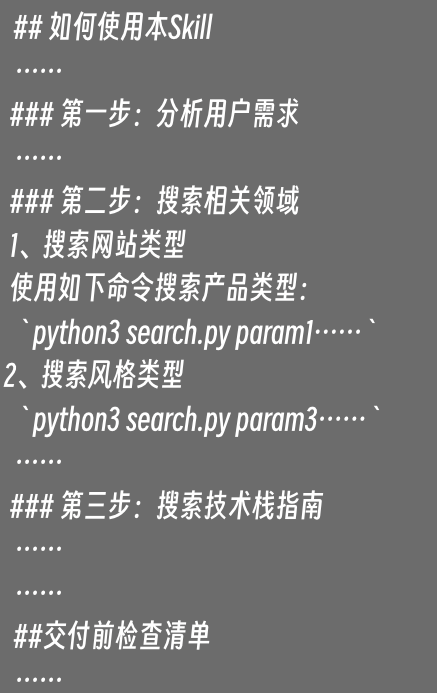

为了让 AI 知道如何搜索，上面的每一步你都写了详细的文字说明，你还专门编写了一个 Python 脚本，并告诉 AI 如何执行这个脚本来从这一堆 CSV 文件里面进行搜索。

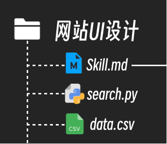

现在 AI 大模型在 Claude Code 的配合下，在拿到你这个 Skill.md 文档之后，就按照你写的流程，一步步执行里面的操作，执行 Python 脚本完成检索，最后拿到完整的 UI 设计信息，开始为你开发网站。

事情发展到这里，这份 Skill 不仅是提供简单的文字信息给 AI 作参考，还能指定工作流，还能提供程序让 Claude Code 来执行，完成更加复杂的工作了。

上面介绍的这个 Skill 不是我虚构的，而是一个真实存在的 Skill，它在 GitHub 上面已经收获了 16K 的 Star：

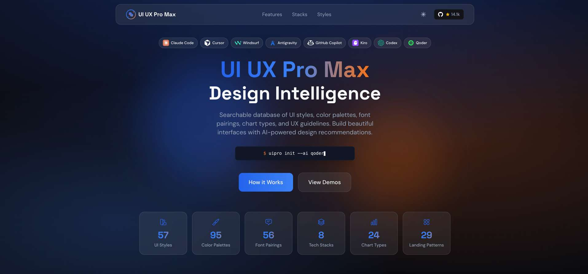

通过这个 Skill，我们可以让 Claude Code 这样的编程智能体开发出 UI 更美观的产品。

而这个 Skill 背后的原理，正如我们前面介绍的那样。

最后让我们来梳理一下整个的过程。

首先，每个 Skill 都需要一个 Markdown 文件，并且在文件的最开始有名字和描述两个字段，这属于这个 Skill 的元数据 Meta Data。

Claude 在启动时加载这些元数据并将它们包含在系统提示词中，因为这两个字段本身内容比较短，所以一般不会占据太多 token。

第二，每个 Markdown 文件除了前面元数据之后的正文内容，叫做指令，它本质上就是一段提示词，用来指导 Claude 如何做特定的事情。只有当 AI 需要使用这个 Skill 的时候才会加载它。官方称之为触发时加载。

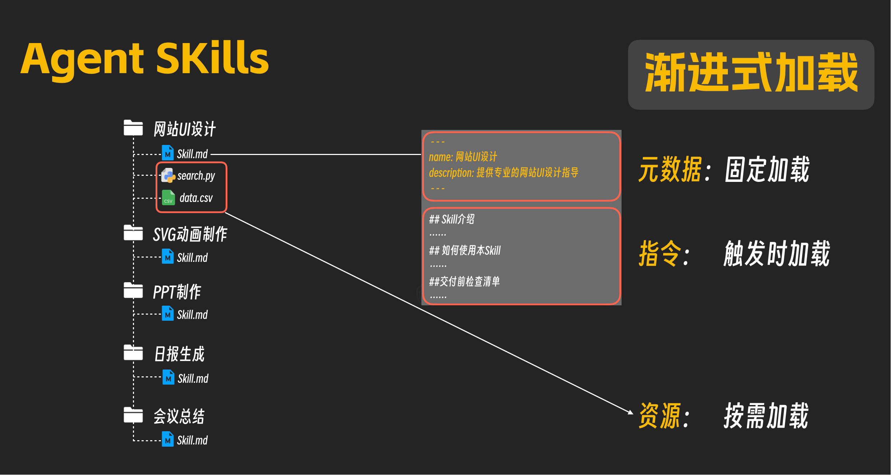

第三，资源和代码。Skill 相关的其他文件和代码脚本，只有当 AI 在使用 Skill 的过程中需要用到的时候才会动态加载。官方称之为按需加载。

Agent Skills 也好，MCP 也好，本质上都属于提示词工程，只不过是符合特定规范相对复杂的提示词，而为了规范管理和各种工程设计考虑，引入了一堆技术名词而已。
