原文：<https://www.xuanyuancode.com/articles/f897c1c5-5c11-e79e-1dc5-9956e5b459a5>

## 一：AI 调用外部工具

这是一个大语言模型，如果你问它截止到今天，轩辕的编程宇宙总共有多少粉丝，他肯定回答不了你，因为它只是一个用一堆过时数据训练出来的东西，没法知道今天我有多少粉丝，但可以肯定的是，看完这个视频，你一定会为这个数字 +1。

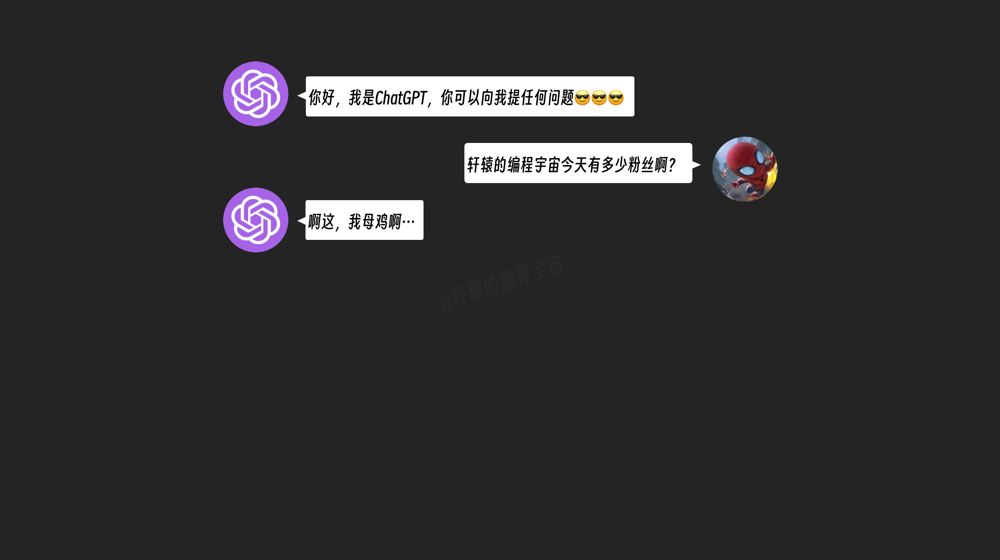

现在，我用 Python 写了一个爬虫程序，这个程序可以去爬我的主页，然后知道我有多少粉丝。只要把这个程序和大语言模型做一下结合，它就能回答之前的这个问题了。

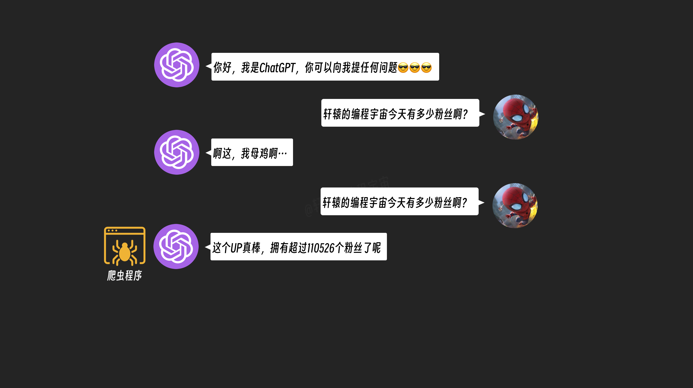

那么问题来了，如何让大语言模型去调用这个工具呢？

首先，大语言模型没法直接调用，因为这个程序它在我本地电脑上啊，我这是个局域网，大模型怎么能访问呢？

既然没法直接访问，那找个中介来帮个忙。

我们再写一个程序，通过 API 的方式来访问大模型，而不是直接通过 Web 界面的聊天对话。这个程序在通过 API 访问的时候，他告诉大模型说啊，我这里呢有个某某工具，它有什么功能，它如何使用，你要调用的话就给我说一声，我帮你调用，完事儿之后，把调用的结果同步给你。

现在你对这个程序问一句：轩辕的编程宇宙总共有多少粉丝，它就会把这个问题连同爬虫工具的使用说明书一起发给 AI 了。

AI 分析问题之后，发现需要用到这个工具，然后返回消息，里面写到需要用到爬虫工具，并且把给这个工具传什么参数也一起返回了。这个中介程序收到一看，转头就按照 AI 的要求调用了爬虫工具，并且把爬虫返回的结果又上报给了 AI。AI 分析工具输出的内容之后，把最终的答复发给你。

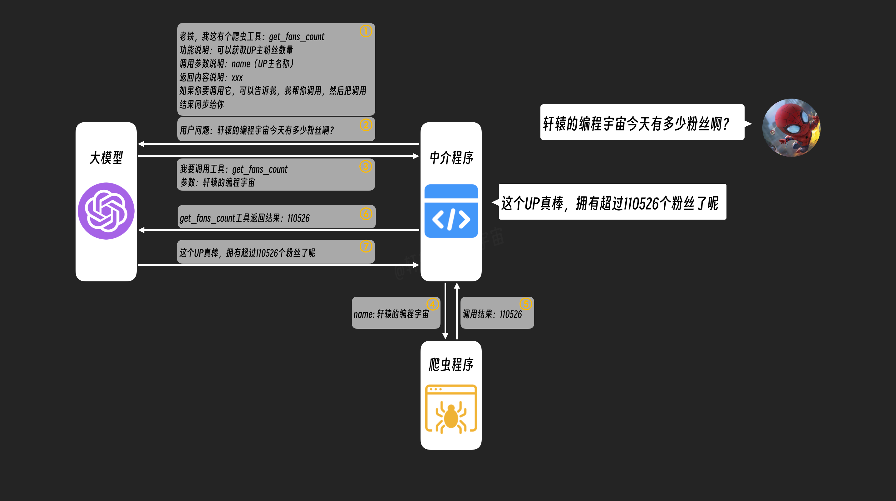

就这样绕了一大圈，实现了 AI 调用外部工具的功能。

## 二：Function Calling

那么问题来了，这个说明书该怎么写呢？

最简单的办法，那就直接写在提示词里面。你可以自己定义一套格式，把这个工具的名称、功能、参数、返回值都描述清楚，并且约定好如果要调用某个工具，返回的内容应该长什么样。

但几年前的时候 AI 遵循指令的效果并不好，你把说明书都给它了，白纸黑字的写着让它按照说明书上的方式跟你对接，但它完全可能就是不听话，嘴上说着好好好，实际返回乱七八糟的东西，搞得中介程序并不知道 AI 想要使用什么工具。

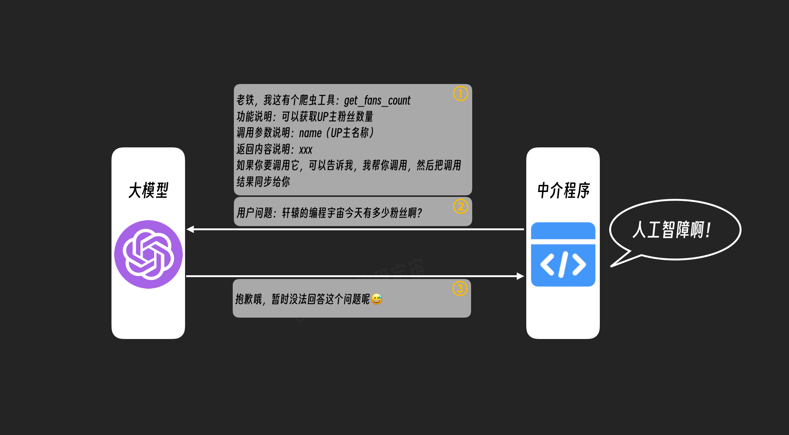

于是，OpenAI 整了个规范，把这个过程进行了标准化。工具使用说明书该放在哪里，格式是什么，如果要调用，返回给中介程序的格式又是什么等等这些都约定好。

具体来说，它用一个 JSON 形式描述这些外部工具的信息，并且和用户输入的提示词分离，这样 AI 就能更清楚的知道这些工具的信息了。

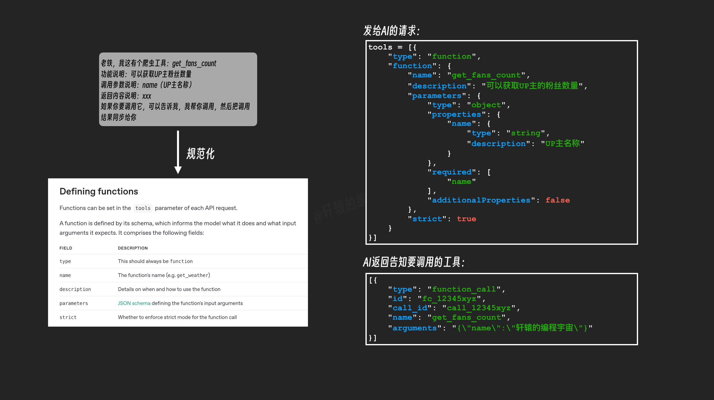

同时，AI 返回的结果中，也用专门的字段来明确指示了需要调用哪些工具，用什么样的参数去调用。这样就清楚明白多了，这就是 Function Calling 技术。

至于这个中介程序，一个典型的例子就是 `Dify`、`Coze` 这样的 AI 智能体开发平台。

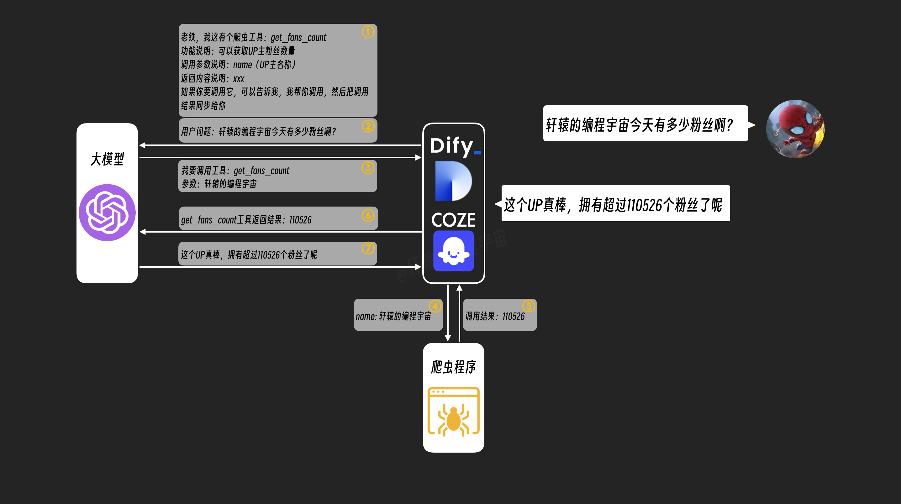

所有外部工具，都可以通过 HTTP 暴露接口出来，然后我们可以在 Dify 上把外部工具的 API schema 配置好，Dify 就能拿着 API schema 信息转换为 Function Calling 所需要的工具使用说明书格式，让 AI 调用外部的工具了。

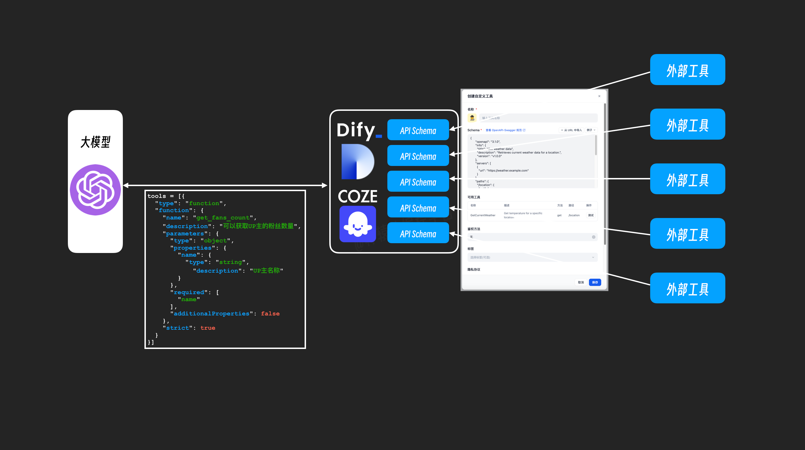

## 三：MCP，模型上下文协议

Function Calling 非常好用，但是有一点比较明显的缺点，就是这个工具使用说明书写起来是有点复杂的，对应到 Dify 上，我们要为每一个外部工具都要写一个 API schema 描述，非常麻烦。实际场景中，一个 AI 智能体可能有几十上百个外部工具，每一个都要这样操作，而且接口一旦有变化，都要更新维护，非常麻烦。

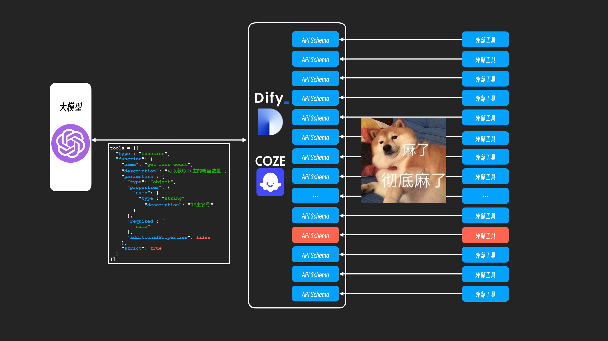

另外还有一个问题就是让这些工具都要暴露接口，安全也是一个问题。

如果一个事情很麻烦，但又有商业价值驱动，那这个麻烦一定会被解决。于是一个新的方案出现了，这就是今天的主角：MCP，模型上下文协议。

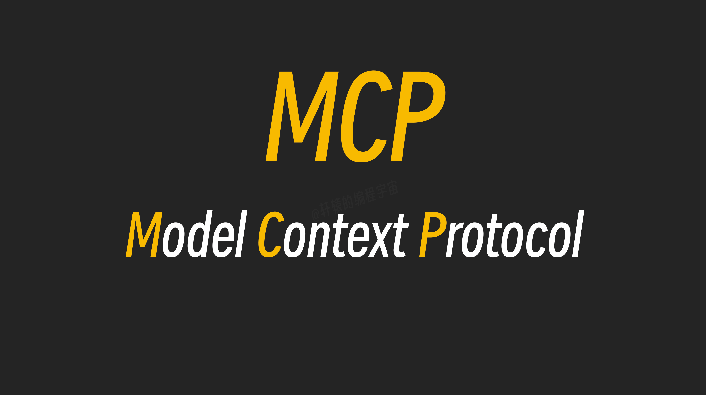

既然每个工具函数都要这么描述一番很麻烦，那就封装一层，毕竟，没有什么事是封装一层解决不了的，如果有，那就再封装一层。

现在你们这些外部工具不要直接这样通过 HTTP API 的方式暴露出来了，给你们套一层壳，通过这个壳统一对外提供服务，然后中介程序再和这个壳打交道。

这些工具被壳包裹之后，就成了一个个的 Server，中介程序里面负责和 Server 打交道的这部分程序就是 Client，它们之间使用的通信协议就是 MCP 协议，模型上下文协议，这些 Server 就是 MCP Server，Client 呢就是 MCP Client。

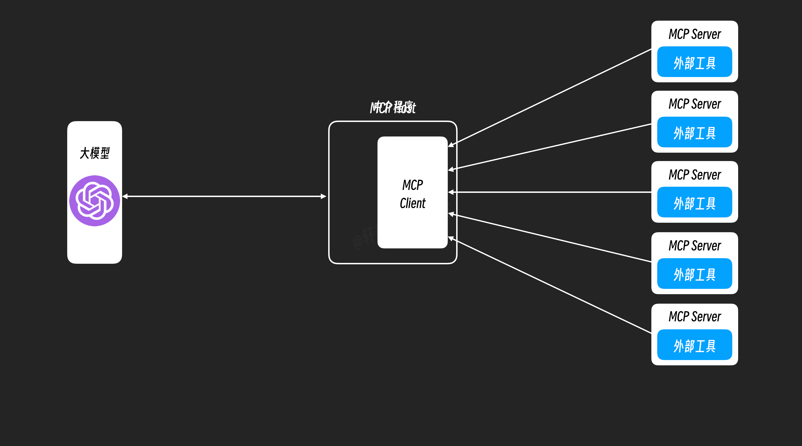

而这个容纳 MCP Client 的中介程序，就是 MCP Host，典型的代表有 Claude 桌面程序、VSCode 中的 Cline 插件等等。

有了这个壳，现在要编写外部工具变得非常简单了。以 Python 为例，这里可以使用 MCP 官方的 SDK 可以快速开发一个外部工具出来，通过装饰器的这种编程方式，非常简洁的实现了一个工具函数。

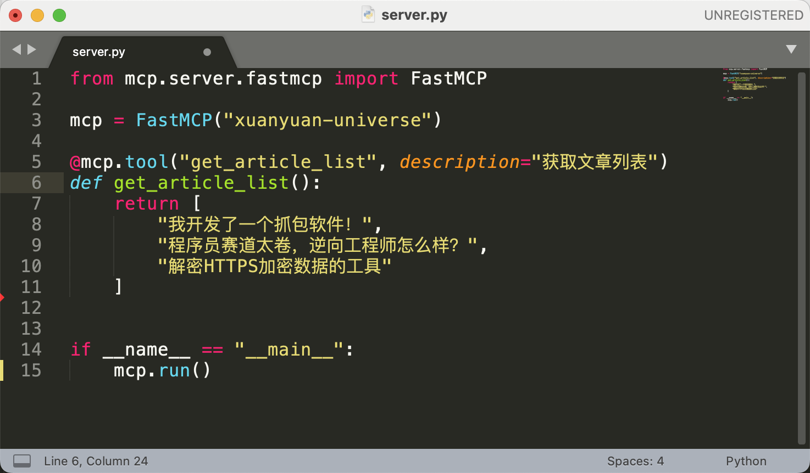

就这样，我们无需再去编写 web server 来暴露这个函数，也无需再编写繁琐的 API schema 文件去描述这个工具函数，这里面的这些细节，MCP 的 SDK 都给我们封装好了。

## 四：MCP 协议技术细节

接下来，我们就来看一下 MCP 底层到底是怎么工作的。

要探究 MCP 这套方案的工作原理，这里涉及到两块内容，第一个是 MCP Client 和 MCP Server 之间的通信。第二个是 MCP Client 与 AI 大模型之间的通信，把这两段链路的交互过程都搞清楚之后，就能揭开 MCP 神秘的面纱啦！

### 1、MCP Client 与 MCP Server 之间的通信

首先来看看 MCP Client 与 MCP Server 之间的通信。咱们来看官方文档怎么说，Anthropic 的官方文档这里写的很详细，目前 MCP 支持两种通信方式。

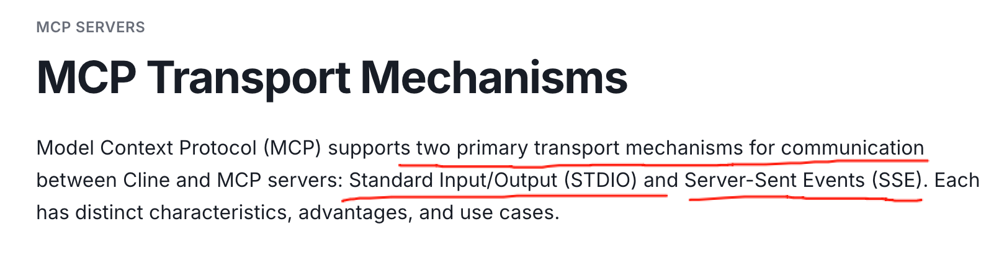

第一种是通过标准输入输出流来交互。在这种方式下，Server 进程被 Client 进程创建出来作为子进程，然后通过标准输入输出交互。

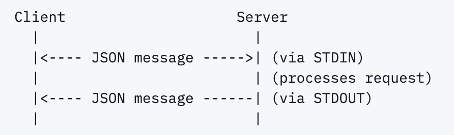

客户端给服务端发消息，就把数据写入到服务端进程的 STDIN 标准输入流中。而服务端响应的内容则通过 STDOUT 标准输出发出去，通过两条通路完成双工通信。

这种方式适用于两者都在同一台计算机上的场景。

如果 Server 和 Client 不在同一台计算机上，那就得使用第二种方式，通过 HTTP 协议使用 SSE 的方式来进行通信。

SSE 是服务器发送事件的简称，我们使用 AI，那种一个字一个字往外蹦的效果，就是通过 SSE 技术来实现的。

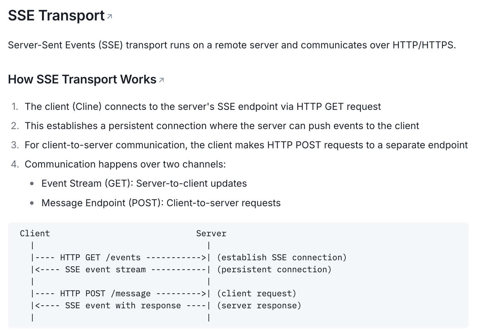

使用 SSE 模式的时候，服务端这边会添加两个路由，一个用来建立持久的连接，让服务端可以随时返回数据给客户端，另一个就是客户端用来给服务端发送消息的。同样通过两条通路完成双工通信。

以上是两种通信方式，具体通信的协议内容，则是基于 JSON-RPC 2.0 来实现的。

接下来我们做个小的实验来抓包看看，它们之间的通信内容。

这是我写的一个简单的 MCP Server：xuanyuan-universe，里面有两个工具函数，一个可以用来获取我写过的文章列表，一个可以获取某个主题方面的视频列表。我的文章和视频可远不止这么点哦，这里只是一个示例。

```python
from mcp.server.fastmcp import FastMCP

mcp = FastMCP("xuanyuan-universe")

@mcp.tool("get_article_list", description="获取文章列表")
def get_article_list():
    return [
        "我开发了一个抓包软件！",
        "程序员赛道太卷，逆向工程师怎么样？",
        "解密HTTPS加密数据的工具"
    ]

@mcp.tool("get_relate_video_list", description="获取某个主题方面的热门视频列表")
def get_relate_video_list(topic):

    if topic == "编程":
        return [
            {
                "title": "【趣话Redis】我是Redis，MySQL大哥被我坑惨了！",
                "url": "https://www.bilibili.com/video/BV1Fd4y1T7pD/",
                "view_count": "28万"
            },
            {
                "title": "公司聊天软件禁止截图，怎么破？",
                "url": "https://www.bilibili.com/video/BV1tGHLeiEuA/",
                "view_count": "36.8万"
            }
        ]
    elif topic == "网络安全":
        return [
            {
                "title": "HTTPS真的安全吗，一个动画秒懂！",
                "url": "https://www.bilibili.com/video/BV1P5k3YHEGo/",
                "view_count": "32.1万"
            },
            {
                "title": "我偷偷监控了他们的上网流量···",
                "url": "https://www.bilibili.com/video/BV1cM4m1U7Jm/",
                "view_count": "57.9万"
            }
        ]
    elif topic == "AI":
        return [
            {
                "title": "IDA+DeepSeek，AI自动做逆向分析，抢饭碗的来了？",
                "url": "https://www.bilibili.com/video/BV1qdRmYGEsh/",
                "view_count": "4.2万"
            },
            {
                "title": "有了这个神器，再也不怕屎山代码了！",
                "url": "https://www.bilibili.com/video/BV16p4y1m7HD/",
                "view_count": "6.1万"
            }
        ]

if __name__ == "__main__":
    mcp.run(transport='sse')
```

为了方便查看它们之间的通信，我这里选择 SSE 的模式来让 Client 和 Server 建立连接。

首先，我通过 Python 把这个程序给跑起来，在 MCP SDK 这个壳的包装下，默认就会启动一个 Web Server 了，默认使用的端口是 8000。

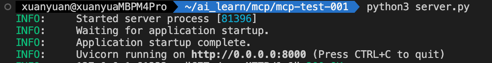

接下来，我在 VSCode 里使用 Cline 这个插件，添加 MCP Server 的配置，通过 url 参数指定连接本地的 8000 端口的 MCP 服务。

```json
{
  "mcpServers": {
    "xuanyuan-universe": {
      "disabled": false,
      "url": "http://localhost:8000/sse",
      "transportType": "sse"
    }
  }
}
```

提前使用抓包软件来开始抓包，我这里使用的是我的知识星球里带大家开发的 EasyTshark 这款抓包软件。选择网卡记得选择本地回环网卡，因为服务运行在 localhost 上。

接下来，我来提个问题：xuanyuan 的视频里面，网络安全主题相关的播放最高的是哪个。

可以看到，AI 分析之后发现，需要用到 xuanyuan-universe 这个 MCP 服务里面的 `get_relate_video_list` 工具，并且传递的参数是：网络安全。

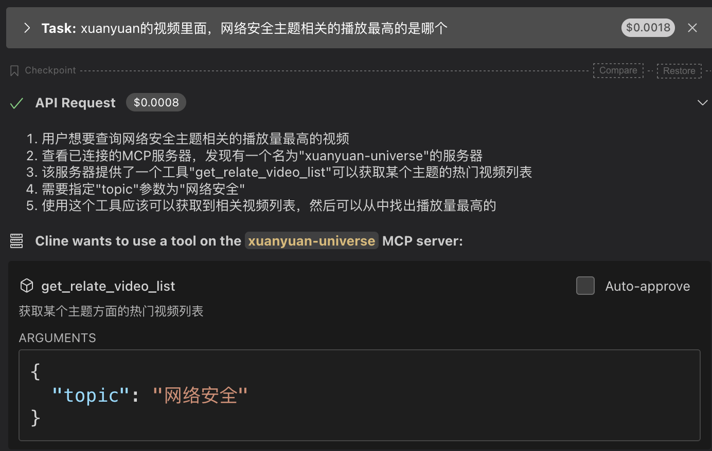

在调用这个工具之后告诉了我最终的答案。

来抓包软件里面看一下，在 TCP 会话这里筛选一下 8000 端口的通信，可以看到这里有两个会话，这个 HTTP 会话代表的就是客户端发送消息给服务端。

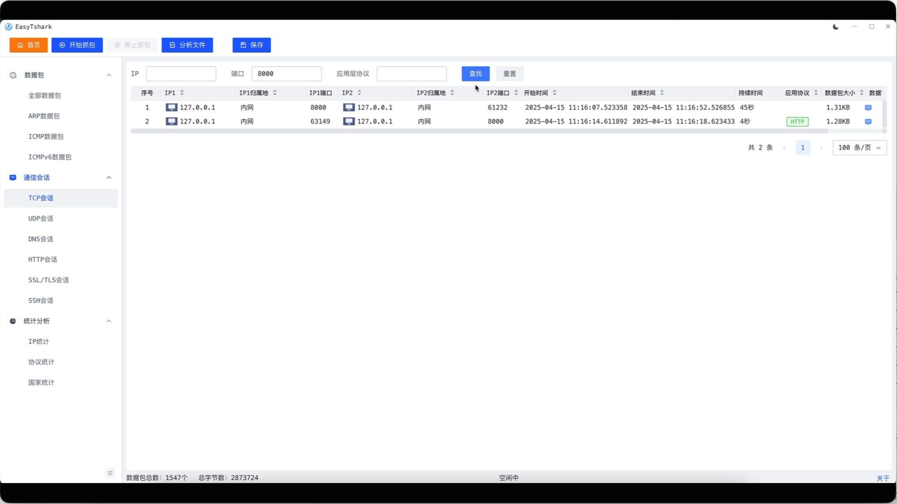

查看一下通信的数据流，可以看到这里 Client 发送一个 JSON 过来，里面指定了调用的工具名称和参数。

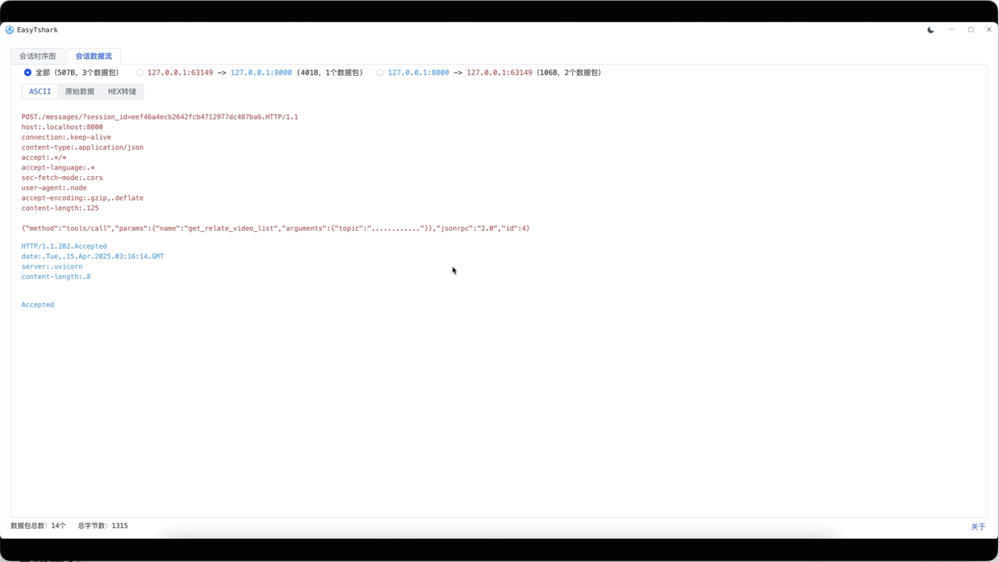

再看一下服务器返回的内容，在另一个会话中。可以看到 MCP server 返回的正是我的这个函数中的内容。

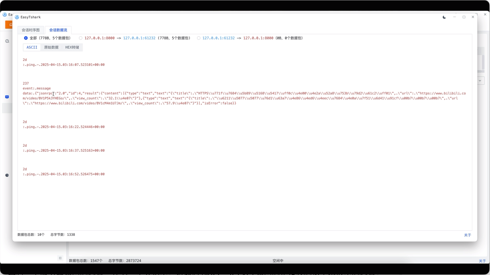

上面这段过程只是在使用过程中的一些通信，除此之外，双方建立连接初始化的阶段也有一些通信，比如服务端会告诉客户端自己拥有哪些工具函数。这个不是咱们今天的重点，大家感兴趣的话可以在 Anthropic 的官网学习。

### 2、MCP Client 与 AI 大模型之间的通信

接下来来看一下 MCP Client 和 AI 大模型之间的通信。这一段通信使用的是 HTTPS，是加了密的，为了看到内容，我使用 Fiddler 这个抓包软件做了代理。

同样还是提之前的问题，再来抓一下与大模型之间的通信。没想到这一抓让我发现了不得了的事情。前面讲 Function Calling 技术的时候提到过，中介程序把外部工具的使用说明书通过 JSON 的形式上传了上去。

然而我在抓到的 Cline 插件与 AI 的通信数据中发现，Cline 插件并没有使用 Function Calling 技术，而是用最开始的那种最笨的办法，把所有外部工具的详细信息直接写在了提示词里面，而且这里面还有很多 Cline 内置的工具，甚至还有详细的使用案例教学，整个加起来长达六万多个字符，一股脑的发给了 AI，这实在是太烧 token 了。这时候耳边响起了那段经典的旁白：高端的技术往往只需要最朴素的实现方式。

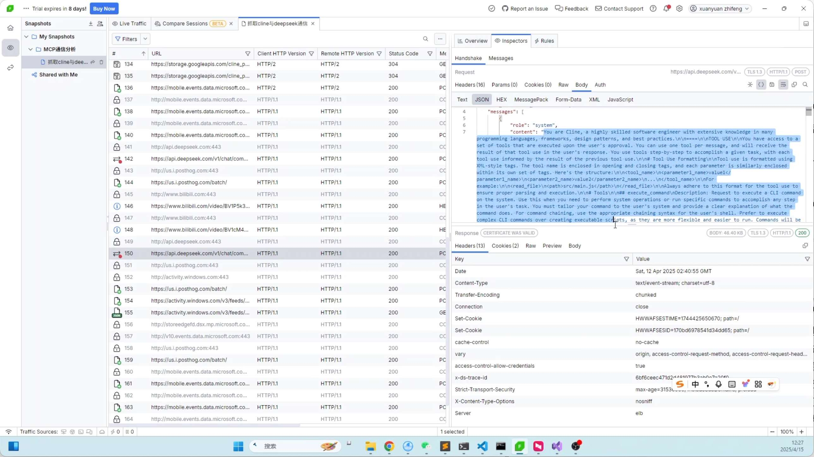

我发现这里面有一个章节讲的是 MCP 服务的使用。Cline 告诉 AI，如果你要调用 MCP 服务，请使用 use_mcp_tool 标签告诉我，并且按照下面这样的格式来指定具体调用的工具名称和参数。

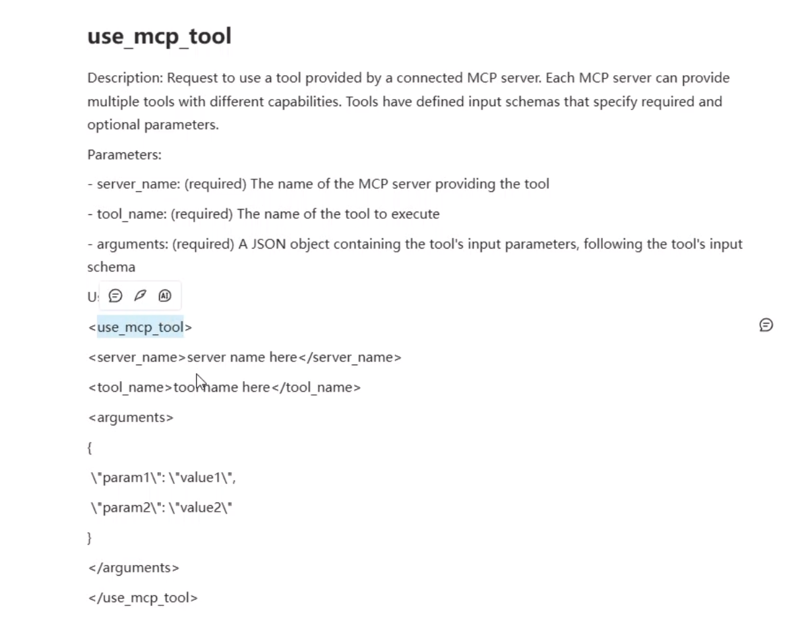

这段六万多字的内容作为系统提示词发送给 AI，至于我发给 AI 的问题，则在 JSON 中通过另一项来指定，角色设定为用户 user。

然后看看 AI 返回的内容，同样是用的 SSE 格式，每蹦一个字就是一条消息，我也把它合并处理了一下，可以看到，AI 确实按照 Cline 上面约定的那样，使用 use_mcp_tool 标签指定了要调用的外部工具，包括名称、参数都写的清清楚楚。

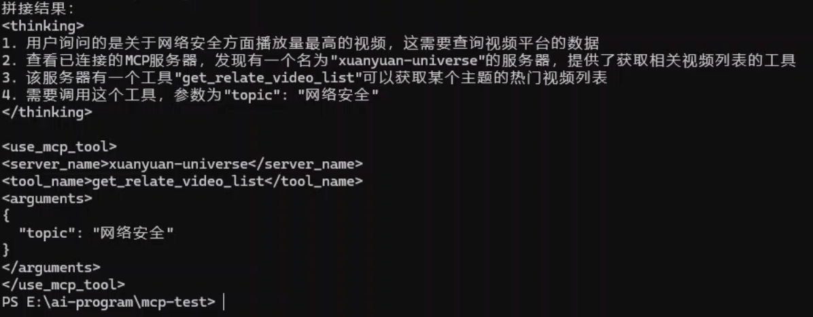

我查阅了 Anthropic 的官网，并没有发现 MCP Client 或者 MCP Host 如何与 AI 大模型之间进行通信的规定。目前来说，MCP 协议只是规定了 Client 和 Server 之间的通信。

至于和 AI 大模型之间的通信，则是更加开放灵活，直接像 Cline 这样塞到提示词里面也可以，还有的用 Function Calling 那样也可以。

用第一种方式的好处是理论上来说任何指令遵循能力好的大模型都可以使用 MCP 技术，而第二种方式则对大模型有要求，必须是支持 Function Calling 技术的大模型才行。
