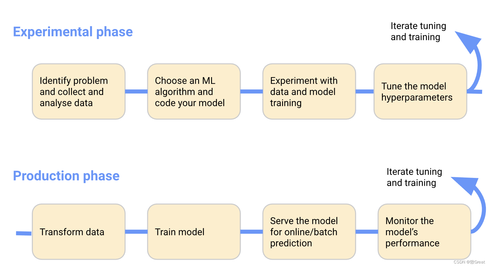

## Kubeflow 简介

Kubeflow 是一个为 Kubernetes 构建的可组合，便携式，可扩展的机器学习技术栈

Kubeflow 是 google 开源的一个基于 Kubernetes 的 ML workflow 平台，其集成了大量的机器学习工具，比如用于交互性实验的 jupyterlab 环境，用于超参数调整的 katib，用于 pipeline 工作流控制的 argo workflow 等

作为一个 “大型工具箱” 集合，kubeflow 为机器学习开发者提供了大量可选的工具，同时也为机器学习的工程落地提供了可行性工具

### 机器学习工作流

kubeflow 是一个胶水项目，它把诸多对机器学习的支持，比如模型训练，超参数训练，模型部署等进行组合并已容器化的方式进行部署，提供整个流程各个系统的高可用及方便的进行扩展部署了 kubeflow 的用户就可以利用它进行不同的机器学习任务



在实验阶段，根据初始假设开发模型，并迭代测试和更新模型以产生正在寻找的结果：

- 确定希望 ML 系统解决的问题
- 收集和分析训练 ML 模型所需的数据
- 选择 ML 框架和算法，并对模型的初始版本进行编码
- 试验数据并训练模型
- 调整模型超参数以确保最高效的处理和最准确的结果

在生产阶段，部署一个执行以下过程的系统：

- 将数据转换为训练系统需要的格式
- 为确保模型在训练和预测期间表现一致，转换过程在实验和生产阶段必须相同
- 训练 ML 模型
- 为在线预测或以批处理模式运行的模型提供服务
- 监控模型的性能，并将结果提供给流程以调整或重新训练模型

ML 工作流中的 Kubeflow 组件如下图所示


### 核心组件

构成 Kubeflow 的核心组件，官网 <https://www.kubeflow.org/docs/components/> 有具体介绍

## 安装 Kubeflow

- 官方定制化安装指南仓库

手动安装向导：<https://www.kubeflow.org/docs/started/installing-kubeflow/>

在部署 Kubeflow 之前，必须在 Kubernetes 集群中指定一个默认 StorageClass 。Kubeflow 部署过程会尝试使用默认 StorageClass 配置新的永久性卷

```bash
kubectl patch storageclass \
  sc-name \
  -p '{"metadata": {"annotations":{"storageclass.kubernetes.io/is-default-class":"true"}}}'
```

使用 NVIDIA DeepOps 提供的 Kubeflow 部署工具：<https://github.com/NVIDIA/deepops/blob/master/docs/k8s-cluster/kubeflow.md>

```bash
./scripts/k8s/deploy_kubeflow.sh
```

## 参考资料

- <https://developer.aliyun.com/article/784044>
