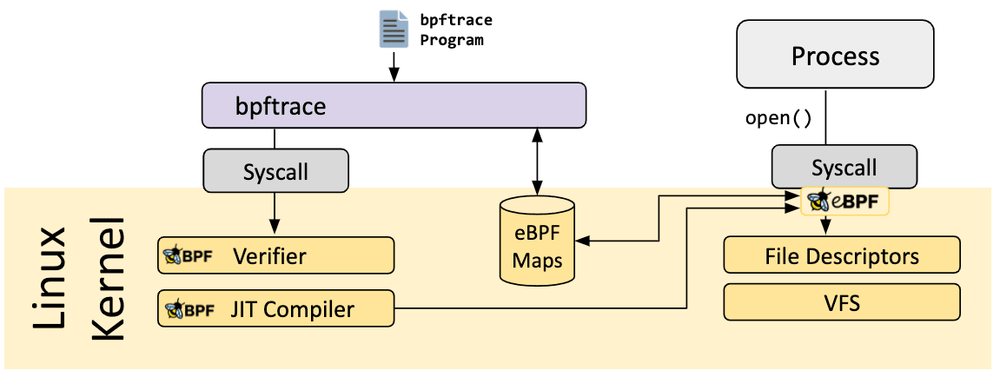
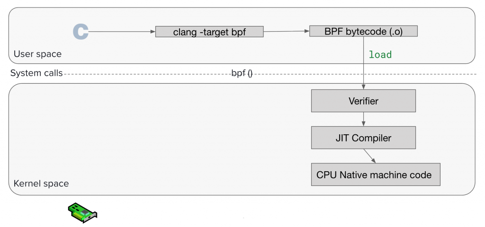
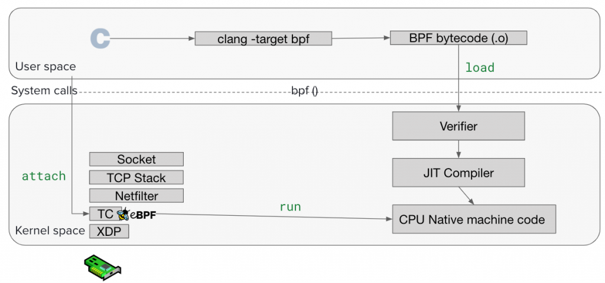
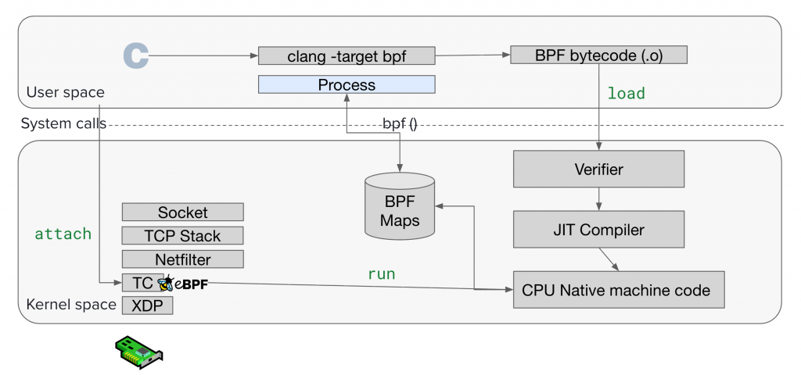
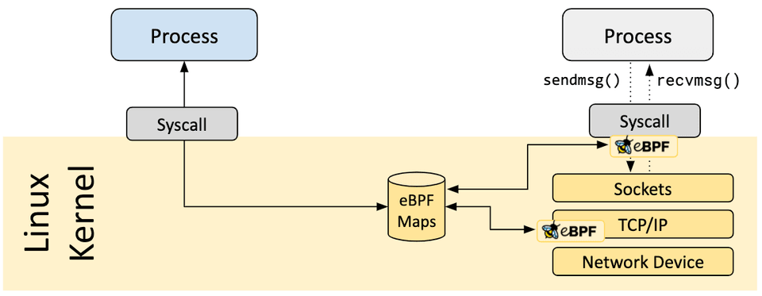

## BFP

BPF ( Berkeley Packet Filter ) : cBPF ( classic ) 和 eBPF ( extended )，简单来说就是传统的和新版的

BPF 最初被应用于网络监测，例如知名的`TCPdump` 工具中，它可以在内核态根据用户定义的规则直接过滤收到的包，相较竞争者 CSPF 更加高效

它设计了一个基于寄存器的虚拟机用来过滤包，而 CSPF 则使用的是基于栈的虚拟机

BPF 有两个组成部分：

- Tap 部分负责收集数据
- Filter 部分负责按规则过滤包


收到包以后，驱动不仅会直接发给协议栈，还会发给 BPF 一份， BPF 根据不同的 filter 直接“就地”进行过滤，不会再拷贝到内核中的其他 buffer 之后再就行处理，否则就太浪费资源了。处理后才会拷贝需要的部分到用户可以拿到的 buffer 中，用户态的应用只会看到他们需要的数据

注意在 BPF 中进行处理的时候，不是一个一个包进行处理的，因为接收到包之间的时间间隔太短，使用 `read` 系统调用又是很费事的，所以 BPF 都是把接收到的数据打包起来进行分析，为了区分开这些数据，BPF 会包一层首部（header），用来作为数据的边界

经典的 BPF 的工作模式是用户使用 BPF 虚拟机的指令集定义过滤表达式，传递给内核，由解释器运行，使得包过滤器可以直接在内核态工作，避免向用户态复制数据，从而提升性能，比如 tcpdump 的 BPF 过滤指令实例如下：

```bash
> tcpdump -d port 80
(000) ldh      [12]
(001) jeq      #0x86dd          jt 2    jf 10
(002) ldb      [20]
(003) jeq      #0x84            jt 6    jf 4
(004) jeq      #0x6             jt 6    jf 5
(005) jeq      #0x11            jt 6    jf 23
(006) ldh      [54]
(007) jeq      #0x50            jt 22   jf 8
(008) ldh      [56]
(009) jeq      #0x50            jt 22   jf 23
(010) jeq      #0x800           jt 11   jf 23
(011) ldb      [23]
(012) jeq      #0x84            jt 15   jf 13
(013) jeq      #0x6             jt 15   jf 14
(014) jeq      #0x11            jt 15   jf 23
(015) ldh      [20]
(016) jset     #0x1fff          jt 23   jf 17
(017) ldxb     4*([14]&0xf)
(018) ldh      [x + 14]
(019) jeq      #0x50            jt 22   jf 20
(020) ldh      [x + 16]
(021) jeq      #0x50            jt 22   jf 23
(022) ret      #262144
(023) ret      #0
```

执行过程如下：


Linux 3.0 中增加了JIT（即时编译），性能比解释执行更快，类似 java 的虚拟机，可以解释执行也可以即时编译执行

现在 BPF 的执行过程如下示意图：


（1）编写 eBPF 代码

（2）将 eBPF 代码通过 LLVM 把编写的 eBPF 代码转成字节码

（3）通过 bpf 系统调用提交给系统内核

（4）内核通过验证器对代码做安全性验证（包括对无界循环的检查）

（5）只有校验通过的字节码才会提交到 JIT 进行编译成可以直接执行的机器指令

（6）当事件发生时候，调用这些指令执行，将结果保存到 map 中

（7）用户程序通过映射来获取执行结果

## eBPF

eBPF (extended BPF)

对于算法和数据结构应该大家都不陌生，在这门学科的语境里用 O(xxx)来衡量算法的复杂度。但是实际的工作中性能工程师要回答的常常不是时间复杂度问题，而是 

- 程序的哪个部分慢？ 
- 慢的部分，单次执行的耗时是多少？

eBPF 能在不改一行代码的情况下，知道给定函数单次执行的耗时，并且是纳秒级别的精度。

官方：

- 官网：<https://ebpf.io/>
- 项目列表：<https://ebpf.io/applications/>

Linux 内核一直是实现监控/可观测性、网络和安全功能的理想环境。 不过很多情况下这并非易事，因为这些工作需要修改内核源码或加载内核模块， 最终实现形式是在已有的层层抽象之上叠加新的抽象。 eBPF 是一项革命性技术，它能在内核中运行沙箱程序（sandbox programs）， 而无需修改内核源码或者加载内核模块。

将 Linux 内核变成可编程之后，就能基于现有的（而非增加新的）抽象层来打造更加智能、 功能更加丰富的基础设施软件，而不会增加系统的复杂度，也不会牺牲执行效率和安全性。

extended BPF（eBPF） ，扩展成一个通用的 kernel extensibility framework ，已经不局限于 Packet Filter ，而是在 Networking, Security,  Profiling, Observability… 等领域都可以使用到 eBPF，而且还加入了 JIT 编译、map 资料结构、verifier 验证机制，所以让 eBPF 变成一个安全的 runtime


## eBPF 原理

### eBPF 的整体架构

eBPF 的整体的架构如下：



BPF 定义了一套属于自己的 RISC 型指令集，Bytecode 其实就是依照这套指令集编译出来的指令

大概就会有一个感觉如下面这张图，C -> Clang 编译-> BPF Bytecode：


Load 就是把 BPF Bytecode 载入到 Kernel ，要做到这件事情，会使用 bpftool 这个工具，其实这都是 bpf() system call

当“Load” 执行下去之后，会先碰到一个叫做 Verifier 的东西，它会做一些安全性的检查，毕竟是要被放到 Kernel 执行的

检查通过之后，会依照你的 Linux Kernel Kconfig 的 `CONFIG_BPF_JIT_ALWAYS_ON` 选项是否有开启，通常大多数预设都是有开启的，如果有开启，Verifier 的下一站遇到的就是 JIT Compiler ，JIT Compiler 会帮你把 BPF Bytecode 编译成 native machine code；如果没有 JIT，kernel 只能用 interpreter 模式，一条一条解释 bytecode



到这里已经成功 Load eBPF Program 到 Kernel 了，但是载入后要怎么执行？即 "attach" 和 "hook point"



eBPF 程序都是事件驱动的，它们会在内核或者应用程序经过某个确定的 Hook 点的时候运行，这些 Hook 点都是提前定义的，包括系统调用、函数进入/退出、内核 tracepoints、网络事件等

如果针对某个特定需求的 Hook 点不存在，可以通过 kprobe 或者 uprobe 来在内核或者用户程序的几乎所有地方挂载 eBPF 程序

### BPF Maps

#### BPF Maps 简介

内核文档 BPF Maps：<https://docs.kernel.org/bpf/maps.html>

假设我们写了一个 BPF Program 是要「计数放行几个封包」，那我们要把 Count 记录在哪？每一次事件来了，经过 hook point  时执行的程式码都是独立发生的(无状态)，而 BPF 提供了 11 个 64 bits 暂存器和一个 512 bytes 的 stack  space，但一旦程式执行完毕，这些暂存器和 stack 中的状态就会被销毁，怎么可能记住上一次执行发生什么？进度到哪？

已经知道 eBPF 是会被动态插入到 Kernel 执行，所以也不可以越界存取 Memory 或是分配存储，所以也不能妄想说把想要纪录的资料储存后让 BPF Program 直接存取

面的情境很自然就衍生出「储存」的需求，于是 Kernel 提供一组资料结构叫 BPF Maps （hash table、array、LRU hash…），用来在 Kernel 与 User Space 之间、以及在 eBPF 程式的多次调用之间共享资料。

BPF Maps 解决以下问题：

1. Kernel Space - User Space 通讯
2.  多次调用的状态持久化
3. 多个 eBPF Program + User Space 共享资料





#### BPF Maps 生命周期

在 BPF 这里不管什么操作，底层都离不开 `bpf()` 这个 system call 吗？所以要创建一个 BPF Map 底层就是通过 `bpf(BPF_MAP_CREATE, ...)` 这样的 system call 而创建的。当创建成功后会返回一个 File Descriptor (FD) ，所以在 User Space 如果要和新创建的 BPF Map 互动就会通过这个 FD

```c
union bpf_attr attr = {
        .map_type = BPF_MAP_TYPE_ARRAY;  /* mandatory */
        .key_size = sizeof(__u32);       /* mandatory */
        .value_size = sizeof(__u32);     /* mandatory */
        .max_entries = 256;              /* mandatory */
        .map_flags = BPF_F_MMAPABLE;
        .map_name = "example_array";
};

```

- `map_type` ：指定要创建的 Map 类型 。这个值决定了核心将使用哪种底层结构实现，例如 Hash table 或 arrary
- `key_size` ：以 byte 为单位定义键的大小
- `value_size` ：以 byte 为单位定义值的大小
- `max_entries` ：设定 Map 能够容纳的最大元素数量
-  `map_flags` ：用于指定额外的行为，详细可以参考此文件，例如： 
  - `BPF_F_MMAPABLE` 允许 User space 透过 `mmap()` 直接映射 Array Map
  -  `BPF_F_NO_PREALLOC` 则指示 Kernel 不要为 Hash Map 预先配置，以节省资源

以 `bpftool` 来做示范：

```bash
sudo bpftool map create /sys/fs/bpf/my_map type hash key 4 value 8 entries 1024 name my_map
```

此命令创建了一个 Key 大小为 4 bytes、value 大小为 8 bytes、最多可容纳 1024 个 entries 的 hash map

BPF Map 的生命周期管理核心原理在于一个简单而强大的机制— 引用计数( `refcnt` )，简单来说它就是一个「 有多少人还在用这个东西 」的计数器。这个机制是 Kernel 内部用于追踪所有 BPF Objects（包括 Map 和 Program）生命周期的唯一真实来源

通过固定（pinning）eBPF 映射来减轻权限要求。固定允许 eBPF 对象在创建它们的进程的生命周期之外保持活动状态，以便其他进程可以访问它们

## 参考资料

- <https://zhuanlan.zhihu.com/p/533747093>
