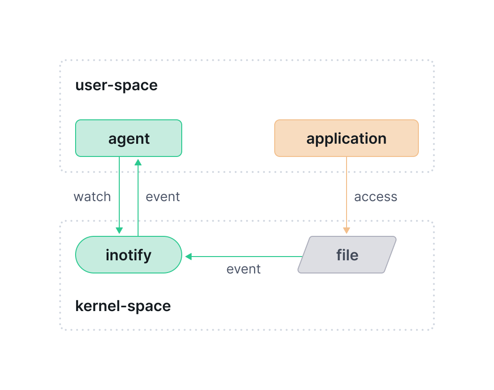

## Tetragon 简介

Tetragon 是一种灵活的安全可观察性和运行时策略执行工具，可直接使用 eBPF 应用策略和过滤，从而减少了监控、进程跟踪以及实时执行策略的开销

Tetragon 是一个专注于 eBPF、实时处理、安全性、可观测性和策略执行的工具，特别是在 Kubernetes 环境中。它通过利用一系列高级的挂钩点（hook points）和选择器（selectors），为基础设施安全提供了强大支持，并能够针对关键事件进行有效防护

Tetragon 提供了如下功能：

- 监控进程执行
- 监控文件操作
- 监控网络活动
- 执行策略

最后一个侧重策略的执行，可以通过发送信号或覆盖系统调用的返回值对重要的安全事件做出反应；前三种侧重监控，并可以将监控数据与容器、Kubernetes 元数据进行关联


官方：

- 官网：<https://tetragon.io/>
- 文档：<https://tetragon.io/docs/>
- GitHub 仓库：<https://github.com/cilium/tetragon/>

### Tetragon 架构


`tetragon` 容器中运行了 Tetragon 的 Daemon 进程，在这个容器中还可以执行 `tetra` 命令（tetragon CLI）

Daemon 进程：

- 加载/卸载 BPF 程序
- 监控策略的变化，将策略写入到 eBPF Map 中。在非 K8s 环境，会监控文件目录中的策略更新
- 对外提供了 gRPC 的 API，监听在 `127.0.0.1:54321`。CLI 的执行实际上都是通过该 API 与 Daemon 进行交互

### 跟踪策略

上面演示中不管是监控还是策略执行，都是通过 跟踪策略（Tracing Policy） 来完成。跟踪策略 TracingPolicy 是 Tetragon 的自定义资源，允许用户跟踪内核中的任意事件，并可定义对匹配采取的操作

策略由挂钩点（hook point，支持 kprobes、tracepoint 和 uprobes）以及用于内核过滤和指定操作的选择器组成

#### 挂钩点 Hook Point

Tetragon 支持三种挂钩点：支持 kprobes、tracepoint 和 uprobes。`kprobes` 和 `tracepoints` 可用于连接内核空间，而 `uprobes` 用于连接到用户空间程序

- kprobes 内核空间探针：将 BPF 代码挂载到内核函数，比如前面监控网络活动时用的 `tcp_connect`，与内核版本强相关，也就是说不同内核版本的内核函数探针可能存在差异
- tracepoints 跟踪点：与 kprobes 相比，在不同内核版本间的差异很小，更加稳定。可以通过 `sudo ls /sys/kernel/debug/tracing/events` 查看内核上可用的跟踪点列表
- uprobes 内核空间探针：在用户空间程序的特定地址设置探针，监控和跟踪用户空间代码的执行。（目前 Tetragon 这部分的文档是缺失的）

#### 选择器 Selector

在 Tetragon 中，TracingPolicy 使用选择器来定义对事件所要执行的内核 BPF 过滤和操作，也就是策略中指定关注的事件以及事件发生时要触发的操作。选择器包含如下几种：

- 参数
- 返回值
- 进程 PID
- 二进制文件的路径
- Linux 命名空间
- Linux 功能
- 命名空间变更
- Linux 功能变更
- 对选择器应用操作

比如我们在前面的例子中，针对 `/etc` 目录的写保护就用到了参数选择器（匹配操作的目录和操作类型）和操作选择器（返回 Sigkill 信号）

## 安装

使用 helm 来安装 Tetragon

```bash
helm repo add cilium https://helm.cilium.io
helm repo update
helm install tetragon cilium/tetragon -n kube-system
```

查看 Tetragon 的组件

```
> kubectl get pod -n kube-system -l app.kubernetes.io/instance=tetragon

NAME                                READY   STATUS    RESTARTS   AGE
tetragon-operator-f68fdfcf6-jltn2   1/1     Running   0          6m23s
tetragon-mh8fp                      2/2     Running   0          6m23s
```

其中 tetragon 是 Daemonset 类型，在每个节点上都会运行其实例。可以使用其获取事件信息

```bash
kubectl exec -ti -n kube-system ds/tetragon -c tetragon -- tetra getevents -o compact --pods test-pod
```

## 使用

### 监控进程执行

在 test-pod 的 pod 中尝试 `curl` 发送请求

```bash
kubectl exec -ti test-pod -- bash -c 'curl -I https://ebpf.io/applications/#tetragon'
```

在 CLI 事件监控中可以看到监控到进行的执行

```bash
🚀 process default/test-pod /usr/bin/bash -c "curl -I https://ebpf.io/applications/#tetragon"
🚀 process default/test-pod /usr/bin/curl -I https://ebpf.io/applications/#tetragon
💥 exit    default/test-pod /usr/bin/curl -I https://ebpf.io/applications/#tetragon 0
```

要获取详细的事件信息，可以使用 `-o json`。在详细信息中，是记录更多进程的详细内容（pid、时间戳等）以及 Kubernetes 的元数据（所在的 pod、label、容器相关、node 等信息）

### 监控文件操作



应用下面的策略可以看到文件操作的相关事件

```yaml
apiVersion: cilium.io/v1alpha1
kind: TracingPolicy
metadata:
  name: "file-monitoring-filtered"
spec:
  kprobes:
  - call: "security_file_permission"
    syscall: false
    return: true
    args:
    - index: 0
      type: "file" # (struct file *) used for getting the path
    - index: 1
      type: "int" # 0x04 is MAY_READ, 0x02 is MAY_WRITE
    returnArg:
      index: 0
      type: "int"
    returnArgAction: "Post"
    selectors:
    - matchArgs:      
      - index: 0
        operator: "Prefix"
        values:
        - "/etc"
      - index: 1
        operator: "Equal"
        values:
        - "2" # MAY_WRITE
```

### 监控网络活动

应用下面的策略，监控 TCP 连接的建立，但是排除集群内的网络连接，将容器的 IP CIDR 排除添加到 `NotDAddr` 的列表中

```yaml
apiVersion: cilium.io/v1alpha1
kind: TracingPolicy
metadata:
  name: "monitor-network-activity-outside-cluster"
spec:
  kprobes:
  - call: "tcp_connect"
    syscall: false
    args:
    - index: 0
      type: "sock"
    selectors:
    - matchArgs:
      - index: 0
        operator: "NotDAddr"
        values:
        - 127.0.0.1
        - 10.42.0.0/16
        - 10.43.0.0/16
      matchActions:
      - action: Sigkill
```

### 执行策略

假如需要对 `/etc` 目录进行写保护，需要上面创建的 `file-monitoring-filtered` 策略，添加 `matchActions`

```yaml
piVersion: cilium.io/v1alpha1
kind: TracingPolicy
metadata:
  name: "file-monitoring-filtered"
spec:
  kprobes:
  - call: "security_file_permission"
    syscall: false
    return: true
    args:
    - index: 0
      type: "file" # (struct file *) used for getting the path
    - index: 1
      type: "int" # 0x04 is MAY_READ, 0x02 is MAY_WRITE
    returnArg:
      index: 0
      type: "int"
    returnArgAction: "Post"
    selectors:
    - matchArgs:      
      - index: 0
        operator: "Prefix"
        values:
        - "/etc"
      - index: 1
        operator: "Equal"
        values:
        - "2" # MAY_WRITE
      matchActions:
      - action: Sigkill
```

## 参考文档

- <https://isovalent.com/blog/post/file-monitoring-with-ebpf-and-tetragon-part-1/>
