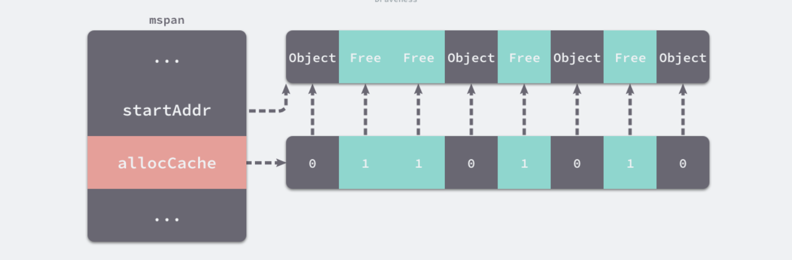
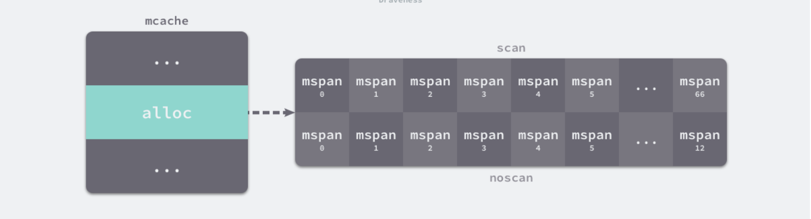

## 内存分配器组件

Go 语言的内存分配器包含

- 内存管理单元
- 线程缓存
- 中心缓存
- 页堆

## 内存管理单元

`runtime.mspan` 是 Go 语言内存管理的基本单元，该结构体中包含 `next` 和 `prev` 两个字段，它们分别指向了前一个和后一个 `runtime.mspan`：

```go
type mspan struct {
	// ...
	next *mspan     // next span in list, or nil if none
	prev *mspan     // previous span in list, or nil if none
	// ...
}
```

源码：<https://github.com/golang/go/blob/go1.21.4/src/runtime/mheap.go#L410-L504>

串联后的结构体会构成双向链表，运行时会使用 `runtime.mSpanList` 存储双向链表的头结点和尾节点并在线程缓存以及中心缓存中使用


```go
// mSpanList heads a linked list of spans.
type mSpanList struct {
	_     sys.NotInHeap
	first *mspan // first span in list, or nil if none
	last  *mspan // last span in list, or nil if none
}
```

源码：<https://github.com/golang/go/blob/go1.21.4/src/runtime/mheap.go#L403-L408>

因为相邻的管理单元会互相引用，所以可以从任意一个结构体访问双向链表中的其他节点

### 页和内存

每个 `runtime.mspan` 都管理 `npages` 个大小为 8KB 的页，这里的页不是操作系统中的内存页，它们是操作系统内存页的整数倍，该结构体会使用下面这些字段来管理内存页的分配和回收：

```go
type mspan struct {
	// ...

	startAddr uintptr // address of first byte of span aka s.base()
	npages    uintptr // number of pages in span

	manualFreeList gclinkptr // list of free objects in mSpanManual spans

	// freeindex is the slot index between 0 and nelems at which to begin scanning
	// for the next free object in this span.
	// Each allocation scans allocBits starting at freeindex until it encounters a 0
	// indicating a free object. freeindex is then adjusted so that subsequent scans begin
	// just past the newly discovered free object.
	//
	// If freeindex == nelem, this span has no free objects.
	//
	// allocBits is a bitmap of objects in this span.
	// If n >= freeindex and allocBits[n/8] & (1<<(n%8)) is 0
	// then object n is free;
	// otherwise, object n is allocated. Bits starting at nelem are
	// undefined and should never be referenced.
	//
	// Object n starts at address n*elemsize + (start << pageShift).
	freeindex uintptr
	// TODO: Look up nelems from sizeclass and remove this field if it
	// helps performance.
	nelems uintptr // number of object in the span.

	// Cache of the allocBits at freeindex. allocCache is shifted
	// such that the lowest bit corresponds to the bit freeindex.
	// allocCache holds the complement of allocBits, thus allowing
	// ctz (count trailing zero) to use it directly.
	// allocCache may contain bits beyond s.nelems; the caller must ignore
	// these.
	allocCache uint64

	// allocBits and gcmarkBits hold pointers to a span's mark and
	// allocation bits. The pointers are 8 byte aligned.
	// There are three arenas where this data is held.
	// free: Dirty arenas that are no longer accessed
	//       and can be reused.
	// next: Holds information to be used in the next GC cycle.
	// current: Information being used during this GC cycle.
	// previous: Information being used during the last GC cycle.
	// A new GC cycle starts with the call to finishsweep_m.
	// finishsweep_m moves the previous arena to the free arena,
	// the current arena to the previous arena, and
	// the next arena to the current arena.
	// The next arena is populated as the spans request
	// memory to hold gcmarkBits for the next GC cycle as well
	// as allocBits for newly allocated spans.
	//
	// The pointer arithmetic is done "by hand" instead of using
	// arrays to avoid bounds checks along critical performance
	// paths.
	// The sweep will free the old allocBits and set allocBits to the
	// gcmarkBits. The gcmarkBits are replaced with a fresh zeroed
	// out memory.
	allocBits  *gcBits
	gcmarkBits *gcBits
	pinnerBits *gcBits // bitmap for pinned objects; accessed atomically

	// ...
}
```

源码：<https://github.com/golang/go/blob/go1.21.4/src/runtime/mheap.go#L410-L504>

- `startAddr` 和 `npages` — 确定该结构体管理的多个页所在的内存，每个页的大小都是 8KB
- `freeindex` — 扫描页中空闲对象的初始索引
- `allocBits` 和 `gcmarkBits` — 分别用于标记内存的占用和回收情况
- `allocCache` — `allocBits` 的补码，可以用于快速查找内存中未被使用的内存

`runtime.mspan` 会以两种不同的视角看待管理的内存

- （1）当结构体管理的内存不足时，运行时会以页为单位向堆申请内存：


- （2）当用户程序或者线程向 `runtime.mspan` 申请内存时，它会使用 `allocCache` 字段以对象为单位在管理的内存中快速查找待分配的空间：



如果能在内存中找到空闲的内存单元会直接返回，当内存中不包含空闲的内存时，上一级的组件 `runtime.mcache` 会为调用 `runtime.mcache.refill`更新内存管理单元以满足为更多对象分配内存的需求

源码：

`runtime.mcache` <https://github.com/golang/go/blob/go1.21.4/src/runtime/mcache.go#L13-L54>

`runtime.mcache.refill` <https://github.com/golang/go/blob/go1.21.4/src/runtime/mcache.go#L142-L216>

### 状态

运行时会使用 `runtime.mSpanStateBox` 存储内存管理单元的状态 `runtime.mSpanState`：

```go
type mspan struct {
	 // ...
	state                 mSpanStateBox // mSpanInUse etc; accessed atomically (get/set methods)
	// ...
}
```

源码：

`runtime.mSpanStateBox` <https://github.com/golang/go/blob/go1.21.4/src/runtime/mheap.go#L381-L386>

`runtime.mSpanState` <https://github.com/golang/go/blob/go1.21.4/src/runtime/mheap.go#L343-L365>

```go
type mSpanState uint8

const (
	mSpanDead   mSpanState = iota
	mSpanInUse             // allocated for garbage collected heap
	mSpanManual            // allocated for manual management (e.g., stack allocator)
)

// mSpanStateBox holds an atomic.Uint8 to provide atomic operations on
// an mSpanState. This is a separate type to disallow accidental comparison
// or assignment with mSpanState.
type mSpanStateBox struct {
	s atomic.Uint8
}
```

该状态可能处于 `mSpanDead`、`mSpanInUse`、`mSpanManual` 和 `mSpanFree`

- 当 `runtime.mspan` 在空闲堆中，它会处于 `mSpanFree` 状态

- 当 `runtime.mspan` 已经被分配时，它会处于 `mSpanInUse`、`mSpanManual` 状态，运行时会遵循下面的规则转换该状态：

  - 在垃圾回收的任意阶段，可能从 `mSpanFree` 转换到 `mSpanInUse` 和 `mSpanManual`

  - 在垃圾回收的清除阶段，可能从 `mSpanInUse` 和 `mSpanManual` 转换到 `mSpanFree`

  - 在垃圾回收的标记阶段，不能从 `mSpanInUse` 和 `mSpanManual` 转换到 `mSpanFree`

设置 `runtime.mspan` 状态的操作必须是原子性的以避免垃圾回收造成的线程竞争问题

### 跨度类

`runtime.spanClass` 是 `runtime.mspan`的跨度类，它决定了内存管理单元中存储的对象大小和个数：

```go
type mspan struct {
	 // ...
	spanclass             spanClass     // size class and noscan (uint8)
	// ...
}
```

`runtime.spanClass` 是一个 `uint8` 类型的整数，它的前 7 位存储着跨度类的 ID，最后一位存储一个 `noscan` 标记位（该标记位表示对象是否包含指针）

```go
// A spanClass represents the size class and noscan-ness of a span.
//
// Each size class has a noscan spanClass and a scan spanClass. The
// noscan spanClass contains only noscan objects, which do not contain
// pointers and thus do not need to be scanned by the garbage
// collector.
type spanClass uint8
```

源码：<https://github.com/golang/go/blob/go1.21.4/src/runtime/mheap.go#L564-L570>

Go 语言的内存管理模块中一共包含 67 种跨度类，每一个跨度类都会存储特定大小的对象并且包含特定数量的页数以及对象，所有的数据都会被预选计算好并存储在 `runtime.class_to_size` 和 `runtime.class_to_allocnpages`等变量中：

```go
var class_to_size = [_NumSizeClasses]uint16{0, 8, 16, 24, 32, 48, 64, 80, 96, 112, 128, 144, 160, 176, 192, 208, 224, 240, 256, 288, 320, 352, 384, 416, 448, 480, 512, 576, 640, 704, 768, 896, 1024, 1152, 1280, 1408, 1536, 1792, 2048, 2304, 2688, 3072, 3200, 3456, 4096, 4864, 5376, 6144, 6528, 6784, 6912, 8192, 9472, 9728, 10240, 10880, 12288, 13568, 14336, 16384, 18432, 19072, 20480, 21760, 24576, 27264, 28672, 32768}
var class_to_allocnpages = [_NumSizeClasses]uint8{0, 1, 1, 1, 1, 1, 1, 1, 1, 1, 1, 1, 1, 1, 1, 1, 1, 1, 1, 1, 1, 1, 1, 1, 1, 1, 1, 1, 1, 1, 1, 1, 1, 1, 1, 2, 1, 2, 1, 2, 1, 3, 2, 3, 1, 3, 2, 3, 4, 5, 6, 1, 7, 6, 5, 4, 3, 5, 7, 2, 9, 7, 5, 8, 3, 10, 7, 4}

```

源码：<https://github.com/golang/go/blob/go1.21.4/src/runtime/sizeclasses.go#L94-L95>

| class | bytes/obj | bytes/span | objects | tail waste | max waste | min align |
| :---: | --------: | ---------: | ------: | :--------: | :-------: | --------- |
|   1   |         8 |       8192 |    1024 |     0      |  87.50%   | 8         |
|   2   |        16 |       8192 |     512 |     0      |  43.75%   | 16        |
|   3   |        24 |       8192 |     341 |     0      |  29.24%   | 8         |
|   4   |        32 |       8192 |     256 |     0      |  46.88%   | 32        |
|   5   |        48 |       8192 |     170 |     32     |  31.52%   | 16        |
|   6   |        64 |       8192 |     128 |     0      |  23.44%   | 64        |
|   7   |        80 |       8192 |     102 |     32     |  19.07%   | 16        |
|   …   |         … |          … |       … |     …      |     …     |           |
|  67   |     32768 |      32768 |       1 |     0      |  12.50%   | 8192      |

上表展示了对象大小从 8B 到 32KB，总共 67 种跨度类的大小、存储的对象数以及浪费的内存空间

跨度类为 5 的 `runtime.mspan` 中对象的大小上限为 48 字节、管理 1 个页（8 KB 内存）、最多可以存储 170 个对象。因为内存需要按照页进行管理，所以在尾部会浪费 32 字节的内存，当页中存储的对象都是 33 字节时，最多会浪费 31.52% 的资源：

$$
\frac{{(48 - 33) * 170 + 32}}{{8192}} = 0.31518
$$

除了上述 67 个跨度类之外，运行时中还包含 ID 为 0 的特殊跨度类，它能够管理大于 32KB 的特殊对象

跨度类中除了存储类别的 ID 之外，它还会存储一个 `noscan` 标记位，该标记位表示对象是否包含指针，垃圾回收会对包含指针的 `runtime.mspan` 结构体进行扫描。可以通过下面的几个函数和方法了解 ID 和标记位的底层存储方式：

```go
func makeSpanClass(sizeclass uint8, noscan bool) spanClass {
	return spanClass(sizeclass<<1) | spanClass(bool2int(noscan))
}

func (sc spanClass) sizeclass() int8 {
	return int8(sc >> 1)
}

func (sc spanClass) noscan() bool {
	return sc&1 != 0
}
```

源码：<https://github.com/golang/go/blob/go1.21.4/src/runtime/mheap.go#L577-L587>

## 线程缓存

`runtime.mcache` 是 Go 语言中的线程缓存，它会与线程上的处理器一一绑定，主要用来缓存用户程序申请的微小对象。每一个线程缓存都持有 `68 * 2` 个 `runtime.mspan`，这些内存管理单元都存储在结构体的 `alloc` 字段中：

```go
type mcache struct {

	// ...

	alloc [numSpanClasses]*mspan // spans to allocate from, indexed by spanClass

	// ...
}
```

源码：<https://github.com/golang/go/blob/41d8e61a6b9d8f9db912626eb2bbc535e929fefc/src/runtime/mcache.go#L12-L53>

其中 numSpanClasses 的值为 136：

```go
const (
	// ...
	_NumSizeClasses = 68
	// ...
)

const (
	numSpanClasses = _NumSizeClasses << 1
	// ...
)
```

源码：

<https://github.com/golang/go/blob/go1.21.4/src/runtime/sizeclasses.go#L89>

<https://github.com/golang/go/blob/go1.21.4/src/runtime/mheap.go#L573>



线程缓存在刚刚被初始化时是不包含 `runtime.mspan` 的，只有当用户程序申请内存时才会从上一级组件获取新的 `runtime.mspan`满足内存分配的需求

### 初始化

运行时在初始化处理器时会调用 `runtime.allocmcache` 初始化线程缓存，该函数会在系统栈中使用 `runtime.mheap` 中的线程缓存分配器初始化新的 `runtime.mcache` 结构体：

```go
func allocmcache() *mcache {
	var c *mcache
	systemstack(func() {
		lock(&mheap_.lock)
		c = (*mcache)(mheap_.cachealloc.alloc())
		c.flushGen.Store(mheap_.sweepgen)
		unlock(&mheap_.lock)
	})
	for i := range c.alloc {
		c.alloc[i] = &emptymspan
	}
	c.nextSample = nextSample()
	return c
}
```

源码：<https://github.com/golang/go/blob/go1.21.4/src/runtime/mcache.go#L85-L98>

初始化后的 `runtime.mcache` 中的所有 `runtime.mspan` 都是空的占位符 `emptymspan`

### 替换

`runtime.mcache.refill`会为线程缓存获取一个指定跨度类的内存管理单元，被替换的单元不能包含空闲的内存空间，而获取的单元中需要至少包含一个空闲对象用于分配内存：

```go
// refill acquires a new span of span class spc for c. This span will
// have at least one free object. The current span in c must be full.
//
// Must run in a non-preemptible context since otherwise the owner of
// c could change.
func (c *mcache) refill(spc spanClass) {
	// Return the current cached span to the central lists.
	s := c.alloc[spc]

	if uintptr(s.allocCount) != s.nelems {
		throw("refill of span with free space remaining")
	}
	if s != &emptymspan {
		// Mark this span as no longer cached.
		if s.sweepgen != mheap_.sweepgen+3 {
			throw("bad sweepgen in refill")
		}
		mheap_.central[spc].mcentral.uncacheSpan(s)

		// Count up how many slots were used and record it.
		stats := memstats.heapStats.acquire()
		slotsUsed := int64(s.allocCount) - int64(s.allocCountBeforeCache)
		atomic.Xadd64(&stats.smallAllocCount[spc.sizeclass()], slotsUsed)

		// Flush tinyAllocs.
		if spc == tinySpanClass {
			atomic.Xadd64(&stats.tinyAllocCount, int64(c.tinyAllocs))
			c.tinyAllocs = 0
		}
		memstats.heapStats.release()

		// Count the allocs in inconsistent, internal stats.
		bytesAllocated := slotsUsed * int64(s.elemsize)
		gcController.totalAlloc.Add(bytesAllocated)

		// Clear the second allocCount just to be safe.
		s.allocCountBeforeCache = 0
	}

	// Get a new cached span from the central lists.
	s = mheap_.central[spc].mcentral.cacheSpan()
	if s == nil {
		throw("out of memory")
	}

	if uintptr(s.allocCount) == s.nelems {
		throw("span has no free space")
	}

	// Indicate that this span is cached and prevent asynchronous
	// sweeping in the next sweep phase.
	s.sweepgen = mheap_.sweepgen + 3

	// Store the current alloc count for accounting later.
	s.allocCountBeforeCache = s.allocCount

	// Update heapLive and flush scanAlloc.
	//
	// We have not yet allocated anything new into the span, but we
	// assume that all of its slots will get used, so this makes
	// heapLive an overestimate.
	//
	// When the span gets uncached, we'll fix up this overestimate
	// if necessary (see releaseAll).
	//
	// We pick an overestimate here because an underestimate leads
	// the pacer to believe that it's in better shape than it is,
	// which appears to lead to more memory used. See #53738 for
	// more details.
	usedBytes := uintptr(s.allocCount) * s.elemsize
	gcController.update(int64(s.npages*pageSize)-int64(usedBytes), int64(c.scanAlloc))
	c.scanAlloc = 0

	c.alloc[spc] = s
}
```

源码：<https://github.com/golang/go/blob/go1.21.4/src/runtime/mcache.go#L142-L216>

该方法会从中心缓存中申请新的 `runtime.mspan`存储到线程缓存中，这也是向线程缓存插入内存管理单元的唯一方法

### 微分配器

线程缓存中还包含几个用于分配微对象的字段，下面的这三个字段组成了微对象分配器，专门管理 16 字节以下的对象：

```go
type mcache struct {

	// ...

	// Allocator cache for tiny objects w/o pointers.
	// See "Tiny allocator" comment in malloc.go.

	// tiny points to the beginning of the current tiny block, or
	// nil if there is no current tiny block.
	//
	// tiny is a heap pointer. Since mcache is in non-GC'd memory,
	// we handle it by clearing it in releaseAll during mark
	// termination.
	//
	// tinyAllocs is the number of tiny allocations performed
	// by the P that owns this mcache.
	tiny       uintptr
	tinyoffset uintptr
	tinyAllocs uintptr

	// ...
}
```

源码：<https://github.com/golang/go/blob/go1.21.4/src/runtime/mcache.go#L27-L41>

微分配器只会用于分配非指针类型的内存：

- `tiny` 会指向堆中的一片内存
- `tinyOffset` 是下一个空闲内存所在的偏移量
- `local_tinyallocs` 会记录内存分配器中分配的对象个数

## 中心缓存

`runtime.mcentral` 是内存分配器的中心缓存，与线程缓存不同，访问中心缓存中的内存管理单元需要使用互斥锁：

```go
// Central list of free objects of a given size.
type mcentral struct {
	_         sys.NotInHeap
	spanclass spanClass

	// partial and full contain two mspan sets: one of swept in-use
	// spans, and one of unswept in-use spans. These two trade
	// roles on each GC cycle. The unswept set is drained either by
	// allocation or by the background sweeper in every GC cycle,
	// so only two roles are necessary.
	//
	// sweepgen is increased by 2 on each GC cycle, so the swept
	// spans are in partial[sweepgen/2%2] and the unswept spans are in
	// partial[1-sweepgen/2%2]. Sweeping pops spans from the
	// unswept set and pushes spans that are still in-use on the
	// swept set. Likewise, allocating an in-use span pushes it
	// on the swept set.
	//
	// Some parts of the sweeper can sweep arbitrary spans, and hence
	// can't remove them from the unswept set, but will add the span
	// to the appropriate swept list. As a result, the parts of the
	// sweeper and mcentral that do consume from the unswept list may
	// encounter swept spans, and these should be ignored.
	partial [2]spanSet // list of spans with a free object
	full    [2]spanSet // list of spans with no free objects
}
```

源码：<https://github.com/golang/go/blob/go1.21.4/src/runtime/mcentral.go#L20-L45>

每个中心缓存都会管理某个跨度类的内存管理单元，它会同时持有两个 `runtime.spanSet`，分别存储包含空闲对象和不包含空闲对象的内存管理单元

### 内存管理单元

线程缓存会通过中心缓存的 `runtime.mcentral.cacheSpan` 方法获取新的内存管理单元，分成以下几个部分：

1. 调用 `runtime.mcentral.partialSwept` 从清理过的、包含空闲空间的 `runtime.spanSet` 结构中查找可以使用的内存管理单元
2. 调用 `runtime.mcentral.partialUnswept` 从未被清理过的、有空闲对象的 `runtime.spanSet` 结构中查找可以使用的内存管理单元
3. 调用 `runtime.mcentral.fullUnswept` 获取未被清理的、不包含空闲空间的 `runtime.spanSet` 中获取内存管理单元并通过 `runtime.mspan.sweep` 清理它的内存空间
4. 调用 `runtime.mcentral.grow` 从堆中申请新的内存管理单元
5. 更新内存管理单元的 `allocCache` 等字段帮助快速分配内存

首先会在中心缓存的空闲集合中查找可用的 `runtime.mspan`，运行时总是会先从获取清理过的内存管理单元，后检查未清理的内存管理单元：

### 扩容

## 页堆