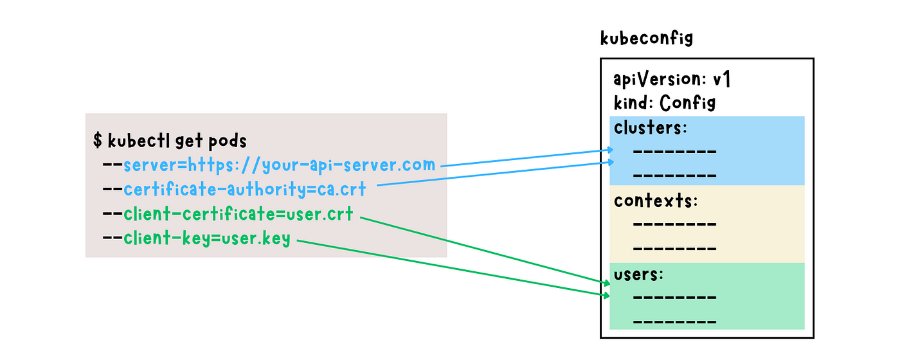
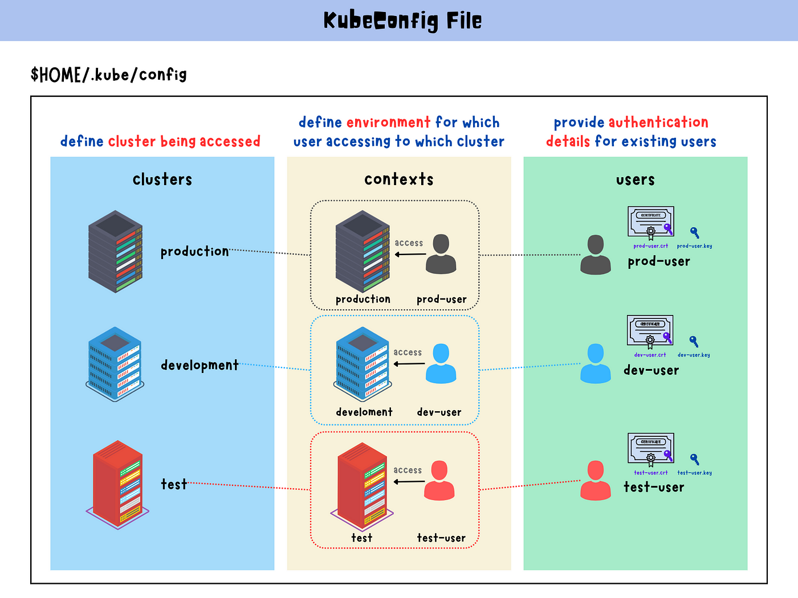

1. Display the current configuration in the `kubeconfig` file

```
$ kubectl config view
```

2. Display the configuration in the specified `kubeconfig` file

```
$ kubectl config view --kubeconfig=<path_to_kubeconfig>
```

3. Set the current context to the specified context

> Allow you to easily **switch** between different environments or clusters

```
$ kubectl config use-context <context_name>
```

4. Retrieve the specified `kubeconfig` file and displays relevant cluster information

```
$ kubectl cluster-info --kubeconfig <path_to_kubeconfig>
```

## 从 ServiceAccount 生成 kubeconfig

```yaml
apiVersion: v1
current-context: dev-quant-admin@dev-quant
kind: Config
preferences: {}
clusters:
- cluster:
    insecure-skip-tls-verify: true
    server: https://kubernetes.default.svc.cluster.local
  name: dev-quant
users:
- name: dev-quant-admin
  user:
    token:
contexts:
- context:
    cluster: dev-quant
    namespace: kube-system
    user: dev-quant-admin
  name: dev-quant-admin@dev-quant

```

