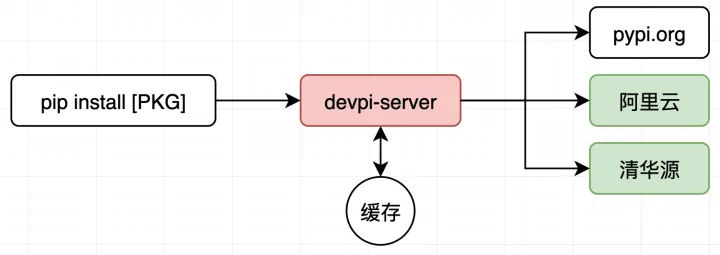

## PyPI Server 方案对比

下面是目前已知的一些部署私有仓库服务的方案：

| 框架             | 代理镜像 | 本地缓存 | 搜索               |
| ---------------- | -------- | -------- | ------------------ |
| devpi            | 支持     | 支持     | 支持 Web + XML RPC |
| DjangoPyPI       | 支持     | 不支持   | 支持 Web + XML RPC |
| chishop          | 不支持   | 不支持   | 不支持             |
| pypiserver       | 支持     | 不支持   | 不支持             |
| Cheese Shop      | 不支持   | 不支持   | 支持 Web + XML RPC |
| localshop        | 支持     | 支持     | 只支持 XML RPC     |
| mypypi           | 不支持   | 不支持   | 不支持             |
| proxypypi        | 支持     | 支持     | 不支持             |
| Flask-Pypi-Proxy | 支持     | 支持     | 不支持             |

## 简介

官方文档地址：<https://devpi.net/docs/devpi>

GitHub 仓库地址：<https://github.com/devpi/devpi>

devpi 有一些特有的功能：

- 支持本地缓存，可以做到公司内网加速的效果
- 支持 Sphinx 文档
- 提供多索引支持，多索引之间还可以继承，这在维护多版本系统上非常有用
- 支持集群部署，支持一台或多台服务器部署实现访问加速
- 支持通过 json 接口，实时监控集群的状态
- 支持导入导出功能
- 支持给索引设置 Jenkins 触发器，可以使用 tox 自动测试上传的包
- 使用插件可以完成 Web 界面的访问控制，增加私有包的安全

直接用 pip 安装包会访问官方源，在国内速度很慢，通常用 pip 的清华/阿里云源替代。但即便如此，这些远程 pypi 源网速也不稳定，而且比如 pytorch/tensorflow 这种大型包，下载仍然费时，尤其是测试镜像打包时还要重复下载。这就需要一个缓存 pypi 服务器来做中转，在内网中下载缓存包，相当于直接拷贝。



## 容器化部署

容器中包括三个组件：

- devpi-server 属于核心组件，提供镜像与缓存功能
- devpi-web 提供 Web 界面和查询功能
- devpi-lockdown 通过在 nginx 的帮助下实现对 Web 界面添加访问控制的功能

使用如下的 Dockerfile 手动构建镜像：

```dockerfile
# syntax=jcr.local.liaosirui.com:5000/third/docker.io/docker/dockerfile:1.4.3

ARG THIRDPARTY_REPO=jcr.local.liaosirui.com:5000/third

FROM --platform=$TARGETPLATFORM ${THIRDPARTY_REPO}/docker.io/library/python:3.8.15-slim

WORKDIR /root

ENV \
    no_proxy=127.0.0.1,localhost,10.0.0.0/8,172.16.0.0/12,192.168.0.0/16,.liaosirui.com \
    https_proxy=http://10.244.244.2:7891 \
    http_proxy=http://10.244.244.2:7891 \
    all_proxy=socks5://10.244.244.2:7891

RUN --mount=type=cache,target=/var/cache,id=build-cache \
    --mount=type=cache,target=/tmp,id=build-tmp \
    \
    python3 -m pip config set global.cache-dir /var/cache/pip \
    \
    && python3 -m pip install  --quiet --no-cache-dir\
    supervisor==4.2.4 \
    devpi-common==3.7.0 \
    devpi-server==6.7.0 \
    devpi-web==4.1.1 \
    devpi-lockdown==2.0.0

ENV \
    https_proxy= \
    http_proxy= \
    all_proxy=

```

构建镜像的命令：

```bash
docker buildx build \
  --progress plain \
  --pull \
  --push \
  --no-cache \
  --label BUILD_DATE=20221115 \
  --platform linux/amd64 \
  --tag docker-registry.local.liaosirui.com:5000/platform/devpi:6.7.0 \
  --file ./Dockerfile \
  .
```

需要初始化 devpi 的配置和缓存安装包的文件夹。不指定目录默认为 `~/.devpi/server`

```bash
devpi-init --serverdir=[PATH]
```

初始化所需目录

```bash
mkdir -p /registry/devpi/data

docker run -it --rm \
	-v /registry/devpi/data:/registry/devpi/data \
	docker-registry.local.liaosirui.com:5000/platform/devpi:6.7.0 \
	devpi-init --serverdir=/registry/devpi/data
```

生成配置文件参考官方文档：

<https://devpi.net/docs/devpi/devpi/stable/+doc/quickstart-server.html#generating-example-config-files-for-supervisor-nginx-cron-launchd>

使用如下命令生成初始化配置

```bash
mkdir -p /registry/devpi/config-generate

docker run -it --rm \
	-v /registry/devpi/config-generate:/registry/devpi/config-generate \
	-w /registry/devpi/config-generate \
	docker-registry.local.liaosirui.com:5000/platform/devpi:6.7.0 \
	devpi-gen-config --host=0.0.0.0 --port=3141 --serverdir=/registry/devpi/data
```

启动 devpi

```bash
docker run -itd \
	--name devpi \
	--restart=always \
	-p 3141:3141 \
	-v /registry/devpi/config-generate:/registry/devpi/config-generate \
	-v /registry/devpi/data:/registry/devpi/data \
	-e https_proxy=http://proxy.local.liaosirui.com:8899 \
	-e http_proxy=http://proxy.local.liaosirui.com:8899 \
	-e all_proxy=socks5://proxy.local.liaosirui.com:8899 \
	-e no_proxy="127.0.0.1,localhost,10.0.0.0/8,172.16.0.0/12,192.168.0.0/16,.liaosirui.com,.doubanio.com" \
	docker-registry.local.liaosirui.com:5000/platform/devpi:6.7.0 \
	/usr/local/bin/devpi-server --host=0.0.0.0 --port=3141 --serverdir /registry/devpi/data
```

设置一个 dns，或者在本地 `/etc/hosts` 写入

```plain
10.244.244.103 devpi.local.liaosirui.com
```

## 使用

本地的操作是需要使用 devpi-client 来完成的，执行下面的命令安装依赖：

```bash
pip install -U devpi-client
```

### 登录

创建连接

```bash
devpi use http://devpi.local.liaosirui.com:3141/
```

默认的用户是 root，密码是空

```bash
# 使用root账号登录
devpi login root --password=
```

### 更换源

登录之后才可以进行索引操作

第一次启动后，会自动从 python 官方源下载索引。这时需要修改 root/pypi 这个 index 中的配置，切换镜像源地址以阿里云为例。首先需要选择 index 地址，然后用户登陆，默认密码为空，最后指定镜像的地址。

```bash
# 创建 douban 索引
devpi index -c douban type=mirror bases=root/pypi

# 使用 douban 索引
devpi use root/douban

# 当仓库中不存在包时，从豆瓣下载包缓存到本地（默认是从官方源 https://pypi.python.org/simple/ 下载）
devpi index root/douban \
  "mirror_web_url_fmt=https://pypi.doubanio.com/simple/{name}/" \
	"mirror_url=https://pypi.doubanio.com/simple/"
```

### 下载私有包

安装一个包进行测试

```bash
# 无访问限制：
# pip install -i "http://[host]/root/dev/+simple/" [package] --trusted-host [host]

# 带访问限制：
# pip install -i "http://[user]:[password]@[host]/root/dev/+simple/" [package] --trusted-host [host]

# 示例：
pip install -i "http://devpi.local.liaosirui.com:3141/root/douban/+simple/" devpi --trusted-host devpi.local.liaosirui.com
```

对应的 ini 配置为：

```ini
[global]
timeout = 60
index-url = http://devpi.local.liaosirui.com:3141/root/douban/+simple/
[install]
trusted-host = devpi.local.liaosirui.com

```

## 添加 torch 源

新增一个 torch 源如下：

```bash
# 创建 torch 索引
devpi index -c torch-cu116 type=mirror

# 使用 torch 索引
devpi use root/torch-cu116

# 当仓库中不存在包时，从豆瓣下载包缓存到本地（默认是从官方源 https://pypi.python.org/simple/ 下载）
devpi index root/torch-cu116 \
  "mirror_web_url_fmt=https://download.pytorch.org/whl/cu116/{name}/" \
	"mirror_url=https://download.pytorch.org/whl/cu116"
```

安装测试

```bash
# CUDA 11.6
pip install \
torch==1.12.1+cu116 torchvision==0.13.1+cu116 torchaudio==0.12.1 \
--extra-index-url "http://devpi.local.liaosirui.com:3141/root/torch-cu116/+simple/" \
--trusted-host devpi.local.liaosirui.com
```

与原先的合并

```ini
[global]
timeout = 60
index-url = http://devpi.local.liaosirui.com:3141/root/douban/+simple/
extra-index-url = http://devpi.local.liaosirui.com:3141/root/torch-cu116/+simple/
[install]
trusted-host = devpi.local.liaosirui.com

```

## 添加 RAPIDS 源

```bash
# 创建源索引
devpi index -c ngc-nvidia type=mirror

# 使用索引
devpi use root/ngc-nvidia

devpi index root/ngc-nvidia \
  "mirror_web_url_fmt=https://pypi.ngc.nvidia.com/{name}/" \
	"mirror_url=https://pypi.ngc.nvidia.com"

```

安装测试

```bash
pip install \
cupy-cuda11x  \
--extra-index-url "http://devpi.local.liaosirui.com:3141/root/ngc-nvidia/+simple/" \
--trusted-host devpi.local.liaosirui.com
```

与原先的合并

```ini
[global]
timeout = 60
index-url = http://devpi.local.liaosirui.com:3141/root/douban/+simple/
extra-index-url = http://devpi.local.liaosirui.com:3141/root/torch-cu116/+simple/
                  http://devpi.local.liaosirui.com:3141/root/ngc-nvidia/+simple/
[install]
trusted-host = devpi.local.liaosirui.com
```

