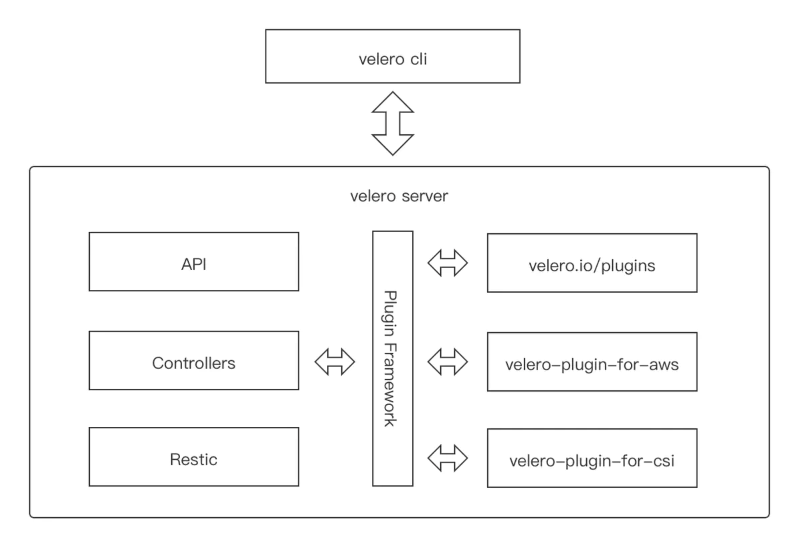

## Velero 简介

Velero 前身是 Heptio Ark ，是由 GO 语言编写的一款用于灾难恢复和迁移工具，可以安全的备份、恢复和迁移 Kubernetes 集群资源和持久卷

官方：

- 官方文档：<https://velero.io/docs/>
- GitHub 仓库地址：<https://github.com/vmware-tanzu/velero>

Velero 主要提供以下能力

- 备份 Kubernetes 集群资源，并在资源丢失情况下进行还原
- 将集群资源迁移到其他集群
- 将生产集群复制到开发和测试集群

Velero 主要组件

- Velero 组件主要包括服务器端和客户端两部分
- 服务端：运行在你 Kubernetes 的集群中
- 客户端：运行在本地的命令行工具，本地环境需要配置好 Kubernetes 集群的 kubeconfig 及 kubectl 客户端工具

Velero 支持备份存储

- Azure BloB 存储
- Google Cloud 存储
- AWS S3 及兼容 S3 的存储（比如：MinIO）
- Aliyun OSS 存储

## 原理

Velero 的基本原理就是将 Kubernetes 集群资源对象数据备份到对象存储中，并能从对象存储中拉取备份数据来恢复集群资源对象数据

不同于 etcd 备份 —— 将集群的全部资源备份起来 ——Velero 是对 Kubernetes 集群内资源对象级别进行备份，可以通过对 Type、Namespace、Label 等对象进行分类备份或者恢复

Velero 的操作（backup, scheduled backup, restore）都是 CRD 自定义资源，存储 etcd 中

Velero 的整体模块架构如下图

- 客户端是一个简单的交互客户端 velero-cli，封装了各种命令参数，可以执行安装、配置、备份、恢复等操作
- 服务端则可以类比成一个典型的 kubebuild 的 operator
  - 不同的 CR，也就是 API
  - 中间 Controller 层需要用到一些相对比较独立的服务时，都会通过插件系统来对接到内部或者外部的插件服务
  - 底层的数据拷贝层是对接 Restic
  - 其它都是外部的插件实现，`velero.io/plugins` 就代表内部的插件实现，由 Velero 或者第三方厂商来实现

### 按需备份（On-demand backups）

backup： 将复制的 Kubernetes 资源对象上传到对象存储中，且可选择调用云环境提供的 API 来创建持久化卷快照，以及可选择指定在备份期间执行 backup hook 操作。 Tips： backup 操作并不是严格的原子性备份，在备份期间，若是有 Kubernetes 资源对象被新建或编辑操作，则这个操作变动可能不会被包含在 backup 备份中

 指令流程：`velero backup create test-backup `

- Velero 客户端向 Kubernetes API server 发起创建 Backup 对象的请求
- BackupController 检测到新建 Backup 对象，并进行参数验证
- BackupController 开始备份执行过程。通过与 API server 交互，获取需要备份的资源数据
- BackupController 向对象存储服务（如：AWS S3）发起上传备份数据请求
- 默认情况，backup 操作是会对持久卷（PV）进行磁盘快照备份的，不过是可以通过 `–snapshot-volumes=false` 进行取消

### 备份还原（Restores）

restore： 对历史备份的 Kubernetes 资源对象和持久卷进行还原，且允许按需选择指定部分资源对象还原到指定命名空间（Namespace）中。且可以选择在备份还原期间或还原后执行 restore hook 操作（比如：执行自定义数据库的还原操作之后，再执行数据库应用容器启动动作）

默认情况下，Velero 进行的是非破坏性还原操作（non-destructive restore），这意味着它不会删除目标集群上的任何数据 —— 即如果备份中的资源对象已经存在于目标集群中，restore 操作将会跳过该资源的还原。当然，也可通配置更新策略 (`–existing-resource-policy=update`)，尝试更新目标集群中已存在资源，以匹配备份中的资源数据。 

指令流程： `velero restore create` 

- Velero 客户端向 Kubernetes API server 发起创建 Restore 对象的请求
- RestoreController 检测到新建 Restore 对象，并进行参数验证
- RestoreController 从对象存储服务处获取待还原备份资源数据信息，并进行备份资源还原前的一些预处理工作（比如：备份资源的 API versions 版本验证）
- RestoreController 开始备份还原执行过程，一次性还原所有指定待还原资源

### 定时备份（Scheduled backups）

schedule： 可以定期备份数据。在 schedule 创建后，便创建第一次备份，随后备份将按照指定调度周期（由 Cron 表达式指定）进行备份

### API versions

Velero 备份资源时，使用 Kubernetes API 首选版本为每个组（group）/ 资源（CRD）备份。而还原备份的目标集群中，必须存在相同 API 组（group）/ 资源（CRD）版本

需要注意的是：只是需要存在，而并不是需要首选版本。例如，如果正在备份的集群在 things API 组中有一个 gizmos 资源，group/versions 为 things/v1alpha1、things/v1beta1 和 things/v1，并且服务器的首选 group/versions 是 things/v1，那么所有 gizmos 将从 things/v1 API 端点备份。 当从该集群恢复备份时，目标集群必须具有 things/v1 端点才能恢复 Gizmo

### 备份存储

Velero 有 2 种备份存储方式：

（1）Restic 方式备份

Restic 是一款 GO 语言开发的开源免费且快速、高效和安全的跨平台备份工具。它是文件系统级别备份持久卷数据并将其发送到 Velero 的对象存储。执行速度取决于本地 IO 能力，网络带宽和对象存储性能，相对快照方式备份慢。 但如果当前集群或者存储出现问题，由于所有资源和数据都存储在远端的对象存储上， 用 Restic 方式备份可以很容易的将应用恢复。 Tips： 使用 Restic 来对 PV 进行备份会有一些限制：

- 不支持备份 hostPath，支持 EFS、AzureFile、NFS、emptyDir、local 或其他没有本地快照概念的卷类型
- 备份数据标志只能通过 Pod 来识别
- 单线程操作大量文件比较慢

（2）快照方式备份

Velero 使用一组 BackupItemAction 插件针对 PersistentVolumeClaims 进行备份，执行速度快。它创建一个以 PersistentVolumeClaim 作为源的 VolumeSnapshot 对象， 此 VolumeSnapshot 对象与用作源的 PersistentVolumeClaim 位于同一命名空间中，与 VolumeSnapshot 对应的 VolumeSnapshotContent 对象是一个集群范围的资源，将指向存储系统中基于磁盘的实际快照。Velero 备份时将所有 VolumeSnapshots 和 VolumeSnapshotContents 对象上传到对象存储系统， 但是 Velero 备份后的数据资源仍然保存在集群的存储上。数据可用性依赖于本地存储的高可用性，因为如果是由于存储故障导致的应用问题，Velero 的快照备份机制并不能恢复应用数据