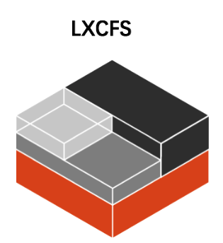

## 背景

Linuxs 利用 Cgroup 实现了对容器的资源限制，但在容器内部依然缺省挂载了宿主机上的 procfs 的 `/proc` 目录，其包含如：meminfo, cpuinfo，stat， uptime 等资源信息

一些监控工具如 free/top 或遗留应用还依赖上述文件内容获取资源配置和使用情况

当它们在容器中运行时，就会把宿主机的资源状态读取出来，引起错误和不便

通过 lxcfs 提供容器资源可见性的方法，可以帮助一些遗留系统更好的识别容器运行时的资源限制

## lxcfs 简介



官方地址：<https://linuxcontainers.org/lxcfs/introduction/>

最新 release 地址：<https://linuxcontainers.org/lxcfs/downloads/>

Github 仓库地址：<https://github.com/lxc/lxcfs>

部署参考：

- <https://github.com/denverdino/lxcfs-admission-webhook>

- <https://github.com/cndoit18/lxcfs-on-kubernetes>

社区中常见的做法是利用 lxcfs 来提供容器中的资源可见性。lxcfs 是一个开源的 FUSE（用户态文件系统）实现来支持 LXC 容器，它也可以支持 Docker 容器。

基于 FUSE 实现的用户空间文件系统

- 站在文件系统的角度: 通过调用 libfuse 库和内核的 FUSE 模块交互实现
- 两个基本功能
  - 让每个容器有自身的 cgroup 文件系统视图,类似 Cgroup Namespace
  - 提供容器内部虚拟的 proc 文件系统

LXCFS 通过用户态文件系统，在容器中提供下列 `procfs` 的文件

```
/proc/cpuinfo
/proc/diskstats
/proc/meminfo
/proc/stat
/proc/swaps
/proc/uptime
/proc/slabinfo
/sys/devices/system/cpu
/sys/devices/system/cpu/online
```

LXCFS 的示意图如下


比如，把宿主机的 `/var/lib/lxcfs/proc/memoinfo` 文件挂载到Docker容器的`/proc/meminfo`位置后

容器中进程读取相应文件内容时，LXCFS 的 FUSE 实现会从容器对应的 Cgroup 中读取正确的内存限制，从而使得应用获得正确的资源约束设定
