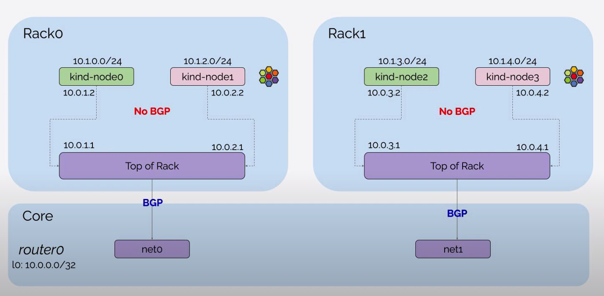

## 构建 Kubernetes 集群示例

通过 Kind 启动 Cilium BGP 集群

### kind 集群

准备一个 Kind 的配置文件，创建一个 4 节点的 Kubernetes 集群

```yaml
# cluster.yaml
kind: Cluster
name: clab-bgp-cplane-demo
apiVersion: kind.x-k8s.io/v1alpha4
networking:
  disableDefaultCNI: true # 禁用默认 CNI
  podSubnet: "10.1.0.0/16" # Pod CIDR
nodes:
  - role: control-plane # 节点角色
    kubeadmConfigPatches:
      - |
        kind: InitConfiguration
        nodeRegistration:
          kubeletExtraArgs:
            node-ip: 10.0.1.2 # 节点 IP
            node-labels: "rack=rack0" # 节点标签

  - role: worker
    kubeadmConfigPatches:
      - |
        kind: JoinConfiguration
        nodeRegistration:
          kubeletExtraArgs:
            node-ip: 10.0.2.2
            node-labels: "rack=rack0"

  - role: worker
    kubeadmConfigPatches:
      - |
        kind: JoinConfiguration
        nodeRegistration:
          kubeletExtraArgs:
            node-ip: 10.0.3.2
            node-labels: "rack=rack1"

  - role: worker
    kubeadmConfigPatches:
      - |
        kind: JoinConfiguration
        nodeRegistration:
          kubeletExtraArgs:
            node-ip: 10.0.4.2
            node-labels: "rack=rack1"

```

执行以下命令，通过 Kind 创建 Kubernetes 集群

```bash
kind create cluster --config cluster.yaml
```

### Containerlab 构建网络环境

定义 Containerlab 的配置文件，创建网络基础设施并连接 Kind 创建的 Kubernetes 集群：

- router0, tor0, tor1 作为 Kubernetes 集群外部的网络设备，在 exec 参数中设置网络接口信息以及 BGP 配置。router0 与 tor0, tor1 建立 BGP 邻居，tor0 与 server0, server1, router0 建立 BGP 邻居，tor1 与 server2, server3, router0 建立 BGP 邻居
- 设置 `network-mode: container:<容器名>` 可以让 Containerlab 共享 Containerlab 之外启动的容器的网络命名空间，设置 server0, server1, server2, server3 容器分别连接到通过 Kind 创建的 Kubernetes 集群的 4 个 Node 上

```yaml
# topo.yaml
name: bgp-cplane-demo
topology:
  kinds:
    linux:
      cmd: bash
  nodes:
    router0:
      kind: linux
      image: frrouting/frr:v8.2.2
      labels:
        app: frr
      exec:
        - iptables -t nat -A POSTROUTING -o eth0 -j MASQUERADE
        - ip addr add 10.0.0.0/32 dev lo
        - ip route add blackhole 10.0.0.0/8
        - touch /etc/frr/vtysh.conf
        - sed -i -e 's/bgpd=no/bgpd=yes/g' /etc/frr/daemons
        - usr/lib/frr/frrinit.sh start
        - >-
          vtysh -c 'conf t'
          -c 'router bgp 65000'
          -c ' bgp router-id 10.0.0.0'
          -c ' no bgp ebgp-requires-policy'
          -c ' neighbor ROUTERS peer-group'
          -c ' neighbor ROUTERS remote-as external'
          -c ' neighbor ROUTERS default-originate'
          -c ' neighbor net0 interface peer-group ROUTERS'
          -c ' neighbor net1 interface peer-group ROUTERS'
          -c ' address-family ipv4 unicast'
          -c '   redistribute connected'
          -c ' exit-address-family'
          -c '!'

    tor0:
      kind: linux
      image: frrouting/frr:v8.2.2
      labels:
        app: frr
      exec:
        - ip link del eth0
        - ip addr add 10.0.0.1/32 dev lo
        - ip addr add 10.0.1.1/24 dev net1
        - ip addr add 10.0.2.1/24 dev net2
        - touch /etc/frr/vtysh.conf
        - sed -i -e 's/bgpd=no/bgpd=yes/g' /etc/frr/daemons
        - /usr/lib/frr/frrinit.sh start
        - >-
          vtysh -c 'conf t'
          -c 'frr defaults datacenter'
          -c 'router bgp 65010'
          -c ' bgp router-id 10.0.0.1'
          -c ' no bgp ebgp-requires-policy'
          -c ' neighbor ROUTERS peer-group'
          -c ' neighbor ROUTERS remote-as external'
          -c ' neighbor SERVERS peer-group'
          -c ' neighbor SERVERS remote-as internal'
          -c ' neighbor net0 interface peer-group ROUTERS'
          -c ' neighbor 10.0.1.2 peer-group SERVERS'
          -c ' neighbor 10.0.2.2 peer-group SERVERS'
          -c ' address-family ipv4 unicast'
          -c '   redistribute connected'
          -c '  exit-address-family'
          -c '!'

    tor1:
      kind: linux
      image: frrouting/frr:v8.2.2
      labels:
        app: frr
      exec:
        - ip link del eth0
        - ip addr add 10.0.0.2/32 dev lo
        - ip addr add 10.0.3.1/24 dev net1
        - ip addr add 10.0.4.1/24 dev net2
        - touch /etc/frr/vtysh.conf
        - sed -i -e 's/bgpd=no/bgpd=yes/g' /etc/frr/daemons
        - /usr/lib/frr/frrinit.sh start
        - >-
          vtysh -c 'conf t'
          -c 'frr defaults datacenter'
          -c 'router bgp 65011'
          -c ' bgp router-id 10.0.0.2'
          -c ' no bgp ebgp-requires-policy'
          -c ' neighbor ROUTERS peer-group'
          -c ' neighbor ROUTERS remote-as external'
          -c ' neighbor SERVERS peer-group'
          -c ' neighbor SERVERS remote-as internal'
          -c ' neighbor net0 interface peer-group ROUTERS'
          -c ' neighbor 10.0.3.2 peer-group SERVERS'
          -c ' neighbor 10.0.4.2 peer-group SERVERS'
          -c ' address-family ipv4 unicast'
          -c '   redistribute connected'
          -c '  exit-address-family'
          -c '!'

    server0:
      kind: linux
      image: nicolaka/netshoot:latest
      network-mode: container:control-plane
      exec:
        - ip addr add 10.0.1.2/24 dev net0
        - ip route replace default via 10.0.1.1

    server1:
      kind: linux
      image: nicolaka/netshoot:latest
      network-mode: container:worker
      exec:
        - ip addr add 10.0.2.2/24 dev net0
        - ip route replace default via 10.0.2.1

    server2:
      kind: linux
      image: nicolaka/netshoot:latest
      network-mode: container:worker2
      exec:
        - ip addr add 10.0.3.2/24 dev net0
        - ip route replace default via 10.0.3.1

    server3:
      kind: linux
      image: nicolaka/netshoot:latest
      network-mode: container:worker3
      exec:
        - ip addr add 10.0.4.2/24 dev net0
        - ip route replace default via 10.0.4.1

  links:
    - endpoints: ["router0:net0", "tor0:net0"]
    - endpoints: ["router0:net1", "tor1:net0"]
    - endpoints: ["tor0:net1", "server0:net0"]
    - endpoints: ["tor0:net2", "server1:net0"]
    - endpoints: ["tor1:net1", "server2:net0"]
    - endpoints: ["tor1:net2", "server3:net0"]

```

执行以下命令，创建网络环境

```bash
clab deploy -t topo.yaml
```

创建完的拓扑如下所示，当前只有 tor0, tor1 和 router0 设备之间建立了 BGP 连接，由于尚未通过 CiliumBGPPeeringPolicy 设置 Kubernetes 集群的 BGP 配置，因此 tor0, tor1 与 Kubernetes Node 的 BGP 连接还没有建立



分别执行以下命令，可以查看 tor0, tor1, router0 这 3 个网络设备当前的 BGP 邻居建立情况

```bash
docker exec -it clab-bgp-cplane-demo-tor0 vtysh -c "show bgp ipv4 summary wide"

docker exec -it clab-bgp-cplane-demo-tor1 vtysh -c "show bgp ipv4 summary wide"

docker exec -it clab-bgp-cplane-demo-router0 vtysh -c "show bgp ipv4 summary wide"
```

### 清理环境

执行以下命令，清理 Containerlab 和 Kind 创建的环境

```
clab destroy -t topo.yaml
kind delete clusters clab-bgp-cplane-demo
```
