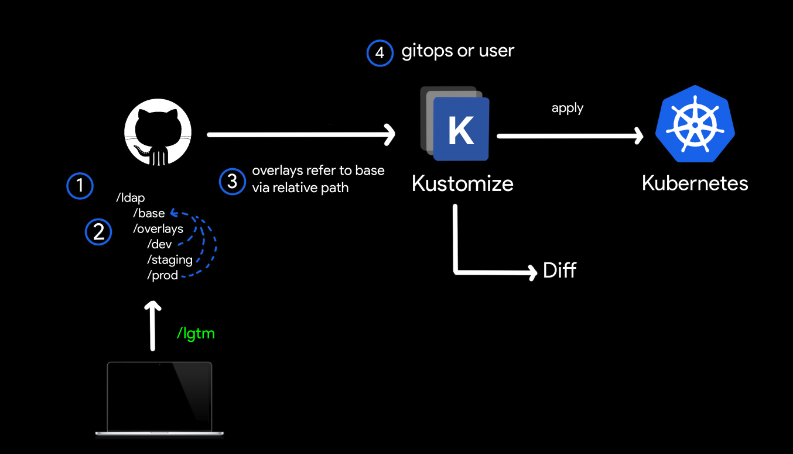

## 简介

kustomize 是一个通过 kustomization 文件定制 kubernetes 对象的工具，它可以通过一些资源生成一些新的资源，也可以定制不同的资源的集合。

官方：

- GitHub 仓库地址：<https://github.com/kubernetes-sigs/kustomize>

一个比较典型的场景是我们有一个应用，在不同的环境例如生产环境和测试环境，它的 yaml 配置绝大部分都是相同的，只有个别的字段不同，这时候就可以利用 kustomize 来解决，kustomize 也比较适合用于 gitops 工作流。



如上图所示，有一个 `ldap` 的应用

- `/base`目录保存的是基本的配置
- `/overlays`里放置的不同环境的配置，例如 `/dev`、`/staging`，`/prod`这些就是不同环境的配置
- `/base`等文件夹下都有一个 `kustomization .yml` 文件，用于配置

执行 `kustomize build dir`的方式就可以生成我们最后用于部署的 yaml 文件，也就是进行到了我们上图的第四步，然后通过 `kubectl apply -f`命令进行部署。

## 安装

使用 kubebuilder 我们不需要额外进行安装，因为在执行相关 `make` 命令的时候，会自动下载可执行文件到 `bin/` 目录下

如果本地有 go 环境，可以执行下列命令进行安装

```bash
GO111MODULE=on go install sigs.k8s.io/kustomize/kustomize/v4@latest
```

官方文档：

- 安装指南：<https://kubectl.docs.kubernetes.io/installation/kustomize/>