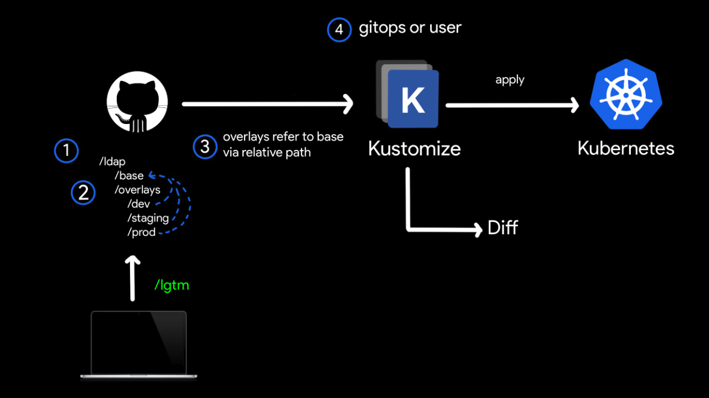

官方文档：

- https://kubectl.docs.kubernetes.io/zh/guides/bespoke/
- https://kubectl.docs.kubernetes.io/zh/guides/offtheshelf/

## 配置定制

Bespoke configuration

自定义配置的工作流

在这个工作流方式中，所有的配置文件（ YAML 资源）都为用户所有，存储在用户的私有 repo 



- 创建一个目录用于版本控制

将一个名为 ldap 的 Kubernetes 集群应用的配置保存在自己的 repo 中

```bash
git init ~/ldap
```

- 创建一个 base

```bash
mkdir -p ~/ldap/base
```

在这个目录中创建并提交 kustomization 文件及一组资源 resources 配置

- 创建 overlays

```bash
mkdir -p ~/ldap/overlays/staging
mkdir -p ~/ldap/overlays/production
```

每个目录都包含需要一个 kustomization 文件以及一或多个 patches

在 staging 目录可能会有一个用于在 configmap 中打开一个实验标记的补丁

在 production 目录可能会有一个在 deployment 中增加副本数的补丁

- 生成 variants

运行 kustomize，将生成的配置用于 kubernetes 应用发布

```bash
kustomize build ~/ldap/overlays/staging | kubectl apply -f -
kustomize build ~/ldap/overlays/production | kubectl apply -f -
```

也可以使用 kubectl 命令发布 variants

```bash
kubectl apply -k ~/ldap/overlays/staging
kubectl apply -k ~/ldap/overlays/production
```


## 通用配置

Off-the-shelf configuration

使用通用配置的工作流

在这个工作流程中，所有文件都由用户拥有，并维护在他们控制的存储库中，但它们是基于一个现成的（off-the-shelf）配置，定期查询更新


- 寻找并且 fork 一个 OTS 配置

- 将其克隆为你自己的 base

这个 base 目录维护在上游为 OTS 配置的 repo ，在这个示例中使用 ladp 的 repo 

```bash
mkdir ~/ldap
git clone https://github.com/$USER/ldap ~/ldap/base

cd ~/ldap/base
git remote add upstream git@github.com:$USER/ldap
```

- 创建 overlays

如配置定制方法一样，创建并完善 overlays 目录中的内容

所有的 overlays 都依赖于 base

```bash
mkdir -p ~/ldap/overlays/staging
mkdir -p ~/ldap/overlays/production
```

用户可以将 overlays 维护在不同的 repo

- 生成 variants

运行 kustomize，将生成的配置用于 kubernetes 应用发布

```bash
kustomize build ~/ldap/overlays/staging | kubectl apply -f -
kustomize build ~/ldap/overlays/production | kubectl apply -f -
```

也可以使用 kubectl 命令发布 variants

```bash
kubectl apply -k ~/ldap/overlays/staging
kubectl apply -k ~/ldap/overlays/production
```


- 从上游更新

用户可以定期从上游 repo 中 rebase 他们的 base 以保证及时更新

```bash
cd ~/ldap/base
git fetch upstream
git rebase upstream/master
```

