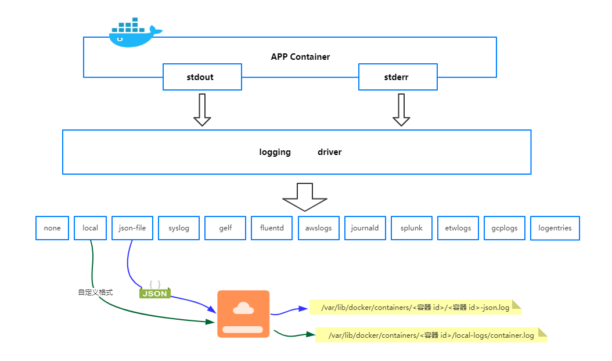
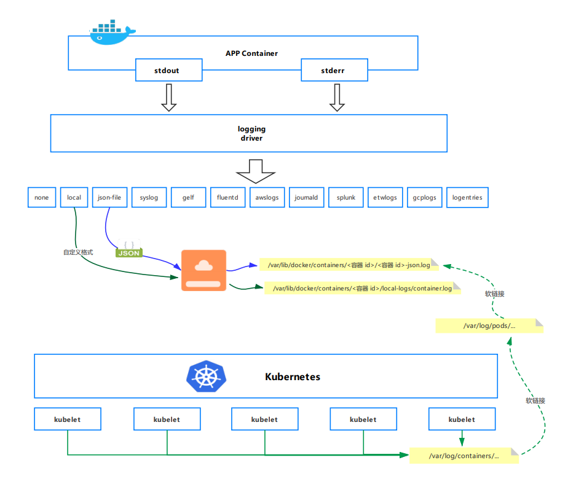

## Docker 日志管理机制

### Docker 的日志种类

在 Docker 中日志分为两大类：

- Docker 引擎日志；
- 容器日志；

#### Docker 引擎日志

Docker 引擎日志就是 docker 服务的日志，即 dockerd 守护进程的日志，在支持 Systemd 的系统中可以通过 `journalctl -u docker --no-pager` 查看日志。

常用命令：

```bash
# 查看最新十条日志
journalctl -f -u docker

# 查看所有日志
journalctl -u docker --no-pager

# 查看最近200条日志【分页】
journalctl -u docker -n 200

# 查看最近200条日志【不分页】
journalctl -u docker -n 200 --no-pager
```

#### 容器日志

容器日志指的是每个容器打到 stdout 和 stderr 的日志，而不是容器内部的日志文件。docker 管理所有容器打到 stdout 和 stderr 的日志，其他来源的日志不归 docker 管理。

通过 **`docker logs`** 命令查看容器日志都是读取容器打到 stdout 和 stderr 的日志。 

### 基于日志驱动（loging driver）的日志管理机制

Docker 提供了一套通用、灵活的日志管理机制，Docker 将所有容器打到 stdout 和 stderr 的日志都统一通过日志驱动重定向到某个地方。

Docker 支持的日志驱动有很多，比如 local、json-file、syslog、journald 等等，类似插件一样，不同的日志驱动可以将日志重定向到不同的地方，这体现了 Docker 日志管理的灵活性，以热插拔的方式实现日志不同目的地的输出。

Dokcer 默认的日志日志驱动是 **`json-file`**，该驱动将将来自容器的 stdout 和 stderr 日志都统一以 `json` 的形式存储到本地磁盘。日志存储路径格式为：**`/var/lib/docker/containers/<容器 id>/<容器 id>-json.log`**。所以可以看出在 `json-file` 日志驱动下，Docker 将所有容器日志都统一重定向到了 `/var/lib/docker/containers/` 目录下，这为日志收集提供了很大的便利。

> 注意：只有日志驱动为：local、json-file 或者 journald 时，docker logs 命令才能查看到容器打到 stdout/stderr 的日志。



下面为官方支持的日志驱动列表：

| 驱动                                                         | 描述                                                         |
| ------------------------------------------------------------ | ------------------------------------------------------------ |
| none                                                         | 运行的容器没有日志，`docker logs` 也不返回任何输出。         |
| [local](https://docs.docker.com/config/containers/logging/local/) | 日志以自定义格式存储，旨在实现最小开销。                     |
| [json-file](https://docs.docker.com/config/containers/logging/json-file/) | 日志格式为JSON。Docker的默认日志记录驱动程序。               |
| [syslog](https://docs.docker.com/config/containers/logging/syslog/) | 将日志消息写入syslog。该 syslog 守护程序必须在主机上运行。   |
| [journald](https://docs.docker.com/config/containers/logging/journald/) | 将日志消息写入journald。该journald守护程序必须在主机上运行。 |
| [gelf](https://docs.docker.com/config/containers/logging/gelf/) | 将日志消息写入Graylog扩展日志格式（GELF）端点，例如Graylog或Logstash。 |
| [fluentd](https://docs.docker.com/config/containers/logging/fluentd/) | 将日志消息写入fluentd（转发输入）。该fluentd守护程序必须在主机上运行。 |
| [awslogs](https://docs.docker.com/config/containers/logging/awslogs/) | 将日志消息写入Amazon CloudWatch Logs。                       |
| [splunk](https://docs.docker.com/config/containers/logging/splunk/) | 使 用HTTP 事件收集器将日志消息写入 splunk。                  |
| [etwlogs](https://docs.docker.com/config/containers/logging/etwlogs/) | 将日志消息写为 Windows 事件跟踪（ETW）事件。仅适用于Windows平台。 |
| [gcplogs](https://docs.docker.com/config/containers/logging/gcplogs/) | 将日志消息写入 Google Cloud Platform（GCP）Logging。         |
| [logentries](https://docs.docker.com/config/containers/logging/logentries/) | 将日志消息写入 Rapid7 Logentries。                           |

#### Docker 日志驱动（loging driver）配置

Docker 支持多种日志驱动类型，可以修改默认的日志驱动配置。日志驱动可以全局配置，也可以给特定容器配置。

- 查看 Docker 当前的日志驱动配置

```bash
docker info |grep  "Logging Driver"
```

- 查看单个容器的设置的日志驱动

```bash
docker inspect -f '{{.HostConfig.LogConfig.Type}}' <容器 id>
```

- Docker 日志驱动全局配置

全局配置意味所有容器都生效，编辑 `/etc/docker/daemon.json` 文件（如果文件不存在新建一个），添加日志驱动配置。

示例：配置 Docker 引擎日志驱动为 syslog（一般都是使用默认的日志驱动 json-file，以下只是示例如何配置全局的日志驱动）

```bash
{
  "log-driver": "syslog"
}
```

- 给特定容器配置日志驱动

在启动容器时指定日志驱动 `--log-driver` 参数。

示例：启动 nginx 容器，日志驱动指定为 journald

  ```bash
  docker run --name nginx -d --log-driver journald nginx
  ```

#### Docker 默认的日志驱动 json-file

json-file 日志驱动记录所有容器的 STOUT/STDERR 的输出 ，用 JSON 的格式写到文件中

```bash
/data/docker-data/containers/80efcd729d409346c0af1cc346d6cf44c31a823d0a771a4f834ee580cb7b7ff/80efcd729d409346c0af1cc346d6cf44c3

1a823d0a771a4f834ee580cb7b7ffe-json.log　　
```

每一条 json 日志中默认包含 `log`, `stream`, `time` 三个字段，示例日志如下：

```json
"log":"10.233.64.72 - - [09/Jun/2022:06:36:19 +0000] \"GET /plugins/variant/1.3/variant.hpi HTTP/1.1\" 200 10252 \"-\" \"curl/7.52.1\" \"-\"\n","stream":"stdout","time":"2022-06-09T06:36:19.606097555Z"}
```

json-file 日志驱动支持的配置选项如下：

| 选项     | 描述                                                         | 示例值                                   |
| -------- | ------------------------------------------------------------ | ---------------------------------------- |
| max-size | 切割之前日志的最大大小。可取值单位为(k,m,g)， 默认为-1（表示无限制）。 | `--log-opt max-size=10m`                 |
| max-file | 可以存在的最大日志文件数。如果切割日志会创建超过阈值的文件数，则会删除最旧的文件。仅在max-size设置时有效。正整数。默认为1。 | `--log-opt max-file=3`                   |
| labels   | 适用于启动Docker守护程序时。此守护程序接受的以逗号分隔的与日志记录相关的标签列表。 | `--log-opt labels=production_status,geo` |
| env      | 适用于启动Docker守护程序时。此守护程序接受的以逗号分隔的与日志记录相关的环境变量列表。 | `--log-opt env=os,customer`              |
| compress | 切割的日志是否进行压缩。默认是disabled。                     | `--log-opt compress=true`                |

配置示例：

```json
{   
  "log-driver": "json-file",   
  "log-level": "warn",   
  "log-opts": {   
    "max-size": "10m",   // 意味着一个容器日志大小上限是10M， 
    "max-file": "3"    // 意味着一个容器有三个日志，分别是 id+.json、id+1.json、id+2.json。可以存在的最大日志文件数。如果超过最大值，则会删除最旧的文件。
    },   
  "graph": "/data/docker-data" 
}
```

## Kubernetes 日志管理机制

### Kubernetes 的日志种类

在 Kubernetes 中日志也主要有两大类：

- Kuberntes 集群组件日志；
- 应用 Pod 日志；

#### Kuberntes 集群组件日志

Kuberntes 集群组件日志分为两类：

- 运行在容器中的 Kubernetes scheduler、kube-proxy、kube-apiserver等。
- 未运行在容器中的 kubelet 和容器 runtime，比如 Docker。

在使用 systemd 机制的服务器上，kubelet 和容器 runtime 写入日志到 journald（常用的 centos7 正是使用 systemd 机制）。如果没有 systemd，他们写入日志到 `/var/log` 目录的 `.log` 文件。

#### 应用 Pod 日志

- Docker

Kubernetes Pod 的日志管理是基于 Docker 引擎的，Kubernetes 并不管理日志的轮转策略，日志的存储都是基于 Docker 的日志管理策略。k8s 集群调度的基本单位就是 Pod，而 Pod 是一组容器，所以 k8s 日志管理基于 Docker 引擎这一说法也就不难理解了，最终日志还是要落到一个个容器上面。

假设 Docker 日志驱动为 json-file，那么在 k8s 每个节点上，kubelet 会为每个容器的日志创建一个软链接，软连接存储路径为：`/var/log/containers/`，软连接会链接到 `/var/log/pods/` 目录下相应 pod 目录的容器日志，被链接的日志文件也是软链接，最终链接到 Docker 容器引擎的日志存储目录：`/docker` 数据盘目录 `/containers` 下相应容器的日志。另外这些软链接文件名称含有 k8s 相关信息：Pod uid、Pod Name、Namespace、容器 ID 、容器名（这块内容详细分析参见下文示例），这就为日志收集提供了很大的便利。



- containerd

containerd 作为 k8s 容器运行时的情况下， 容器日志的落盘由 kubelet 来完成，保存到 `/var/log/pods/$CONTAINER_NAME` 目录下，同时在 `/var/log/containers` 目录下创建软链接，指向日志文件

方法一：在 kubelet 参数中指定：

```bash
--container-log-max-files=5
--container-log-max-size="100Mi"
```

方法二：在 KubeletConfiguration 中指定：

```bash
"containerLogMaxSize": "100Mi",
"containerLogMaxFiles": 5,
```

