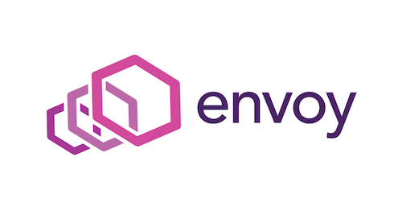
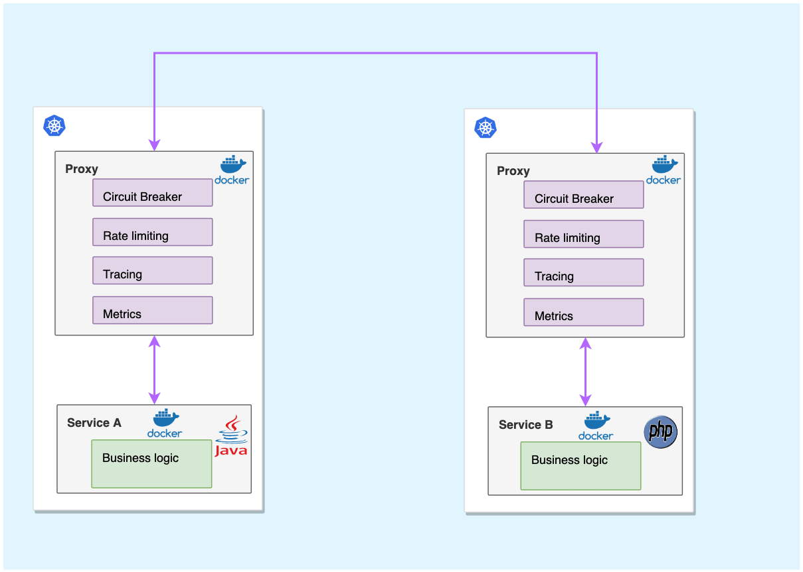

## 介绍

- 官网：<https://www.envoyproxy.io/>
- Github 仓库地址：<https://github.com/envoyproxy/envoy>
- 官方文档地址：<https://www.envoyproxy.io/docs>
- 非官方中文文档：<https://cloudnative.to/envoy/>
- dockerhub 仓库地址：<https://hub.docker.com/r/envoyproxy/envoy/tags>

Envoy 是一个开源的边缘服务代理，也是 Istio Service Mesh 默认的数据平面，专为云原生应用程序设计。

Envoy 是专为大型现代 SOA（面向服务架构）架构设计的 L7 代理和通信总线，体积小，性能高。它的诞生源于以下理念：

> 对于应用程序而言，网络应该是透明的，当发生网络和应用程序故障时，能够很容易定位出问题的根源。

## 核心功能

Envoy 的核心功能：

- **非侵入的架构** : `Envoy` 是一个独立进程，设计为伴随每个应用程序服务运行。所有的 `Envoy` 形成一个透明的通信网格，每个应用程序发送消息到本地主机或从本地主机接收消息，不需要知道网络拓扑，对服务的实现语言也完全无感知，这种模式也被称为 `Sidecar`。
- 基于 Modern C++11 实现，性能优异。

- **L3/L4/L7 架构** : 传统的网络代理，要么在 `HTTP` 层工作，要么在 `TCP` 层工作。在 `HTTP` 层的话，你将会从传输线路上读取整个 `HTTP` 请求的数据，对它做解析，查看 `HTTP` 头部和 `URL`，并决定接下来要做什么。随后，你将从后端读取整个响应的数据，并将其发送给客户端。但这种做法的缺点就是非常复杂和缓慢，更好的选择是下沉到 `TCP` 层操作：只读取和写入字节，并使用 `IP` 地址，`TCP` 端口号等来决定如何处理事务，但无法根据不同的 `URL` 代理到不同的后端。`Envoy` 支持同时在 3/4 层和 7 层操作，以此应对这两种方法各自都有其实际限制的现实。
- **顶级 HTTP/2 支持** : 它将 `HTTP/2` 视为一等公民，并且可以在 `HTTP/2` 和 `HTTP/1.1` 之间相互转换（双向），建议使用 `HTTP/2`。
- **服务发现和动态配置** : 与 `Nginx` 等代理的热加载不同，`Envoy` 可以通过 `API` 来实现其控制平面，控制平面可以集中服务发现，并通过 `API` 接口动态更新数据平面的配置，不需要重启数据平面的代理。不仅如此，控制平面还可以通过 API 将配置进行分层，然后逐层更新，例如：上游集群中的虚拟主机、`HTTP` 路由、监听的套接字等。
- **gRPC 支持** : [gRPC](http://www.grpc.io/) 是一个来自 `Google` 的 `RPC` 框架，它使用 `HTTP/2` 作为底层多路复用传输协议。Envoy 完美支持 HTTP/2，也可以很方便地支持 `gRPC`。
- **特殊协议支持** : Envoy 支持对特殊协议在 L7 进行嗅探和统计，包括：[MongoDB](https://www.envoyproxy.io/docs/envoy/latest/configuration/listeners/network_filters/mongo_proxy_filter#)、[DynamoDB](https://www.servicemesher.com/envoy/intro/arch_overview/dynamo.html#arch-overview-dynamo) 等。
- **可观测性** : `Envoy` 的主要目标是使网络透明，可以生成许多流量方面的统计数据，这是其它代理软件很难取代的地方，内置 `stats` 模块，可以集成诸如 `prometheus/statsd` 等监控方案。还可以集成分布式追踪系统，对请求进行追踪。

## 设计目标

Envoy 官方的设计目标是这么说的：

>  Envoy 并不是很慢（我们已经花了相当长的时间来优化关键路径）。基于模块化编码，易于测试，而不是性能最优。我们的观点是，在其他语言或者运行效率低很多的系统中，部署和使用 Envoy 能够带来很好的运行效率。

虽然 `Envoy` 没有把追求极致的性能作为首要目标，但并不表示 `Envoy` 是没有追求的，只是扩展性优先，性能稍微靠边。Envoy 和 `Nginx` 一样，也采用了 **多线程 + 非阻塞 + 异步IO（Libevent）** 的架构，性能仍然很强悍。

## sidecar 模式

在云环境下，技术栈可以是多种多样的。那么如何能够将这些异构的服务组件串联起来，成为了服务治理的一个重大课题。

而 `Sidecar` 模式为服务治理，提供了一种解决方案。

### 问题背景

大部分应用和服务都需要实现额外的服务治理功能，这些功能可以作为单独的组件或服务而存在。如果将这些功能集成到业务应用中，就会与业务应用运行在同一个进程中，从而可以有效地共享资源。

从另一方面来看，这也意味着服务治理组件与业务应用之间的隔离性很弱，一旦其中一个组件出现故障，可能会影响其他组件甚至整个应用程序。

除此之外，服务治理组件需要使用与父应用程序相同的技术栈来实现，因此它们之间有密切的相互依赖性。

### 解决方案

上述问题的解决方案是，**将服务治理功能从应用本身剥离出来作为单独进程**，与主应用程序共同放在一台主机（Host）中，但会将它们部署在各自的进程或容器中。这种方式也被称为 **Sidecar（边车）模式**。

下图展示了服务治理功能与主应用程序的部署关系图。

该模式允许我们向应用无侵入添加多种功能，避免了为满足第三方组件需求而向应用添加额外的配置代码。

### Sidecar 模式

在软件架构中，`Sidecar` 附加到主应用，或者叫父应用上，以扩展/增强功能特性，同时 `Sidecar` 与主应用是松耦合的。

如同三轮摩托车那样，将边车（Sidecar）安装在一辆摩托车上，就变成了边三轮摩托车。每辆边三轮摩托车都有自己的边车。类似同样的方式，`Sidecar` 服务共享其父应用程序的主机。对于应用程序的每个实例，边车的实例被部署并与其一起托管。

使用 `Sidecar` 模式的好处有很多：

- 通过将服务治理相关功能抽象到不同的层来降低微服务的代码复杂性
- 在运行时环境和编程语言方面，`Sidecar` 独立于其主要应用程序，不需要为每个微服务编写服务治理功能的代码，减少了微服务架构中的代码重复
- `Sidecar` 可以访问与主应用程序相同的资源。例如，`Sidecar` 可以监视 Sidecar 本身和主应用程序使用的系统资源
- 由于它靠近主应用程序，因此在它们之间进行通信时没有明显的延迟
- 降低了应用与底层平台的耦合度

## Enovy

`Envoy` 是为云原生应用设计的代理，可以在服务旁运行，以平台无关的方式提供必要的特性，所有到服务的流量都通过 `Envoy` 代理，这里 `Envoy` 扮演的就是 `Sidecar` 的角色。

总的来说，在从一体化架构向微服务架构的转型让我们可以相对独立、大规模地部署应用，而在容器环境中，`Sidecar` 模式可以很好地兼容，帮助我们降低微服务架构复杂性，更好地实现服务发现、流量管理、负载均衡、路由。
