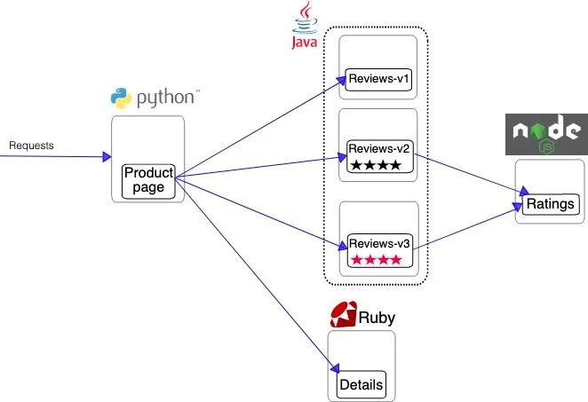
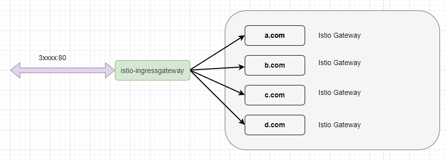
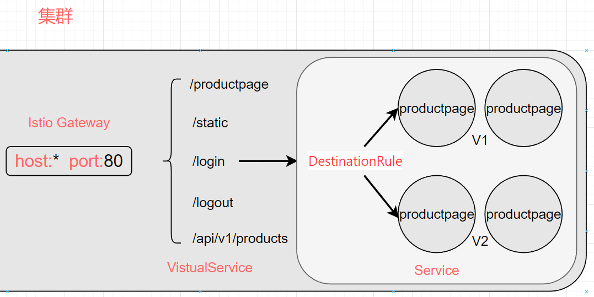

## Bookinfo 简介

代码地址：<https://github.com/istio/istio/tree/master/samples/bookinfo/>

Bookinfo 应用分为四个单独的微服务：

- `productpage` 这个微服务会调用 `details` 和 `reviews` 两个微服务，用来生成页面。
- `details` 这个微服务中包含了书籍的信息。
- `reviews` 这个微服务中包含了书籍相关的评论。它还会调用 `ratings` 微服务。
- `ratings` 这个微服务中包含了由书籍评价组成的评级信息。

`reviews` 微服务有 3 个版本：

- v1 版本不会调用 `ratings` 服务。
- v2 版本会调用 `ratings` 服务，并使用 1 到 5 个黑色星形图标来显示评分信息。
- v3 版本会调用 `ratings` 服务，并使用 1 到 5 个红色星形图标来显示评分信息。



服务依赖图如下所示：


## Bookinfo 部署

安装官方的 Demo 示例：

```bash
kubectl create ns istio-bookinfo-demo

kubectl label namespace istio-bookinfo-demo istio-injection=enabled

kubectl apply \
-n istio-bookinfo-demo \
-f libs/istio/samples/bookinfo/platform/kube/bookinfo.yaml
```

应用很快会启动起来。当每个 Pod 准备就绪时，Istio 边车将伴随应用一起部署

```bash
kubectl get all -n istio-bookinfo-demo
```

确认上面的操作都正确之后，运行下面命令，通过检查返回的页面标题来验证应用是否已在集群中运行，并已提供网页服务：

```bash
kubectl exec -n istio-bookinfo-demo "$(kubectl get pod -n istio-bookinfo-demo -l app=ratings -o jsonpath='{.items[0].metadata.name}')" -c ratings -- curl -sS productpage:9080/productpage | grep -o "<title>.*</title>"

```

此时，BookInfo 应用已经部署，但还不能被外界访问。要开放访问，需要创建 Istio 入站网关（Ingress Gateway）， 它会在网格边缘把一个路径映射到路由

```bash
kubectl apply \
-n istio-bookinfo-demo \
-f libs/istio/samples/bookinfo/networking/bookinfo-gateway.yaml
```

检查配置

```bash
> istioctl analyze

Error [IST0101] (Gateway istio-bookinfo-demo/bookinfo-gateway) Referenced selector not found: "istio=ingressgateway"
Error: Analyzers found issues when analyzing namespace: istio-bookinfo-demo.
See https://istio.io/v1.19/docs/reference/config/analysis for more information about causes and resolutions.
```

切换 gateway 对应的 selector

```yaml
apiVersion: networking.istio.io/v1alpha3
kind: Gateway
metadata:
  name: bookinfo-gateway
spec:
  selector:
    istio: ingressgateway
  servers:
  - port:
      number: 80
      name: http
      protocol: HTTP
    hosts:
    - "*"

```

执行下面命令以判断的 Kubernetes 集群环境是否支持外部负载均衡：

```bash
> kubectl get svc -n istio-system istio-ingressgateway

NAME                   TYPE       CLUSTER-IP    EXTERNAL-IP   PORT(S)                                      AGE
istio-ingressgateway   NodePort   10.96.2.189   <none>        15021:30613/TCP,80:32721/TCP,443:32156/TCP   6m1s
```

设置 `EXTERNAL-IP` 的值之后， 环境就有了一个外部的负载均衡器，可以将其用作入站网关。但如果 EXTERNAL-IP 的值为 (或者一直是 <`pending`> 状态)， 则环境则没有提供可作为入站流量网关的外部负载均衡器

在这个情况下，还可以用服务（Service）的`NodePort`访问网关

```bash
export INGRESS_PORT=$(kubectl get service -n istio-system istio-ingressgateway -o jsonpath='{.spec.ports[?(@.name=="http2")].nodePort}')

export INGRESS_HOST=$(kubectl get po -l istio=ingressgateway -n istio-system -o jsonpath='{.items[0].status.hostIP}')
```

设置环境变量 GATEWAY_URL：

```bash
export GATEWAY_URL=$INGRESS_HOST:$INGRESS_PORT
echo "$GATEWAY_URL"
echo "http://$GATEWAY_URL/productpage"
```

把上面命令的输出地址复制粘贴到浏览器并访问，确认 Bookinfo 应用的产品页面是否可以打开

要查看追踪数据，必须向服务发送请求。请求的数量取决于 Istio 的采样率。采样率在安装 Istio 时设置，默认采样速率为 1%。在第一个跟踪可见之前，您需要发送至少 100 个请求。使用以下命令向 productpage 服务发送 100 个请求：

```bash
for i in `seq 1 100`; do curl -s -o /dev/null http://$GATEWAY_URL/productpage; done
```

Kiali 仪表板展示了网格的概览以及 Bookinfo 示例应用的各个服务之间的关系。它还提供过滤器来可视化流量的流动

## 详解 istio 相关配置

### Gateway

已经部署了 istio-ingressgateway，这个组件起到了类似 nginx、apisix 的效果，对外提供端口访问，然后将流量转发到内部服务中。

但是 istio-ingressgateway 并不能直接转发流量到 Pod，它还需要进行一些配置。要为 productpage 创建一个站点，绑定对应的域名，这样外部访问 istio-ingressgateway 的端口时，istio-ingressgateway 才知道该将流量转发给谁。在 Istio 中，定义这种绑定关系的资源叫 Gateway。



Gateway 类似 Nginx 需要创建一个反向代理时需要绑定的域名配置。

创建一个 Gateway，绑定域名入口

```yaml
apiVersion: networking.istio.io/v1alpha3
kind: Gateway
metadata:
  name: bookinfo-gateway
spec:
  selector:
    istio: ingressgateway
  servers:
  - port:
      number: 80
      name: http
      protocol: HTTP
    hosts:
    - "*"

```

`hosts` 表示对外开放的访问路径，可以绑定域名、IP 等。这里使用 `*` ，表示所有访问都可以进入此网关。

当我们创建 Istio Gateway 之后，istio-ingressgateway 会为我们监控流量，检测不同的域名或端口属于哪个 Istio Gateway 。


### VirtualService

虽然创建了 Istio Gateway，但是还不能直接通过网关访问到前面部署的微服务，还需要创建 Istio VirtualService 将 Istio Gateway 跟对应的 Kubernetes Service 绑定起来，然后流量才能正式流向 Pod。


一定要注意这里，流量实际并不会经过 Service 中，但是 VirtualService 需要通过 Service 来发现 Pod。

VirtualService 的主要目标是为服务提供稳定的入口地址，并通过配置一系列的路由规则来控制流量在网格内的行为。

VirtualService 可以用于实现以下功能：

- 请求路由：将请求路由到特定的服务或版本，例如将请求分发到不同版本的服务，以实现灰度发布或金丝雀发布。

- 请求重试：为失败的请求配置重试策略，以提高服务的可用性。

- 请求超时：设置请求的超时时间，以便在特定时间内没有得到响应时中断请求。

- 请求镜像：将请求的副本发送到另一个服务，用于测试新版本的服务，而不影响实际的生产流量。

- 流量分割：将流量按照特定的比例分发到不同的服务或版本，以实现流量控制。

```yaml
apiVersion: networking.istio.io/v1alpha3
kind: VirtualService
metadata:
  name: bookinfo
spec:
  hosts:
  - "*"
  gateways:
  - bookinfo-gateway
  http:
  - match:
    - uri:
        exact: /productpage
    - uri:
        prefix: /static
    - uri:
        exact: /login
    - uri:
        exact: /logout
    - uri:
        prefix: /api/v1/products
    route:
    - destination:
        host: productpage
        port:
          number: 9080
```

`http.match`，表示暴露了哪些 API 地址，外部访问时只能访问到这些地址。可以通过 `http.match` 限制集群外部访问此地址时所能使用的 URL

然后通过 `http.route` 绑定 Kubernetes Service ，通过 Service 中的服务发现，将流量转发到对应的 Pod 中

host 这里，由于 VirtualService 跟 Service/Pod 在同一个命名空间中，所以只需要配置 Service 的名称即可，如果要跨命名空间访问，则需要加上完整的命名空间名称。

由于只暴露了五个地址，所以外部直接访问 `/` ，是打不开页面的。

### DestinationRule

Istio VistualService 中可以限制外部能够访问的路由地址，而 DestinationRule 则可以配置访问的 Pod 策略。可以为 Istio VistualService 绑定一个 Istio DestinationRule，通过 DestinationRule 我们还可以定义版本子集等，通过更加丰富的策略转发流量。



