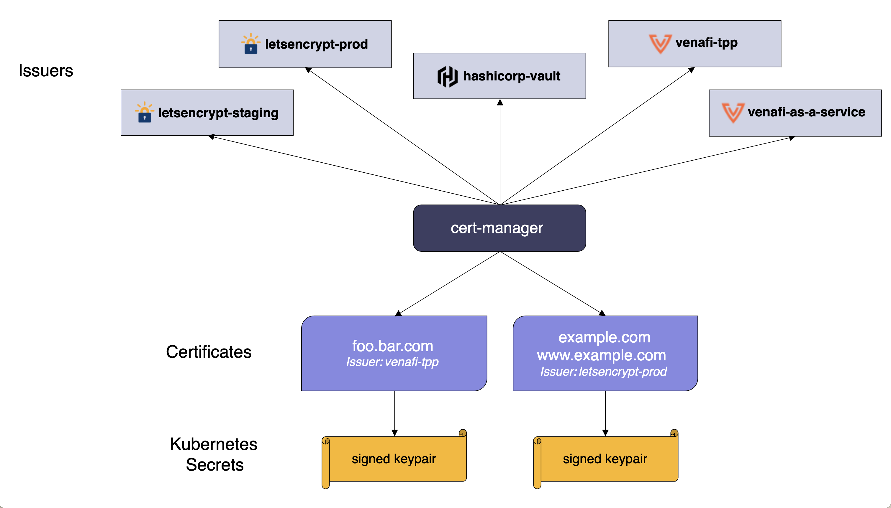

安全性是云原生应用程序的重中之重。

虽然安全性是一个非常广泛的话题，但 Linkerd 依然可以发挥重要作用：其双向 TLS（mTLS）功能是为了在 Kubernetes 中实现零信任的安全方法。

零信任安全是一种 IT 安全模型，要求试图访问专用网络上资源的每一个人和每一台设备（无论位于网络边界之内还是之外）都必须进行严格的身份验证。

## 什么是 mTLS

在云环境中越来越普遍的通信安全方法是**零信任**方法，虽然对零信任安全的全面处理超出了本节的范围，但核心目标是将应用程序的安全边界缩小到尽可能小的级别。例如，与其在数据中心周围设置防火墙，对进入的流量实施安全保护，留下"软内部"而不进一步验证，不如让数据中心的每个应用在自己的边界实施安全。这种零信任的方法自然适合云环境，因为云环境中的底层硬件和网络基础设施不在你的控制之下。

Linkerd 安全模型通过在服务之间提供透明的双向 TLS 通信来实现零信任安全，双向 TLS (mTLS) 是一种传输安全形式，可提供通信的机密性和身份验证。换句话说，不仅通信被加密，而且身份也在连接的两端进行验证（mTLS 的**双向**组件与浏览器使用的 TLS 不同，它只验证连接的服务器端，mTLS 验证客户端和服务器的身份）。 Linkerd 的目标是通过使用 mTLS 对 Kubernetes Pod 之间的通信进行身份验证和加密，允许你对 Kubernetes 集群采用零信任方法。

验证是特别重要的，虽然大多数人认为 TLS 的价值在于加密，但验证连接两边实体的身份也同样重要。毕竟只有在你能相信与你通信的另一方的实体是他们所说的人的情况下，加密才是有用的--来自不良行为者的加密信息仍然是来自不良行为者的信息。

在 Linkerd 中，通过 mTLS 验证的身份与 Kubernetes ServiceAccounts 相关联。这意味着 Linkerd 的 mTLS 身份系统使用与 Kubernetes 用于为集群上的工作负载建立身份和访问控制的完全相同的模式，而不是发明一个新框架。

## 使用 Linkerd 的 mTLS

Linkerd 的设计原则之一是，**复杂性是安全的敌人**。配置东西越难，使用它的可能性就越小; 选项和设置越多，就越有可能不小心以不安全的方式进行配置。

默认情况下，Linkerd 为所有网格中的 `pod-to-pod` 通信启用了 mTLS，只要双方都注入了数据平面代理，那么恭喜你：你已经在服务之间验证了加密的 mTLS。事实上，前面我们使用的 `Emojivoto` 应用程序中就已经在使用 mTLS 了，只是我们没有意识到而已。

对对于 Linkerd 自动添加 mTLS 的功能，有几个需要注意的地方。

- 两个端点都必须在网格中。Linkerd 需要同时处理客户端和服务器端的连接才能发挥其 mTLS 的魔力。
- 在 Linkerd 2.8.1 和更早的版本中，Linkerd 只能为 HTTP 和 gRPC 流量添加 mTLS，即使如此，也无法针对某些类型的权限、主机或 Header 执行该操作，这些限制在 Linkerd 2.9 中已经被移除，它将 mTLS 添加到所有的 TCP 流量中，不管是什么协议。
- 客户端发起 TLS 的连接不能由 Linkerd 进行 mTLS。相反，Linkerd 会将把这些连接视为 TCP 流量。请注意，这也意味着 Linkerd 只能为这些连接提供 TCP 级别的指标。

接下来让我们来了解下 mTLS 是如何工作的，以及如何验证我们的连接是否确实具有 mTLS。

## Linkerd Identity 组件

在前面讲解 Linkerd 架构的时候我们就讨论过 Linkerd 控制平面的 `Identity` 组件，它作为 CA 或证书颁发机构所扮演的角色。证书颁发机构是颁发数字证书并使身份组件成为数字证书颁发者的实体。

Linkerd 使用的证书与网站用来验证其身份的 TLS 证书“类型”相同。与网站不同，这些证书不经过 `Verisign` 等第三方实体的验证，因为它们不需要验证，**它们仅供 Linkerd 代理在集群内使用**。

Linkerd 的 CA（Identity 服务）作为 Linkerd 控制平面的一部分部署到集群中。在该部署过程中，Linkerd CLI 将生成一个证书并将其存储在 Linkerd 命名空间中名为 `linkerd-identity-token-XXXXX` 的 Kubernetes Secret 中。

```
$ kubectl get secret -n linkerd
NAME                                 TYPE                                  DATA   AGE
linkerd-identity-issuer              Opaque                                2      11d
linkerd-identity-token-nqhbk         kubernetes.io/service-account-token   3      11d
# ......
```

通过查看 Secret 可以看到一个前缀为 `linkerd-identity-token-` 的 Secret 对象，我们可以将其导出来进行查看：

```
$ kubectl get secret -n linkerd linkerd-identity-token-nqhbk -o yaml
apiVersion: v1
data:
  ca.crt: <ca.crt>
  namespace: bGlua2VyZA==
  token: <token>
kind: Secret
metadata:
  annotations:
    kubernetes.io/service-account.name: linkerd-identity
    kubernetes.io/service-account.uid: cdc3d8fd-0e02-4b17-88ce-d2cc0a9e4907
  name: linkerd-identity-token-nqhbk
  namespace: linkerd
type: kubernetes.io/service-account-token
```

输出的数据部分中名为 `ca.crt` 的字段就是在 Linkerd 安装期间生成的 UTF-8 编码的根证书。此证书称为“信任之锚”，因为它是用作颁发给代理的所有证书的基础。

信任锚还用于在安装时创建另一个证书和密钥对：颁发者凭据，这些存储在名为 `linkerd-identity-issuer` 的单独 Kubernetes Secret 中。颁发者凭据用于向 Linkerd proxy 颁发证书，同样我们也可以来查看该 Secret 的数据。

```
$ kubectl get secret -n linkerd linkerd-identity-issuer -o yaml
apiVersion: v1
data:
  crt.pem: <crt.pem>
  key.pem: <key.pem>
kind: Secret
metadata:
  labels:
    linkerd.io/control-plane-component: identity
    linkerd.io/control-plane-ns: linkerd
  name: linkerd-identity-issuer
  namespace: linkerd
type: Opaque
```

接下来我们将了解如何使用这些密钥向代理颁发证书以启用 mTLS。

## Linkerd 代理如何获取证书

首先，当 Pod 被注入 Linkerd 代理时，该代理会向 Linkerd 的身份服务发送证书签名请求 (CSR)。身份服务使用颁发者凭据向该代理颁发签名证书（CSR 的作用域是运行 Pod 的 Kubernetes ServiceAccount，因此生成的证书与该 ServiceAccount 相关联），证书将在 24 小时后过期。在证书过期前，代理向身份服务发送新的证书签名请求，获取新证书；这个过程在 Linkerd 代理的整个生命周期内都会持续，这称为**证书轮换**，是一种将证书泄露造成的损失降至最低的自动化方式：**在最坏的情况下，任何泄露的证书只能使用 24 小时**。

`linkerd check` 命令有一种简单的方法来确保代理都具有由身份服务颁发的证书，我们可以自己通过传递 `--proxy` 标志来检查代理的状态。

```
# 使用 --proxy 标志在数据平面检查代理
$ linkerd check --proxy
# ......
linkerd-identity
----------------
√ certificate config is valid
√ trust anchors are using supported crypto algorithm
√ trust anchors are within their validity period
√ trust anchors are valid for at least 60 days
√ issuer cert is using supported crypto algorithm
√ issuer cert is within its validity period
√ issuer cert is valid for at least 60 days
√ issuer cert is issued by the trust anchor

linkerd-identity-data-plane
---------------------------
√ data plane proxies certificate match CA

# ......

Status check results are √
```

上面的输出结果中包括一个 `linkerd-identity-data-plane` 部分，用来指示代理是否正在使用由信任锚颁发的证书。

```
linkerd-identity-data-plane
---------------------------
√ data plane proxies certificate match CA
```

我们也可以在 Linkerd 代理和身份服务中开启 debug 模式，以查看代理将 CSR 发送到身份服务并取回证书。

```
$ kubectl get deploy -n linkerd
NAME                     READY   UP-TO-DATE   AVAILABLE   AGE
linkerd-destination      1/1     1            1           11d
linkerd-identity         1/1     1            1           11d
linkerd-proxy-injector   1/1     1            1           11d
$ kubectl edit deploy linkerd-identity -n linkerd
# ......
  spec:
    containers:
    - args:
      - identity
      - -log-level=debug  # 设置为 debug 模式
      - -log-format=plain
      - -controller-namespace=linkerd
      - -identity-trust-domain=cluster.local
      - -identity-issuance-lifetime=24h0m0s
      - -identity-clock-skew-allowance=20s
      - -identity-scheme=linkerd.io/tls
# ......
```

当身份服务重新更新后，我们可以观察对应 Pod 的日志信息：

```
$ kubectl logs -f -n linkerd deploy/linkerd-identity -c identity
```

上面的命令会输出很多日志到控制台，在 Linkerd 身份日志输出中，我们可以看到 `Request Body` 和 `Response Body` 相关的输出，其中包括一个很长的 UTF-8 编码数据，即 `CSR` 和颁发给代理的证书：

```
# ......
time="2022-08-30T07:39:17Z" level=debug msg="Issuer has been updated"
time="2022-08-30T07:39:17Z" level=info msg="starting admin server on :9990"
time="2022-08-30T07:39:17Z" level=info msg="starting gRPC server on :8080"
time="2022-08-30T07:39:17Z" level=debug msg="Validating token for linkerd-identity.linkerd.serviceaccount.identity.linkerd.cluster.local"
I0830 07:39:17.291787       1 request.go:1123] Request Body: {"kind":"TokenReview","apiVersion":"authentication.k8s.io/v1","metadata":{"creationTimestamp":null},"spec":{"token":"<......>"},"status":{"user":{}}}
# ......
I0830 07:39:17.291969       1 round_trippers.go:435] curl -k -v -XPOST  -H "Accept: application/json, */*" -H "Content-Type: application/json" -H "User-Agent: controller/v0.0.0 (linux/amd64) kubernetes/$Format" -H "Authorization: Bearer <masked>" 'https://10.96.0.1:443/apis/authentication.k8s.io/v1/tokenreviews'
I0830 07:39:17.293883       1 round_trippers.go:454] POST https://10.96.0.1:443/apis/authentication.k8s.io/v1/tokenreviews 201 Created in 1 milliseconds
# ......
I0830 07:39:17.294241       1 request.go:1123] Response Body: {"kind":"TokenReview","apiVersion":"authentication.k8s.io/v1","metadata":{"creationTimestamp":null,"managedFields":[{"manager":"controller","operation":"Update","apiVersion":"authentication.k8s.io/v1","time":"2022-08-30T07:39:17Z","fieldsType":"FieldsV1","fieldsV1":{"f:spec":{"f:token":{}}}}]},"spec":{"token":"<token>"},"status":{"authenticated":true,"user":{"username":"system:serviceaccount:linkerd:linkerd-identity","uid":"cdc3d8fd-0e02-4b17-88ce-d2cc0a9e4907","groups":["system:serviceaccounts","system:serviceaccounts:linkerd","system:authenticated"],"extra":{"authentication.kubernetes.io/pod-name":["linkerd-identity-5d9b874d66-m77ps"],"authentication.kubernetes.io/pod-uid":["2f147d37-1616-487a-b7aa-1805b84c026a"]}},"audiences":["https://kubernetes.default.svc.cluster.local"]}}
# ......
```

接下来我们再来查看下 `Emojivoto` 应用服务之间的安全性。首先我们可以使用 `linkerd viz edges` 命令来查看下 Pod 之间是如何连接的。

```
$ linkerd viz edges po -n emojivoto
SRC                           DST                         SRC_NS        DST_NS      SECURED
vote-bot-6d7677bb68-jvxsg     web-5f86686c4d-58p7k        emojivoto     emojivoto   √
web-5f86686c4d-58p7k          emoji-696d9d8f95-5vn9w      emojivoto     emojivoto   √
web-5f86686c4d-58p7k          voting-ff4c54b8d-xhjv7      emojivoto     emojivoto   √
prometheus-7bbc4d8c5b-5rc8r   emoji-696d9d8f95-5vn9w      linkerd-viz   emojivoto   √
prometheus-7bbc4d8c5b-5rc8r   vote-bot-6d7677bb68-jvxsg   linkerd-viz   emojivoto   √
prometheus-7bbc4d8c5b-5rc8r   voting-ff4c54b8d-xhjv7      linkerd-viz   emojivoto   √
prometheus-7bbc4d8c5b-5rc8r   web-5f86686c4d-58p7k        linkerd-viz   emojivoto   √
```

我们可以看到上面的输出结果中最后包含一列 `SECURED`，表示是否是安全的连接，下面的值均为 `√`，表示是安全的连接。

然后我们再此使用 `linkerd viz tap` 命令来捕获实时流量，在输出的信息中也包含一个 `tls=true` 的标签值，如下所示：

```
$ linkerd viz tap deploy web -n emojivoto
req id=0:0 proxy=in  src=10.244.1.165:47130 dst=10.244.1.176:8080 tls=true :method=GET :authority=web-svc.emojivoto:80 :path=/api/list
req id=0:1 proxy=out src=10.244.1.176:42096 dst=10.244.1.188:8080 tls=true :method=POST :authority=emoji-svc.emojivoto:8080 :path=/emojivoto.v1.EmojiService/ListAll
rsp id=0:1 proxy=out src=10.244.1.176:42096 dst=10.244.1.188:8080 tls=true :status=200 latency=2731µs
# ......
```

到这里面我们就了解了 Linkerd 的 Identity 组件如何向数据平面中的 Linkerd 代理颁发证书，以及 Linkerd 在代理中的 mTLS 实现如何使用这些证书来加密通信并验证双方的身份。

## 自动轮换控制器平面 TLS 凭证

Linkerd 的自动 mTLS 功能使用一组 TLS 凭据为代理生成 TLS 证书：信任锚(trust anchor)、颁发者证书(issuer certificate)和私钥(private key)。虽然 Linkerd 每 24 小时自动轮换数据平面代理的 TLS 证书，但它不会轮换用于颁发这些证书的 TLS 凭据。接下来我们来了解下如何使用 `Cert-manager` 进行自动轮换颁发者证书和私钥。

### Cert-manager

`Cert-manager` 是一个非常流行的云原生证书管理工具。`Cert-manager` 将证书和证书颁发者作为 CRD 资源类型添加到 Kubernetes 集群中，简化了获取、更新和使用这些证书的过程。它可以从各种受支持的来源发布证书，包括 `Let's Encrypt`、 `HashiCorp Vault` 和 `Venafi` 以及私有 PKI。它将确保证书有效并且是最新的，并尝试在证书到期前的配置时间更新证书。



`Cert-manager` 的安装也非常简单，可以直接使用官方提供的资源清单文件一键安装，如下所示：

```
$ kubectl apply -f https://github.com/cert-manager/cert-manager/releases/download/v1.9.1/cert-manager.yaml
```

默认会将相关资源安装到一个名为 `cert-manager` 的命名空间中：

```
$ kubectl get pods -n cert-manager
NAME                                      READY   STATUS    RESTARTS   AGE
cert-manager-55649d64b4-kdcfk             1/1     Running   0          43s
cert-manager-cainjector-666db4777-cp2dn   1/1     Running   0          43s
cert-manager-webhook-6466bc8f4-5lvw5      1/1     Running   0          43s
```

### 颁发证书

接下来我们使用 `step` 工具创建一个签名密钥对，并将其存储在 Kubernetes 的一个 Secret 对象中。

```
$ step certificate create root.linkerd.cluster.local ca.crt ca.key \
  --profile root-ca --no-password --insecure
Your certificate has been saved in ca.crt.
Your private key has been saved in ca.key.
```

然后将生成的 `ca.crt` 和 `ca.key` 保存到 Secret 对象中：

```
$ kubectl create secret tls linkerd-trust-anchor --cert=ca.crt --key=ca.key -n linkerd
secret/linkerd-trust-anchor created
```

有了 Secret，我们可以创建一个引用密钥的证书颁发者 `Issuer` 资源：

```
$ cat <<EOF | kubectl apply -f -
apiVersion: cert-manager.io/v1
kind: Issuer
metadata:
  name: linkerd-trust-anchor
  namespace: linkerd
spec:
  ca:
    secretName: linkerd-trust-anchor
EOF
$ kubectl get issuer -n linkerd
NAME                   READY   AGE
linkerd-trust-anchor   True    84s
```

然后我们就可以颁发证书了，并将它们写入到一个 Secret 对象中，最后，我们可以创建一个 cert-manager "Certificate" 资源， 它使用这个 Issuer 来生成所需的证书：

```
$ cat <<EOF | kubectl apply -f -
apiVersion: cert-manager.io/v1
kind: Certificate
metadata:
  name: linkerd-identity-issuer
  namespace: linkerd
spec:
  secretName: linkerd-identity-issuer
  duration: 48h
  renewBefore: 25h
  issuerRef:
    name: linkerd-trust-anchor
    kind: Issuer
  commonName: identity.linkerd.cluster.local
  dnsNames:
  - identity.linkerd.cluster.local
  isCA: true
  privateKey:
    algorithm: ECDSA
  usages:
  - cert sign
  - crl sign
  - server auth
  - client auth
EOF
$ kubectl get certificate -n linkerd
NAME                      READY   SECRET                    AGE
linkerd-identity-issuer   True    linkerd-identity-issuer   17s
```

在上面的资源清单文件中，`duration` 指示 cert-manager 将证书视为有效期 48 小时，而 `renewBefore` 指示 cert-manager 将尝试在当前证书到期前 25 小时颁发新证书。

此时，cert-manager 现在可以使用此证书资源获取 TLS 凭据，该凭据将存储在名为 `linkerd-identity-issuer` 的 Secret 中，要验证您新颁发的证书，我们可以运行下面的命令：

```
$ kubectl get secret linkerd-identity-issuer -o yaml -n linkerd
apiVersion: v1
data:
  ca.crt: <ca.crt>
  crt.pem: <crt.pem>
  key.pem: <key.pem>
  tls.crt: <tls.crt>
  tls.key: <tls.key>
kind: Secret
metadata:
  name: linkerd-identity-issuer
  namespace: linkerd
type: Opaque
```

现在我们只需要通知 Linkerd 使用这些凭据就可以了。由于我们是通过 `linkerd` 命令行工具进行安装的，Linkerd 控制平面默认会通过 `--identity-external-issuer` 标志进行安装，该标志指示 Linkerd 从 `linkerd-identity-issuer` 的 Secret 读取证书。每当更新存储在 Secret 中的 `certificate` 和 `key` 时， identity 服务将自动检测此更改并重新加载新凭据。

这样我们就设置了 Linkerd 控制平面 TLS 凭据的自动轮换，如果你想监控更新过程，你可以检查服务发出的 `IssuerUpdated` 事件：

```
$ kubectl get events --field-selector reason=IssuerUpdated -n linkerd

LAST SEEN   TYPE     REASON          OBJECT                        MESSAGE
2m37s       Normal   IssuerUpdated   deployment/linkerd-identity   Updated identity issuer
```

可以看到已经执行了 `Updated identity issuer`。