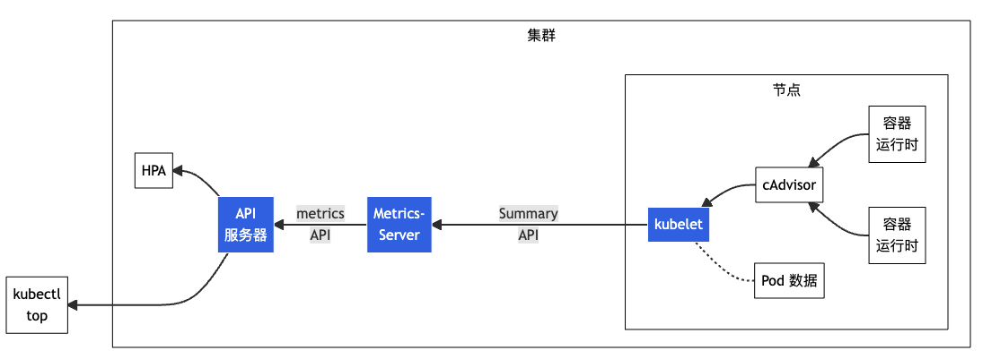

## Metrics Server 简介

对于 Kubernetes，Metrics API 提供了一组基本的指标，以支持自动伸缩和类似的用例。 该 API 提供有关节点和 Pod 的资源使用情况的信息， 包括 CPU 和内存的指标。



图中从右到左的架构组件包括以下内容：

- cAdvisor: 用于收集、聚合和公开 Kubelet 中包含的容器指标的守护程序。
- kubelet: 用于管理容器资源的节点代理。 可以使用 `/metrics/resource` 和 `/stats` kubelet API 端点访问资源指标。
- Summary API: kubelet 提供的 API，用于发现和检索可通过 /stats 端点获得的每个节点的汇总统计信息。
- metrics-server: 集群插件组件，用于收集和聚合从每个 kubelet 中提取的资源指标。 API 服务器提供 Metrics API 以供 HPA、VPA 和 kubectl top 命令使用。Metrics Server 是 Metrics API 的参考实现。
- Metrics API: Kubernetes API 支持访问用于工作负载自动缩放的 CPU 和内存。要在你的集群中进行这项工作，你需要一个提供 Metrics API 的 API 扩展服务器。

官方：

- 安装指南：<https://github.com/kubernetes-sigs/metrics-server#installation>

- GitHub 仓库：<https://github.com/kubernetes-sigs/metrics-server>
- 资源指标管道：<https://kubernetes.io/zh-cn/docs/tasks/debug/debug-cluster/resource-metrics-pipeline/>

## 安装 Metrics Server

使用 Chart 安装，values.yaml 的值如下：

```yaml
customTolerations: &customTolerations
  - key: node.kubernetes.io/not-ready
    operator: Exists
    effect: NoExecute
    tolerationSeconds: 60
  - key: node.kubernetes.io/unreachable
    operator: Exists
    effect: NoExecute
    tolerationSeconds: 60
  - key: node-role.kubernetes.io/control-plane
    operator: Exists
  - key: node-role.kubernetes.io/monitoring
    operator: Exists

customNodeAffinity: &customNodeAffinity
  requiredDuringSchedulingIgnoredDuringExecution:
    nodeSelectorTerms:
      - matchExpressions:
          - key: node-role.kubernetes.io/monitoring
            operator: In
            values:
              - ""
              - "yes"
              - "true"

customNodeSelector: &customNodeSelector
  kubernetes.io/arch: amd64
  kubernetes.io/os: linux

global:
  imagePullSecrets: 
    - name: platform-oci-image-pull-secrets

image:
  repository: harbor.alpha-quant.com.cn:5000/3rd_party/registry.k8s.io/metrics-server/metrics-server
  tag: "v0.6.4"

resources:
  limits:
    cpu: 100m
    memory: 512Mi
  requests:
    cpu: 100m
    memory: 200Mi

defaultArgs:
  - --secure-port=10250
  - --cert-dir=/tmp
  - --kubelet-insecure-tls
  - --kubelet-preferred-address-types=InternalIP,ExternalIP,Hostname
  - --kubelet-use-node-status-port
  - --metric-resolution=15s

nodeSelector: *customNodeSelector
tolerations: *customTolerations
affinity:
  nodeAffinity: *customNodeAffinity

```

安装

```bash
helm repo add metrics-server https://kubernetes-sigs.github.io/metrics-server/
helm upgrade --install \
    --version 3.8.3 \
    -n kube-system \
    --create-namespace \
    -f ./values.yaml \
    metrics-server \
    metrics-server/metrics-server

```

## 使用

查看度量指标

```bash
> kubectl top nodes

NAME        CPU(cores)   CPU%   MEMORY(bytes)   MEMORY%   
devmaster   197m         0%     9665Mi          7%        
devnode1    23m          0%     3543Mi          11%       
devnode2    19m          0%     3474Mi          11%   

> kubectl top pods

NAME                                            CPU(cores)   MEMORY(bytes)   
ingress-nginx-controller-7cbdc77679-8flsw       2m           328Mi           
ingress-nginx-frp-controller-57b997b44b-d6f9v   2m           338Mi 
```

