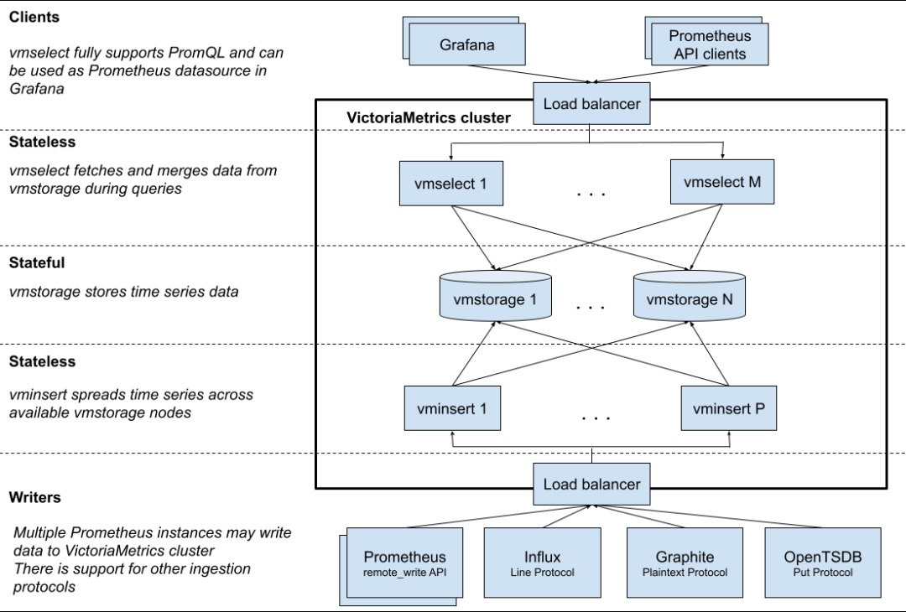

## 说明

VictoriaMetrics 是一个支持水平扩展的时序数据库，可以作为 Prometheus 的远端存储，并且实现了 PromSQL，可以直接通过 VictoriaMetrics 查询时序数据，避开 Prometheus 查询时的单点瓶颈。

使用 VM 完全替换 Prometheus，可以达到架构简单、更低的资源占用


## 对比其他方案

cortex过于复杂，没有正式 release；使用 thanos，prometheus 通过 thanos 进行 remote read 内存开销增加1倍，oom；m3db 复杂，学习、管理成本高。

## 业务量指标

时间序列（time series）是时序数据库的最小管理单位，每个 time series 对应一系列按时间分布的的采样点。

需要考虑以下几个问题：

1. 能存储多少个 time series，total number of time series；
2. 能支持多少个 time series 的并发写入，number of active time series；
3. 能支持多高速度的采样数据写入，每秒写入点数；
4. 能支持多高查询频率，average query rate；
5. 每次查询耗时，query duration；

## VictoriaMetrics Cluster 模式部署

VictoriaMetrics 集群版本 的架构如下：



vminsert 和 vmselect 是无状态的写入、查询节点，vmstorage 是有状态的存储节点。数据平均分配到 vmstorage 节点，每个 vmstorage 分担一部分数据，没有冗余，如果 vmstorage 节点丢失，那么数据对应丢失。

三个组件的镜像：

```bash
victoriametrics/vminsert:v1.82.0-cluster
victoriametrics/vmselect:v1.82.0-cluster
victoriametrics/vmstorage:v1.82.0-cluster
```

### vmstorage

数据存储以及查询结果返回

vmstorage 有状态服务，监听端口 8482(http)、8400(insert)、8401(select)

```yaml
ports:
  - name: http
    containerPort: 8482
    protocol: TCP
  - name: vminsert
    containerPort: 8400
    protocol: TCP
  - name: vmselect
    containerPort: 8401
    protocol: TCP
```

主要参数：

```bash
-retentionPeriod  # 存储时间，单位是月
-storageDataPath  # 数据存放路径
```

### vminsert

数据录入，可实现类似分片、副本功能。可以将数据分片插入到多个 storage 实例当中去，具体怎么插入是有一套算法，将数据哈希到某个节点上面去

vminsert 无状态服务，所以暴露的时候可以使用 LB 的形式，指向所有的 vmstorage，监听端口 8480

```yaml
ports:
  - name: http
    containerPort: 8480
    protocol: TCP
```

主要参数：

```bash
-storageNode=<vmstorage_host>:8400
```

### vmselect

数据查询，汇总和数据去重，如果有压力可以横向扩展

vmselect 无状态服务，指向所有的 vmstorage，监听端口 8481

```yaml
ports:
  - name: http
    containerPort: 8481
    protocol: TCP
```

主要参数：

```bash
-storageNode=<vmstorage_host>:8401
```

### vmagent

数据指标抓取，支持多种后端存储，会占用本地磁盘缓存

vmagent 相比于 Prometheus 抓取指标来说具有更多的灵活性，比如除了拉取（pull）指标还可以推送（push）指标，此外还有很多其他特性：

- 可以替换 prometheus 的 scraping target
- 支持从 Kafka 读写数据
- 支持基于 prometheus relabeling 的模式添加、移除、修改 labels，可以在数据发送到远端存储之前进行数据的过滤
- 支持多种数据协议，influx line 协议，graphite 文本协议，opentsdb 协议，prometheus remote write 协议，json lines 协议，csv 数据等
- 支持收集数据的同时，并复制到多种远端存储系统
- 支持不可靠远端存储，如果远程存储不可用，收集的指标会在 `-remoteWrite.tmpDataPath` 缓冲，一旦与远程存储的连接被修复，缓冲的指标就会被发送到远程存储，缓冲区的最大磁盘用量可以用 `-remoteWrite.maxDiskUsagePerURL` 来限制。
- 相比 prometheus 使用更少的内存、cpu、磁盘 io 以及网络带宽
- 当需要抓取大量目标时，抓取目标可以分散到多个 vmagent 实例中
- 可以通过在抓取时间和将其发送到远程存储系统之前限制唯一时间序列的数量来处理高基数和高流失率问题
- 可以从多个文件中加载 scrape 配置


### vmalert

报警相关组件，不如果不需要告警功能可以不使用该组件

要想完全替换 prometheus 还有一个非常重要的部分就是报警模块，之前我们都是在 prometheus 中定义报警规则评估后发送给 alertmanager 的，同样对应到 vm 中也有一个专门来处理报警的模块：vmalert。

vmalert 会针对 `-datasource.url` 地址执行配置的报警或记录规则，然后可以将报警发送给 `-notifier.url` 配置的 `Alertmanager`，记录规则结果会通过远程写入的协议进行保存，所以需要配置 `-remoteWrite.url`。

## 配置

分别访问下面三个地址，查看组件的状态数据：

```bash
insert:  http://127.0.0.1:8480/metrics
select:  http://127.0.0.1:8481/metrics
storage: http://127.0.0.1:8482/metrics
```

grafana 中添加的 victorai 数据源

```bash
http://vmselect:8481/select/0/prometheus/
```

验证数据：

```bash
curl http://127.0.0.1:8481/select/0/prometheus/api/v1/labels
```

## 数据查询和写入

### 数据写入

vminsert 的写入 API 格式如下：

```bash
http://<vminsert>:8480/insert/<accountID>/<suffix>
```

accountID 是不同用户/租户的 ID，必须是数字，否则通过 vmselect 查询的时候会遇到下面的问题：

```bash
# localcluster 不是数字，vmselect 报错
auth error: cannot parse accountID from "localcluster": strconv.Atoi: parsing "localcluster": invalid syntax
```

VictoriaMetrics 支持多种写入方式，通过 sufficx 区分，suffix 支持以下几种：

- prometheus: for inserting data with Prometheus remote write API
- influx/write: for inserting data with Influx line protocol
- influx/api/v2/write: for inserting data with Influx line protocol
- opentsdb/api/put: for accepting OpenTSDB HTTP /api/put requests.
- prometheus/api/v1/import: for importing data obtained via api/v1/export on vmselect

### 数据查询

vmselect 采用 prometheus 的查询语法，API 格式如下：

```bash
http://<vmselect>:8481/select/<accountID>/prometheus/<suffix>
```

- api/v1/query: performs PromQL instant query
- api/v1/query_range: performs PromQL range query
- api/v1/series: performs series query
- api/v1/labels: returns a list of label names
- api/v1/label/<label_name>/values: returns values for the given <label_name> according to API
- federate: returns federated metrics
- api/v1/export: exports raw data. See this article for details

通过 Prometheus 的 API 查询：

```bash
curl -g 'http://localhost:9090/api/v1/series' --data-urlencode 'match[]=vm_rows{}' |jq

{
  "status": "success",
  "data": [
    {
      "__name__": "vm_rows",
      "instance": "172.29.128.2:8482",
      "job": "victoria",
      "type": "indexdb"
    },
    {
      "__name__": "vm_rows",
      "instance": "172.29.128.2:8482",
      "job": "victoria",
      "type": "storage/big"
    },
    {
      "__name__": "vm_rows",
      "instance": "172.29.128.2:8482",
      "job": "victoria",
      "type": "storage/small"
    }
  ]
}
```

通过 VictoriaMetrics 的 API 查询：

```bash
curl 'http://127.0.0.1:8481/select/0/prometheus/api/v1/series' --data-urlencode 'match[]=vm_rows{}' |jq

{
  "status": "success",
  "data": [
    {
      "__name__": "vm_rows",
      "job": "victoria",
      "type": "indexdb",
      "instance": "172.29.128.49:8482"
    },
    {
      "__name__": "vm_rows",
      "job": "victoria",
      "type": "indexdb",
      "instance": "172.29.128.2:8482"
    },
    {
      "__name__": "vm_rows",
      "job": "victoria",
      "type": "indexdb",
      "instance": "172.29.128.7:8482"
    },
   ...
```
