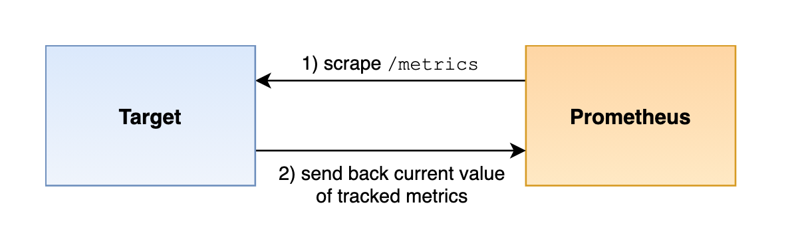

## 仪表化简介

如何在自己的应用程序中暴露监控指标呢？可以通过：

- 直接在应用中集成 metrics 指标数据
- 也可以单独开发一个对应的 exporter 来暴露指标
- 或者根据需求编写脚本推送到 pushgateway 网关生成监控指标

当然最好的方式是直接在应用程序中集成 Prometheus 监控指标数据。

本文介绍如何使用 Prometheus 客户端库暴露监控指标，直接在代码中添加相关指标以获取对应用程序的监控能力。

官方文档：

- 不同类型系统监控的建议：https://prometheus.io/docs/practices/instrumentation/
- 指标命名最佳实践：<https://prometheus.io/docs/practices/naming/#metric-names>

## 抓取指标

Prometheus 通过一个 HTTP 请求抓取监控目标，默认请求的端点名是 `/metrics`。



监控目标通过发送每个被跟踪的时间序列单个样本，以及样本的指标名称、标签集合和样本值来响应每个指标的当前状态。

抓取到数据后 Prometheus 会存储每个样本，并为其添加一个服务器端的时间戳，从而从单个抓取构建成一组时间序列。

监控指标的格式，如下所示：

```plain
# HELP http_requests_total The total number of HTTP requests.
# TYPE http_requests_total counter
http_requests_total{method="post",code="200"} 1027
http_requests_total{method="post",code="400"}    3

# HELP process_open_fds Number of open file descriptors.
# TYPE process_open_fds gauge
process_open_fds 15

# HELP http_request_duration_seconds A histogram of the request duration.
# TYPE http_request_duration_seconds histogram
http_request_duration_seconds_bucket{le="0.05"} 24054
http_request_duration_seconds_bucket{le="0.1"} 33444
http_request_duration_seconds_bucket{le="0.2"} 100392
http_request_duration_seconds_bucket{le="0.5"} 129389
http_request_duration_seconds_bucket{le="1"} 133988
http_request_duration_seconds_bucket{le="+Inf"} 144320
http_request_duration_seconds_sum 53423
http_request_duration_seconds_count 144320

# HELP rpc_duration_seconds A summary of RPC durations in seconds.
# TYPE rpc_duration_seconds summary
rpc_duration_seconds{quantile="0.01"} 3.102
rpc_duration_seconds{quantile="0.05"} 3.272
rpc_duration_seconds{quantile="0.5"} 4.773
rpc_duration_seconds{quantile="0.9"} 9.001
rpc_duration_seconds{quantile="0.99"} 76.656
rpc_duration_seconds_sum 5.7560473e+04
rpc_duration_seconds_count 2693

```

## 客户端库

Prometheus 官方已经提供了一些语言的客户端库，包括 Go、Java、Python、Ruby，还有一些非官方的第三方客户端库，可以用来帮助在应用中集成 Prometheus 指标服务。

官方仓库：

- Java：<https://github.com/prometheus/client_java>
- Python：<https://github.com/prometheus/client_python>
- Golang：<https://github.com/prometheus/client_golang>
- Ruby：<https://github.com/prometheus/client_ruby>
- Rust：<https://github.com/prometheus/client_rust>

使用这些库可以创建和跟踪不同类型的指标，反映服务当前的状态，这些库都允许创建和更新单独的指标对象，将它们注册到一个指标注册中心，然后通过 HTTP 暴露该指标注册中心，也就是常用的 `metrics` 接口。


Prometheus 的仪表化客户端库中包含不同的指标类型：counters、gauges、histograms 以及 summaries，和 Prometheus 中的指标类型对应，具体要使用哪种类型的指标取决于实际情况。

根据不同的指标类型，在构建指标对象的时候需要提供不同的选项，比如在创建直方图的时候需要指定存储桶 bucket，而创建计数器的时候下不需要其他额外参数的。

此外构造的指标对象还为每种类型的指标暴露了不同的状态更新方法，例如，计数器具有增加当前值的方法，但不会暴露将计数器设置为任意值的方法，但是仪表盘是允许设置当前值的。

Prometheus 的客户端库页面上列出的所有官方库的实现都考虑到了效率和并发安全问题：

- 效率：对指标对象的状态更新进行了优化
- 并发安全：指标对象的所有状态更新以及从指标状态读取都是并发安全的，这意味着可以从多个线程（或 Go 中的 goroutines）更新指标值，而无需考虑锁的问题，应用程序还能够同时安全地处理多个指标抓取。

## 跟踪指标

当对一个系统或者服务进行仪表化的时候，尽量提供一些有意义的测量指标，业界有几个比较著名的指导方针，可以帮助我们来理解在一个系统中应该添加哪些指标。

### Google 的四大黄金指标

有 4 个来自 Google SRE 手册的黄金指标，这 4 个指标主要针对应用程序或用户部分。

- 延迟（Latency）：服务请求所需耗时，例如 HTTP 请求平均延迟。需要区分成功请求和失败请求，因为失败请求可能会以非常低的延迟返回错误结果。
- 流量（Traffic）：衡量服务容量需求（针对系统而言），例如每秒处理的 HTTP 请求数或者数据库系统的事务数量。
- 错误（Errors）：请求失败的速率，用于衡量错误发生的情况，例如 HTTP500 错误数等显式失败，返回错误内容或无效内容等隐式失败，以及由策略原因导致的失败（比如强制要求响应时间超过 30ms 的请求为错误）。
- 饱和度（Saturation）：衡量资源的使用情况，例如内存、CPU、I/O、磁盘使用量（即将饱和的部分，比如正在快速填充的磁盘）。

### 资源指标的 USE 方法

USE 是 Utilization（使用率）、Saturation（饱和度）、Error（错误）的首字母组合，是 Netflix 的内核和性能工程师 Brendan Gregg 提出的，主要用于分析系统性能问题，可以指导用户快速识别资源瓶颈及错误，主要可以考虑添加以下指标。

- 使用率（Utilization）：关注系统资源的使用情况，这里的资源主要包括但不限于 CPU、内存、网络、磁盘等，100%使用率通常是系统性能瓶颈的标志。
- 饱和度（Saturation）：例如调度器运行队列长度，这里主要是针对资源的饱和度（注意，不同于四大黄金指标）。任何资源在某种程度上的饱和都可能导致系统性能的下降。
- 错误（Errors）：发生了多少（以及什么类型的）错误。例如，网卡在数据包传输过程中检测到以太网络冲突了 10 次。

### 请求服务系统的 RED 方法

RED 方法是 Weave Cloud 基于 Google 的 4 个黄金指标再结合 Prometheus 及 Kubernetes 容器实践得出的方法论，特别适用于对云原生应用以及微服务架构应用进行监控和度量。在四大黄金指标的原则下，RED 方法可以有效地帮助用户衡量云原生以及微服务应用下的用户体验问题。RED 方法主要关注以下 3 种关键指标。

- Request Counters：请求计数器。
- Errors Counters：错误计数器。
- Request Duration：每个请求所花费的时间（histograms 或 summaries）。

一般来说，上述三大监控理论的最佳实践是：

- 在遵循 Google 四大黄金指标的前提下
- 对于在线系统，结合 RED 方法和缓存命中率方式进行监测；
- 对于离线系统或者主机监控，以 USE 方法为主进行监测；
- 对于批处理系统，可以采用类似 Pushgateway 的形式进行监控。

当然这些指南并不能完全覆盖实际监控需求，但是对于在应用中添加哪些指标提供了一个很好的指导作用。

## 指标命名

一个时间序列的指标名称描述了被监测系统的某些状态，比如在如下所示的时间序列中：

```
http_requests_total{job="nginx",instance="localhost:8080",method="POST"}
```

指标名称就是标签前面的 `http_requests_total`，该指标名称本身字面意思就可以帮助理解该指标的含义，虽然 Prometheus 本身并不会以语义方式解释指标名称。

建议如下命名规范（更推荐阅读官方文档）：

- 必须符合数据模型中的有效字符
- 必须有一个与指标所属领域相关的应用前缀，这个前缀有时被客户端库成为命名空间，对于特定与某个应用的指标，前缀通常是应用名称本身，当然有时候指标也是比较通用的，比如 `prometheus_notifications_total` 是特定于 Prometheus 应用的指标，`http_request_duration_seconds` 用于所有的 HTTP 请求
- 必须有单一的单位，不要把秒和毫秒或字节这些混在一起
- 应该使用基本的单位，比如秒、字节、米等
- 应该有一个描述单位的后缀，采用复数形式，此外累积计数除了单位之外，还应该有一个总数 total 作为后缀，比如 `http_reuqest_duration_seconds`、`node_memory_usage_bytes`、`http_requests_total` (没有单位的累计计数)、`process_cpu_seconds_total` (带单位的累计计数)、`foobar_build_info` (用于提供关于运行中的应用元信息的指标)

请注意，直方图和摘要还生成带有后缀 `_sum`、`_count` 和 `_bucket`（单个直方图桶的计数器）的计数器指标，但这些是根据基本指标名称自动生成的直方图，因此不需要手动指定这些后缀。

一个给定指标的所有维度上的 `sum()` 或 `avg()` 应该是有意义的（尽管不一定有用），如果没有意义，请将数据拆分为多个指标。例如，将各种队列的容量放在一个指标中是可行的，而将一个队列的容量与队列中的当前元素数混合在一起则是不规范的。

## 标签

`Label` 标签是 Prometheus 中非常重要的一个元素，在仪表化应用的时候为指标指定合适的标签也是非常重要的。

每组唯一的标签（包括指标名称）都会标识并自动创建一个唯一的时间序列，Prometheus 会在查询期间跟踪、存储和处理该时间序列，时间序列的数量也是 Prometheus 主要的性能瓶颈之一，对于稍好性能的服务器来说，通常可以很好的处理几百万的时间序列，当然最好不要太大，所以在决定将哪些标签维度添加到指标中的时候，需要考虑到这一点。

Prometheus 总的时间序列成本需要通过指标上的不同标签维度相乘得到，比如按照 status code 和 method 来拆分 HTTP 请求计数，则序列总数将是不同的 status code 和不同的 method 数量的乘积得到这两个维度的所有有效组合，然后还需要将该基数乘以相同类型的受监控目标的数量，以得出 Prometheus 服务器的总体时间序列成本，所以对于标签维度的控制是非常重要的，不能太少，也不能太多。

为避免时间序列数量激增，请保持你的每个标签的可能值的数量有一定的限制。尤其要避免以下示例：

- 在一个标签值中存储公共 IP 地址或电子邮件地址
- 在一个标签值中存储完整的 HTTP 路径，如果这些路径包含 ID 或其他无限制的信息
- 或类似的模式

这将迅速产生一个不断增加的时间系列，在短时间内使 Prometheus 服务器过载。所以要避免用这种方式的标签值。
