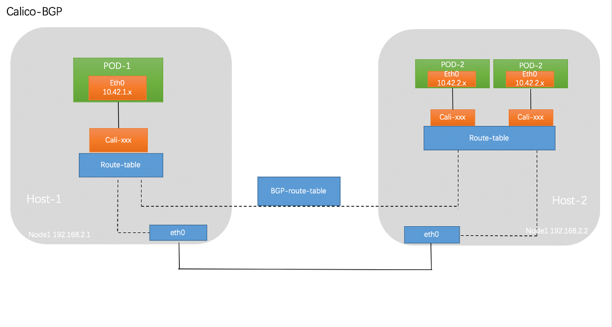

Calico 是一种开源网络和网络安全解决方案，适用于容器，虚拟机和基于主机的本机工作负载。Calico 支持广泛的平台，包括 Kubernetes，docker，OpenStack 和裸机服务。Calico 后端支持多种网络模式。

- BGP 模式：将节点做为虚拟路由器通过 BGP 路由协议来实现集群内容器之间的网络访问。
- IPIP 模式：在原有 IP 报文中封装一个新的 IP 报文，新的 IP 报文中将源地址 IP 和目的地址 IP 都修改为对端宿主机 IP。
- cross-subnet：Calico-ipip 模式和 calico-bgp 模式都有对应的局限性，对于一些主机跨子网而又无法使网络设备使用 BGP 的场景可以使用 cross-subnet 模式，实现同子网机器使用 calico-BGP 模式，跨子网机器使用 calico-ipip 模式。

## 安装

安装 Calico 网络插件

```bash
curl https://docs.projectcalico.org/manifests/calico.yaml -O calico.yaml
```

查看已部署 k8s 集群的子网段

```bash
> kubeadm config print init-defaults | grep Subnet
  serviceSubnet: 10.96.0.0/12

# 旧版本使用：kubeadm config view | grep Subnet
```


修改网段

```bash
# 1、修改calico.yaml配置文件
vim calico.yaml

# 由于calico.yaml配置文件中使用的pod cidr地址段默认为192.168.0.0/16，
# 与在kubeadm init初始化master节点时，指定的–pod-network-cidr地址段10.4.0.0/16不同
# 所以需要修改calico配置文件，取消CALICO_IPV4POOL_CIDR变量和value前的注释，并将value值设置为与--pod-network-cidr指定地址段相同的值，即：10.4.0.0/16
# 2、取消前面的注释，将value值改为 10.4.0.0/16
- name: CALICO_IPV4POOL_CIDR
  value: "10.4.0.0/16"
```

应用calico网络

```bash
kubectl apply -f calico.yaml
```

## IPIP 模式

<https://system51.github.io/2020/05/27/using-calico/>


## BGP 模式



### calico 切换 BGP 模式

部署完成后默认使用 calico-ipip 的模式，通过在节点的路由即可得知，通往其他节点路由通过 tunl0 网卡出去

```bash
# route -n
Kernel IP routing table
Destination     Gateway         Genmask         Flags Metric Ref    Use Iface
0.0.0.0         10.244.244.1    0.0.0.0         UG    100    0        0 eth0
10.4.17.128     10.244.244.103  255.255.255.192 UG    0      0        0 tunl0
10.4.198.192    10.244.244.102  255.255.255.192 UG    0      0        0 tunl0
10.4.250.64     0.0.0.0         255.255.255.192 U     0      0        0 *
10.4.250.66     0.0.0.0         255.255.255.255 UH    0      0        0 cali912d1f2a902
10.4.250.67     0.0.0.0         255.255.255.255 UH    0      0        0 cali55ef474e4e9
10.4.250.68     0.0.0.0         255.255.255.255 UH    0      0        0 calie77e0b179be
10.244.244.0    0.0.0.0         255.255.255.0   U     100    0        0 eth0
10.245.245.0    0.0.0.0         255.255.255.0   U     150    0        0 ib0
172.17.0.0      0.0.0.0         255.255.0.0     U     0      0        0 docker0
172.18.0.0      0.0.0.0         255.255.0.0     U     0      0        0 br-73377e18bc69
```

修改`CALICO_IPV4POOL_IPIP`改为 off，添加新环境变量`FELIX_IPINIPENABLED`为 false

```bash
kubectl set env daemonset/calico-node -n kube-system CALICO_IPV4POOL_IPIP=off

kubectl set env daemonset/calico-node -n kube-system FELIX_IPINIPENABLED=false
```

修改完成后对节点进行重启，等待恢复后查看主机路由，与 ipip 大区别在于去往其他节点的路由，由 Tunnel0 走向网络网卡

```bash
```

## ipip&bgp性能测试

https://zhdya.gitee.io/zhdya/2020/10/01/calico%20ipip&bgp%E6%80%A7%E8%83%BD%E6%B5%8B%E8%AF%95/

## cross-subnet 模式

### calico 切换 cross-subnet 模式

Calico-ipip 模式和 calico-bgp 模式都有对应的局限性，对于一些主机跨子网而又无法使网络设备使用 BGP 的场景可以使用 cross-subnet 模式，实现同子网机器使用 calico-BGP 模式，跨子网机器使用 calico-ipip 模式。

ipip虽然实现了 calico 跨网段通信，但对于相同网段间的主机通信来说，IP-in-IP 就有点多余了，因为二者宿主机处于同一广播域，2层互通，直接走主机路由即可。此时需要借助calico cross-subnet

```
$ calicoctl apply -f - << EOF
apiVersion: v1
kind: ipPool
metadata:
  cidr: 192.168.0.0/16
spec:
  ipip:
    enabled: true
    mode: cross-subnet
  nat-outgoing: true
EOF
```

