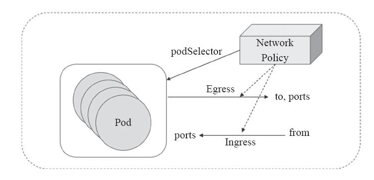
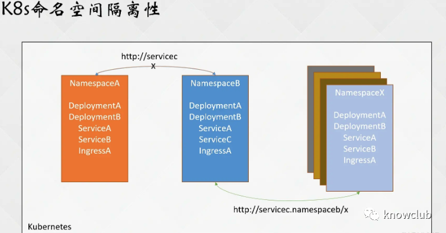
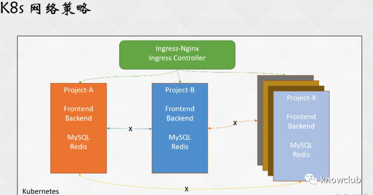

## NetworkPolicy 简介

如果希望在 IP 地址或端口层面（OSI 第 3 层或第 4 层）控制网络流量， 则可以考虑为集群中特定应用使用 Kubernetes 网络策略（NetworkPolicy）



NetworkPolicy 是一种以应用为中心的结构，允许设置如何允许 Pod 与网络上的各类网络“实体” （这里使用实体以避免过度使用诸如“端点”和“服务”这类常用术语， 这些术语在 Kubernetes 中有特定含义）通信。

Pod 可以通信的 Pod 是通过如下三个标识符的组合来辩识的：

1. 其他被允许的 Pods（例外：Pod 无法阻塞对自身的访问）
2. 被允许的名字空间
3. IP 组块（例外：与 Pod 运行所在的节点的通信总是被允许的， 无论 Pod 或节点的 IP 地址）

在定义基于 Pod 或名字空间的 NetworkPolicy 时，会使用选择算符来设定哪些流量可以进入或离开与该算符匹配的 Pod

同时，当基于 IP 的 NetworkPolicy 被创建时，基于 IP 组块（CIDR 范围） 来定义策略







## 前置条件

网络策略通过网络插件来实现

要使用网络策略，必须使用支持 NetworkPolicy 的网络解决方案

创建一个 NetworkPolicy 资源对象而没有控制器来使它生效的话，是没有任何作用的

- 高版本 kubectl

需要安装 kubectl 高版本，用于创建 ingress 等资源

```bash
docker create --entrypoint=sh --name kubectl bitnami/kubectl:1.24.8

docker cp kubectl:/opt/bitnami/kubectl/bin/kubectl ./kubectl
```

- 需要安装 kubectl 插件列表如下
  - ns
  - ingress-nginx

## Pod 隔离的两种类型

Pod 有两种隔离

- 出口的隔离
- 入口的隔离

它们涉及到可以建立哪些连接。这里的“隔离”不是绝对的，而是意味着“有一些限制”。另外的，“非隔离方向”意味着在所述方向上没有限制。这两种隔离（或不隔离）是独立声明的， 并且都与从一个 Pod 到另一个 Pod 的连接有关。

- 默认情况下，一个 Pod 的出口是非隔离的，即所有外向连接都是被允许的。如果有任何的 NetworkPolicy 选择该 Pod 并在其 policyTypes 中包含 “Egress”，则该 Pod 是出口隔离的， 称这样的策略适用于该 Pod 的出口。当一个 Pod 的出口被隔离时， 唯一允许的来自 Pod 的连接是适用于出口的 Pod 的某个 NetworkPolicy 的 egress 列表所允许的连接。这些 egress 列表的效果是相加的。

- 默认情况下，一个 Pod 对入口是非隔离的，即所有入站连接都是被允许的。如果有任何的 NetworkPolicy 选择该 Pod 并在其 policyTypes 中包含 “Ingress”，则该 Pod 被隔离入口， 称这种策略适用于该 Pod 的入口。当一个 Pod 的入口被隔离时，唯一允许进入该 Pod 的连接是来自该 Pod 节点的连接和适用于入口的 Pod 的某个 NetworkPolicy 的 ingress 列表所允许的连接。这些 ingress 列表的效果是相加的。

网络策略是相加的，所以不会产生冲突。如果策略适用于 Pod 某一特定方向的流量，Pod 在对应方向所允许的连接是适用的网络策略所允许的集合。因此，评估的顺序不影响策略的结果。

要允许从源 Pod 到目的 Pod 的连接，源 Pod 的出口策略和目的 Pod 的入口策略都需要允许连接。如果任何一方不允许连接，建立连接将会失败。

## NetworkPolicy 配置详解

说明：除非选择支持网络策略的网络解决方案，否则将发送到 API 服务器没有任何效果

```yaml
apiVersion: networking.k8s.io/v1
kind: NetworkPolicy
metadata:
  name: test-network-policy
  namespace: default
spec:
  podSelector:
    matchLabels:
      role: db
  policyTypes:
  - Ingress
  - Egress
  ingress:
  - from:
    - ipBlock:
        cidr: 172.17.0.0/16
        except:
        - 172.17.1.0/24
    - namespaceSelector:
        matchLabels:
          project: myproject
    - podSelector:
        matchLabels:
          role: frontend
    ports:
    - protocol: TCP
      port: 6379
  egress:
  - to:
    - ipBlock:
        cidr: 10.0.0.0/24
    ports:
    - protocol: TCP
      port: 5978

```

- 必需字段：与所有其他的 Kubernetes 配置一样，NetworkPolicy 需要 apiVersion、 kind 和 metadata 字段

- spec：NetworkPolicy 规约 中包含了在一个名字空间中定义特定网络策略所需的所有信息。

  - podSelector：每个 NetworkPolicy 都包括一个 podSelector，它对该策略所 适用的一组 Pod 进行选择。示例中的策略选择带有 "role=db" 标签的 Pod。空的 podSelector 选择名字空间下的所有 Pod。

  - policyTypes: 每个 NetworkPolicy 都包含一个 policyTypes 列表，其中包含 Ingress 或 Egress 或两者兼具。policyTypes 字段表示给定的策略是应用于 进入所选 Pod 的入站流量还是来自所选 Pod 的出站流量，或两者兼有。如果 NetworkPolicy 未指定 policyTypes 则默认情况下始终设置 Ingress；如果 NetworkPolicy 有任何出口规则的话则设置 Egress。

  - ingress: 每个 NetworkPolicy 可包含一个 ingress 规则的白名单列表

    每个规则都允许同时匹配 from 和 ports 部分的流量。示例策略中包含一条简单的规则：它匹配某个特定端口，来自三个来源中的一个，第一个通过 ipBlock 指定，第二个通过 namespaceSelector 指定，第三个通过 podSelector 指定。

  - egress: 每个 NetworkPolicy 可包含一个 egress 规则的白名单列表

    每个规则都允许匹配 to 和 port 部分的流量。该示例策略包含一条规则，该规则将指定端口上的流量匹配到 10.0.0.0/24 中的任何目的地。

所以，该网络策略示例:

1. 隔离 "default" 名字空间下 "role=db" 的 Pod （如果它们不是已经被隔离的话）

2. （Ingress 规则）允许以下 Pod 连接到 "default" 名字空间下的带有 "role=db" 标签的所有 Pod 的 6379 TCP 端口：

3. - "default" 名字空间下带有 "role=frontend" 标签的所有 Pod
   - 带有 "project=myproject" 标签的所有名字空间中的 Pod
   - IP 地址范围为 172.17.0.0–172.17.0.255 和 172.17.2.0–172.17.255.255 （即，除了 172.17.1.0/24 之外的所有 172.17.0.0/16）

4. （Egress 规则）允许从带有 "role=db" 标签的名字空间下的任何 Pod 到 CIDR 10.0.0.0/24 下 5978 TCP 端口的连接

在配置网络策略时，有很多细节需要注意，比如上述的示例中，一段关于 ingress 的 from 配置：

```yaml
 - from:
    - ipBlock:
        cidr: 172.17.0.0/16
        except:
        - 172.17.1.0/24
    - namespaceSelector:
        matchLabels:
          project: myproject
    - podSelector:
        matchLabels:
          role: frontend
# namespaceSelector 和 podSelector 是或的关系，表示两个条件满足一个就可以

```

需要注意的是在 ipBlock、namespaceSelector 和 podSelector 前面都有一个 `-`，如果前面没有这个横杠将是另外一个完全不同的概念

可以看一下下面的示例：

```yaml
- from:
    - ipBlock:
        cidr: 172.17.0.0/16
        except:
        - 172.17.1.0/24
    - namespaceSelector:
        matchLabels:
          project: myproject
      podSelector:
        matchLabels:
          role: frontend
# namespaceSelector 和 podSelector 是并且的关系，表示两个条件都满足
```

此时的 namespaceSelector 有 “-”，podSelector 没有 “-”，那此时的配置，代表的含义是允许具有 `user=Alice` 标签的 Namespace 下，并且具有 `role=client` 标签的所有 Pod 访问，namespaceSelector 和 podSelector 是且的关系

```yaml
ingress:
  - from:
    - namespaceSelector:
        matchLabels:
          user: alice
    - podSelector:
        matchLabels:
          role: client
```

此时的 namespaceSelector 和 podSelector 都有“-”，配置的含义是允许具有 `user=Alice` 标签 的Namespace 下的所有 Pod 和当前 Namespace 下具有 `role=client` 标签的 Pod 访问，namespaceSelector 和 podSelector 是或的关系

在配置 ipBlock 时，可能也会出现差异性

因为在接收或者发送流量时，很有可能伴随着数据包中源 IP 和目标 IP 的重写，也就是 SNAT 和  DNAT，此时会造成流量的目标 IP 和源 IP 与配置的 ipBlock 出现了差异性，造成网络策略不生效，所以在配置 IPBlock 时，需要确认网络交换中是否存在源目地址转换

并且 IPBlock 最好不要配置 Pod的 IP，因为 Pod 发生重建时，它的 IP 地址一般就会发生变更，所以 IPBlock 一般用于配置集群的外部 IP

## 示例

首先创建该项目所用的 Namespace

```bash
> kubectl create ns nw-demo

namespace/nw-demo created
```

切换默认命名空间

```bash
kubectl ns nw-demo
```

### 隔离中间件服务

1. 有一个项目，它有自己数据库 MySQL 和缓存 Redis 中间件，只希望这个项目的应用能够访问该中间件
2. 假如有一个项目需要通过 Ingress 进行对外发布，想要除了 Ingress 外，其他任何 Namespace 下的 Pod 都不能访问该项目。

假设有一个项目叫 nw-demo，里面部署了三个微服务，分别是 MySQL、Redis 和 Nginx。现需要对 MySQL、Redis、Nginx 进行隔离，分别实现如下效果：

- MySQL、Redis 只能被该 Namespace 下的 Pod 访问；
- Nginx 可以被 `ingress-nginx` 命名空间下的 Pod 和该 Namespace 下的 Pod 访问；


创建 MySQL 服务，MySQL 以容器启动时，必须配置 root 的密码，或者设置密码为空，所以需要设置一个 `MYSQL_ROOT_PASSWORD` 的变量：

```bash
kubectl create deploy mysql --image=docker.io/library/mysql:8.0.31

kubectl set env deploy/mysql MYSQL_ROOT_PASSWORD=mysql
```

创建 redis 服务

```bash
kubectl create deploy redis --image=docker.io/library/redis:7.0.5-bullseye
```

确认容器是否启动：

```bash
> kubectl get po -owide

NAME                     READY   STATUS              RESTARTS   AGE   IP             NODE        NOMINATED NODE   READINESS GATES
mysql-664f9868b-5s6g9    1/1     Running             0          14s   10.160.199.5   dev-chhli   <none>           <none>
redis-6466b54d6d-8zpt6   0/1     ContainerCreating   0          69s   10.160.199.10  dev-chhli   <none>           <none>
```

在没有配置任何网络策略时，测试下网络的连通性，可以在任意 Kubernetes 节点上执行 telnet 命令：

```bash
# 进行测试的IP和Pod名字可能与实际测试的不一致，需要与实际情况为准
> telnet 10.160.199.5 3306
Trying 10.160.199.5...
Connected to 10.160.199.5.
Escape character is '^]'.

> telnet 10.160.199.10 6379
Trying 10.160.199.10...
Connected to 10.160.199.10.
Escape character is '^]'.
```

然后根据标签配置网络策略，本示例的配置将MySQL和Redis进行了拆分，配置了两个网络策略，当然也可以给两个Pod配置一个相同的标签，这样就可以使用同一个网络策略进行限制

但是在生产环境中，并不推荐使用同一个网络策略，因为有时候需要更细粒度的策略，同一个网络策略可能会有局限性，也会导致配置失败，所以本示例采用分开的网络策略进行配置：

- `mysql-nw.yaml` mysql-np 是对具有 `app=mysql` 标签的 Pod 进行管理

```yaml
apiVersion: networking.k8s.io/v1
kind: NetworkPolicy
metadata:
  name: mysql-np
  namespace: nw-demo
spec:
  podSelector:
    matchLabels:
      app: mysql
  policyTypes:
  - Ingress
  ingress:
  - from:
    - namespaceSelector:
        matchLabels:
          access-nw-mysql-redis: "true"
    ports:
    - protocol: TCP
      port: 3306
```

- `redis-nw.yaml` redis-np 是对具有 `app=redis` 标签的 Pod 进行管理

```yaml
apiVersion: networking.k8s.io/v1
kind: NetworkPolicy
metadata:
  name: redis-np
  namespace: nw-demo
spec:
  podSelector:
    matchLabels:
      app: redis
  policyTypes:
  - Ingress
  ingress:
  - from:
    - namespaceSelector:
        matchLabels:
          access-nw-mysql-redis: "true"
    ports:
    - protocol: TCP
      port: 6379
```

但是需要注意的是该网络策略的 ingress from 是以 namespaceSelector 的标签进行匹配的，并非 podSelector，或者是两者的结合。

因为在生产环境中，同一个 Namespace 下可能会有很多不同类型、不同标签的 Pod，并且它们可能并不具有一个相同的标签，所以如果通过 podSelector 进行选择，可能会比较麻烦，因为 Pod 一旦创建，对其标签的修改是很不方便的（apps/v1 一旦创建就不可修改）

而使用 namespaceSelector 另一个好处是，可以很方便的对某个 Namespace 下的 Pod 进行管控，直接给指定 Namespace 添加标签即可，当然，如果需要更细粒度的管控，也可以结合 podSelector 使用

创建后宿主机和任何 Pod 都已不能访问该 Namespace 下的 MySQL 和 Redis

```bash
> telnet 10.160.199.5 3306
Trying 10.160.199.5...

> telnet 10.160.199.10 6379
Trying 10.160.199.10...
```

在 nw-demo 命名空间下创建一个用于测试连通性的工具，然后进行测试，也是不能访问该服务的：

```bash
kubectl run -ti --rm debug-tools --image=docker.io/library/busybox:1.35

> telnet 10.160.199.5 3306
```

由于之前的 from 配置的是 namespaceSelector，所以如果想要某一个 Namespace 下的 Pod 能够访问，直接给该 Namespace 添加一个 NetworkPolicy 中配置的标签即可，比如允许 `nw-demo` 命名空间下的所以 Pod 访问该 NetworkPolicy 隔离的服务：

```bash
> kubectl label ns nw-demo access-nw-mysql-redis=true

namespace/nw-demo labeled
```

使用 `nw-demo` 命名空间下的 debug-tools 再次测试：

```
> telnet 10.160.199.5 3306
```

此时 `nw-demo` 下的 Pod 已经可以访问 MySQL 和 Redis，可以对其他 Namespace 下的 Pod 进行测试，比如在 default 命名空间进行测试：

```bash
kubectl run -ti --rm debug-tools --image=docker.io/library/busybox:1.35 -n default 
```

可以看到此时 default 命名空间下的 Pod 并不能访问 `nw-demo` 的服务，如果想要 MySQL 和 Redis 对 default 命名空间开放，只需要添加一个 `access-nw-mysql-redis=true` 的标签即可。

> 相对于传统架构，对中间件的访问限制，在 Kubernetes 中实现同样的效果，可能配置更加方便且易于管理

### 服务发布限制

一般情况下，一个项目的服务发布，会把域名的根路径指向前端应用，接口路径指向对应的网关或者微服务。

假设现在创建一个 Nginx 服务充当前端页面，配置网络策略只让 Ingress Controller 访问该应用：

创建应用

```bash
kubectl create deploy nginx --image=docker.io/library/nginx:1.23.2-alpine
```

暴露服务

```bash
kubectl expose deploy nginx --port=80
```

查看创建的服务

```bash
kubectl get svc,po -l app=nginx
```

在没有任何网络策略的情况下，该服务可以被任何 Pod 访问：

```bash
# 统一命名空间
kubectl run -ti --rm debug-tools --image=docker.io/curlimages/curl:7.86.0 -- sh
> curl -kIs nginx.nw-demo

# 在 default 命名空间测试
kubectl run -ti --rm debug-tools -n default --image=docker.io/curlimages/curl:7.86.0 -- sh
> curl -kIs nginx.nw-demo
```

配置网络策略只让 Ingress Controller 访问该服务：

```yaml
apiVersion: networking.k8s.io/v1
kind: NetworkPolicy
metadata:
  name: nginx-np
  namespace: nw-demo
spec:
  podSelector:
    matchLabels:
      app: nginx
  policyTypes:
  - Ingress
  ingress:
  - from:
    - namespaceSelector:
        matchLabels:
          name: ingress-nginx
      podSelector:
        matchLabels:
          "app.kubernetes.io/name": ingress-nginx
    - podSelector: {}
    ports:
    - protocol: TCP
      port: 80
```

注意： 该条策略对具有 `app=nginx` 标签的Pod生效，只让具有 `name=ingress-nginx` 标签的 Namespace 下的具有 `app.kubernetes.io/name=ingress-nginx` 标签的 Pod 访问（需要根据实际的 Ingress 标签进行更改），同时还有一个允许当前 Namespace 下的 Pod 访问的策略 `- podSelector: {}`。

测试在没有被允许的命名空间无法访问

```bash
# 在 default 命名空间测试
kubectl run -i -t --rm debug-tools -n default --image=docker.io/curlimages/curl:7.86.0 -- sh

/ $ curl --max-time 10 -kIs nginx.nw-demo
/ $ echo $?
28
```

测试在允许范围内的 Pod 可以访问

```bash
# 在当前命名空间测试
kubectl run -ti --rm debug-tools --image=docker.io/curlimages/curl:7.86.0 -- sh

/ $ curl --max-time 10 -kIs nginx.nw-demo
/ $ echo $?
HTTP/1.1 200 OK
Server: nginx/1.23.2
Date: Fri, 09 Dec 2022 08:00:33 GMT
Content-Type: text/html
Content-Length: 615
Last-Modified: Wed, 19 Oct 2022 10:28:53 GMT
Connection: keep-alive
ETag: "634fd165-267"
Accept-Ranges: bytes
```

在 ingress 的 pod 中测试

```bash
kubectl ingress-nginx -n ingress-nginx exec -i --deployment ingress-nginx-controller-controller -- curl --max-time 10 -kIs nginx.nw-demo
```

可以看到 Ingress Controller 和该 Namespace 下的 Pod 可以访问，其他 Namespace 不可以访问。

此时可以创建一个 Ingress，然后用域名测试：

```bash
kubectl create ingress nginx --rule="testnp.com/*=nginx:80"

# 查看 ingress 列表
kubectl ingress-nginx ingresses
```

测试访问

```bash
# 以实际的 ingress 访问 ip 为准
curl -H "Host:testnp.com" http://10.24.2.14:80
```

