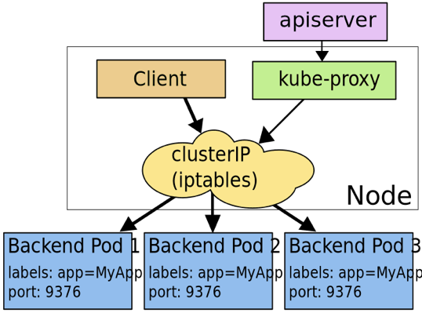

## 服务间调用

首先是东西向的流量调用，即服务间调用。这部分主要包括两种调用方式，即 clusterIp 模式以及 dns 模式。

clusterIp 是 service 的一种类型，在这种类型模式下，kube-proxy 通过 iptables/ipvs 为 service 实现了一种 VIP(虚拟 ip)的形式。只需要访问该 VIP，即可负载均衡地访问到 service 背后的 pod。

上图是 clusterIp 的一种实现方式，此外还包括 userSpace 代理模式(基本不用)，以及 ipvs 模式(性能更好)。

dns 模式很好理解，对 clusterIp 模式的 service 来说，它有一个 A 记录是 `service-name.namespace-name.svc.cluster.local`，指向 clusterIp 地址。所以一般使用过程中，我们直接调用 service-name 即可。

## 服务外访问

南北向的流量，即外部请求访问 kubernetes 集群，主要包括三种方式：nodePort、loadbalancer、ingress。

nodePort 同样是 service 的一种类型，通过 iptables 赋予了调用宿主机上的特定 port 就能访问到背后 service 的能力。

loadbalancer 则是另一种 service 类型，通过公有云提供的负载均衡器实现。

我们访问 100 个服务可能需要创建 100 个 nodePort/loadbalancer。我们希望通过一个统一的外部接入层访问内部 kubernetes 集群，这就是 ingress 的功能。ingress 提供了统一接入层，通过路由规则的不同匹配到后端不同的 service 上。ingress 可以看做是”service 的 service”。ingress 在实现上往往结合 nodePort 以及 loadbalancer 完成功能。
