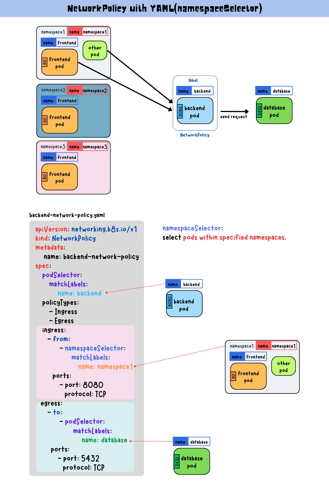
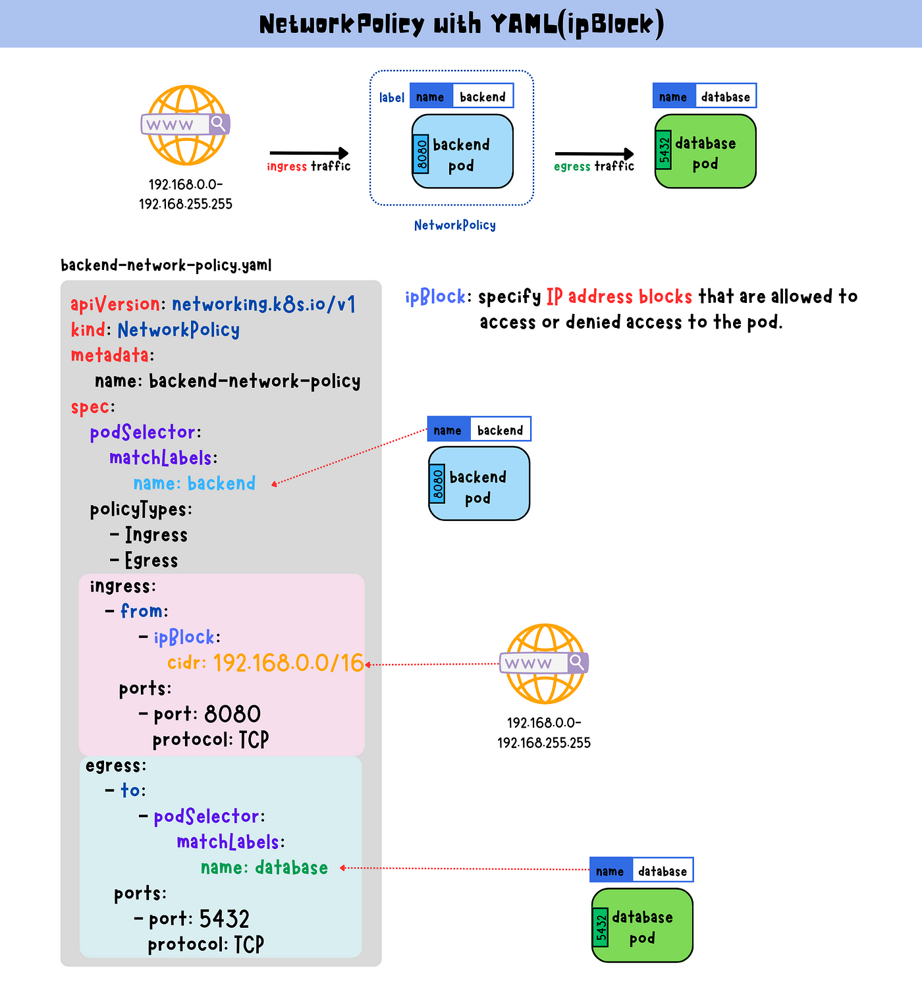

## NetworkPolicy 简介

如果希望在 IP 地址或端口层面（OSI 第 3 层或第 4 层）控制网络流量， 则可以考虑为集群中特定应用使用 Kubernetes 网络策略（NetworkPolicy）


NetworkPolicy 是一种以应用为中心的结构，允许设置如何允许 Pod 与网络上的各类网络“实体” 通信

Pod 可以通信的 Pod 是通过如下三个标识符的组合来辩识的：

1. 其他被允许的 Pods（例外：Pod 无法阻塞对自身的访问）
2. 被允许的名字空间
3. IP 组块（例外：与 Pod 运行所在的节点的通信总是被允许的， 无论 Pod 或节点的 IP 地址）


## 前置条件

网络策略通过网络插件来实现

要使用网络策略，必须使用支持 NetworkPolicy 的网络解决方案

创建一个 NetworkPolicy 资源对象而没有控制器来使它生效的话，是没有任何作用的

## NetworkPolicy 配置详解

说明：除非选择支持网络策略的网络解决方案，否则将发送到 API 服务器没有任何效果

NetworkPolicy 是一个 Kubernetes 对象，它允许使用 IP 地址、端口、协议和标签等各种因素创建策略来限制命名空间中 pod 与外部实体之间的通信

```yaml
apiVersion: networking.k8s.io/v1
kind: NetworkPolicy
metadata:
  name: test-network-policy
  namespace: default
spec:
  podSelector:
    matchLabels:
      role: db
  policyTypes:
  - Ingress
  - Egress
  ingress:
  - from:
    - ipBlock:
        cidr: 172.17.0.0/16
        except:
        - 172.17.1.0/24
    - namespaceSelector:
        matchLabels:
          project: myproject
    - podSelector:
        matchLabels:
          role: frontend
    ports:
    - protocol: TCP
      port: 6379
  egress:
  - to:
    - ipBlock:
        cidr: 10.0.0.0/24
    ports:
    - protocol: TCP
      port: 5978

```

在定义基于 Pod 或名字空间的 NetworkPolicy 时，会使用选择算符来设定哪些流量可以进入或离开与该算符匹配的 Pod

同时，当基于 IP 的 NetworkPolicy 被创建时，基于 IP 组块（CIDR 范围） 来定义策略


### Pod 隔离的两种类型

`ingress`部分定义**流入流量规则**，而该`egress`部分定义**流出流量规则**

- 入口流量是指定向到Kubernetes 集群中的一个 Pod 或一组 Pod 的传入网络流量。例如，如果集群外部的用户向集群内的 Pod 发送请求，则该流量将被视为该 Pod 的入口流量
- 出口流量是指 Kubernetes 集群中一个或一组 pod 的传出网络流量。例如，如果集群中的 Pod 向集群外部的服务或外部端点发送请求，则该流量将被视为来自该 Pod 的出口流量

Pod 有两种隔离

- 出口的隔离
- 入口的隔离

它们涉及到可以建立哪些连接。这里的“隔离”不是绝对的，而是意味着“有一些限制”。另外的，“非隔离方向”意味着在所述方向上没有限制。这两种隔离（或不隔离）是独立声明的， 并且都与从一个 Pod 到另一个 Pod 的连接有关。

- 默认情况下，一个 Pod 的出口是非隔离的，即所有外向连接都是被允许的。如果有任何的 NetworkPolicy 选择该 Pod 并在其 policyTypes 中包含 “Egress”，则该 Pod 是出口隔离的， 称这样的策略适用于该 Pod 的出口。当一个 Pod 的出口被隔离时， 唯一允许的来自 Pod 的连接是适用于出口的 Pod 的某个 NetworkPolicy 的 egress 列表所允许的连接。这些 egress 列表的效果是相加的。

- 默认情况下，一个 Pod 对入口是非隔离的，即所有入站连接都是被允许的。如果有任何的 NetworkPolicy 选择该 Pod 并在其 policyTypes 中包含 “Ingress”，则该 Pod 被隔离入口， 称这种策略适用于该 Pod 的入口。当一个 Pod 的入口被隔离时，唯一允许进入该 Pod 的连接是来自该 Pod 节点的连接和适用于入口的 Pod 的某个 NetworkPolicy 的 ingress 列表所允许的连接。这些 ingress 列表的效果是相加的。

网络策略是相加的，所以不会产生冲突。如果策略适用于 Pod 某一特定方向的流量，Pod 在对应方向所允许的连接是适用的网络策略所允许的集合。因此，评估的顺序不影响策略的结果

要允许从源 Pod 到目的 Pod 的连接，源 Pod 的出口策略和目的 Pod 的入口策略都需要允许连接。如果任何一方不允许连接，建立连接将会失败

### 完整配置

- 必需字段：与所有其他的 Kubernetes 配置一样，NetworkPolicy 需要 apiVersion、 kind 和 metadata 字段

- spec：NetworkPolicy 规约中包含了在一个名字空间中定义特定网络策略所需的所有信息

  - podSelector：每个 NetworkPolicy 都包括一个 podSelector，它对该策略所 适用的一组 Pod 进行选择。示例中的策略选择带有 "role=db" 标签的 Pod。空的 podSelector 选择名字空间下的所有 Pod

  - policyTypes: 每个 NetworkPolicy 都包含一个 policyTypes 列表，其中包含 Ingress 或 Egress 或两者兼具。policyTypes 字段表示给定的策略是应用于 进入所选 Pod 的入站流量还是来自所选 Pod 的出站流量，或两者兼有。如果 NetworkPolicy 未指定 policyTypes 则默认情况下始终设置 Ingress；如果 NetworkPolicy 有任何出口规则的话则设置 Egress

  - ingress: 每个 NetworkPolicy 可包含一个 ingress 规则的白名单列表

    每个规则都允许同时匹配 from 和 ports 部分的流量。示例策略中包含一条简单的规则：它匹配某个特定端口，来自三个来源中的一个，第一个通过 ipBlock 指定，第二个通过 namespaceSelector 指定，第三个通过 podSelector 指定

  - egress: 每个 NetworkPolicy 可包含一个 egress 规则的白名单列表

    每个规则都允许匹配 to 和 port 部分的流量。该示例策略包含一条规则，该规则将指定端口上的流量匹配到 10.0.0.0/24 中的任何目的地

所以，该网络策略示例:

1. 隔离 "default" 名字空间下 "role=db" 的 Pod （如果它们不是已经被隔离的话）

2. （Ingress 规则）允许以下 Pod 连接到 "default" 名字空间下的带有 "role=db" 标签的所有 Pod 的 6379 TCP 端口：

3. - "default" 名字空间下带有 "role=frontend" 标签的所有 Pod
   - 带有 "project=myproject" 标签的所有名字空间中的 Pod
   - IP 地址范围为 172.17.0.0–172.17.0.255 和 172.17.2.0–172.17.255.255 （即，除了 172.17.1.0/24 之外的所有 172.17.0.0/16）

4. （Egress 规则）允许从带有 "role=db" 标签的名字空间下的任何 Pod 到 CIDR 10.0.0.0/24 下 5978 TCP 端口的连接

`podSelector`字段根据标签选择 Pod，并确定策略适用于哪些 Pod


namespaceSelector 是一个允许选择特定名称空间并将网络策略规则应用于这些名称空间内的所有 pod 的字段



`ipBlock`选择器将选择特定的 IP CIDR 范围以用作入站流量来源或出站流量目的地。这些应该是集群外部 IP，因为 Pod IP 存在时间短暂的且随机产生



在配置网络策略时，有很多细节需要注意，比如上述的示例中，一段关于 ingress 的 from 配置：

```yaml
 - from:
    - ipBlock:
        cidr: 172.17.0.0/16
        except:
        - 172.17.1.0/24
    - namespaceSelector:
        matchLabels:
          project: myproject
    - podSelector:
        matchLabels:
          role: frontend
# namespaceSelector 和 podSelector 是或的关系，表示两个条件满足一个就可以

```

需要注意的是在 ipBlock、namespaceSelector 和 podSelector 前面都有一个 `-`，如果前面没有这个横杠将是另外一个完全不同的概念

可以看一下下面的示例：

```yaml
- from:
    - ipBlock:
        cidr: 172.17.0.0/16
        except:
        - 172.17.1.0/24
    - namespaceSelector:
        matchLabels:
          project: myproject
      podSelector:
        matchLabels:
          role: frontend
# namespaceSelector 和 podSelector 是并且的关系，表示两个条件都满足
```

此时的 namespaceSelector 有 “-”，podSelector 没有 “-”，那此时的配置，代表的含义是允许具有 `user=Alice` 标签的 Namespace 下，并且具有 `role=client` 标签的所有 Pod 访问，namespaceSelector 和 podSelector 是且的关系

```yaml
ingress:
  - from:
    - namespaceSelector:
        matchLabels:
          user: alice
    - podSelector:
        matchLabels:
          role: client
```

此时的 namespaceSelector 和 podSelector 都有“-”，配置的含义是允许具有 `user=Alice` 标签 的Namespace 下的所有 Pod 和当前 Namespace 下具有 `role=client` 标签的 Pod 访问，namespaceSelector 和 podSelector 是或的关系

在配置 ipBlock 时，可能也会出现差异性

因为在接收或者发送流量时，很有可能伴随着数据包中源 IP 和目标 IP 的重写，也就是 SNAT 和  DNAT，此时会造成流量的目标 IP 和源 IP 与配置的 ipBlock 出现了差异性，造成网络策略不生效，所以在配置 IPBlock 时，需要确认网络交换中是否存在源目地址转换

并且 IPBlock 最好不要配置 Pod的 IP，因为 Pod 发生重建时，它的 IP 地址一般就会发生变更，所以 IPBlock 一般用于配置集群的外部 IP

