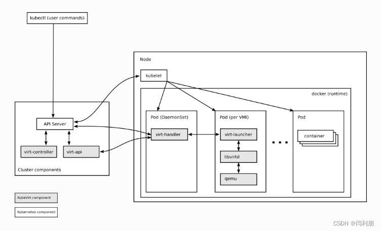
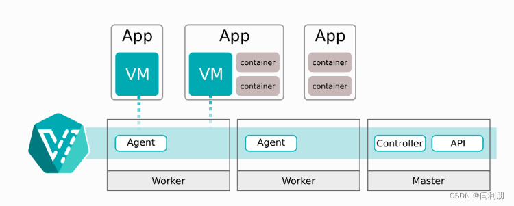

## KubeVirt 简介

Kubevirt 是 Redhat 开源一套以容器方式运行虚拟机的项目，通过 kubernetes 云原生来管理虚拟机生命周期。

KubeVirt 是一个 kubernetes 插件，在调度容器之余也可以调度传统的虚拟机。它通过使用自定义资源（CRD）和其它 Kubernetes 功能来无缝扩展现有的集群，以提供一组可用于管理虚拟机的虚拟化的 API。

官方：

- 官网：<https://kubevirt.io/>
- 文档：<https://kubevirt.io/user-guide/>
- GitHub 仓库：<https://github.com/kubevirt/kubevirt>

## Kubevirt 架构设计

### CRD 资源

kubevirt 主要实现了下面几种资源，以实现对虚拟机的管理：

- VirtualMachineInstance（VMI）

类似于kubernetes Pod，是管理虚拟机的最小资源。一个VirtualMachineInstance对象即表示一台正在运行的虚拟机实例，包含一个虚拟机所需要的各种配置。

- VirtualMachine（VM）

为集群内的 VirtualMachineInstance 提供管理功能，例如开机、关机、重启虚拟机，确保虚拟机实例的启动状态，与虚拟机实例是 `1:1` 的关系，类似与 `spec.replica` 为 1 的 StatefulSet。

- VirtualMachineInstanceReplicaSet

类似 ReplicaSet，可以启动指定数量的 VirtualMachineInstance，并且保证指定数量的 VirtualMachineInstance 运行，可以配置 HPA。

### 整体架构

Kubevirt 的整体架构：



 简化版：



## 磁盘和卷

虚拟机镜像（磁盘）是启动虚拟机必不可少的部分，KubeVirt 中提供多种方式的虚拟机磁盘，虚拟机镜像（磁盘）使用方式非常灵活。

这里列出几种比较常用的：

- PersistentVolumeClaim 

使用 PVC 做为后端存储，适用于数据持久化，即在虚拟机重启或者重建后数据依旧存在。使用的 PV 类型可以是 block 和 filesystem，使用 filesystem 时，会使用 PVC 上的 `/disk.img`，格式为 RAW 格式的文件作为硬盘。block 模式时，使用 block volume 直接作为原始块设备提供给虚拟机。

- ephemeral

基于后端存储在本地做一个写时复制（COW）镜像层，所有的写入都在本地存储的镜像中，VM 实例停止时写入层就被删除，后端存储上的镜像不变化。

- containerDisk

基于 scratch 构建的一个 docker image，镜像中包含虚拟机启动所需要的虚拟机镜像，可以将该 docker image push 到 registry，使用时从 registry 拉取镜像，直接使用 containerDisk 作为 VMI 磁盘，数据是无法持久化的。

- hostDisk

使用节点上的磁盘镜像，类似于 hostpath，也可以在初始化时创建空的镜像。

- dataVolume

提供在虚拟机启动流程中自动将虚拟机磁盘导入 pvc 的功能，在不使用 DataVolume 的情况下，用户必须先准备带有磁盘映像的 pvc，然后再将其分配给 VM 或 VMI。dataVolume 拉取镜像的来源可以时 http，对象存储，另一块 PVC 等。


## KubeVirt 安装

安装 libvirt 和 qemu 软件包

```bash
dnf install -y \
  qemu-kvm \
  libvirt virt-install virt-viewer \
  bridge-utils
```

检查是否满足安装需求：

```bash
> virt-host-validate qemu

  QEMU: Checking for hardware virtualization                                 : PASS
  QEMU: Checking if device /dev/kvm exists                                   : PASS
  QEMU: Checking if device /dev/kvm is accessible                            : PASS
  QEMU: Checking if device /dev/vhost-net exists                             : PASS
  QEMU: Checking if device /dev/net/tun exists                               : PASS
  QEMU: Checking for cgroup 'cpu' controller support                         : PASS
  QEMU: Checking for cgroup 'cpuacct' controller support                     : PASS
  QEMU: Checking for cgroup 'cpuset' controller support                      : PASS
  QEMU: Checking for cgroup 'memory' controller support                      : PASS
  QEMU: Checking for cgroup 'devices' controller support                     : PASS
  QEMU: Checking for cgroup 'blkio' controller support                       : PASS
  QEMU: Checking for device assignment IOMMU support                         : PASS
  QEMU: Checking if IOMMU is enabled by kernel                               : PASS
  QEMU: Checking for secure guest support                                    : WARN (Unknown if this platform has Secure Guest support)
```

处理：`No ACPI DMAR table found, IOMMU either disabled in BIOS or not supported by this hardware platform`

```bash
vim /etc/default/grub
# 添加：intel_iommu=on
# GRUB_CMDLINE_LINUX="... quiet intel_iommu=on"

# 重新生成 grub2 config 文件
> grub2-mkconfig -o /boot/grub2/grub.cfg

# 验证：
> dmesg | grep -e DMAR | grep -i iommu
```


## 参考资料

- <https://cloud.tencent.com/developer/article/1587640>
- <https://www.informaticar.net/setup-virtualization-on-red-hat-8/>
- <https://blog.csdn.net/BY_xiaopeng/article/details/124458361>
- <https://freewechat.com/a/MzI1OTY2MzMxOQ==/2247494070/1>
- 如何使用 Kubevirt 管理 Kubernetes 中的虚拟机 https://mp.weixin.qq.com/s/UFxPutqcuA19HsHtDsCeBQ
- kubevirt（一）虚拟化技术 <https://mp.weixin.qq.com/s?__biz=MzAwMDQyOTcwOA==&mid=2247485409&idx=1&sn=5a8990a27b56cc693490e9a9e172768f&chksm=9ae85c02ad9fd514b740178d3b78added9aa0f776b67156a0b0367e91a694e6fe4eb901d7d68&scene=178&cur_album_id=2573510573263667200#rd>
- kubevirt（二）实现原理 https://mp.weixin.qq.com/s?__biz=MzAwMDQyOTcwOA==&mid=2247485425&idx=1&sn=0bd289c71671b19b1db1651a4b646882&chksm=9ae85c12ad9fd50451f3c53427e2818e3d71ecbacecd2d0828f7601f3e49503c752cf0c4218a&scene=178&cur_album_id=2573510573263667200#rd
- kubevirt（三）迁移（migration）https://mp.weixin.qq.com/s/Wx7RSBlW23pVpHkvngkJMw
- kubevirt（四）热插拔卷（hotplug volume）https://mp.weixin.qq.com/s/z5chVax1m-m3e2JBs9rdUA