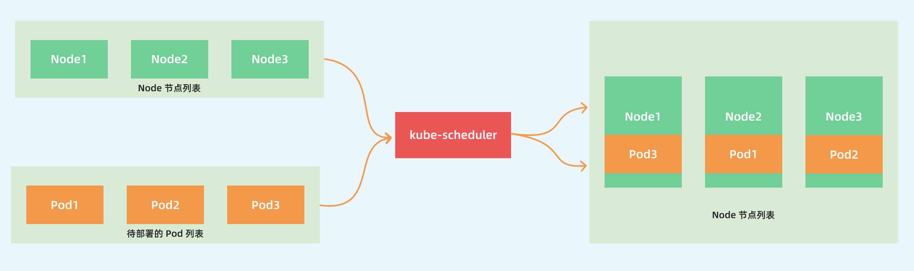

官方文档：

- 调度：<https://kubernetes.io/zh-cn/docs/concepts/scheduling-eviction/kube-scheduler/>

https://granulate.io/blog/a-deep-dive-into-kubernetes-scheduling/

https://www.infoq.cn/article/or7crphtdlx1ivhsfngk

https://www.cnblogs.com/zhangmingcheng/p/16324140.html

https://xie.infoq.cn/article/33fb565b66b825a9683abf864

https://kubernetes.io/zh-cn/docs/concepts/scheduling-eviction/pod-priority-preemption/

https://kubernetes.io/docs/concepts/scheduling-eviction/scheduler-perf-tuning/

https://kubernetes.io/docs/concepts/scheduling-eviction/assign-pod-node/#affinity-and-anti-affinity

https://www.infoq.cn/article/3S9hqoOX0mODAVyM0VH3?utm_source=related_read_bottom&utm_medium=article

https://www.qikqiak.com/k3s/scheduler/overview/

调度器配置：https://kubernetes.io/zh-cn/docs/reference/scheduling/config/

https://www.jianshu.com/p/91f4c8967a92

https://rx-m.com/kube-scheduler-kubecon-cloudnativecon-na-2021/

https://blog.csdn.net/i_want_to_be_a_god/article/details/106969992

http://www.iceyao.com.cn/post/2020-08-31-k8s-scheduler-framework/

https://qiankunli.github.io/2020/09/03/scheduler_score.html

Etcd 性能优化问题：https://www.infoq.cn/article/S4V2cmNeKE186mQmkPVJ

https://www.infoq.cn/article/or7crphtdlx1ivhsfngk

http://www.iceyao.com.cn/post/2020-08-31-k8s-scheduler-framework/

## 调度器

`kube-scheduler` 是 kubernetes 的核心组件之一

主要负责整个集群资源的调度功能，根据特定的调度算法和策略，将 Pod 调度到最优的工作节点上面去，从而更加合理、更加充分的利用集群的资源

这也是我们选择使用 kubernetes 一个非常重要的理由

## 源码

kubernetes 调度器的源码位于 

- Master 分支 <https://github.com/kubernetes/kubernetes/tree/master/pkg/scheduler>

- v1.25.5 分支 <https://github.com/kubernetes/kubernetes/tree/v1.25.5/pkg/scheduler>

其中 Scheduler 创建和运行的核心程序，对应的代码在

- Master 分支 <https://github.com/kubernetes/kubernetes/blob/master/pkg/scheduler/scheduler.go>
- v1.24.5 分支 <https://github.com/kubernetes/kubernetes/blob/v1.25.5/pkg/scheduler/scheduler.go>

如果要查看 `kube-scheduler` 的入口程序，对应的代码在：

- Master 分支 <https://github.com/kubernetes/kubernetes/blob/master/cmd/kube-scheduler/scheduler.go>

- v1.24.5 分支 <https://github.com/kubernetes/kubernetes/blob/v1.25.5/cmd/kube-scheduler/scheduler.go>

## 调度流程

### 调度 binding

`kube-scheduler` 的主要作用就是根据特定的调度算法和调度策略将 Pod 调度到合适的 Node 节点上去

启动之后会一直监听 API Server，获取到 `PodSpec.NodeName` 为空的 Pod，对每个 Pod 都会创建一个 binding

需要考虑的问题：

- 如何保证全部的节点调度的公平性？并不是所有节点资源配置一定都是一样的
- 如何保证每个节点都能被分配资源？
- 集群资源如何能够被高效利用？
- 集群资源如何才能被最大化使用？
- 如何保证 Pod 调度的性能和效率？
- 用户是否可以根据自己的实际需求定制自己的调度策略？

考虑到实际环境中的各种复杂情况，kubernetes 的调度器采用插件化的形式实现，可以方便用户进行定制或者二次开发，可以自定义一个调度器并以插件形式和 kubernetes 进行集成

### 调度的过滤和打分

调度主要分为以下几个部分：

- 首先是**预选过程**，过滤掉不满足条件的节点，这个过程称为 `Predicates`（过滤）
- 然后是**优选过程**，对通过的节点按照优先级排序，称之为 `Priorities`（打分）
- 最后从中选择优先级最高的节点，如果中间任何一步骤有错误，就直接返回错误

`Predicates` 阶段首先遍历全部节点，过滤掉不满足条件的节点，属于`强制性`规则，这一阶段输出的所有满足要求的节点将被记录并作为第二阶段的输入，如果所有的节点都不满足条件，那么 Pod 将会一直处于 Pending 状态，直到有节点满足条件，在这期间调度器会不断的重试。

所以我们在部署应用的时候，如果发现有 Pod 一直处于 Pending 状态，那么就是没有满足调度条件的节点，这个时候可以去检查下节点资源是否可用。

`Priorities` 阶段即再次对节点进行筛选，如果有多个节点都满足条件的话，那么系统会按照节点的优先级(`priorites`)大小对节点进行排序，最后选择优先级最高的节点来部署 Pod 应用。

### 调度 binding 完整流程

更详细的流程是这样的：

- 首先，客户端通过 API Server 的 REST API 或者 kubectl 工具创建 Pod 资源
- API Server 收到用户请求后，存储相关数据到 etcd 数据库中
- 调度器监听 API Server 查看到还未被调度(bind)的 Pod 列表，循环遍历地为每个 Pod 尝试分配节点，这个分配过程：
  - 预选阶段(Predicates)，过滤节点，调度器用一组规则过滤掉不符合要求的 Node 节点，比如 Pod 设置了资源的 request，那么可用资源比 Pod 需要的资源少的主机显然就会被过滤掉
  - 优选阶段(Priorities)，为节点的优先级打分，将上一阶段过滤出来的 Node 列表进行打分，调度器会考虑一些整体的优化策略，比如把 Deployment 控制的多个 Pod 副本尽量分布到不同的主机上，使用最低负载的主机等等策略
- 经过上面的阶段过滤后选择打分最高的 Node 节点和 Pod 进行 `binding` 操作，然后将结果存储到 etcd 中 最后被选择出来的 Node 节点对应的 kubelet 去执行创建 Pod 的相关操作（当然也是 watch APIServer 发现的）

## 调度框架

### 默认的调度器

目前调度器已经全部通过插件的方式实现了调度框架，默认开启的调度插件如以下代码所示：

