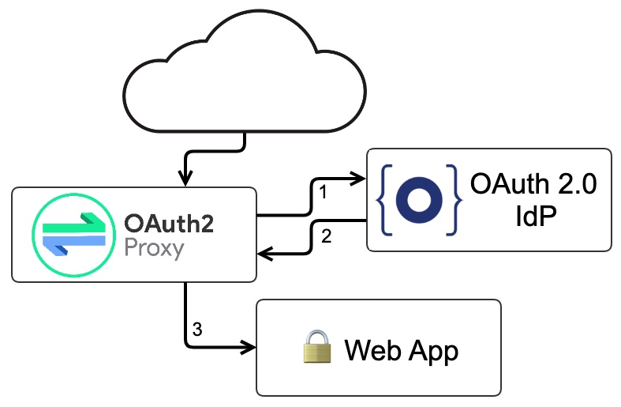

## 简介

一个反向代理，提供与 OpenID Connect 和更多身份提供者的身份验证

- GitHub 仓库地址

<https://github.com/oauth2-proxy/oauth2-proxy>

- 文档地址

<https://oauth2-proxy.github.io/oauth2-proxy/docs/>

有很多页面都是没有登录验证的，比如 prometheus，skywalking 等，这个时候就可以使用 oauth2-proxy 去添加验证，oauth2-proxy 本质是一个反向代理服务器，你可以直接把服务放到 oauth2-proxy 后面，或者在 nginx 之后放 oauth2-proxy 通过它来代理到你的服务中




支持对接的服务：

- [Google](https://oauth2-proxy.github.io/oauth2-proxy/docs/configuration/oauth_provider#google-auth-provider) *default*
- [Azure](https://oauth2-proxy.github.io/oauth2-proxy/docs/configuration/oauth_provider#azure-auth-provider)
- [ADFS](https://oauth2-proxy.github.io/oauth2-proxy/docs/configuration/oauth_provider#adfs-auth-provider)
- [Facebook](https://oauth2-proxy.github.io/oauth2-proxy/docs/configuration/oauth_provider#facebook-auth-provider)
- [GitHub](https://oauth2-proxy.github.io/oauth2-proxy/docs/configuration/oauth_provider#github-auth-provider)
- [Keycloak](https://oauth2-proxy.github.io/oauth2-proxy/docs/configuration/oauth_provider#keycloak-auth-provider)
- [GitLab](https://oauth2-proxy.github.io/oauth2-proxy/docs/configuration/oauth_provider#gitlab-auth-provider)
- [LinkedIn](https://oauth2-proxy.github.io/oauth2-proxy/docs/configuration/oauth_provider#linkedin-auth-provider)
- [Microsoft Azure AD](https://oauth2-proxy.github.io/oauth2-proxy/docs/configuration/oauth_provider#microsoft-azure-ad-provider)
- [OpenID Connect](https://oauth2-proxy.github.io/oauth2-proxy/docs/configuration/oauth_provider#openid-connect-provider)
- [login.gov](https://oauth2-proxy.github.io/oauth2-proxy/docs/configuration/oauth_provider#logingov-provider)
- [Nextcloud](https://oauth2-proxy.github.io/oauth2-proxy/docs/configuration/oauth_provider#nextcloud-provider)
- [DigitalOcean](https://oauth2-proxy.github.io/oauth2-proxy/docs/configuration/oauth_provider#digitalocean-auth-provider)
- [Bitbucket](https://oauth2-proxy.github.io/oauth2-proxy/docs/configuration/oauth_provider#bitbucket-auth-provider)
- [Gitea](https://oauth2-proxy.github.io/oauth2-proxy/docs/configuration/oauth_provider#gitea-auth-provider)

## OIDC 配置实例

```yaml
containers:
  - name: proxy
    image: 'quay.io/oauth2-proxy/oauth2-proxy:v7.3.0'
    imagePullPolicy: IfNotPresent
    command:
      - /bin/oauth2-proxy
    args:
      - '--http-address=0.0.0.0:4180'
      - '--metrics-address=0.0.0.0:44180'
      - '--upstream=http://localhost:80'
      - '--provider=oidc'
      - '--oidc-issuer-url=https://xxxx'
      - '--email-domain=*'
      - '--skip-provider-button=true'
      - '--ssl-insecure-skip-verify=true'
      - '--cookie-secure=false'
      - '--cookie-expire=24h0m0s'
      - >-
        --redirect-url=https://xxxx/portal/docs/oauth2/callback
    env:
      - name: OAUTH2_PROXY_CLIENT_ID
        value: <client-id>
      - name: OAUTH2_PROXY_CLIENT_SECRET
        value: <client-secret>
      - name: OAUTH2_PROXY_COOKIE_SECRET
        value: <cookie-secret>
    ports:
      - name: http
        containerPort: 4180
        protocol: TCP
      - name: metrics
        containerPort: 44180
        protocol: TCP
    resources:
      limits:
        cpu: 128m
        memory: 512Mi
      requests:
        cpu: 100m
        memory: 128Mi
    readinessProbe:
      tcpSocket:
        port: 4180
      initialDelaySeconds: 2
      timeoutSeconds: 2
      periodSeconds: 10
      successThreshold: 1
      failureThreshold: 3
    livenessProbe:
      tcpSocket:
        port: 4180
      initialDelaySeconds: 2
      timeoutSeconds: 2
      periodSeconds: 10
      successThreshold: 1
      failureThreshold: 3

```

由于 oauth 监听路径为 /oauth...

因此 ingress 还需要做 rewirte

```yaml
kind: Ingress
apiVersion: networking.k8s.io/v1
metadata:
  name: portal-docs
  namespace: aipaas-system
  labels:
    app.aipaas.io/instance: docs
    app.kubernetes.io/managed-by: Helm
    helm.sh/app-version: v1.0.0
    helm.sh/chart: chart-docs-5.11.1-master-322c98a3d523
    helm.sh/managed-by: Helm
  annotations:
    kubernetes.io/ingress.class: nginx
    nginx.ingress.kubernetes.io/proxy-body-size: 1024m
    # fix for: upstream sent too big header while reading response header from upstream
    nginx.ingress.kubernetes.io/proxy-buffer-size: 256k
    nginx.ingress.kubernetes.io/rewrite-target: /oauth2/$2
spec:
  rules:
    - host: xxxx
      http:
        paths:
          - path: /portal/docs/oauth2($|/)(.*)
            pathType: Prefix
            backend:
              service:
                name: docs
                port:
                  name: http

```
