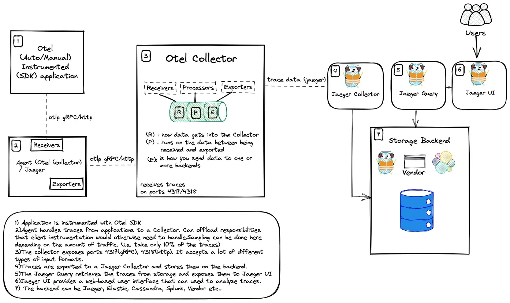
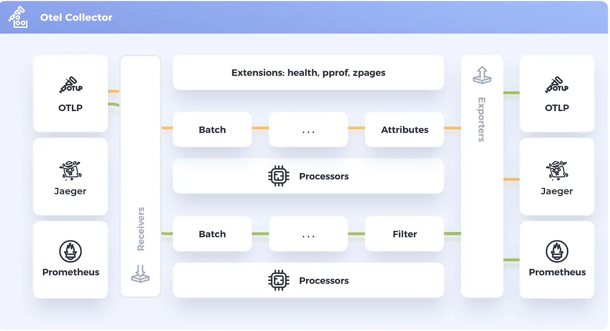
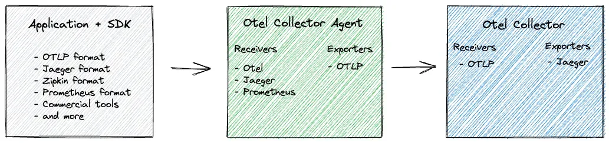
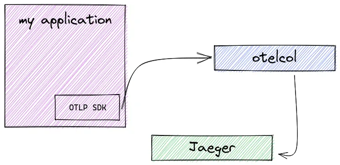
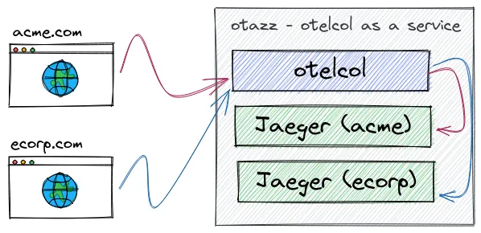

## OpenTelemetry

OpenTelemetry 可以用于从应用程序收集数据。它是一组工具、API 和 SDK 集合，可以使用它们来检测、生成、收集和导出遥测数据（指标、日志和追踪），以帮助分析应用的性能和行为


OpenTelemetry 是：

- 开源的
- 受到可观测领域行业领导者的采用和支持
- 一个 CNCF 项目
- 与供应商无关的

OpenTelemetry 包括可观测性的三个支柱：追踪、指标和日志

- **分布式追踪**是一种跟踪服务请求在分布式系统中从开始到结束的方法
- **指标**是对一段时间内活动的测量，以便了解系统或应用程序的性能
- **日志**是系统或应用程序在特定时间点发生的事件的文本记录

**OpenTelemetry 与供应商无关**

OpenTelemetry 提供了一个与供应商无关的**可观测性标准**，因为它旨在标准化跟踪的生成。通过 OpenTelemetry，可以将检测埋点与后端分离。这意味着不依赖于任何工具（或供应商）

不仅可以使用任何想要的编程语言，还可以挑选任何兼容的存储后端，从而避免被绑定在特定的商业供应商上面

开发人员可以检测他们的应用程序，而无需知道数据将存储在哪里

OpenTelemetry 提供了创建跟踪数据的工具，为了获取这些数据，首先需要检测应用程序来收集数据。为此，需要使用 **OpenTelemetry SDK**

## 检测（埋点）

应用程序的检测数据可以使用自动或手动（或混合）方式生成。 要使用 OpenTelemetry 检测应用程序，可以前往访问 OpenTelemetry 存储库，选择适用于的应用程序的语言，然后按照说明进行操作

### 自动检测

使用自动检测是一个很好的方式，因为它简单、容易，不需要进行很多代码更改

如果没有必要的知识（或时间）来创建适合你应用程序量身的追踪代码，那么这种方法就非常合适

当使用自动检测时，将创建一组预定义的 spans，并填充相关属性

### 手动检测

手动检测是指为应用程序编写特定的埋点代码。这是向应用程序添加可观测性代码的过程。这样做可以更有效地满足你的需求，因为可以自己添加属性和事件

这样做的缺点是需要导入库并自己完成所有工作



### 传播器

可以将 `W3C tracecontext`、`baggage` 和`b3` 等传播器（Propagators）添加到配置中

不同的传播器定义特定的行为规范，以便跨进程边界传播带上上下文数据

- `Trace Context`：用于在 HTTP headers 中编码 trace 数据，以便在不同的服务间传递这些数据
- `Baggage`：用于在 span 之间传递键值对数据，例如用户 ID、请求 ID 等
- `B3`：用于在 HTTP headers 中编码 trace 数据，以便在不同的服务间传递这些数据（主要用于 Zipkin 或其兼容的系统）

### 采样

采样是一种通过减少收集和发送到后端的追踪样本数量来控制 OpenTelemetry 引入的噪声和开销的机制

可以告诉 OpenTelemetry 根据要发送的追踪/流量的数量执行采样。（比如只采样 10% 的追踪数据）


两种常见的采样技术是

- 头采样
- 尾采样

## OpenTelemetry 协议（OTLP）

OpenTelemetry 协议（OTLP）规范描述了遥测数据在遥测源、收集器和遥测后端之间的编码、传输和传递机制

每种语言的 SDK 都提供了一个 OTLP 导出器，可以配置该导出器来通过 OTLP 导出数据。然后，OpenTelemetry SDK 会将事件转换为 OTLP 数据

OTLP 是代理（配置为导出器）和收集器（配置为接收器）之间的通信

## OpenTelemetry Collectors

应用程序的遥测数据可以发送到 OpenTelemetry Collectors 收集器



收集器是 OpenTelemetry 的一个组件，它接收遥测数据（span、metrics、logs 等），处理（预处理数据）并导出数据（将其发送到想要的通信后端）

### Receivers

接收器 Receivers 是数据进入收集器的方式，可以是推送或拉取。OpenTelemetry 收集器可以以多种格式接收遥测数据



以下是接收器在端口 4317(gRPC) 和 4318(http) 上接受 OTLP 数据的配置示例：

```yaml
otlp:
  protocols:
    http:
    grpc:
      endpoint: "0.0.0.0:4317"
```

同样下面的示例，它可以以 Jaeger Thrift HTTP 协议方式接收遥测数据

```yaml
jaeger: # Jaeger 协议接收器
  protocols: # 定义接收器支持的协议
    thrift_http: # 通过 Jaeger Thrift HTTP 协议接收数据
      endpoint: "0.0.0.0:14278"
```

### Processors

一旦接收到数据，收集器就可以处理数据。处理器在接收和导出之间处理数据

处理器是可选的，但有些是推荐的。比如 `batch` 处理器是非常推荐的。批处理器接收跨度、指标或日志，并将它们放入批次中。批处理有助于更好地压缩数据，减少传输数据所需的传出连接数量。该处理器支持基于大小和时间的批处理

```yaml
processors:
  batch:
```

需要注意的是配置处理器并不会启用它。需要通过 `service` 部分的 `pipelines` 启用

```yaml
service:
  pipelines:
    traces:
      receivers: [jaeger]
      processors: [batch]
      exporters: [zipkin]
```

### Exporters

为了可视化和分析遥测数据，还需要使用导出器。导出器是 OpenTelemetry 的一个组件，也是数据发送到不同系统/后端的方式。

比如 `console exporter` 是一种常见的导出器，对于开发和调试任务非常有用，他会将数据打印到控制台。

在 `exporters` 部分，可以添加更多目的地。例如，如果想将追踪数据发送到 Grafana Tempo，只需添加如下所示的配置：

```yaml
exporters:
  logging:
  otlp:
    endpoint: "<tempo_endpoint>"
    headers:
      authorization: Basic <api_token>
```

最终要生效也需要在 `service` 部分的 `pipelines` 中启用

```yaml
service:
  pipelines:
    traces:
      receivers: [otlp]
      processors: []
      exporters: [logging, otlp]
```

OpenTelemetry 附带了各种导出器，在 OpenTelemetry 收集器 Contrib 存储库中可以找到

### Extensions

扩展主要用于不涉及处理遥测数据的任务。比如健康监控、服务发现和数据转发等。扩展是可选的

```yaml
extensions:
  health_check:
  pprof:
  zpages:
  memory_ballast:
    size_mib: 512
```

## OpenTelemetry Collector 部署模式/策略

OpenTelemetry 收集器可以通过不同的方式进行部署

### Agent 模式

在这种情况下，OpenTelemetry 检测的应用程序将数据发送到与应用程序一起驻留的（收集器）代理。然后，该代理程序将接管并处理所有来自应用程序的追踪数据

收集器可以通过 sidecar 方式部署为代理，sidecar 可以配置为直接将数据发送到存储后端


### Gateway 模式

还可以决定将数据发送到另一个 OpenTelemetry 收集器，然后从（中心）收集器进一步将数据发送到存储后端。在这种配置中，有一个中心的 OpenTelemetry 收集器，它使用 `deployment` 模式部署，具有许多优势，如自动扩展


使用中心收集器的一些优点是：

- 消除对团队的依赖
- 强制执行批处理、重试、加密、压缩的配置/策略
- 在中心位置进行身份验证
- 丰富的元数据信息
- 进行抽样决策
- 通过 HPA 进行扩展

### 部署模式

采集器可以以三种不同的方式部署：

1. 作为 Kubernetes Deployment：这是默认选项，它允许采集器根据需要在节点之间移动，支持向上和向下扩展。
2. 作为 Kubernetes Daemonset：这个选项将在每个节点上部署一个采集器，当你想确保你的信号在没有任何网络开销的情况下被处理时，它可能很有用。
3. 作为一个 Sidecar：被注入到任何新的注释的 pod 中（使用 `sidecar.opentelemetry.io/inject: true`）。当采集器需要一个 pod 的特定配置时，这可能是很好的（例如，也许它需要一些专门的转换）。

可以混合和匹配这些收集器模式。例如，可以设置一个 sidecar，为部署中的 pod 做一些转换，然后将它们发送到一个全局收集器，与其他工作负载共享。

基本版 - 客户端使用 OTLP 进行检测，将数据发送到一组收集器



可以将数据发送到多个导出器


在 Kubernetes 上部署 OpenTelemetry Collector 时可以使用的模式

（1）sidecar 模式：


代理作为 sidecar，其中使用 OpenTelemetry Collector 将容器添加到工作负载 Pod。然后，该实例被配置为将数据发送到可能位于不同命名空间或集群中的外部收集器

（2）daemonset 模式：

Agent 作为 DaemonSet，这样每个 Kubernetes 节点就有一个代理 pod


负载均衡 - 基于 trace id 的负载均衡：


多集群 - 代理、工作负载和控制平面收集器：


### 多租户模式

两个租户，每个租户都有自己的 Jaeger



### 信号模式

两个收集器，每个收集器对应一种遥测数据类型


## OpenTelemetry 后端

OpenTelemetry 收集器并不提供自己的后端，所以可以使用任何供应商或开源产品

为了可视化和分析遥测数据，只需要在 OpenTelemetry 采集器种配置一个导出器，比如 Jaeger 就是一个非常流行的用于分析和查询数据的开源产品

```yaml
# exporters:
#   jaeger:
#     endpoint: "http://jaeger-collector.tracing.svc:14250"

exporters:
  "otlp/jaeger":
    endpoint: "http://jaeger-collector.tracing.svc:4317"
```

