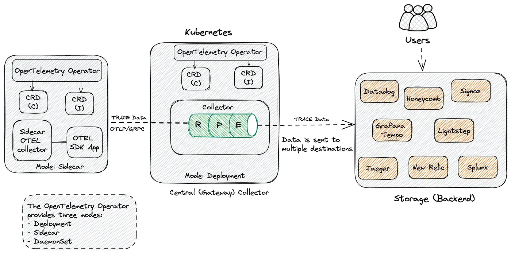

## OpenTelemetry Operator

在 Kubernetes 上使用 OpenTelemetry，主要就是部署 OpenTelemetry 收集器

建议使用 OpenTelemetry Operator 来部署，因为它可以帮助我们轻松部署和管理 OpenTelemetry 收集器，还可以自动检测应用程序

使用 Helm Chart 来部署 OpenTelemetry Operator，首先添加 Helm Chart 仓库：

```bash
helm repo add open-telemetry https://open-telemetry.github.io/opentelemetry-helm-charts

helm repo update
```

默认情况下会部署一个准入控制器，用于验证 OpenTelemetry Operator 的配置是否正确，为了使 APIServer 能够与 Webhook 组件进行通信，Webhook 需要一个由 APIServer 配置为可信任的 TLS 证书

OpenTelemetry 相关的 CRD：

```bash
> kubectl get crd |grep opentelemetry
```

## 中心 OpenTelemetry 收集器

然后我们这里选择使用中心 OpenTelemetry 收集器，并让其他 OpenTelemetry 代理将数据发送到该收集器。从代理接收的数据将在此收集器上进行处理，并通过导出器发送到存储后端。整个工作流如下图所示：



创建一个如下所示的 `OpenTelemetryCollector` 实例对象：

```yaml
# central-collector.yaml
apiVersion: opentelemetry.io/v1alpha1
kind: OpenTelemetryCollector
metadata:
  name: simplest
spec:
  config: |
    receivers:
      otlp:
        protocols:
          grpc:
          http:
    processors:
      memory_limiter:
        check_interval: 1s
        limit_percentage: 75
        spike_limit_percentage: 15
      batch:
        send_batch_size: 10000
        timeout: 10s

    exporters:
      logging:
      otlp:
        endpoint: "<tempo_endpoint>"
        headers:
          authorization: Basic <api_token> # echo -n "<your user id>:<your api key>" | base64

    service:
      pipelines:
        traces:
          receivers: [otlp]
          processors: [memory_limiter, batch]
          exporters: [logging, otlp]

```

在这里 OpenTelemetry Collector 通过 grpc 和 http 两种协议来接收遥测数据，并通过日志记录导出和 Grafana Tempo 来记录这些 Span，这会将 Span 写入接收 Span 的 OpenTelemetry Collector 实例的控制台和 Grafana Tempo 后端去

然后将使用 Sidecar 模式部署 OpenTelemetry 代理。该代理会将应用程序的追踪发送到中心（网关）OpenTelemetry 收集器

```yaml
# sidecar.yaml
apiVersion: opentelemetry.io/v1alpha1
kind: OpenTelemetryCollector
metadata:
  name: sidecar
spec:
  mode: sidecar
  config: |
    receivers:
      otlp:
        protocols:
          grpc:
          http:
    processors:
      batch:
    exporters:
      logging:
      otlp:
        endpoint: "<path_to_central_collector>.<namespace>:4317"
    service:
      telemetry:
        logs:
          level: "debug"
      pipelines:
        traces:
          receivers: [otlp]
          processors: []
          exporters: [logging, otlp]

```

## 自动检测

OpenTelemetry Operator 可以注入和配置 OpenTelemetry 自动检测库。目前支持 DotNet、Java、NodeJS、Python 和 Golang（需要手动开启）

要使用自动检测，需要为 SDK 和检测配置添加一个 `Instrumentation` 资源。比如对于 Java 应用程序，配置如下

```yaml
apiVersion: opentelemetry.io/v1alpha1
kind: Instrumentation
metadata:
  name: java-instrumentation
spec:
  propagators:
    - tracecontext
    - baggage
    - b3
  sampler:
    type: always_on
  java:
```

如果是 Python 应用程序，配置如下：

```yaml
apiVersion: opentelemetry.io/v1alpha1
kind: Instrumentation
metadata:
  name: python-instrumentation
spec:
  propagators:
    - tracecontext
    - baggage
    - b3
  sampler:
    type: always_on
  python:
```

要启用检测，需要更新部署文件并向其添加注解。通过这种方式，告诉 OpenTelemetry Operator 将 sidecar 和 java 工具注入到应用程序中

```yaml
annotations:
  instrumentation.opentelemetry.io/inject-java: "true"
  sidecar.opentelemetry.io/inject: "true"
```

