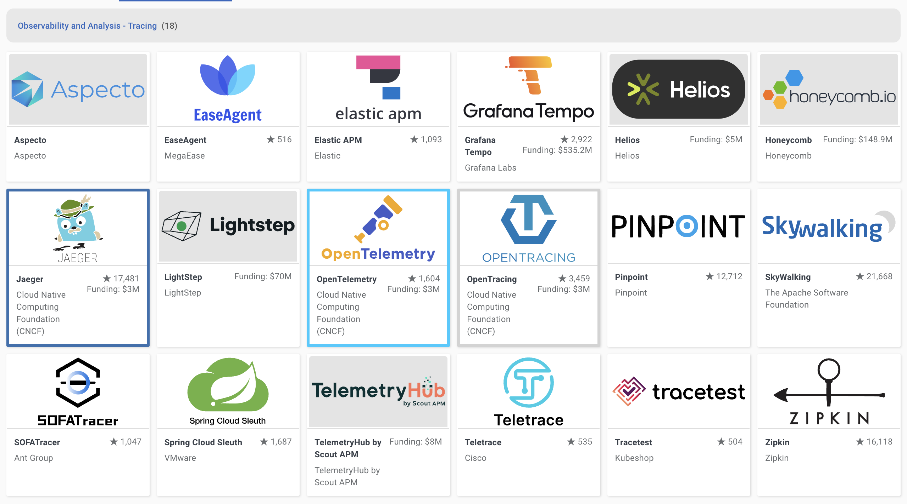

## 为什么需要追踪

假设你有一个如下所示的微服务架构

现在想象一下来自客户端的请求

从上面的架构图中可以看出，一个请求可能要经过几十个或几百个网络调用。这使得很难知道请求所经过的整个路径，如果只有日志和指标，那么故障排查会非常复杂

当应用出现问题时，需要解决很多问题，例如：

- 如何找出根本原因？
- 如何监视它所经过的所有服务？

分布式跟踪可以帮助查看整个请求过程中服务之间的交互，并可以让开发者深入了解系统中请求的整个生命周期。它帮助我们发现应用程序中的错误、瓶颈和性能问题

追踪从用户与应用程序进行交互的一刻开始，应该能够看到整个请求直到最后一层

跟踪数据（以 span 的形式）生成信息（元数据），可以帮助了解请求延迟或错误是如何发生的，以及它们对整个请求会产生什么样的影响

## 如何实现追踪

为了实现追踪，需要做以下几件事：

1. 检测应用程序
2. 收集和处理数据
3. 存储和可视化数据，以便可以查询它

