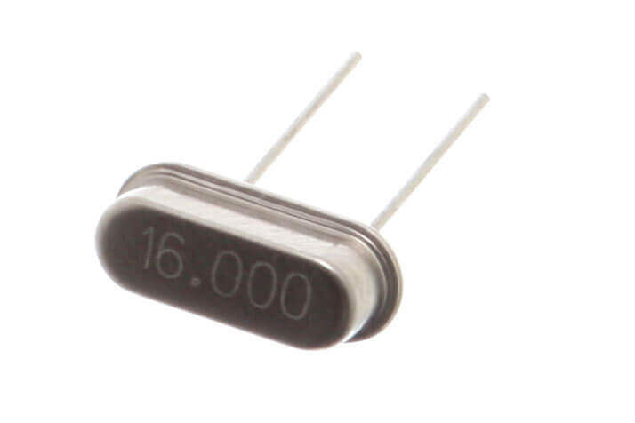
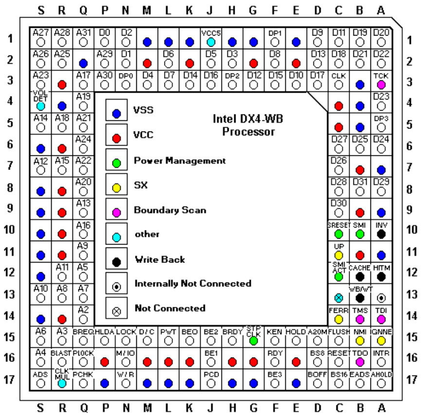
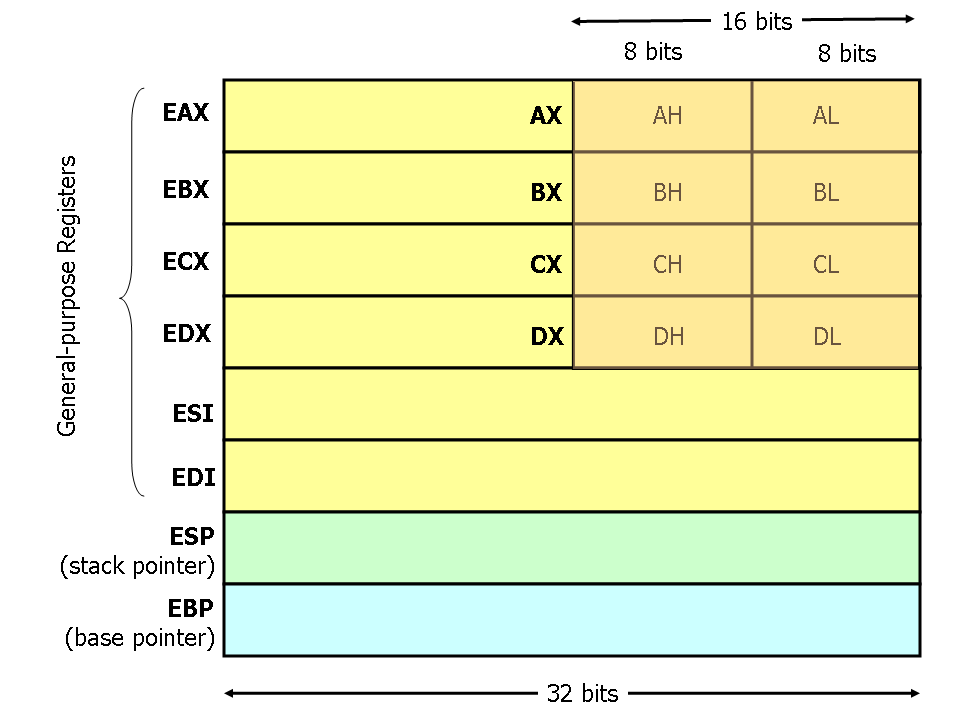
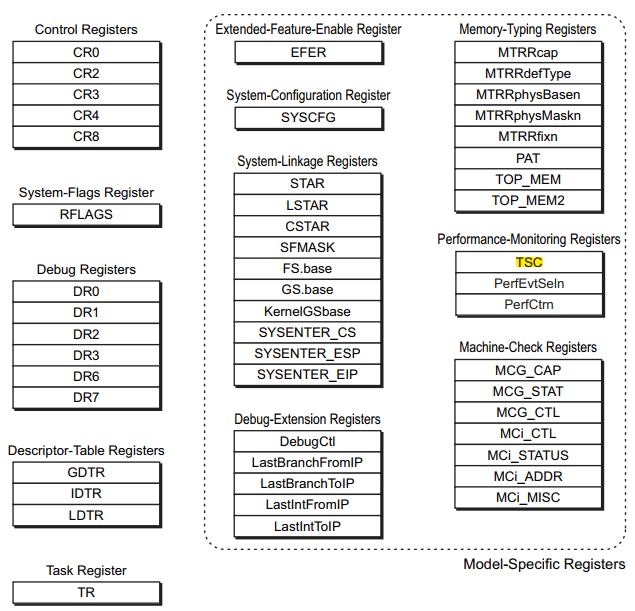

## 计算机组件的运行频率

### 时钟源

`~20MHz` 的石英晶体谐振器（quartz crystal resonator）

石英晶体谐振器是利用石英晶体（又称水晶）的压电效应 来产生高精度振荡频率的一种电子器件



受物理特性的限制，只有几十 MHz。

### Clock generator

针对不同部分（内存、PCIe、CPU 等）倍频

计算机的内存、PCIe 设备、CPU 等等组件需要的工作频率不一样（主要原因之一是其他组件跟不上 CPU 的频率）， 而且都远大于几十 MHz，因此需要对频率做提升

clock generator 是个专用芯片，也是焊在主板上，一般跟晶振挨着。


### CPU 频率是如何从 `~20MHz` 提升到 **`~3GHz`** 的

#### 传递路径：最终连接到 CPU `CLK` 引脚

结合上面的图，时钟信号的**传递/提升路径**：

1. 晶振（**`~20MHz`**）
2. 主板上的 clock generator 芯片
3. 北桥芯片
4. CPU

时钟信号连接到 CPU 的一个名为 CLK 的引脚。 两个具体的 CLK 引脚实物图：

- Intel 486 处理器（1989）：CLK 在第三行倒数第三列



- AMD SP3 CPU Socket (2017)：EPYC 7001/7002/7003 系列用的这种，见 [SP3 Pin Map](https://en.wikichip.org/wiki/amd/packages/socket_sp3#Pin_Map)。

#### CPU 内部：还有一个 clock generator

现代 CPU 内部一般还有一个 **`clock generator`**，可以继续提升频率， 最终达到厂商宣传里的基频（base frequency）或标称频率（nominal frequency），例如 EPYC 6543 的 2795MHz。 这跟原始晶振频率比，已经提升了上百倍。

## x86 架构的寄存器

### 通用目的寄存器



计算机执行的所有代码，几乎都是经由通用寄存器完成的

### 特殊目的寄存器

如名字所示，用于特殊目的，一般也需要配套的特殊指令读写。大致分为几类：

- control registers
- debug registers
- mode-specific registers (MSR)

MSR 是 x86 架构中的一组控制寄存器（control registers）， 设计用于 debugging/tracing/monitoring 等等目的

以下是 **`AMD`** 的一些系统寄存器， 其中就包括了 MSR 寄存器，来自 [AMD64 Architecture Programmer’s Manual, Volume 3 (PDF)](https://www.amd.com/content/dam/amd/en/documents/processor-tech-docs/programmer-references/24594.pdf)



几个相关的指令：

- **`RDMSR/WRMSR`** 指令：读写 MSR registers
- **`CPUID`** 指令：检查 CPU 是否支持某些特性

RDMSR/WRMSR 指令使用方式：

- 需要 priviledged 权限
- Linux `msr` 内核模块创建了一个伪文件 **`/dev/cpu/{id}/msr`**，用户可以读写这个文件
- 还有一个 `msr-tools` 工具包

### `MSR` 之一：`TSC`

MSR 中与时间有关的一个寄存器，叫 TSC (Time Stamp Counter)

## TSC（时间戳计数器）

### 本质：X86 处理器中的一个特殊寄存器

Time Stamp Counter (TSC) 是 X86 处理器 （Intel/AMD/…）中的一个 64-bit 特殊目的 寄存器，属于 MRS 的一种。 还是 AMD 编程手册中的图，可以看到 MSR 和 TSC 的关系：


在多核情况下（如今几乎都是多核了），每个物理核（processor）都有一个 TSC register， 或者说这是一个 per-processor register

### 作用：记录 cpu 启动以来累计的 **`cycles`** 数量

时钟信号经过层层提升之后，最终达到 CPU 期望的高运行频率，然后就会在这个频率上工作。

这里有个 CPU cycles（指令周期）的概念： 频率没经过一个周期（1Hz），CPU cycles 就增加 1 —— TSC 记录的就是从 CPU 启动（或重置）以来的累计 cycles。 这也呼应了它的名字：时间戳计数器

### 实际：经常被当做（高精度）时钟用

根据以上原理，如果 CPU 频率恒定且不存在 CPU 重置的话，

- TSC 记录的就是系统启动以来的 cycles 数量；
- cycles 可以精确换算成时间；
- 这个时间的精度还非常高；
- 使用开销还很低（这涉及到操作系统和内核实现）。

所以无怪乎 TSC 被大量用户空间程序当做开销地高精度的时钟。

本质上用户空间程序只需要一条指令（`RDTSC`），就能读取这个值。非常简单的几行代码：

```c
unsigned long long rdtsc() {
    unsigned int lo, hi;
    __asm__ volatile ("rdtsc" : "=a" (lo), "=d" (hi));
    return ((unsigned long long)hi << 32) | lo;
}
```

就能拿到当前时刻的 cpu cycles。所以统计耗时就很直接：

```bash
start = rdtsc();

// business logic here

end = rdtsc();
elapsed_seconds = (end-start) / cycles_per_sec;
```

以上的假设是 TSC 恒定，随着 wall time 均匀增加。

如果 CPU 频率恒定的话（也就是没有超频、节能之类的特殊配置），cycles 就是以恒定速率增加的， 这时 TSC 确实能跟时钟保持同步，所以可以作为一种获取时间或计时的方式。 但接下来会看到，cycles 恒定这个前提条件如今已经很难满足，内核也不推荐用 tsc 作为时间度量

乱序执行会导致 RDTSC 的执行顺序与期望的顺序发生偏差，导致计时不准，两种解决方式：

- 插入一个同步指令（a serializing instruction），例如 **`CPUID`**，强制前面的指令必现执行完，才能才执行 RDTSC；
- 使用一个变种指令 RDTSCP，但这个指令只是对指令流做了部分顺序化（partial serialization of the instruction stream），并不完全可靠。

### 挑战：TSC 的准确性越来越难以保证

如果一台机器只有一个处理器，并且工作频率也一直是稳定的，那拿 TSC 作为计时方式倒也没什么问题。 但随着下面这些技术的引入，TSC 作为时钟就不准了：

- 多核处理器：意味着每个核上都有一个 TSC，如何保持这些 TSC 寄存器值的严格同步；
- 不同处理器的温度差异也会导致 TSC 偏差；
- 超线程：一个处理器上两个硬件线程（Linux 中看就是两个 CPU）；
- 超频、降频等等功耗管理功能：导致时钟不再是稳定的；
- CPU 指令乱序执行功能：获取 TSC 的指令的执行顺序和预期的可能不一致，导致计时不准；
- 休眠状态：恢复到运行状态时重置 TSC；

### 改进：引入 constant/invariant TSC

解决方式之一，是一种称为**恒定速率**（constant rate） TSC 的技术，

- 在 Linux 中，可以通过 `cat /proc/cpuinfo | grep constant_tsc` 来判断；
- 有这个 flag 的 CPU，TSC 以 CPU 的标称频率（nominal frequency）累积；超频或功耗控制等等导致的实际 CPU 时钟频率变化，不会影响到 TSC。

较新的 Intel、AMD 处理器都支持这个特性。

但是，constant_tsc 只是表明 CPU 有提供恒定 TSC 的能力， 并不表示实际工作 TSC 就是恒定的

### 小结：**计数器**（counter），而非时钟（clock）

从上面的内容已经可以看出， TSC 如其名字“时间戳计数器”所说，确实本质上只是一个计数器， 记录的是 CPU 启动以来的 cpu cycles 次数。

虽然在很多情况下把它当时钟用，结果也是正确的，但这个是没有保证的，因为影响它稳定性的因素太多了 —— 不稳拿它计时也就不准了。

另外，它是一个 x86 架构的特殊寄存器，换了其他 cpu 架构可能就不支持，所以依赖 TSC 的代码可移植性会变差。

## 查看和监控 TSC 相关信息

### Linux 系统时钟源（`clocksource`）配置

不要把 tsc 作为时钟来看待，它只是一个计数器。但另一方面，内核确实需要一个时钟，

- 内核自己的定时器、调度、网络收发包等等需要时钟；
- 用户程序也需要时间功能，例如 **`gettimeofday() / clock_gettime()`**。

在底层，内核肯定是要基于启动以来的计数器，这时 tsc 就成为它的备选之一（而且优先级很高）。

```bash
# cat /sys/devices/system/clocksource/clocksource0/available_clocksource
tsc hpet acpi_pm

# cat /sys/devices/system/clocksource/clocksource0/current_clocksource
ts
```

`tsc`：优先

- 高精度：基于 cycles，所以精度是几个 GHz，对应 ns 级别；
- 低开销：跟内核实现有关

`hpet`：性能开销太大

- 相比 tsc，hpet 在很多场景会明显导致系统负载升高。所以能用 tsc 就不要用 hpet

### `turbostat` 查看实际 TSC 计数

`turbostat` 是 Linux 内核自带的一个工具，可以查看包括 TSC 在内的很多信息。

- <https://github.com/torvalds/linux/blob/v4.18/tools/power/x86/turbostat/turbostat.c>

不加任何参数时，turbostat 会 **`5s`** 打印一次统计信息

用精简模式，只打印每个 CPU 在过去 1s 的 TSC 频率和所有 CPU 的平均 TSC：

```bash
# sample 1s and only one time, print only per-CPU & average TSCs
turbostat --quiet --show CPU,TSC_MHz --interval 1 --num_iterations 1
```

但 `turbostat` 如果执行的时间非常短，比如 `1s`，统计到数据就不太准，偏差比较大； 持续运行一段时间后，得到的数据才比较准

### `rdtsc/rdtscp` 指令采集 TSC 计数

```c
#include <stdio.h>
#include <time.h>
#include <unistd.h>

// https://stackoverflow.com/questions/16862620/numa-get-current-node-core
unsigned long rdtscp(int *chip, int *core) {
    unsigned a, d, c;
    __asm__ volatile("rdtscp" : "=a" (a), "=d" (d), "=c" (c));

    *chip = (c & 0xFFF000)>>12;
    *core = c & 0xFFF;
    return ((unsigned long)a) | (((unsigned long)d) << 32);;
}

int main() {
    int sleep_us = 100000;
    unsigned long tsc_nominal_hz = 2795000000;
    unsigned long expected_inc = (unsigned long)(1.0 * sleep_us / 1000000 * tsc_nominal_hz);
    unsigned long low = (unsigned long)(expected_inc * 0.95);
    unsigned long high = (unsigned long)(expected_inc * 1.05);
    printf("Sleep interval: %d us, expected tsc increase range [%lu,%lu]\n", sleep_us, low, high);

    unsigned long start, delta;
    int start_chip=0, start_core=0, end_chip=0, end_core=0;

    while (1) {
        start = rdtscp(&start_chip, &start_core);
        usleep(sleep_us);
        delta = rdtscp(&end_chip, &end_core) - start;

        if (delta > high || delta < low) {
            time_t seconds = time(NULL); // seconds since Unix epoch (1970.1.1)
            struct tm t = *localtime(&seconds);
            printf("%02d-%02d %02d:%02d:%02d TSC jitter: %lu\n",
                    t.tm_mon + 1, t.tm_mday, t.tm_hour, t.tm_min, t.tm_sec, delta);
            fflush(stdout);
        }
    }

    return 0;
}
```

编译运行

```bash
gcc tsc-checker.c -o tsc-checker

# print to stdout and copy to a log file, using stream buffer instead of line buffers
stdbuf --output=L ./tsc-checker | tee tsc.log
```

可以看到这台机器（真实服务器）有偶发 TSC 抖动， 能偏离正常范围 `540272646/540000000 - 1 = 0.05049%`， 也就是说 100ms 的时间它能偏离 0.05ms。TSC 短时间连续抖动时， 机器就会出现各种奇怪现象，比如 load 升高、网络超时、活跃线程数增加等等，因为内核系统因为时钟抖动乱

## TSC 不稳定

flags 里面显式支持 `constant_tsc` 和 `nonstop_tsc`，所以按照文档的描述 TSC 应该是恒定的

不稳定有可能的原因：各厂商的 BIOS 逻辑，或者 SMI 中断风暴

### BIOS 设置致使 TSC 不恒定

TSC 可写，所以某些 BIOS 固件代码会修改 TSC 值，导致操作系统时序不同步（或者说不符合预期）。

恒定 TSC 特性只是说处理器提供了恒定的能力，但用不用这个能力，服务器厂商有非常大的决定权。

某些厂商的固件代码会在 TSC sync 逻辑中中修改 TSC 的值。 这种修改在固件这边没什么问题，但会破坏内核层面的时序视角，例如内核调度器工作会出问题。 因此，内核最后引入了一个 patch 来处理 ACPI suspend/resume，以保证 TSC sync 机制在操作系统层面还是正常的

<https://github.com/torvalds/linux/commit/cd7240c0b900eb6d690ccee088a6c9b46dae815a>

### SMI 中断风暴导致 TSC 不稳

BIOS SMI handler 通过修改 TSC 隐藏它们的执行。如果有大量这种中断（可能是有 bug）， 就会导致大量时间花在中断处理时，但又不会计入 TSC，最终导致系统出现卡顿等问题。

AMD 的机器看不到 SMI 统计

```bash
turbostat --quiet --show CPU,TSC_MHz,SMI --interval 1 --num_iterations 1
```

