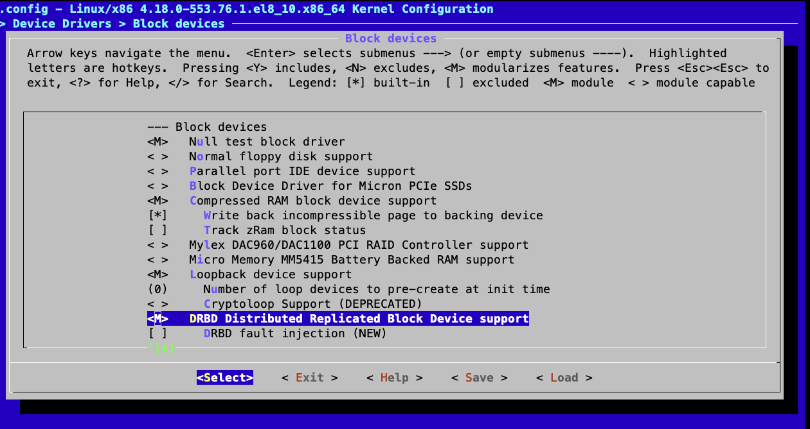

### 内核源码的 Kconfig

- Kconfig 文件主要是用来提供 menuconfig 菜单选项的。
- Makefile 文件用于源码编译的。

以下几个文件进行分析：

- `/kernel/Makefile`
- `/kernel/Kconfig`
- `/kernel/drivers/Makefile`
- `/kernel/drivers/Kconfig`
- `/kernel/drivers/char/Makefile`
- `/kernel/drivers/char/Kconfig`
- `/kernel/drivers/tty/Makefile`
- `/kernel/drivers/tty/Kconfig`

Kconfig 调用关系，简化后可以表示成：

```
kernel
  ├── drivers
  |    ├── char
  |    |    ├── Makefile
  |    |    └── Kconfig ─────┐  <────┐
  |    ├── tty               |       |
  |    |    ├── Makefile     |(3)    |(2)
  |    |    └── Kconfig <────┘       |
  |    ├── Makefile                  |
  |    └── Kconfig <────┐ ───────────┘
  ├── Makefile          |(1)
  └── Kconfig ──────────┘
```

下面以源码目录为例

`Kconfig`

```
…… source "drivers/Kconfig" …… 
```

`drivers/Kconfig`

```
# SPDX-License-Identifier: GPL-2.0 menu "Device Drivers" …… source "drivers/char/Kconfig" …… 
```

`drivers/char/Kconfig`

```
…… menu "Character devices" source "drivers/tty/Kconfig" …… 
```

`drivers/tty/Kconfig`

```
# SPDX-License-Identifier: GPL-2.0
config TTY
    bool "Enable TTY" if EXPERT
    default y
    ---help---
    Allows you to remove TTY support which can save space, and
    blocks features that require TTY from inclusion in the kernel.
    TTY is required for any text terminals or serial port
    communication. Most users should leave this enabled.

if TTY

config VT
    bool "Virtual terminal" if EXPERT
    depends on !UML
    select INPUT
    default y
    ---help---
    ……
……

endif # TTY
```

## 编译

安装源码

```bash
dnf --enablerepo=devel localinstall kernel-4.18.0-553.77.1.el8_10.src.rpm
```

安装依赖

```bash
dnf --enablerepo=devel build-dep kernel
```

更新 Menuconfig

```bash
dnf install -y ncurses-devel

cd /usr/src/kernels/$(uname -r)
make menuconfig
```

勾选需要的驱动

- Y：将该功能编译进内核
- N：不将该功能编译进内核
- M：将该功能编译成可以动态加载到内核中的模块




保存退出

编译可能提示证书有误，直接不编译即可，将`CONFIG_SYSTEM_TRUSTED_KEYS`值改为空白，`CONFIG_MODULE_SIG_KEY`保持不变

根据 CPU 核数编译，例如：

```bash
make -j16 bzImage
# make -j$(nproc) bzImage
```

编译诶和模块

```bash
make -j16 modules
```

```bash
make modules_install   # 拷贝内核模块的 .ko 文件到 /lib/modules/ 下
make install           # 拷贝 initrd 和 bzImage 到 boot 目录下，并修改开机启动配置文件
reboot                 # 重启
```

