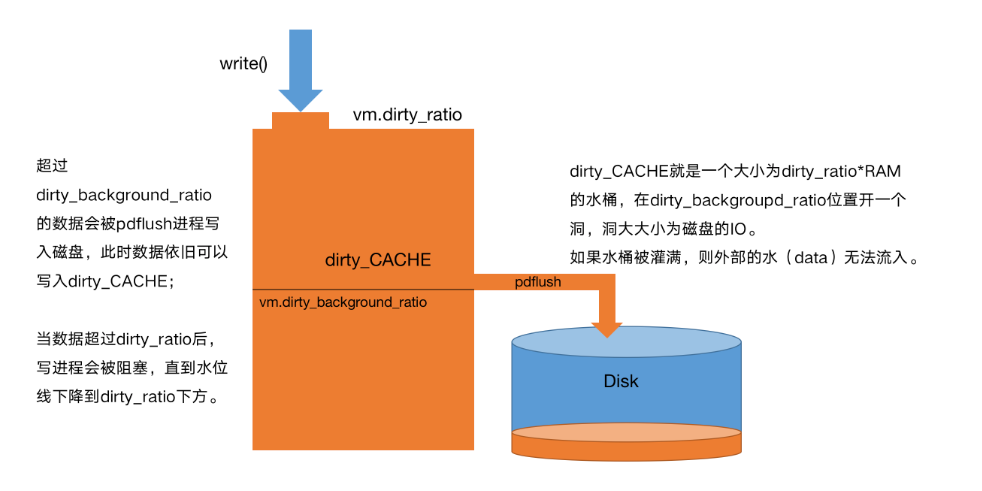

## 文件系统缓存

```bash
/proc/sys/vm/dirty_background_ratio
/proc/sys/vm/dirty_ratio

sysctl -a | grep dirty
```

`dirty_ratio` 是 Linux 内核中控制内存脏页回写机制

脏页（Dirty Pages）：应用程序修改内存中的数据后，未同步到磁盘的部分

先达到 `vm.dirty_background_ratio` 的条件然后触发 flush 进程进行异步的回写操作，但是这一过程中应用进程仍然可以进行写操作，如果多个应用进程写入的量大于 flush 进程刷出的量那自然会达到 vm.dirty_ratio 这个参数所设定的坎，此时操作系统会转入同步地处理脏页的过程，阻塞应用进程



- `vm.dirty_background_ratio` 

是内存可以填充脏数据的百分比。这些脏数据稍后会写入磁盘，`pdflush/flush/kdmflush`这些后台进程会稍后清理脏数据，将一定缓存的脏页异步地刷入外存。比如，我有 32G 内存，那么有 3.2G 的脏数据可以待着内存里，超过 3.2G 的话就会有后台进程来清理。

- `vm.dirty_ratio`

是可以用脏数据填充的绝对最大系统内存量，当系统到达此点时，必须将所有脏数据提交到磁盘，同时所有新的`I/O`块都会被阻塞，直到脏数据被写入磁盘。这通常是长`I/O`卡顿的原因，但这也是保证内存中不会存在过量脏数据的保护机制。

- `vm.dirty_background_bytes`和`vm.dirty_bytes`是另一种指定这些参数的方法。如果设置`_bytes`版本，则`_ratio`版本将变为 0，反之亦然。
- `vm.dirty_expire_centisecs` 

指定脏数据能存活的时间。当 `pdflush/flush/kdmflush` 在运行的时候，他们会检查是否有数据超过这个时限，如果有则会把它异步地写到磁盘中。毕竟数据在内存里待太久也会有丢失风险。

- `vm.dirty_writeback_centisecs` 

指定多长时间 `pdflush/flush/kdmflush` 这些进程会唤醒一次，然后检查是否有缓存需要清理。