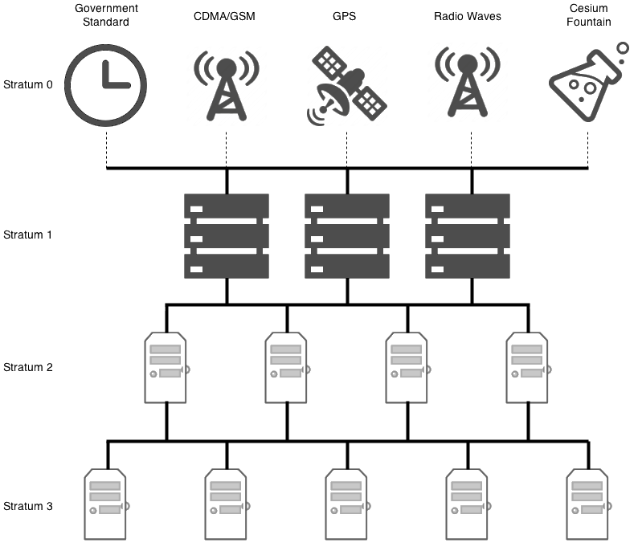
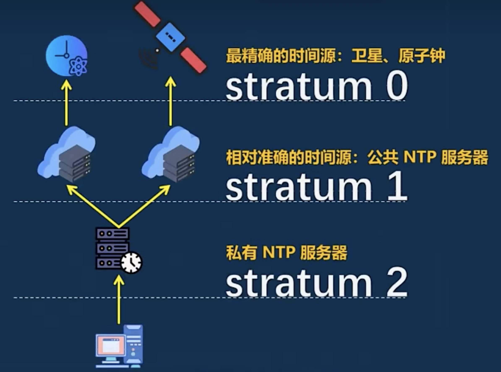
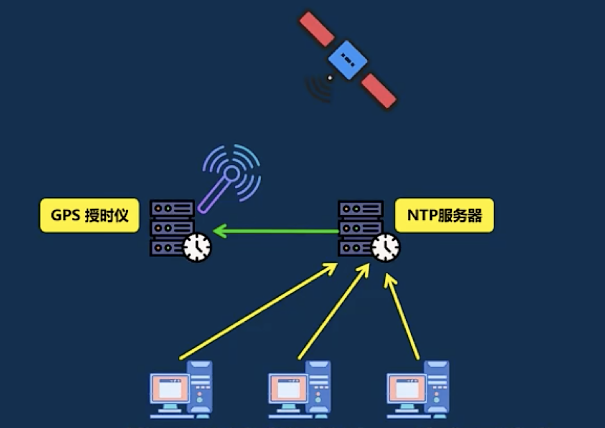
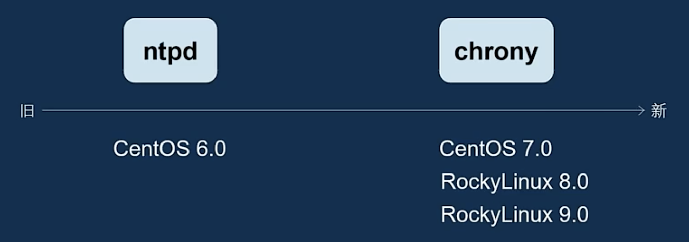
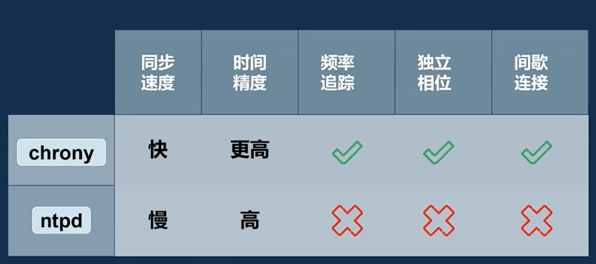

## NTP

网络时间协议 (Network Time Protocol, NTP) 是通过 RFC-1305 定义的时间同步协议，该协议基于 UDP 协议，使用端口号为 123；该协议用于在时间服务器和客户端之间同步时间，从而使网络内所有设备的时钟保持一致

NTP 时间同步是按照层级分发时间的（层数越低，对时精度越高）

## ntpd 对比 chrony

chrony 默认使用 323 UDP 端口

- <https://docs.redhat.com/en/documentation/red_hat_enterprise_linux/7/html/system_administrators_guide/ch-configuring_ntp_using_the_chrony_suite>

- <https://docs.fedoraproject.org/en-US/fedora/f40/system-administrators-guide/servers/Configuring_NTP_Using_the_chrony_Suite/#sect-differences_between_ntpd_and_chronyd>