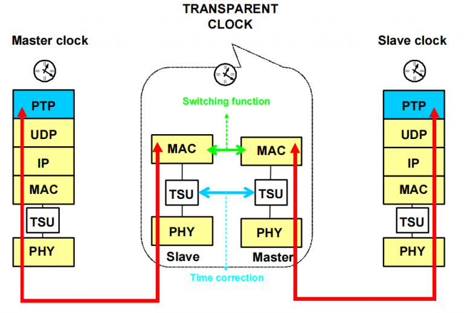

普通时钟指的是具有单个 PTP 端口的 PTP 时钟，它作为 PTP 网络中的一个节点运行，并且可以根据 BCM 算法在一个网段内选择作为主节点或从节点。 普通时钟是 PTP 网络中最常见的设备，因为它们通常用作网络中的终端节点，连接到需要同步的设备

透明时钟在 IEEE 1588 标准的第二版中得到了引入，作为优化级联拓扑结构的一种创新方法。与边界时钟不同，透明时钟并不扮演多端口普通时钟的角色，而是负责更新 PTP 事件消息中新引入的时间间隔字段。这一 64 位时间间隔校正字段的引入，使得交换延迟能够被补偿至小于 1 皮秒的潜在精度，从而显著提升了时间同步的精确性。