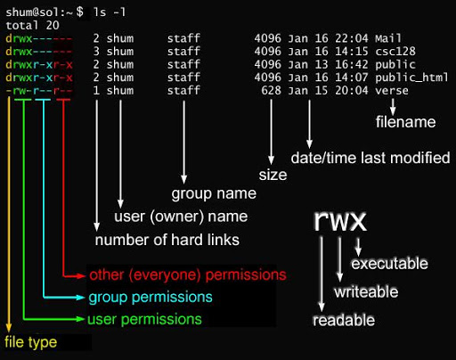
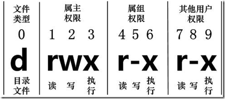
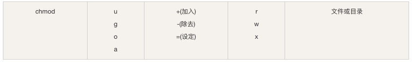

## 基础权限：rwx

在 Linux 中第一个字符代表这个文件是目录、文件或链接文件等等。

接下来的字符中，以三个为一组，且均为 **rwx** 的三个参数的组合。其中， **r** 代表可读(read)、 **w** 代表可写(write)、 **x** 代表可执行(execute)。 要注意的是，这三个权限的位置不会改变，如果没有权限，就会出现减号 **-** 而已。



每个文件的属性由左边第一部分的 10 个字符来确定



从左至右用 0-9 这些数字来表示。

- 第 0 位确定文件类型
- 第 1-3 位确定属主（该文件的所有者）拥有该文件的权限
- 第 4-6 位确定属组（所有者的同组用户）拥有该文件的权限
- 第 7-9 位确定其他用户拥有该文件的权限。

其中

- 第 1、4、7 位表示读权限，如果用 r 字符表示，则有读权限，如果用 - 字符表示，则没有读权限
- 第 2、5、8 位表示写权限，如果用 w 字符表示，则有写权限，如果用 - 字符表示没有写权限
- 第 3、6、9 位表示可执行权限，如果用 x 字符表示，则有执行权限，如果用 - 字符表示，则没有执行权限

文件的权限字符为： `-rwxrwxrwx` ， 这九个权限是三个三个一组。其中，可以使用数字来代表各个权限，各权限的分数对照表如下：

- r:4
- w:2
- x:1

每种身份(owner/group/others)各自的三个权限(r/w/x)分数是需要累加的，例如当权限为： `-rwxrwx---`分数则是：

- `owner = rwx = 4+2+1 = 7`
- `group = rwx = 4+2+1 = 7`
- `others= --- = 0+0+0 = 0`

九个权限分别是：

- user：用户
- group：组
- others：其他

那么就可以使用 u, g, o 来代表三种身份的权限。

此外， a 则代表 all，即全部的身份。

读写的权限可以写成 r, w, x，也就是可以使用下表的方式来看：



因此

```bash
 chmod u=rwx,g=rx,o=r test
```

修改权限的方式

```bash
# 修改权限的两种方式
# 方式一：数字法（推荐，精确控制）
chmod 644 config.yml      # rw-r--r--
chmod 755 script.sh       # rwxr-xr-x
chmod 600 .ssh/id_rsa     # rw------- (私钥必须是 600)

# 方式二：符号法（适合微调）
chmod u+x script.sh       # 给所有者加执行权限
chmod g-w config.yml      # 去掉组的写权限
chmod o= secret.txt       # 清空其他用户的所有权限
chmod a+r public.html     # 所有人加读权限
```

## 目录权限

目录权限和文件不太一样。目录权限含义：

- r - 可以列出目录内容（ls）
- w - 可以在目录中创建/删除文件
- x - 可以进入目录（cd）和访问目录中的文件

实验：创建测试目录

```bash
mkdir -p /tmp/perm_test && cd /tmp/perm_test
```

（1）场景 1：只有 r 没有 x

```bash
mkdir test_r && chmod 444 test_r
echo "hello" > test_r/file.txt 2>/dev/null  # 会失败
ls test_r/                                  # 能看到文件名，但看不到详情
cat test_r/file.txt                         # 失败，因为没有 x 权限
```

（2）场景 2：只有 x 没有 r

```bash
mkdir test_x && chmod 111 test_x
echo "hello" > test_x/file.txt
ls test_x/                                    # 失败，不能列目录
cat test_x/file.txt                           # 成功，知道文件名就能访问
```

生产环境常用配置

```bash
chmod 755 /var/www/html      # Web 目录，所有人可读可进入
chmod 750 /app/config        # 配置目录，组内可读，其他人禁止
chmod 700 /root/.ssh         # SSH 目录，仅所有者可访问
```

## 特殊权限

（1）SUID (Set User ID)

数字表示：`4xxx`，执行文件时，临时获得文件所有者的权限

典型例子：passwd 命令需要修改 `/etc/shadow`，普通用户执行时临时获得 root 权限

```bash
ls -la /usr/bin/passwd
# -rwsr-xr-x 1 root root 68208 Mar 14 2023 /usr/bin/passwd
#    ^-- 注意这个 s，表示设置了 SUID
```

设置 SUID

```bash
chmod u+s /usr/local/bin/myapp
chmod 4755 /usr/local/bin/myapp
```

（2）SGID (Set Group ID) 

数字表示：`2xxx`。对文件：执行时临时获得文件所属组的权限；对目录：在该目录下创建的文件自动继承目录的所属组

```bash
# 团队共享目录配置
mkdir -p /data/team_project
chown root:developers /data/team_project
chmod 2775 /data/team_project

# 现在 developers 组的成员在这里创建的文件，所属组都是 developers
```

（3）Sticky Bit

数字表示：`1xxx`。只对目录有效：目录中的文件只能被文件所有者或 root 删除

典型例子：/tmp 目录

```bash
ls -ld /tmp
# drwxrwxrwt 15 root root 4096 Jan 20 10:00 /tmp
#          ^-- 注意这个 t，表示设置了 Sticky Bit
```

设置 Sticky Bit

```bash
chmod +t /data/shared
chmod 1777 /data/shared
```

## 文件所有权

chown 和 chgrp

```bash
# 修改所有者
chown nginx /var/www/html/index.html

# 修改所有者和所属组
chown nginx:www-data /var/www/html/index.html

# 只修改所属组
chgrp www-data /var/www/html/index.html
# 或者
chown :www-data /var/www/html/index.html

# 递归修改（谨慎使用）
chown -R nginx:www-data /var/www/html/

# 只修改符合条件的文件（更安全的做法）
find /var/www/html -type f -exec chown nginx:www-data {} \;
find /var/www/html -type d -exec chown nginx:www-data {} \;

# 参考符号链接的目标（默认不跟随）
chown -h nginx:www-data /var/www/html/link  # 修改链接本身
chown nginx:www-data /var/www/html/link     # 修改链接指向的文件
```

## ACL：细粒度权限控制

传统的 rwx 权限有个致命缺陷：只能设置一个所有者和一个所属组。如果你想让用户 A 有读写权限，用户 B 只有读权限，用户 C 完全没权限，传统权限就搞不定了。这时候 ACL 就派上用场了。

```bash
# 查看文件的 ACL
getfacl /data/project/config.yml

# 输出示例：
# file: data/project/config.yml
# owner: root
# group: developers
# user::rw-
# user:alice:rw-        # alice 用户有读写权限
# user:bob:r--          # bob 用户只有读权限
# group::r--
# group:ops:rw-         # ops 组有读写权限
# mask::rw-
# other::---

# 设置用户 ACL
setfacl -m u:alice:rw /data/project/config.yml    # 给 alice 读写权限
setfacl -m u:bob:r /data/project/config.yml       # 给 bob 只读权限

# 设置组 ACL
setfacl -m g:ops:rw /data/project/config.yml      # 给 ops 组读写权限

# 删除特定 ACL
setfacl -x u:alice /data/project/config.yml       # 删除 alice 的 ACL
setfacl -x g:ops /data/project/config.yml         # 删除 ops 组的 ACL

# 删除所有 ACL（恢复到传统权限）
setfacl -b /data/project/config.yml

# 递归设置 ACL
setfacl -R -m u:alice:rwX /data/project/          # X 表示仅对目录设置执行权限

# 设置默认 ACL（新创建的文件自动继承）
setfacl -d -m u:alice:rw /data/project/           # 目录下新文件自动给 alice 读写权限
setfacl -d -m g:developers:rwx /data/project/     # 目录下新文件自动给 developers 组全权限
```

ACL 的 mask 机制：这是个容易被忽略但很重要的概念。mask 定义了 ACL 权限的上限。

```bash
# 查看当前 mask
getfacl /data/project/config.yml | grep mask

# 设置 mask（限制所有 ACL 的最大权限）
setfacl -m m::r /data/project/config.yml
# 即使 alice 设置了 rw 权限，实际生效的也只有 r（被 mask 限制）

# 注意：chmod 会影响 mask
chmod 640 /data/project/config.yml
# 这会把 mask 设置为 r--，可能导致 ACL 权限失效
```

## 其他

### 文件扩展属性

有时候可能发现作为 root 居然无法对一些文件进行编辑或删除，除了系统中可能部署了一些防篡改的程序造成外，大部分情况是用 chattr 命令配置了该文件的一些扩展属性造成的

`chattr` 其中一些功能是由 Linux 内核版本来支持的，不过现在生产环境使用的 Linux kerne l版本应该都在 2.6 以上了。通过 `chattr` 命令修改文件系统属性能够提高系统的安全性，但是它并不适合所有的目录：`chattr` 命令不能保护 `/`、`/dev`、`/tmp`、`/var` 目录

lsattr命令是用来查看文件扩展属性的

#### chattr

 `chattr` 命令用于改变文件属性。

这项指令可改变存放在文件系统上的文件或目录属性，这些属性共有以下模式：

- `A` ：文件或目录的 atime (access time) 不可被修改 (modified)，可以有效预防例如电脑磁盘 I/O 错误的发生
- `j` ：即 journal，设定此参数使得当通过 `mount` 参数：`data=ordered` 或者 `data=writeback` 挂载的文件系统，文件在写入时会先被记录(在 journal 中)。如果 filesystem 被设定参数为 `data=journal`，则该参数自动失效。
- `a`（让文件或目录仅供附加用途）：即 append，设定该参数后，只能向文件中添加数据，而不能删除，多用于服务器日志文件安全，只有 root 才能设定这个属性
- `b`（不更新文件或目录的最后存取时间）：
- `c`（将文件或目录压缩后存放）：即compresse，设定文件是否经压缩后再存储。读取时需要经过自动解压操作
- `d`（将文件或目录排除在倾倒操作之外）：即 no dump，设定文件不能成为 dump 程序的备份目标
- `i`（不得任意更动文件或目录）：设定文件不能被删除、改名、设定链接关系，同时不能写入或新增内容。i 参数对于文件 系统的安全设置有很大帮助
- `s`（保密性删除文件或目录）：保密性地删除文件或目录，即硬盘空间被全部收回
- `S`（即时更新文件或目录）：硬盘 I/O 同步选项，功能类似 sync
- `u`（预防意外删除）：与s相反，当设定为u时，数据内容其实还存在磁盘中，可以用于undeletion

语法

```bash
chattr [-RV][-v<版本编号>][+/-/=<属性>][文件或目录...]
```

参数

- `-R` 递归处理，将指定目录下的所有文件及子目录一并处理
- `-v<版本编号>` 设置文件或目录版本
- `-V` 显示指令执行过程

mode 部分

- `+` ：在原有参数设定基础上，追加参数
- `-` ：在原有参数设定基础上，移除参数
- `=` ：更新为指定参数设定

#### lsattr

用 `chattr` 执行改变文件或目录的属性，可执行 `lsattr` 指令查询其属性