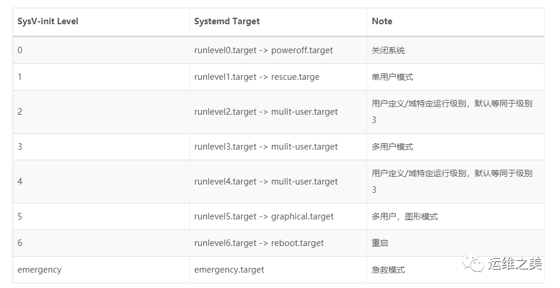

## Unit 文件结构

```ini
[Unit]
Description=Hello World
After=docker.service
Requires=docker.service

[Service]
TimeoutStartSec=0
ExecStartPre=-/usr/bin/docker kill busybox1
ExecStartPre=-/usr/bin/docker rm busybox1
ExecStartPre=/usr/bin/docker pull busybox
ExecStart=/usr/bin/docker run --name busybox1 busybox /bin/ sh -c "while true; do echo Hello World; sleep 1; done"
ExecStop="/usr/bin/docker stop busybox1"
ExecStopPost="/usr/bin/docker rm busybox1"

[Install]
WantedBy=multi-user.target
```

如所示，Systemd 服务的 Unit 文件可以分为三个配置区段：

- Unit 和 Install 段：所有 Unit 文件通用，用于配置服务（或其它系统资源）的描述、依赖和随系统启动的方式
- Service 段：服务（Service）类型的 Unit 文件（后缀为 .service）特有的，用于定义服务的具体管理和操作方法

## Unit 段

- Description：描述这个 Unit 文件的信息
- Documentation：指定服务的文档，可以是一个或多个文档的 URL 路径
- Requires：依赖的其它 Unit 列表，列在其中的 Unit 模板会在这个服务启动时的同时被启动。并且，如果其中任意一个服务启动失败，这个服务也会被终止
- Wants：与 Requires 相似，但只是在被配置的这个 Unit 启动时，触发启动列出的每个 Unit 模块，而不去考虑这些模板启动是否成功
- After：与 Requires 相似，但是在后面列出的所有模块全部启动完成以后，才会启动当前的服务
- Before：与 After 相反，在启动指定的任务一个模块之间，都会首先确证当前服务已经运行
- Binds To：与 Requires 相似，失败时失败，成功时成功，但是在这些模板中有任意一个出现意外结束或重启时，这个服务也会跟着终止或重启
- Part Of：一个 Bind To 作用的子集，仅在列出的任务模块失败或重启时，终止或重启当前服务，而不会随列出模板的启动而启动
- OnFailure：当这个模板启动失败时，就会自动启动列出的每个模块
- Conflicts：与这个模块有冲突的模块，如果列出的模块中有已经在运行的，这个服务就不能启动，反之亦然

## Install 段

这部分配置的目标模块通常是特定运行目标的 .target 文件，用来使得服务在系统启动时自动运行。这个区段可以包含三种启动约束：

- WantedBy：和 Unit 段的 Wants 作用相似，只有后面列出的不是服务所依赖的模块，而是依赖当前服务的模块。它的值是一个或多个 Target，当前 Unit 激活时（enable）符号链接会放入 /etc/systemd/system 目录下面以 <Target 名> + .wants 后缀构成的子目录中，如 “/etc/systemd/system/multi-user.target.wants/“

```
# find /etc/systemd/system/* -type d
/etc/systemd/system/default.target.wants
/etc/systemd/system/getty.target.wants
/etc/systemd/system/graphical.target.wants
/etc/systemd/system/multi-user.target.wants
/etc/systemd/system/network-online.target.wants
/etc/systemd/system/paths.target.wants
/etc/systemd/system/shutdown.target.wants
/etc/systemd/system/sockets.target.wants
/etc/systemd/system/sysinit.target.wants
/etc/systemd/system/timers.target.wants
```

- RequiredBy：和 Unit 段的 Wants 作用相似，只有后面列出的不是服务所依赖的模块，而是依赖当前服务的模块。它的值是一个或多个 Target，当前 Unit 激活时，符号链接会放入 /etc/systemd/system 目录下面以 <Target 名> + .required 后缀构成的子目录中
- Also：当前 Unit enable/disable 时，同时 enable/disable 的其他 Unit
- Alias：当前 Unit 可用于启动的别名

SysV-init 运行级别与 Systemd Target 对应的 Unit 文件



通过 systemctl list-units --type=target 命令可以获取当前正在使用的运行目标

```plain
# systemctl list-units --type=target
UNIT                   LOAD   ACTIVE SUB    DESCRIPTION
basic.target           loaded active active Basic System
cryptsetup.target      loaded active active Encrypted Volumes
getty.target           loaded active active Login Prompts
graphical.target       loaded active active Graphical Interface
local-fs-pre.target    loaded active active Local File Systems (Pre)
local-fs.target        loaded active active Local File Systems
multi-user.target      loaded active active Multi-User System
network-online.target  loaded active active Network is Online
network.target         loaded active active Network
nss-user-lookup.target loaded active active User and Group Name Lookups
paths.target           loaded active active Paths
remote-fs-pre.target   loaded active active Remote File Systems (Pre)
remote-fs.target       loaded active active Remote File Systems
slices.target          loaded active active Slices
sockets.target         loaded active active Sockets
sound.target           loaded active active Sound Card
swap.target            loaded active active Swap
sysinit.target         loaded active active System Initialization
time-sync.target       loaded active active System Time Synchronized
timers.target          loaded active active Timers
LOAD   = Reflects whether the unit definition was properly loaded.
ACTIVE = The high-level unit activation state, i.e. generalization of SUB.
SUB    = The low-level unit activation state, values depend on unit type.
20 loaded units listed. Pass --all to see loaded but inactive units, too.
To show all installed unit files use 'systemctl list-unit-files'.
```

## Service 段

用来 Service 的配置，只有 Service 类型的 Unit 才有这个区块。它的主要字段分为服务生命周期和服务上下文配置两个方面。

（1）服务生命周期控制相关

- Type：定义启动时的进程行为，它有以下几种值：
  - Type=simple：默认值，执行ExecStart指定的命令，启动主进程
  - Type=forking：以 fork 方式从父进程创建子进程，创建后父进程会立即退出
  - Type=oneshot：一次性进程，Systemd 会等当前服务退出，再继续往下执行
  - Type=dbus：当前服务通过D-Bus启动
  - Type=notify：当前服务启动完毕，会通知Systemd，再继续往下执行
  - Type=idle：若有其他任务执行完毕，当前服务才会运行
- RemainAfterExit：值为 true 或 false（默认）。当配置为 true 时，Systemd 只会负责启动服务进程，之后即便服务进程退出了，Systemd 也仍然会认为这个服务还在运行中。这个配置主要是提供给一些并非常驻内存，而是启动注册后立即退出，然后等待消息按需启动的特殊类型服务使用的。
- ExecStart：启动当前服务的命令
- ExecStartPre：启动当前服务之前执行的命令
- ExecStartPos：启动当前服务之后执行的命令
- ExecReload：重启当前服务时执行的命令
- ExecStop：停止当前服务时执行的命令
- ExecStopPost：停止当其服务之后执行的命令
- RestartSec：自动重启当前服务间隔的秒数
- Restart：定义何种情况 Systemd 会自动重启当前服务，可能的值包括 always（总是重启）、on-success、on-failure、on-abnormal、on-abort、on-watchdog
- TimeoutStartSec：启动服务时等待的秒数，这一配置对于使用 Docker 容器而言显得尤为重要，因其第一次运行时可能需要下载镜像，严重延时会容易被 Systemd 误判为启动失败杀死。通常，对于这种服务，将此值指定为 0，从而关闭超时检测
- TimeoutStopSec：停止服务时的等待秒数，如果超过这个时间仍然没有停止，Systemd 会使用 SIGKILL 信号强行杀死服务的进程

（2）服务上下文配置相关

- Environment：为服务指定环境变量
- EnvironmentFile：指定加载一个包含服务所需的环境变量的列表的文件，文件中的每一行都是一个环境变量的定义
- Nice：服务的进程优先级，值越小优先级越高，默认为 0。其中 -20 为最高优先级，19 为最低优先级
- WorkingDirectory：指定服务的工作目录
- RootDirectory：指定服务进程的根目录（/ 目录）。如果配置了这个参数，服务将无法访问指定目录以外的任何文件
- User：指定运行服务的用户
- Group：指定运行服务的用户组
- MountFlags：服务的 Mount Namespace 配置，会影响进程上下文中挂载点的信息，即服务是否会继承主机上已有挂载点，以及如果服务运行执行了挂载或卸载设备的操作，是否会真实地在主机上产生效果。可选值为 shared、slaved 或 private
  - shared：服务与主机共用一个 Mount Namespace，继承主机挂载点，且服务挂载或卸载设备会真实地反映到主机上
  - slave：服务使用独立的 Mount Namespace，它会继承主机挂载点，但服务对挂载点的操作只有在自己的 Namespace 内生效，不会反映到主机上
  - private：服务使用独立的 Mount Namespace，它在启动时没有任何任何挂载点，服务对挂载点的操作也不会反映到主机上
- LimitCPU / LimitSTACK / LimitNOFILE / LimitNPROC 等：限制特定服务的系统资源量，例如 CPU、程序堆栈、文件句柄数量、子进程数量等

注意：如果在 ExecStart、ExecStop 等属性中使用了 Linux 命令，则必须要写出完整的绝对路径。对于 ExecStartPre 和 ExecStartPost 辅助命令，若前面有个 “-” 符号，表示忽略这些命令的出错。因为有些 “辅助” 命令本来就不一定成功，比如尝试清空一个文件，但文件可能不存在。

日志重定向

StandardOutput 和 StandardError，用于重定向标准输出和标准错误输出（注意日志路径要配置绝对路径）

```ini
[Service]
StandardOutput=append:/mnt/test.log
StandardError=append:/mnt/test.log
```

查看是否支持

```bash
man systemd.exec
```
