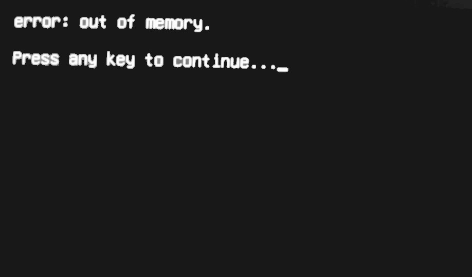
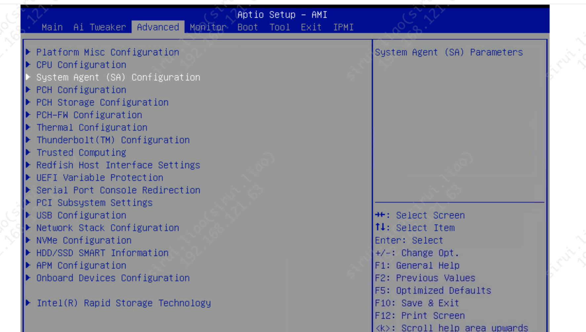
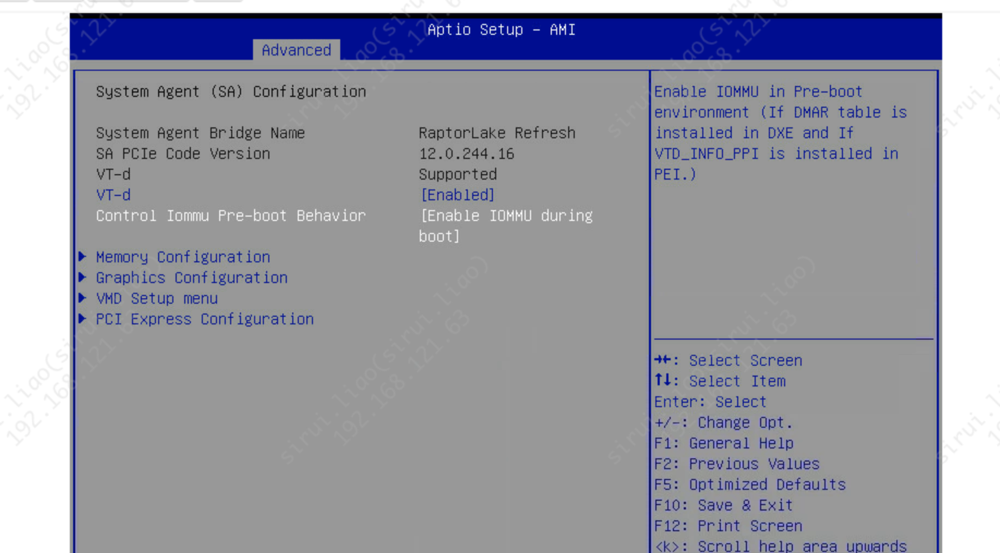

## 23.04 遇到 out of memory



DMA 保护，参考资料：<https://learn.microsoft.com/zh-cn/windows/security/hardware-security/kernel-dma-protection-for-thunderbolt>

通过错误提示初步判断是内存出现了问题，返回去 BIOS 进行各项设置的检查，在查询后找到了这个 DMA 保护的含义即为对内存的保护，取消勾选

还需要开启 IoMMU during boot





在 Ubuntu 安装完成之后，再进入 BIOS 重新开启 DMA 保护，经测试不影响已安装系统的正常启动与运行

## Ub 23 切换 old-releases

```bash
# ub23 非 LTS 的
sed -i 's#archive.ubuntu.com#old-releases.ubuntu.com#g' /etc/apt/sources.list
```


