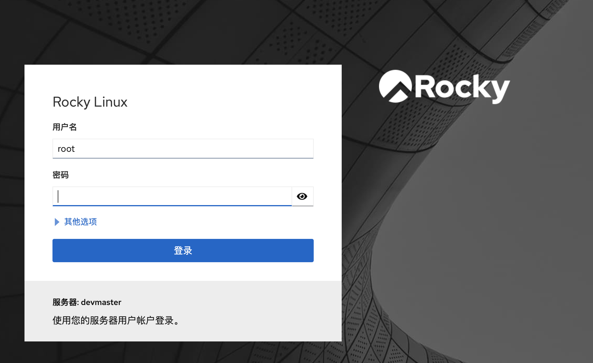

安装 WebConsole

```bash
dnf install -y \
  cockpit \
  cockpit-machines \
  cockpit-pcp
```

开启服务

```bash
systemctl start cockpit.socket
systemctl status cockpit.socket
```

设置开机自动启动

```bash
systemctl enable cockpit.socket
```

如果防火墙是开启状态，需要放行

```bash
firewall-cmd --add-service=cockpit --permanent

firewall-cmd --reload
```

从 Web 界面访问 <https://10.244.244.201:9090>

