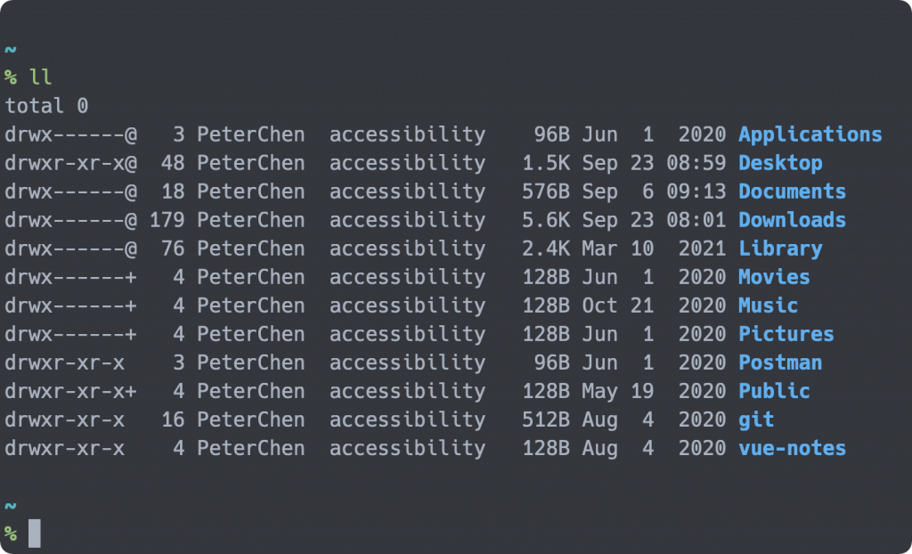

## Zsh 配置框架 Zim

Zsh 可以让使用者利用配置客制各种不同的功能，像是命令的自动补全、提示、高亮与缩写等。但是要自己设定这些需要花费大量的时间，因此找一个好的框架，并且使用大家公认的大众配置会是个比较省力的方式。

这些框架除了预配置的功能外，都会提供扩充的插件，藉由引入这些插件，可以轻松地实现各式功能，而不需要自己去做大量的配置。


Zim 是个 Zsh 配置框架，它提供了丰富的预设功能，并且以高效著称。

除了预设的功能外，使用者还可以使用 Modules 对功能进行扩充，并选择自己喜爱的 Themes 来使用。

官方仓库地址：<https://github.com/zimfw/zimfw>

官网：<https://zimfw.sh/>

## 安装 zim

使用 curl 进行安装

```bash
curl -fsSL https://raw.githubusercontent.com/zimfw/install/master/install.zsh | zsh
```

环境变量：

- ZDOTDIR

zim 的安装路径

- ZIM_HOME

设置 Zim 使用的目录所在的位置

- ZSH_CACHE_DIR

zsh cache 的路径

## Zim 的配置

官方文档地址：<https://zimfw.sh/docs/commands/>

Zim 的配置藉由一个配置档 `~/.zimrc` 来处理，安装完成后他会有预设的配置，使用者可以自己决定是否要使用这些配置。

Zim 的 Module 与 Theme 的安装方式是相同的， 接着以 theme eriner 为例，展示如何配置 Zim 。

- 安装 module

首先，在 `~/.zimrc` 中將 `eriner` 加入到配置：

```zsh
# Zim theme
zmodule eriner
```

使用指令安装 Module ：

```zsh
zimfw install
```

- 更新 module

使用指令更新所有在 `~/.zimrc` 中的 Module ：

```shell
zimfw update
```

- 刪除 Module

先将要刪除的 Module 从 `~/.zimrc` 中刪去：

```shell
# Zim theme
#zmodule eriner
```

然后使用指令安装 Module ：

```shell
zimfw uninstall
```

它会询问是否要删除，选择是后，就会开始进行解安装的动作。

## zim 的预设功能

Zim 在安装时会预设配置多个不同的 Module ，其列表如下：

```
# Start configuration added by Zim install {{{
#
# This is not sourced during shell startup, and it's only used to configure the
# zimfw plugin manager.
#

#
# Modules
#

# Sets sane Zsh built-in environment options.
zmodule environment
# Provides handy git aliases and functions.
zmodule git
# Applies correct bindkeys for input events.
zmodule input
# Sets a custom terminal title.
zmodule termtitle
# Utility aliases and functions. Adds colour to ls, grep and less.
zmodule utility

#
# Prompt
#

# Exposes to prompts how long the last command took to execute, used by asciiship.
zmodule duration-info
# Exposes git repository status information to prompts, used by asciiship.
zmodule git-info
# A heavily reduced, ASCII-only version of the Spaceship and Starship prompts.
zmodule asciiship

#
# Completion
#

# Additional completion definitions for Zsh.
zmodule zsh-users/zsh-completions --fpath src
# Enables and configures smart and extensive tab completion.
# completion must be sourced after all modules that add completion definitions.
zmodule completion

#
# Modules that must be initialized last
#

# Fish-like syntax highlighting for Zsh.
# zsh-users/zsh-syntax-highlighting must be sourced after completion
zmodule zsh-users/zsh-syntax-highlighting
# Fish-like history search (up arrow) for Zsh.
# zsh-users/zsh-history-substring-search must be sourced after zsh-users/zsh-syntax-highlighting
zmodule zsh-users/zsh-history-substring-search
# Fish-like autosuggestions for Zsh.
zmodule zsh-users/zsh-autosuggestions
# }}} End configuration added by Zim install
```

- environment

仓库地址：<https://github.com/zimfw/environment>

- git

仓库地址：<https://github.com/zimfw/git>

此为官方的 Module ，设定 Git 相关的别名与功能。


- utility

仓库地址：<https://github.com/zimfw/utility>

此为官方的 Module ，设定 `ls` 、 `grep` 与 `less` 相关的配置，包含高亮与别名。



- duration-info

仓库地址：<https://github.com/zimfw/duration-info>

此为官方的 Module ，纪录指令执行的时间。


- git-info

仓库地址：<https://github.com/zimfw/git-info>

此为官方的 Module ，导出 Git 库相关的信息。


- asciiship

仓库地址：<https://github.com/zimfw/asciiship>

此为官方的 Theme ，使用 git-info 与 duration-info 显示相关的信息。


- completion

仓库地址：<https://github.com/zimfw/completion>

此为官方的 Module ，提供指令的相关提示，需要搭配 `zsh-users/zsh-completions` 来提供指令的信息补完。


- zsh-users/zsh-autosuggestions

仓库地址：<https://github.com/zsh-users/zsh-autosuggestions>

zsh-autosuggestions 会记忆使用者之前的指令，然后再输入相似的指令时对使用者做提示，如果确认之后，可以使用右箭头按钮完成输入。


- zsh-users/zsh-syntax-highlighting

仓库地址：<https://github.com/zsh-users/zsh-history-substring-search>

zsh-syntax-highlighting 提供 Zsh 指令高亮的显示


- zsh-users/zsh-history-substring-search

仓库地址：<https://github.com/zsh-users/zsh-history-substring-search>

zsh-history-substring-search 让使用者可以输入指令的一部分，然后使用上下方向键选取之前与现在所输入的字串有吻合的指令。


## 其他的 Modules

Zim 提供了许多的 Modules 与 Themes ，可以依照需求做安装，像是 homebrew 提供了 brew 指令的别名。

module 列表大全：<https://zimfw.sh/docs/modules/>

Theme 列表大全：<https://zimfw.sh/docs/themes/>

另外也有许多第三方的套件也可以使用 Zim 来管理，只要是使用 `{init.zsh,module_name.{zsh,plugin.zsh,zsh-theme,sh}}` 的档案安装的套件都可以，如果不是的话，也可以使用 `zmodule --source` 指定安装的档案。

这些第三方套件，像是 Spaceship 、 alias-tips 等，都可以藉由 awesome-zsh-plugins 寻找。地址：<https://github.com/unixorn/awesome-zsh-plugins>

- Spaceship: https://github.com/spaceship-prompt/spaceship-prompt

- alias-tips: https://github.com/djui/alias-tips

## 自己的插件配置

```
# Start configuration added by Zim install {{{
#
# This is not sourced during shell startup, and it's only used to configure the
# zimfw plugin manager.
#

#
# Modules
#

# Sets sane Zsh built-in environment options.
zmodule environment
# Provides handy git aliases and functions.
zmodule git
# Applies correct bindkeys for input events.
zmodule input
# Sets a custom terminal title.
zmodule termtitle
# Utility aliases and functions. Adds colour to ls, grep and less.
zmodule utility
####### Custom
# Provides a convenient way to load ssh-agent. This enables one-time login and caching of ssh credentials per session.
zmodule ssh
###### end

#
# Prompt
#

# Exposes to prompts how long the last command took to execute, used by asciiship.
zmodule duration-info
# Exposes git repository status information to prompts, used by asciiship.
zmodule git-info
####### Custom
# Formats the path to the current working directory to be used by prompts.
zmodule prompt-pwd
# change theme
zmodule steeef
# alias tips
zmodule djui/alias-tips
###### end

#
# Completion
#

# Additional completion definitions for Zsh.
zmodule zsh-users/zsh-completions --fpath src
# Enables and configures smart and extensive tab completion.
# completion must be sourced after all modules that add completion definitions.
zmodule completion
####### Custom
# kubectl
# zmodule joke/zim-kubectl
# helm
# zmodule joke/zim-helm
# yq
# zmodule joke/zim-yq
# oh-my-zsh
zmodule ohmyzsh/ohmyzsh \
  -f 'plugins/ansible' -s 'plugins/ansible/ansible.plugin.zsh' \
  -f 'plugins/common-aliases' -s 'plugins/common-aliases/common-aliases.plugin.zsh' \
  -f 'plugins/command-not-found' -s 'plugins/command-not-found/command-not-found.plugin.zsh' \
  -f 'plugins/cp' -s 'plugins/cp/cp.plugin.zsh' \
  -f 'plugins/docker-compose' -s 'plugins/docker-compose/docker-compose.plugin.zsh' \
  -f 'plugins/docker' -s 'plugins/docker/docker.plugin.zsh' \
  -f 'plugins/encode64' -s 'plugins/encode64/encode64.plugin.zsh' \
  -f 'plugins/git' -s 'plugins/git/git.plugin.zsh' \
	-f 'plugins/git-lfs' -s 'plugins/git-lfs/git-lfs.plugin.zsh' \
  -f 'plugins/golang' -s 'plugins/golang/golang.plugin.zsh' \
  -f 'plugins/helm' -s 'plugins/helm/helm.plugin.zsh' \
  -f 'plugins/history' -s 'plugins/history/history.plugin.zsh' \
  -f 'plugins/kubectl' -s 'plugins/kubectl/kubectl.plugin.zsh' \
  -f 'plugins/nvm' -s 'plugins/nvm/nvm.plugin.zsh' \
	-f 'plugins/pip' -s 'plugins/pip/pip.plugin.zsh' \
	-f 'plugins/pre-commit' -s 'plugins/pre-commit/pre-commit.plugin.zsh' \
	-f 'plugins/pyenv' -s 'plugins/pyenv/pyenv.plugin.zsh' \
	-f 'plugins/python' -s 'plugins/python/python.plugin.zsh' \
	-f 'plugins/rsync' -s 'plugins/rsync/rsync.plugin.zsh' \
	-f 'plugins/rust' -s 'plugins/rust/rust.plugin.zsh' \
	-f 'plugins/vscode' -s 'plugins/vscode/vscode.plugin.zsh'
###### end

#
# Modules that must be initialized last
#

# Fish-like syntax highlighting for Zsh.
# zsh-users/zsh-syntax-highlighting must be sourced after completion
zmodule zsh-users/zsh-syntax-highlighting
# Fish-like history search (up arrow) for Zsh.
# zsh-users/zsh-history-substring-search must be sourced after zsh-users/zsh-syntax-highlighting
zmodule zsh-users/zsh-history-substring-search
# Fish-like autosuggestions for Zsh.
zmodule zsh-users/zsh-autosuggestions
# }}} End configuration added by Zim install
```

写入 `~/.zshrc`

```basssh
zstyle ":zim" disable-version-check yes
```

新建需要的补全存放目录

```bash
mkdir -p ${ZSH_CACHE_DIR}/completions
```

