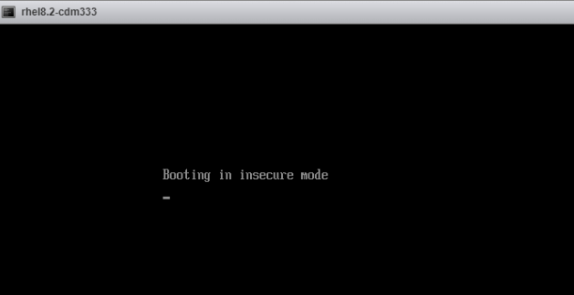

查看是否开启安全启动

```bash
mokutil --sb-state
```

加入 key

```bash
mokutil --import
```

禁用安全模式需要

```bash
/usr/bin/mokutil --disable-validation
```

输入临时密码并在出现提示时确认密码。

在 MOK 管理界面，按任意键继续。选择 Change Secure Boot state

选择是否 disable secure boot，选择 yes



参考文档：

- <https://elrepo.org/wiki/doku.php?id=secureboot>

- <https://blog.csdn.net/kadwf123/article/details/122581627>