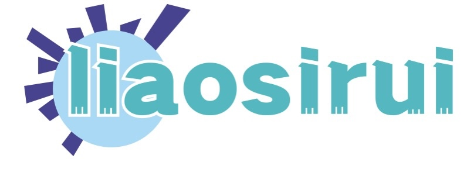

<div align="center">

<h2 align="center"> 廖思睿的个人博客 </h2>
<p align="center">
欢迎访问我的博客站点！
</p>
<p align="center">
  
  
  
  <br />
  
  
  
</p>
</div>

如果有任何疑问或错误，欢迎在 issues 进行提问或给予修正意见

如果喜欢或对你有所帮助，欢迎 Star，对作者是一种鼓励和推进 😀

### 在线阅读

在线阅读博客地址：<https://blog.liaosirui.com/>

### 文字统计

```plain
-------------------------------------------------------------------------------
Language                     files          blank        comment           code
-------------------------------------------------------------------------------
Markdown                       996          25700              0          73134
YAML                             7             10              3            148
Bourne Shell                     1              0              0             20
Makefile                         1              0              0              7
-------------------------------------------------------------------------------
TOTAL                         1005          25710              3          73309
-------------------------------------------------------------------------------
```

### About me

欢迎访问我的个人主页：<https://www.liaosirui.com>

💬 a devops coder and focus on golang and k8s.

#### Code & Skills


[](https://www.linux.org/)[](https://rockylinux.org/)[](https://rockylinux.org/)[](https://www.alpinelinux.org/)[](https://www.debian.org/)

[](https://golang.org/)[](https://www.python.org/)[](https://www.gnu.org/software/bash/)[](https://www.markdownguide.org/)

[](https://www.ansible.com/)

[](https://kubernetes.io/)[](https://www.docker.com/)[](https://containerd.io/)[](https://helm.sh/)

[](https://www.tigera.io/project-calico/)[](https://cilium.io/)

[](https://www.beegfs.io/c/)[](https://ceph.io/en/)

[](https://prometheus.io/)[](https://grafana.com/)

[](https://www.elastic.co/cn)[](https://www.elastic.co/cn/kibana)

[](https://opentelemetry.io/)[](https://www.jaegertracing.io/)

[](https://istio.io/)

[](https://docs.gitlab.com/runner/)[](https://github.com/features/actions)

[](https://goharbor.io/)[](https://www.sonatype.com/products/sonatype-nexus-repository)[](https://www.sonatype.com/products/sonatype-nexus-repository)

[](https://www.mysql.com/)[](https://www.postgresql.org/)[](https://www.sqlite.org/index.html)[](https://www.mongodb.com/)[](https://redis.com/)[](https://www.rabbitmq.com/)[](https://kafka.apache.org/)

[](https://nginx.org/)

[](https://airflow.apache.org/)

[](https://code.visualstudio.com/)[](https://jupyterlab.readthedocs.io/en/latest/)[](https://www.vim.org/)[](https://gohugo.io/)

[](https://www.postman.com/)[](https://swagger.io/)[](https://jmeter.apache.org/)

[](https://git-scm.com/)[](https://github.com/)[](https://about.gitlab.com/)

[](https://trello.com/)[](https://www.atlassian.com/software/jira/work-management)
