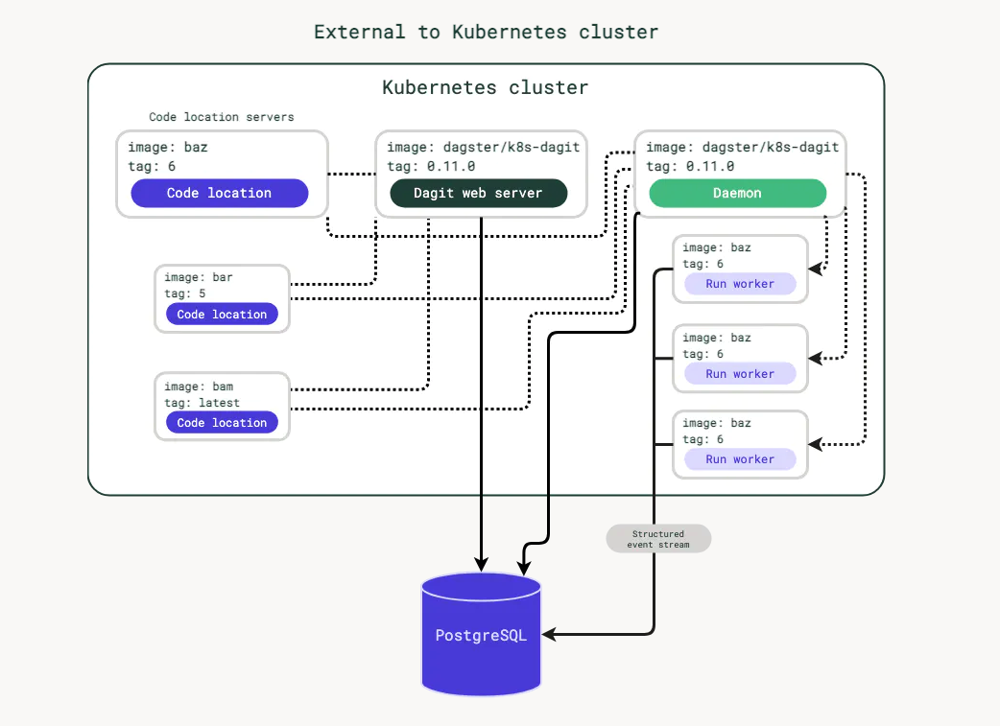

官方文档：<https://docs.dagster.io/1.1.9/deployment/guides/kubernetes/deploying-with-helm#deploying-dagster-on-helm>

## 部署架构



概览：

| Component            | Type                        | Image                                                        |
| -------------------- | --------------------------- | ------------------------------------------------------------ |
| Code location server | Deployment behind a service | User-provided or dagster/user-code-example (released weekly) |
| Dagit                | Deployment behind a service | dagster/dagster-k8s (released weekly)                        |
| Daemon               | Deployment                  | dagster/dagster-k8s (released weekly)                        |
| Run worker           | Job                         | User-provided or dagster/user-code-example (released weekly) |
| Database             | PostgreSQL                  | postgres (optional)                                          |

- Code location server


- Dagit

Dagit 网络服务器通过 gRPC 与用户代码部署通信，以获取填充 Dagit UI 所需的信息。 Dagit 不加载或执行用户编写的代码，即使用户代码包含错误也将保持可用。 Dagit 经常检查用户代码部署是否已更新，如果是，则获取新信息。

Dagit 可以通过在 values.yaml 中设置 dagit.replicaCount 字段来水平缩放。

默认情况下，Dagit 通过 K8sRunLauncher 启动运行，每次运行都会创建一个新的 Kubernetes 作业。

- 守护进程 Daemon


- Run worker


- 执行器 Executor


- 数据库 Database

## 执行部署

克隆仓库

```bash
git clone https://github.com/dagster-io/dagster.git

cd dagster
```

最新分支：<https://github.com/dagster-io/dagster/tree/1.1.9>

切换到最新的分支上

```bash
git checkout 1.1.9
```

进入 helm chart 所在的文件夹

```bash
cd helm
```

部署的依赖项：

```yaml
dependencies:
  - name: dagster-user-deployments
    version: 0.0.1-dev
    condition: dagster-user-deployments.enableSubchart
  - name: postgresql
    version: 8.1.0
    repository: https://raw.githubusercontent.com/bitnami/charts/eb5f9a9513d987b519f0ecd732e7031241c50328/bitnami
    condition: postgresql.enabled
  - name: rabbitmq
    version: 6.16.3
    repository: https://raw.githubusercontent.com/bitnami/charts/eb5f9a9513d987b519f0ecd732e7031241c50328/bitnami
    condition: rabbitmq.enabled
  - name: redis
    version: 12.7.4
    repository: https://raw.githubusercontent.com/bitnami/charts/eb5f9a9513d987b519f0ecd732e7031241c50328/bitnami
    condition: redis.internal
```

部署使用如下 yaml 文件作为 `values.yaml`

```yaml
imagePullSecrets:
  - name: dagster-image-pull-secrets

dagit:
  replicaCount: 3
  workspace:
    enabled: true
  enableReadOnly: true
  dbStatementTimeout: ~
  dbPoolRecycle: ~
  deploymentLabels:
    app.aipaas.io/app: dagster
    app.aipaas.io/component: dagit
  labels:
    app.aipaas.io/app: dagster
    app.aipaas.io/component: dagit
    app.aipaas.io/np.middleware: allowed
  affinity:
    nodeAffinity:
      requiredDuringSchedulingIgnoredDuringExecution:
        nodeSelectorTerms:
          - matchExpressions:
              - key: kubernetes.io/hostname
                operator: In
                values:
                  - devmaster1
                  - devmaster2
                  - devmaster3
    # podAntiAffinity:
    #   requiredDuringSchedulingIgnoredDuringExecution:
    #     - labelSelector:
    #         matchLabels:
    #           app.aipaas.io/app: dagster
    #           app.aipaas.io/component: dagit
    #       namespaces:
    #         - dagster-system
    #       topologyKey: kubernetes.io/hostname
  tolerations:
    - operator: Exists
  resources:
    limits:
      cpu: 100m
      memory: 128Mi
    requests:
      cpu: 100m
      memory: 128Mi
  startupProbe:
    enabled: false

dagster-user-deployments:
  enabled: true
  enableSubchart: true
  imagePullSecrets:
    - name: dagster-image-pull-secrets
  deployments:
    - name: "k8s-example-user-code-1"
      image:
        repository: "docker.io/dagster/user-code-example"
        tag: 1.1.9
        pullPolicy: Always
      dagsterApiGrpcArgs:
        - "--python-file"
        - "/example_project/example_repo/repo.py"
      port: 3030
      includeConfigInLaunchedRuns:
        enabled: true
      env: {}
      envConfigMaps: []
      envSecrets: []
      labels:
        app.aipaas.io/app: dagster
        app.aipaas.io/component: k8s-example-user-code-1
        app.aipaas.io/np.middleware: allowed
      volumes: []
      volumeMounts: []
      annotations: {}
      nodeSelector: {}
      affinity:
        nodeAffinity:
          requiredDuringSchedulingIgnoredDuringExecution:
            nodeSelectorTerms:
              - matchExpressions:
                  - key: kubernetes.io/hostname
                    operator: In
                    values:
                      - devmaster1
                      - devmaster2
                      - devmaster3
        # podAntiAffinity:
        #   requiredDuringSchedulingIgnoredDuringExecution:
        #     - labelSelector:
        #         matchLabels:
        #           app.aipaas.io/app: dagster
        #           app.aipaas.io/component: k8s-example-user-code-1
        #       namespaces:
        #         - dagster-system
        #       topologyKey: kubernetes.io/hostname
      tolerations:
        - operator: Exists
      podSecurityContext: {}
      securityContext: {}
      resources:
        limits:
          cpu: 200m
          memory: 256Mi
        requests:
          cpu: 200m
          memory: 256Mi
      readinessProbe:
        periodSeconds: 20
        timeoutSeconds: 3
        successThreshold: 1
        failureThreshold: 3
      livenessProbe: {}
      startupProbe:
        enabled: false
      service:
        annotations: {}

runLauncher:
  type: CeleryK8sRunLauncher
  config:
    k8sRunLauncher:
      labels:
        app.aipaas.io/app: dagster
        app.aipaas.io/component: k8s-run-launcher
        app.aipaas.io/np.middleware: allowed
      resources:
        limits:
          cpu: 100m
          memory: 128Mi
        requests:
          cpu: 100m
          memory: 128Mi
      runK8sConfig:
        containerConfig: # raw config for the pod's main container
          resources:
            cpu: 100m
            memory: 128Mi
        podTemplateSpecMetadata: # raw config for the pod's metadata
          # annotations:
          #   mykey: myvalue
          labels:
            app.aipaas.io/app: dagster
            app.aipaas.io/component: k8s-run-launcher
            app.aipaas.io/np.middleware: allowed
        podSpecConfig: # raw config for the spec of the launched's pod
          # nodeSelector:
          #   disktype: ssd
          affinity:
            nodeAffinity:
              requiredDuringSchedulingIgnoredDuringExecution:
                nodeSelectorTerms:
                  - matchExpressions:
                      - key: kubernetes.io/hostname
                        operator: In
                        values:
                          - devmaster1
                          - devmaster2
                          - devmaster3
        jobSpecConfig: # raw config for the kubernetes job's spec
          ttlSecondsAfterFinished: 7200
          template:
            spec:
              affinity:
                nodeAffinity:
                  requiredDuringSchedulingIgnoredDuringExecution:
                    nodeSelectorTerms:
                      - matchExpressions:
                          - key: kubernetes.io/hostname
                            operator: In
                            values:
                              - devmaster1
                              - devmaster2
                              - devmaster3
        jobMetadata: # raw config for the kubernetes job's metadata
          # annotations:
          #   mykey: myvalue
          labels:
            app.aipaas.io/app: dagster
            app.aipaas.io/component: k8s-run-launcher
            app.aipaas.io/np.middleware: allowed
    celeryK8sRunLauncher:
      affinity:
        nodeAffinity:
          requiredDuringSchedulingIgnoredDuringExecution:
            nodeSelectorTerms:
              - matchExpressions:
                  - key: kubernetes.io/hostname
                    operator: In
                    values:
                      - devmaster1
                      - devmaster2
                      - devmaster3
      tolerations:
        - operator: Exists
      resources:
        limits:
          cpu: 300m
          memory: 2048Mi
        requests:
          cpu: 300m
          memory: 2048Mi
      labels:
        app.aipaas.io/app: dagster
        app.aipaas.io/component: celery-k8s-run-launcher
        app.aipaas.io/np.middleware: allowed

postgresql:
  enabled: true
  postgresqlUsername: dagsterpg
  postgresqlDatabase: dagsterpass
  global:
    storageClass: csi-local-data-path

rabbitmq:
  enabled: true
  rabbitmq:
    username: dagsterrabbit
    password: dagsterpass
  global:
    storageClass: csi-local-data-path

redis:
  enabled: true
  internal: true
  usePassword: true
  password: "dagsterpass"
  global:
    storageClass: csi-local-data-path

flower:
  enabled: true
  affinity:
    nodeAffinity:
      requiredDuringSchedulingIgnoredDuringExecution:
        nodeSelectorTerms:
          - matchExpressions:
              - key: kubernetes.io/hostname
                operator: In
                values:
                  - devmaster1
                  - devmaster2
                  - devmaster3
  tolerations:
    - operator: Exists
  resources:
    limits:
      cpu: 100m
      memory: 128Mi
    requests:
      cpu: 100m
      memory: 128Mi

ingress:
  enabled: true
  annotations:
    kubernetes.io/ingress.class: nginx
    nginx.ingress.kubernetes.io/proxy-body-size: 1024m
    nginx.ingress.kubernetes.io/proxy-buffer-size: 256k
    cert-manager.io/cluster-issuer: cert-http01
  labels: {}
  ingressClassName: ~
  dagit:
    path: "/"
    pathType: Prefix
    host: "dagit.dagster.local.liaosirui.com"
    tls:
      enabled: true
      secretName: "dagit-https-cert"
  readOnlyDagit:
    path: "/"
    pathType: Prefix
    host: "dagit-readonly.dagster.local.liaosirui.com"
    tls:
      enabled: true
      secretName: "dagit-readonly-https-cert"
  flower:
    path: "/"
    pathType: Prefix
    host: "flower.dagster.local.liaosirui.com"
    tls:
      enabled: true
      secretName: "flow-https-cert"

dagsterDaemon:
  enabled: true

  runRetries:
    enabled: true
    maxRetries: 0

```

